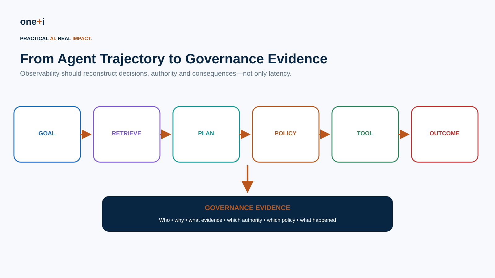
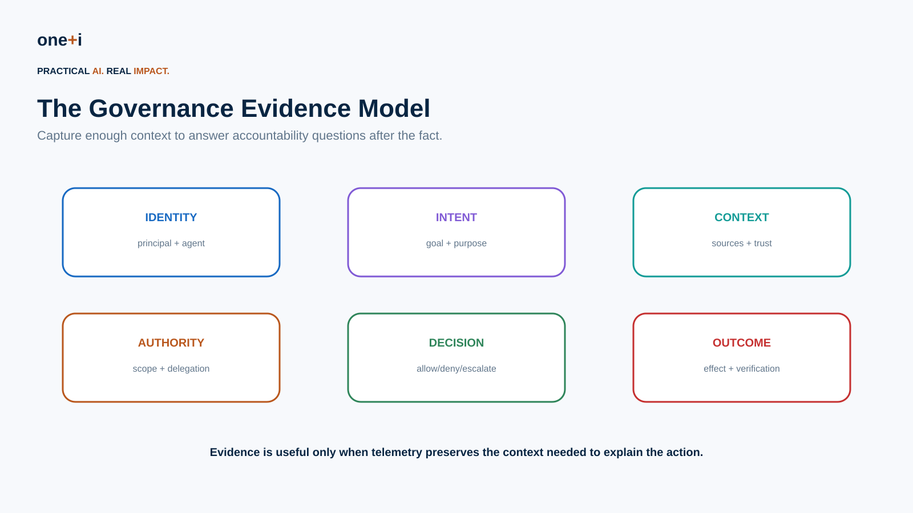
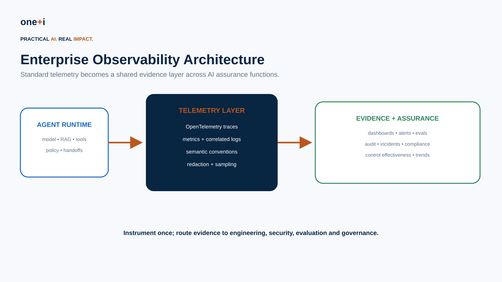
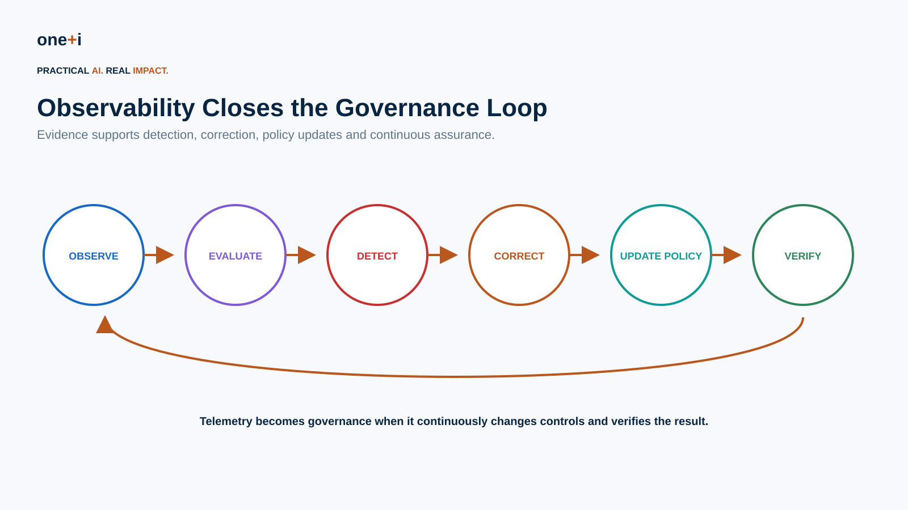

# Module 13 — Observability as Governance Evidence

> **Course:** Enterprise AI Agent Governance: From Principles to Runtime Control  
> **Audience:** AI/ML engineers, agent architects, platform engineers, security teams, governance/risk teams, SRE and audit stakeholders  
> **Recommended duration:** 9 hours theory + 7 hours practical lab  
> **Scenario:** Instrument and govern an enterprise procurement agent whose decisions must be reconstructable after execution.

## Learning objectives

By the end of this module, learners should be able to:

- distinguish debugging telemetry from governance evidence;
- define a governance evidence model for autonomous actions;
- reconstruct agent trajectories across model calls, RAG, tools, policies, approvals and handoffs;
- use traces, metrics and correlated logs appropriately;
- instrument GenAI workloads with OpenTelemetry concepts and semantic conventions;
- attach identity, purpose, authority, policy and risk metadata without leaking sensitive data;
- design evidence for ALLOW / DENY / ESCALATE decisions;
- measure control effectiveness, autonomy and policy compliance;
- detect anomalous trajectories and governance near misses;
- preserve evidence for audits and incidents;
- define retention, access, redaction and sampling policies;
- connect runtime evidence to continuous evaluation and policy improvement;
- review OpenAI Agents SDK tracing, OpenTelemetry, LangSmith and Arize Phoenix patterns;
- build an enterprise governance evidence dashboard and evidence package.

> **Core principle:** If an autonomous action cannot be reconstructed, its governance cannot be meaningfully demonstrated.



---

## 1. Why observability becomes a governance problem

Traditional observability asks:

```text
Did the service fail?
How long did it take?
How much CPU did it use?
```

Agent governance needs additional questions:

```text
What goal was the agent pursuing?
Who initiated it?
What authority did it have?
What information influenced the decision?
Which policy evaluated the action?
Was approval required?
Which tools and agents were invoked?
What changed in the world?
Can the complete decision path be reconstructed?
```

For autonomous systems, telemetry is not merely debugging data. It can become **evidence that controls actually operated**.

---

## 2. Observability vs governance evidence

A trace is not automatically governance evidence.

A technically complete trace may still omit:

- principal identity,
- delegated authority,
- purpose,
- data classification,
- policy version,
- risk score,
- approval identity,
- control decision,
- action outcome.

Governance evidence is telemetry designed around **accountability questions**.



---

## 3. Evidence questions

For each consequential action, aim to answer:

### Identity
Who initiated the workflow? Which agent acted? Which downstream agent or service executed?

### Intent
What business goal and task purpose authorized the workflow?

### Context
What data, retrieved sources, memory and tool outputs influenced it?

### Authority
Which permissions, delegation grants and limits applied?

### Decision
Which policy and control produced ALLOW, DENY or ESCALATE?

### Outcome
What actually happened, and was the result verified?

---

## 4. Trace the trajectory, not only the answer

A useful trace hierarchy can look like:

```text
workflow
├── agent run
│   ├── model generation
│   ├── retrieval
│   ├── policy evaluation
│   ├── tool call
│   │   ├── authorization
│   │   └── outcome verification
│   └── handoff
└── final outcome
```

The OpenAI Agents SDK currently traces agent runs, model generations, function-tool calls, guardrails and handoffs, and supports custom spans/processors. That makes it useful for trajectory reconstruction, while governance-specific metadata still needs to be designed by the application.

---

## 5. OpenTelemetry as the interoperability layer

OpenTelemetry is increasingly important because enterprise AI systems rarely use one framework or observability backend.

Use it to normalize:

```text
traces
metrics
logs
resource/service metadata
```

OpenTelemetry's GenAI semantic conventions provide standardized attributes for GenAI operations such as model, token usage and operation information. The conventions continue to evolve, so production schemas should be versioned and reviewed rather than copied once and forgotten.

---

## 6. Traces, metrics and logs

### Traces
Best for reconstructing a workflow and causal relationships.

### Metrics
Best for aggregate trends:

```text
policy denial rate
approval rate
autonomous-action rate
tool error rate
cost per successful task
risk distribution
```

### Correlated logs
Best for discrete security/governance events and detailed evidence that should not be forced into span attributes.

A mature architecture uses all three.

---

## 7. Governance metadata

Useful trace/run metadata includes:

```text
workflow_id
agent_id
agent_version
principal_id / pseudonymous subject
tenant
business_purpose
risk_tier
policy_version
authorization_decision_id
delegation_id
approval_id
model/provider
tool_id
data_classification
environment
release/version
```

Avoid placing secrets or unnecessary personal data into telemetry.

---

## 8. Policy decisions as first-class evidence

A policy evaluation should emit structured evidence:

```json
{
  "decision": "ESCALATE",
  "policy": "payment-policy",
  "version": "3.4",
  "reason_codes": ["HIGH_VALUE", "NEW_VENDOR"],
  "risk_score": 0.82
}
```

Do not rely only on free-text explanations.

Structured reason codes support audit, analytics and regression testing.

---

## 9. Human approval evidence

Record:

```text
what action was proposed
what exact arguments were approved
who approved
under which role
when approval occurred
approval scope
expiry
whether execution matched approval
```

Approval should be bound to the action—not merely recorded as a generic `approved=true`.

---

## 10. Delegation evidence

For multi-agent workflows capture:

```text
delegator
delegate
task
purpose
scope
permissions
resource limits
expiry
parent delegation
```

This reconstructs the authority chain:

```text
Human → Agent A → Agent B → Tool
```

---

## 11. Retrieval evidence

Useful evidence can include:

```text
document/source identifiers
retrieval query
ranking/scores
trust/provenance classification
document version
knowledge-base version
```

Do not automatically store complete retrieved documents in traces.

Prefer references, hashes and controlled snapshots where appropriate.

---

## 12. Memory evidence

Capture:

```text
memory read/write
memory identifier
source/provenance
classification
retention class
validation decision
correction/deletion event
```

A governance investigation should be able to determine whether memory influenced an unsafe decision.

---

## 13. Tool evidence

For consequential tools record:

```text
tool identity
tool version
requested operation
validated arguments or safe hashes
authorization decision
approval requirement
execution status
result classification
reversibility
external transaction ID
```

Do not log credentials.

---

## 14. Outcome observability

A successful API response does not necessarily mean the business outcome was correct.

Examples:

```text
payment API returned 200
≠
payment was authorized correctly

email sent
≠
recipient was permitted

database update succeeded
≠
record mutation was policy compliant
```

Observe and verify the **effect**, not only the call.

---

## 15. Governance metrics

Useful metrics include:

- task success;
- autonomous-action rate;
- escalation rate;
- denial rate;
- policy violation and near-miss rate;
- approval override/rejection rate;
- tool authorization failures;
- delegation depth;
- high-risk action frequency;
- anomaly rate;
- guardrail/control activation;
- recovery rate;
- evidence completeness;
- trajectory reconstructability;
- cost per successful governed task.

---

## 16. Evidence completeness

Define mandatory evidence fields by risk tier.

Example:

```text
LOW:
identity + action + outcome

MEDIUM:
+ purpose + policy decision

HIGH:
+ authority + risk + approval + evidence sources

CRITICAL:
+ complete authority chain + immutable decision/outcome evidence
```

Measure missing evidence as a governance defect.

---

## 17. Near misses

Do not monitor only successful violations.

Examples:

```text
unauthorized tool attempt blocked
high-risk action escalated
prompt injection detected before tool use
delegation denied
approval rejected
data egress prevented
```

Near misses reveal pressure against controls and emerging attack patterns.

---

## 18. Control effectiveness

Telemetry lets governance move from:

> We have a policy.

to:

> We can measure whether the policy operates.

For each control measure:

```text
trigger frequency
true-positive rate
false-positive rate
bypass rate
latency
cost
user friction
failure mode
```

---

## 19. Anomaly detection

Potential signals:

```text
new tool sequence
unusual destination
unexpected delegation depth
rapid repeated denials
large data reads
unusual memory writes
approval spikes
high retry count
new model/tool combination
large cost change
```

An anomaly is a signal—not automatically a violation.

---

## 20. Evidence for incidents

A security incident needs enough evidence to reconstruct:

```text
initial goal
principal
agent/model versions
retrieved context
memory
plan/trajectory
delegation
tool calls
authorization
policy decisions
approvals
external effects
containment
recovery
```

This directly connects this module to Agent Red Teaming and Incident Response.

---

## 21. Evidence for audit

Audit evidence should demonstrate:

```text
control existed
control version
control applied
decision produced
exceptions/escalations
human approval where required
outcome
follow-up
```

Avoid building audit processes that require manually reading millions of raw traces.

Create structured evidence packages.

---

## 22. Privacy and telemetry minimization

Observability itself creates risk.

Prompts, tool arguments and retrieved documents may contain:

```text
PII
credentials
customer data
trade secrets
regulated information
```

Use:

```text
redaction
tokenization/pseudonymization
hashes
references instead of raw content
field allowlists
access controls
retention limits
encryption
```

OpenAI's Agents SDK, for example, exposes configuration controlling whether potentially sensitive model/tool inputs and outputs are included in traces.

---

## 23. Sampling

Traditional random trace sampling can discard the exact high-risk workflow governance needs.

Consider risk-aware retention:

```text
routine low-risk run
→ sample

DENY / ESCALATE
→ retain

high-value action
→ retain

security anomaly
→ retain

incident
→ preserve
```

Do not confuse observability sampling with legal record-retention requirements.

---

## 24. Evidence integrity

For high-assurance workflows consider:

```text
immutable/WORM storage
append-only audit streams
signed events
hash chains
trusted timestamps
restricted deletion
separation of duties
```

The appropriate mechanism depends on regulatory and business risk.

---

## 25. Access control

Telemetry often contains more information than application users can normally see.

Apply:

```text
RBAC/ABAC
tenant isolation
purpose-based access
break-glass procedures
auditor roles
security roles
retention/deletion policy
access auditing
```

An observability platform should not become a data-exfiltration shortcut.

---

## 26. OpenAI Agents SDK

Current Agents SDK tracing provides:

```text
traces
agent spans
generation spans
function/tool spans
guardrail spans
handoff spans
custom spans
trace metadata
custom trace processors
```

Use framework-native tracing for rich execution semantics, then export or normalize governance evidence as needed.

---

## 27. OpenTelemetry GenAI semantic conventions

OpenTelemetry's GenAI conventions currently standardize concepts such as:

```text
GenAI operation
requested model
token usage
finish reasons
optional message/tool content
```

This improves interoperability across frameworks and backends.

Treat verbose/sensitive content as opt-in and design organization-specific governance attributes in a controlled namespace.

---

## 28. LangSmith

LangSmith is useful for agent tracing, evaluation and operational analysis in LangChain/LangGraph ecosystems.

Review it for:

```text
trace inspection
datasets/evaluation
feedback
production monitoring
```

Governance teams should still define which metadata and decisions constitute evidence rather than relying on a vendor's default trace schema.

---

## 29. Arize Phoenix

Phoenix provides open-source LLM/agent observability and evaluation with OpenTelemetry-oriented instrumentation.

It is useful when teams want:

```text
open tracing
evaluation
retrieval analysis
tool/agent visibility
self-hosted options
```

The broader architectural lesson is to keep the evidence model portable.

---

## 30. Vendor-neutral architecture



A practical pattern:

```text
Agent frameworks
↓
framework-native instrumentation
↓
OpenTelemetry / normalized evidence schema
↓
observability backend(s)
↓
evaluation + security + governance analytics
↓
evidence store / audit package
```

Do not make governance evidence dependent on one dashboard.

---

## 31. Continuous governance



The lifecycle becomes:

```text
Observe
→ Evaluate
→ Detect
→ Correct
→ Update policy
→ Verify
→ Observe
```

Observability is what allows governance to operate after deployment.

---

## 32. Practical notebook

`13_observability_as_governance_evidence.ipynb`

The notebook implements:

- a synthetic agent trajectory;
- structured trace/span model;
- governance metadata;
- identity/purpose/authority evidence;
- policy-decision events;
- approval binding;
- retrieval provenance;
- delegation chains;
- tool/outcome evidence;
- sensitive-data redaction;
- risk-aware sampling;
- evidence completeness scoring;
- governance metrics;
- near-miss analysis;
- control-effectiveness metrics;
- anomaly signals;
- audit evidence packages;
- incident reconstruction;
- OpenTelemetry instrumentation patterns;
- OpenAI Agents SDK tracing patterns;
- CI assertions for observability requirements.

---

## 33. Enterprise checklist

Before production:

- Can every consequential action be linked to a trace?
- Is the initiating principal known?
- Is the business purpose recorded?
- Can authority and delegation be reconstructed?
- Is the policy version recorded?
- Are ALLOW / DENY / ESCALATE decisions structured?
- Are approvals bound to exact actions?
- Can retrieval and memory influence be reconstructed?
- Are tool calls and real outcomes distinguishable?
- Are near misses retained?
- Are high-risk traces protected from random sampling?
- Are secrets excluded/redacted?
- Is telemetry access governed?
- Are retention rules defined?
- Is evidence completeness measured?
- Can incidents be reconstructed?
- Can auditors receive structured evidence instead of raw logs?
- Are telemetry schemas versioned?
- Can evidence move between observability backends?
- Does runtime evidence feed evaluation and policy improvement?

---

## 34. Primary references

1. OpenTelemetry — GenAI Observability  
   https://opentelemetry.io/blog/2026/genai-observability/

2. OpenTelemetry — Semantic Conventions  
   https://opentelemetry.io/docs/specs/semconv/

3. OpenAI Agents SDK — Tracing  
   https://openai.github.io/openai-agents-python/tracing/

4. OpenAI Agents SDK — Tracing API  
   https://openai.github.io/openai-agents-python/ref/tracing/

5. LangSmith — Observability  
   https://docs.langchain.com/langsmith/observability

6. Arize Phoenix  
   https://arize.com/docs/phoenix

---

## 35. Key takeaway

> **Observability becomes governance evidence when telemetry can prove who acted, under what authority, based on what information, under which controls, and with what consequence.**

The goal is not maximum logging.

The goal is **minimum sufficient, trustworthy evidence for accountability, assurance and continuous control**.
