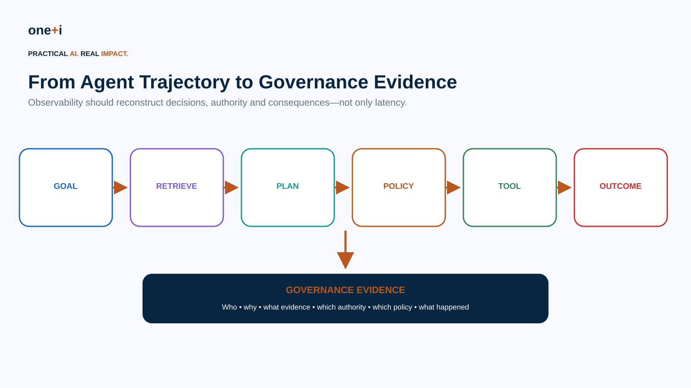
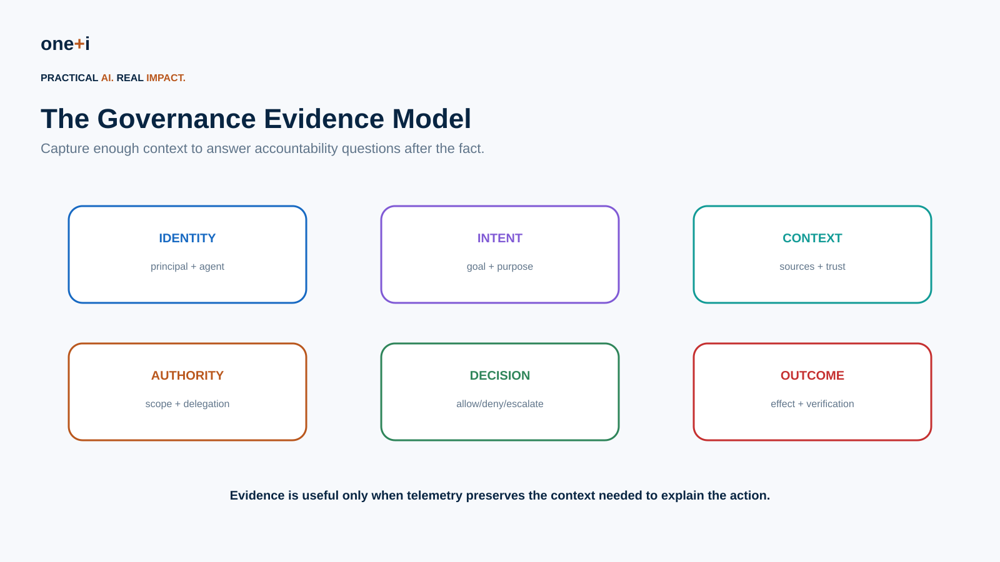
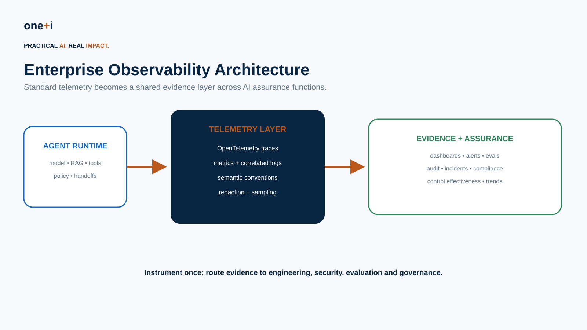
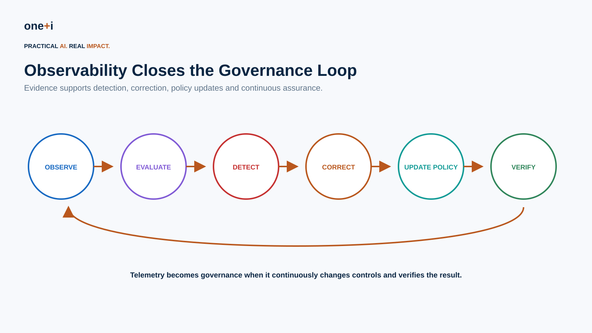

# Module 13 — Observability as Governance Evidence

> **Course:** Enterprise AI Agent Governance: From Principles to Runtime Control
> **Audience:** AI/ML engineers, agent architects, platform engineers, security teams, governance/risk teams, SRE and audit stakeholders
> **Recommended duration:** 9 hours theory + 7 hours practical lab
> **Scenario:** Instrument and govern an enterprise procurement agent whose decisions must be reconstructable after execution.

## Course thesis

Telemetry becomes governance evidence only when its scope, origin, meaning, completeness, causal links, privacy controls, integrity, retention and access can be defended. A dashboard can show what an instrumented component reported; it cannot by itself prove that every relevant component emitted data, that a decision was authorized, that an external effect occurred, or that records were not altered.

## Prerequisites

You should be comfortable with Python, distributed tracing, agent tool/approval flows, and the evidence concepts from [Agent Red Teaming & Adversarial Testing](../../intermediate/12-agent-red-teaming-and-adversarial-testing/README.md). The canonical lab is fully synthetic and performs no model, network, collector, shell, cloud or business-system call.

## Success criteria

You have completed the module when you can:

- separate operational telemetry, security signals, decision evidence, business-effect verification and formal records;
- reconstruct a tenant-bound causal trajectory from an authenticated root through retrieval, policy, approval, tool execution and verified outcome;
- minimize data before export using allowlists, references and keyed pseudonyms rather than relying on regex cleanup alone;
- explain what digests, HMACs, signatures, append-only streams, trusted timestamps and WORM storage do—and do not—prove;
- detect missing events, sequence/parent gaps, altered post-approval actions, unverified outcomes and invalid integrity chains;
- govern evidence reads by tenant, role and purpose, audit access, operate break-glass review, and apply legal hold;
- design tail-retention rules without confusing observability sampling with legal or business record retention;
- construct portable OpenTelemetry and OpenAI trace artifacts without exporting sensitive data; and
- choose among OpenTelemetry, OpenInference, Phoenix, LangSmith, Langfuse and framework-native tracing without treating a vendor dashboard as an evidence control.

## Non-goals

The lab does not claim that HMACs provide public non-repudiation, that a trace proves a real-world effect, that pseudonymization is anonymization, that sampled telemetry is a complete record, or that an in-memory store is production-grade immutable storage. It does not establish a retention schedule for any jurisdiction or execute a collector/backend.

## Claim-to-proof map

| Claim | Executable proof | Negative/evaluation proof |
|---|---|---|
| Evidence comes from a trusted boundary | tenant/service-bound authenticated producer and application-owned context | expired, unauthorized, cross-tenant and wrong-service producers fail |
| Sensitive data is minimized before storage | event-specific allowlists, references, keyed pseudonyms and residual redaction | prompt/nested attributes fail; emails/secrets are removed |
| A trace is causally reconstructable | one root, continuous sequence, parent links and risk-tier requirements | missing parent, time reversal, duplicate span, missing outcome and sequence-gap tests |
| Approval and outcome bind to the executed action | canonical action digests and explicit tool/outcome links | changed action, unverified outcome and broken link block the gate |
| Integrity is independently checked | per-trace event chain, HMAC verification, chained custody receipts and authenticated bounded package | event/chain/package/key tampering fails verification |
| Evidence access is itself governed | tenant-, role- and purpose-bound reads with access receipts | cross-tenant discovery, invalid purpose and break-glass misuse fail |
| Retention is risk-aware and explicit | named tail rules, deterministic routine sampling and legal hold | invalid rates fail; legal hold overrides expiry |
| Common SDK examples are real but bounded | in-memory OpenTelemetry spans and unstarted Agents SDK objects | no credentials, default exporter, network or raw content |

---

## Learning objectives

By the end of this module, learners should be able to:

- distinguish debugging telemetry from governance evidence;
- define a governance evidence model for autonomous actions;
- reconstruct agent trajectories across model calls, RAG, tools, policies, approvals and handoffs;
- use traces, metrics and correlated logs appropriately;
- instrument GenAI workloads with OpenTelemetry concepts and semantic conventions;
- attach identity, purpose, authority, policy and risk metadata without leaking sensitive data;
- design evidence for ALLOW / DENY / ESCALATE decisions;
- measure control effectiveness, autonomy and policy compliance;
- detect anomalous trajectories and governance near misses;
- preserve evidence for audits and incidents;
- define retention, access, redaction and sampling policies;
- connect runtime evidence to continuous evaluation and policy improvement;
- review OpenAI Agents SDK tracing, OpenTelemetry, LangSmith and Arize Phoenix patterns;
- build an enterprise governance evidence dashboard and evidence package.

> **Core principle:** If an autonomous action cannot be reconstructed, its governance cannot be meaningfully demonstrated.



---

## 1. Why observability becomes a governance problem

Traditional observability asks:

```text
Did the service fail?
How long did it take?
How much CPU did it use?
```

Agent governance needs additional questions:

```text
What goal was the agent pursuing?
Who initiated it?
What authority did it have?
What information influenced the decision?
Which policy evaluated the action?
Was approval required?
Which tools and agents were invoked?
What changed in the world?
Can the complete decision path be reconstructed?
```

For autonomous systems, telemetry is not merely debugging data. It can become **evidence that controls actually operated**.

---

## 2. Observability vs governance evidence

A trace is not automatically governance evidence.

A technically complete trace may still omit:

- principal identity,
- delegated authority,
- purpose,
- data classification,
- policy version,
- risk score,
- approval identity,
- control decision,
- action outcome.

Governance evidence is telemetry designed around **accountability questions**.

### Evidence trust model

Treat every link as a separate assurance question:

```text
trusted runtime context
→ authenticated producer
→ minimized/versioned event
→ reliable transport
→ append-only integrity-protected store
→ completeness and linkage checks
→ purpose-bound access
→ bounded audit/incident package
```

Model output, tool text, W3C baggage and caller-supplied span attributes are useful context but are not authoritative identity, purpose or permission. Derive governance context from the application control plane and workload identity. A signed record can establish origin and integrity only within its key-management and producer trust assumptions; it does not make a false observation true.



---

## 3. Evidence questions

For each consequential action, aim to answer:

### Identity
Who initiated the workflow? Which agent acted? Which downstream agent or service executed?

### Intent
What business goal and task purpose authorized the workflow?

### Context
What data, retrieved sources, memory and tool outputs influenced it?

### Authority
Which permissions, delegation grants and limits applied?

### Decision
Which policy and control produced ALLOW, DENY or ESCALATE?

### Outcome
What actually happened, and was the result verified?

---

## 4. Trace the trajectory, not only the answer

A useful trace hierarchy can look like:

```text
workflow
├── agent run
│   ├── model generation
│   ├── retrieval
│   ├── policy evaluation
│   ├── tool call
│   │   ├── authorization
│   │   └── outcome verification
│   └── handoff
└── final outcome
```

The OpenAI Agents SDK currently traces agent runs, model generations, function-tool calls, guardrails and handoffs, and supports custom spans/processors. That makes it useful for trajectory reconstruction, while governance-specific metadata still needs to be designed by the application.

---

## 5. OpenTelemetry as the interoperability layer

OpenTelemetry is increasingly important because enterprise AI systems rarely use one framework or observability backend.

Use it to normalize:

```text
traces
metrics
logs
resource/service metadata
```

The current OpenTelemetry semantic-conventions line is 1.44. GenAI conventions have moved to a dedicated repository and include agent, inference and tool concepts, but individual groups still carry their own stability levels. Pin the convention/schema version used by producers and retain migrations; do not silently reinterpret old records after a rename.

OpenTelemetry supplies context propagation and signal transport, not application authority. Baggage crosses process boundaries and may be caller-controlled. Use it for correlation hints, then resolve identity, tenant, purpose and grants from trusted application state before emitting governance evidence.

---

## 6. Traces, metrics and logs

### Traces
Best for reconstructing a workflow and causal relationships.

### Metrics
Best for aggregate trends:

```text
policy denial rate
approval rate
autonomous-action rate
tool error rate
cost per successful task
risk distribution
```

### Correlated logs
Best for discrete security/governance events and detailed evidence that should not be forced into span attributes.

A mature architecture uses all three.

---

## 7. Governance metadata

Useful trace/run metadata includes:

```text
workflow_id
agent_id
agent_version
principal_id / pseudonymous subject
tenant
business_purpose
risk_tier
policy_version
authorization_decision_id
delegation_id
approval_id
model/provider
tool_id
data_classification
environment
release/version
```

Avoid placing secrets or unnecessary personal data into telemetry.

---

## 8. Policy decisions as first-class evidence

A policy evaluation should emit structured evidence:

```json
{
  "decision": "ESCALATE",
  "policy": "payment-policy",
  "version": "3.4",
  "reason_codes": ["HIGH_VALUE", "NEW_VENDOR"],
  "risk_score": 0.82
}
```

Do not rely only on free-text explanations.

Structured reason codes support audit, analytics and regression testing.

---

## 9. Human approval evidence

Record:

```text
what action was proposed
what exact arguments were approved
who approved
under which role
when approval occurred
approval scope
expiry
whether execution matched approval
```

Approval should be bound to the action—not merely recorded as a generic `approved=true`.

---

## 10. Delegation evidence

For multi-agent workflows capture:

```text
delegator
delegate
task
purpose
scope
permissions
resource limits
expiry
parent delegation
```

This reconstructs the authority chain:

```text
Human → Agent A → Agent B → Tool
```

---

## 11. Retrieval evidence

Useful evidence can include:

```text
document/source identifiers
retrieval query
ranking/scores
trust/provenance classification
document version
knowledge-base version
```

Do not automatically store complete retrieved documents in traces.

Prefer references, hashes and controlled snapshots where appropriate.

---

## 12. Memory evidence

Capture:

```text
memory read/write
memory identifier
source/provenance
classification
retention class
validation decision
correction/deletion event
```

A governance investigation should be able to determine whether memory influenced an unsafe decision.

---

## 13. Tool evidence

For consequential tools record:

```text
tool identity
tool version
requested operation
validated arguments or safe hashes
authorization decision
approval requirement
execution status
result classification
reversibility
external transaction ID
```

Do not log credentials.

---

## 14. Outcome observability

A successful API response does not necessarily mean the business outcome was correct.

Examples:

```text
payment API returned 200
≠
payment was authorized correctly

email sent
≠
recipient was permitted

database update succeeded
≠
record mutation was policy compliant
```

Observe and verify the **effect**, not only the call.

---

## 15. Governance metrics

Useful metrics include:

- task success;
- autonomous-action rate;
- escalation rate;
- denial rate;
- policy violation and near-miss rate;
- approval override/rejection rate;
- tool authorization failures;
- delegation depth;
- high-risk action frequency;
- anomaly rate;
- guardrail/control activation;
- recovery rate;
- evidence completeness;
- trajectory reconstructability;
- cost per successful governed task.

---

## 16. Evidence completeness

Define mandatory evidence fields by risk tier.

Example:

```text
LOW:
identity + action + outcome

MEDIUM:
+ purpose + policy decision

HIGH:
+ authority + risk + approval + evidence sources

CRITICAL:
+ complete authority chain + immutable decision/outcome evidence
```

Measure missing evidence as a governance defect.

---

## 17. Near misses

Do not monitor only successful violations.

Examples:

```text
unauthorized tool attempt blocked
high-risk action escalated
prompt injection detected before tool use
delegation denied
approval rejected
data egress prevented
```

Near misses reveal pressure against controls and emerging attack patterns.

---

## 18. Control effectiveness

Telemetry lets governance move from:

> We have a policy.

to:

> We can measure whether the policy operates.

For each control measure:

```text
trigger frequency
true-positive rate
false-positive rate
bypass rate
latency
cost
user friction
failure mode
```

---

## 19. Anomaly detection

Potential signals:

```text
new tool sequence
unusual destination
unexpected delegation depth
rapid repeated denials
large data reads
unusual memory writes
approval spikes
high retry count
new model/tool combination
large cost change
```

An anomaly is a signal—not automatically a violation.

---

## 20. Evidence for incidents

A security incident needs enough evidence to reconstruct:

```text
initial goal
principal
agent/model versions
retrieved context
memory
plan/trajectory
delegation
tool calls
authorization
policy decisions
approvals
external effects
containment
recovery
```

This directly connects this module to Agent Red Teaming and Incident Response.

---

## 21. Evidence for audit

Audit evidence should demonstrate:

```text
control existed
control version
control applied
decision produced
exceptions/escalations
human approval where required
outcome
follow-up
```

Avoid building audit processes that require manually reading millions of raw traces.

Create structured evidence packages.

---

## 22. Privacy and telemetry minimization

Observability itself creates risk.

Prompts, tool arguments and retrieved documents may contain:

```text
PII
credentials
customer data
trade secrets
regulated information
```

Use:

```text
redaction
tokenization/pseudonymization
hashes
references instead of raw content
field allowlists
access controls
retention limits
encryption
```

OpenAI's Agents SDK, for example, exposes configuration controlling whether potentially sensitive model/tool inputs and outputs are included in traces.

Minimize at the producer before data enters a queue, processor, debug log or exporter. Collector redaction is useful defense in depth, but a later processor cannot undo exposure to an earlier exporter or side channel. Prefer event-specific allowlists; regexes miss structured, encoded and novel secrets. A plain hash of a low-entropy employee/customer identifier can often be guessed—use keyed pseudonyms or a controlled tokenization service and keep re-identification access separate.

OpenTelemetry explicitly makes the implementer responsible for identifying sensitive data. Review auto-instrumentation because GenAI message content, tool arguments/results, retrieved documents and metadata may all be opt-in yet highly sensitive.

---

## 23. Sampling

Traditional random trace sampling can discard the exact high-risk workflow governance needs.

Consider risk-aware retention:

```text
routine low-risk run
→ sample

DENY / ESCALATE
→ retain

high-value action
→ retain

security anomaly
→ retain

incident
→ preserve
```

Do not confuse observability sampling with legal record-retention requirements.

Head sampling decides before the complete outcome is known. For governance, route through a trusted Collector and use tail policies that retain errors, DENY/ESCALATE, high-risk actions, anomalies and incident-linked traces. Still maintain a separate system of record for approvals, financial transactions, legal holds and other mandatory records. Sampling rules need versioning, loss/queue metrics and tests for partial traces.

---

## 24. Evidence integrity

For high-assurance workflows consider:

```text
immutable/WORM storage
append-only audit streams
signed events
hash chains
trusted timestamps
restricted deletion
separation of duties
```

The appropriate mechanism depends on regulatory and business risk.

A SHA-256 digest detects changed content only when a trusted reference digest is protected. An HMAC authenticates data to parties sharing a secret but does not provide public non-repudiation. Digital signatures add asymmetric verification but still depend on producer trust, key custody, rotation, revocation, timestamps and canonical serialization. Hash chains reveal deletion/reordering only relative to a protected checkpoint. WORM storage protects configured retention; it does not prove completeness or truth.

---

## 25. Access control

Telemetry often contains more information than application users can normally see.

Apply:

```text
RBAC/ABAC
tenant isolation
purpose-based access
break-glass procedures
auditor roles
security roles
retention/deletion policy
access auditing
```

An observability platform should not become a data-exfiltration shortcut.

Enforce tenant before trace lookup so an unauthorized reader cannot use error differences to discover another tenant's trace. Bind each read/export to a declared purpose, produce a separate access receipt, alert on unusual bulk access, and require a security-owned reason/case for break-glass. Evidence administrators should not automatically be able to alter policy decisions or business records.

---

## 26. OpenAI Agents SDK

Current Agents SDK tracing provides:

```text
traces
agent spans
generation spans
function/tool spans
guardrail spans
handoff spans
custom spans
trace metadata
custom trace processors
```

Use framework-native tracing for rich execution semantics, then export or normalize governance evidence as needed. Current SDK tracing is enabled by default, and model/tool inputs and outputs are included unless `trace_include_sensitive_data` (or its environment default) is disabled. Disabling tracing does not erase batches already buffered.

Trace processors are independent observers. Adding a redactor before another exporter does not make export fail closed if redaction fails, and `add_trace_processor()` leaves the default exporter present. When export depends on successful minimization, replace processors with an application-owned exporter that copies, minimizes and only then delivers—or drops the batch on any failure. Configure this before creating traces.

The Agents API can also export session traces as paginated OTLP JSON when trace export is enabled. A blank token count may mean not-yet-available rather than zero, and traces can finalize after the agent response, so ingestion must handle late data and explicit completeness states.

---

## 27. OpenTelemetry GenAI semantic conventions

OpenTelemetry's GenAI conventions currently standardize concepts such as:

```text
GenAI operation
requested model
token usage
finish reasons
optional message/tool content
```

This improves interoperability across frameworks and backends.

Treat verbose/sensitive content as opt-in and design organization-specific governance attributes in a controlled, versioned namespace. Current GenAI tool arguments/results and definitions are specifically flagged as potentially sensitive; omit them by default and record stable references/digests when that answers the governance question.

### OpenInference

OpenInference complements OpenTelemetry with AI span kinds such as `AGENT`, `TOOL`, `RETRIEVER`, `GUARDRAIL` and `EVALUATOR`, plus instrumentation for common frameworks including the OpenAI Agents SDK. It is useful for portable AI semantics, but its prompt/message/document/tool attributes can be verbose and sensitive. It does not add evidence authenticity, producer authorization or completeness by itself.

---

## 28. LangSmith

LangSmith is useful for agent tracing, evaluation and operational analysis in LangChain/LangGraph ecosystems.

Review it for:

```text
trace inspection
datasets/evaluation
feedback
production monitoring
```

Governance teams should still define which metadata and decisions constitute evidence rather than relying on a vendor's default trace schema.

Before adoption, evaluate project/tenant isolation, regional storage, encryption, retention/deletion, sampling, anonymization hooks, SSO/RBAC, access audit, export and incident response. Dataset or feedback workflows can copy trace content into a second retention domain; govern that lifecycle separately.

---

## 29. Arize Phoenix

Phoenix provides open-source LLM/agent observability and evaluation with OpenTelemetry-oriented instrumentation.

It is useful when teams want:

```text
open tracing
evaluation
retrieval analysis
tool/agent visibility
self-hosted options
```

Phoenix currently combines OpenTelemetry/OpenInference tracing with annotations/evaluations, versioned datasets and experiments. Those features are useful for converting failures into evaluation cases, but evaluator traces and copied dataset examples create additional sensitive-data and retention surfaces.

The broader architectural lesson is to keep the evidence model portable and to distinguish a debugging/evaluation backend from the protected evidence system of record.

### Langfuse

Current Langfuse Python v4 and JavaScript/TypeScript v5 SDKs are OpenTelemetry-based and can target hosted or self-hosted deployments. Langfuse combines tracing, prompt management, evaluation and datasets. Its export-stage `mask_otel_spans` hook is useful, but it affects only the Langfuse exporter: other processors/exporters receive their own unmodified span copies and need separate minimization. A masking failure drops the affected batch or span, so monitor loss explicitly.

Langfuse client sampling is trace-level and respects the OpenTelemetry decision; it is volume control, not a governance retention rule. Project trace retention also does not automatically remove dataset items or audit logs, so copied evaluation data needs a distinct lifecycle review.

---

## 30. Vendor-neutral architecture



A practical pattern:

```text
Agent frameworks
↓
framework-native instrumentation
↓
producer minimization + versioned governance schema
↓
authenticated OTLP → Collector memory limits/redaction/tail policy/batching
↓
observability/evaluation backend(s) + protected evidence store
↓
purpose-bound incident/audit packages + access receipts
```

Do not make governance evidence dependent on one dashboard.

---

## 31. Continuous governance



The lifecycle becomes:

```text
Observe
→ Evaluate
→ Detect
→ Correct
→ Update policy
→ Verify
→ Observe
```

Observability is what allows governance to operate after deployment.

---

## State of the art — September 2026

**Established foundation:** W3C trace context, OpenTelemetry traces/metrics/logs/resources, authenticated OTLP, Collector pipelines, framework-native spans, structured decision events, sensitive-data minimization, explicit retention/access policy, and backend-independent export.

**Current AI layer:** OpenTelemetry GenAI conventions now live in their dedicated repository; OpenInference supplies complementary agent/tool/retrieval/evaluator span semantics; Phoenix connects traces to annotations, versioned datasets and experiments; LangSmith connects framework traces to evaluation/feedback; Langfuse v4 uses OpenTelemetry-native tracing with masking/sampling controls; OpenAI offers native Agents SDK spans and Agents API OTLP JSON export.

**Emerging practice:** trace/trajectory grading, evaluation traces, incident-to-dataset conversion, adaptive tail sampling, collector signing components, evidence coverage SLOs, policy-decision correlation, trace-derived attack regressions, and privacy-preserving telemetry projections.

**Open problems:** proving completeness across partial outages and asynchronous effects; trustworthy cross-organization propagation; semantic-convention migration; calibrating anomaly/evaluator signals; long-lived multi-agent and memory traces; reconciling late spans; containing cardinality/cost; lawful retention/deletion; and proving that a recorded external outcome actually occurred.

---

## 32. Practical notebook

`13_observability_as_governance_evidence.ipynb`

The notebook imports the reusable, tested [`lab.py`](lab.py) and implements:

- an authenticated, tenant/service-bound synthetic evidence producer;
- a versioned causal trajectory with retrieval references, policy, exact-action approval, tool acceptance and verified outcome;
- event-specific data allowlists, keyed pseudonyms and residual secret/email redaction before storage;
- per-trace append-only event chains, HMAC verification, chained access/custody receipts and bounded authenticated evidence packages;
- risk-tier completeness, causality, action/outcome binding and release gates;
- purpose/role/tenant-bound evidence access with access receipts and break-glass checks;
- risk-aware deterministic tail retention, incident retention and legal holds;
- exact-population completeness/retention metrics;
- a hardened Collector configuration artifact with minimization before tail sampling/export;
- current OpenTelemetry, OpenInference, Phoenix, LangSmith and OpenAI integration boundaries; and
- real in-memory OpenTelemetry spans plus real unstarted OpenAI Agents SDK trace objects.

```bash
make course-13
```

---

## 33. Enterprise checklist

Before production:

- Can every consequential action be linked to a trace?
- Is the initiating principal known?
- Is the business purpose recorded?
- Can authority and delegation be reconstructed?
- Is the policy version recorded?
- Are ALLOW / DENY / ESCALATE decisions structured?
- Are approvals bound to exact actions?
- Can retrieval and memory influence be reconstructed?
- Are tool calls and real outcomes distinguishable?
- Are near misses retained?
- Are high-risk traces protected from random sampling?
- Are secrets excluded/redacted?
- Is minimization applied before every queue, debug sink and exporter?
- Are direct identifiers tokenized/keyed rather than merely hashed?
- Is telemetry access governed?
- Does every evidence read/export produce an access receipt?
- Are retention rules defined?
- Are observability sampling and mandatory record retention separated?
- Are partial traces, late spans, queue loss and collector outage measurable?
- Is evidence completeness measured?
- Are approval, execution and verified outcome bound to the same canonical action?
- Are schema/convention versions and migrations preserved?
- Are integrity keys/checkpoints protected and rotated?
- Can incidents be reconstructed?
- Can auditors receive structured evidence instead of raw logs?
- Are telemetry schemas versioned?
- Can evidence move between observability backends?
- Does runtime evidence feed evaluation and policy improvement?

---

## 34. Primary references

1. W3C — Trace Context Recommendation
   https://www.w3.org/TR/trace-context/

2. OpenTelemetry — GenAI Observability
   https://opentelemetry.io/blog/2026/genai-observability/

3. OpenTelemetry — Semantic Conventions 1.44
   https://opentelemetry.io/docs/specs/semconv/

4. OpenTelemetry — Dedicated GenAI semantic conventions repository
   https://github.com/open-telemetry/semantic-conventions-genai

5. OpenTelemetry — Handling sensitive data
   https://opentelemetry.io/docs/security/handling-sensitive-data/

6. OpenTelemetry Collector — Processors and stability
   https://opentelemetry.io/docs/collector/components/processor/

7. OpenTelemetry Collector — Secure configuration guidance
   https://opentelemetry.io/docs/security/config-best-practices/

8. OpenInference — Semantic conventions
   https://arize-ai.github.io/openinference/spec/semantic_conventions.html

9. OpenAI Agents SDK — Tracing and fail-closed redaction guidance
   https://openai.github.io/openai-agents-python/tracing/

10. OpenAI Agents API — Tracing and OTLP JSON export
   https://developers.openai.com/api/docs/guides/agents-api/tracing

11. LangSmith — Observability
   https://docs.langchain.com/langsmith/observability

12. Arize Phoenix — Tracing, evaluation, datasets and experiments
   https://arize.com/docs/phoenix

13. Langfuse — Current OpenTelemetry-based SDKs and masking
    https://langfuse.com/docs/observability/sdk/overview
    https://langfuse.com/docs/observability/features/masking

14. NIST — Digital Evidence Preservation (NISTIR 8387)
    https://www.nist.gov/publications/digital-evidence-preservation-considerations-evidence-handlers

15. NIST AI RMF — Generative AI Profile
    https://www.nist.gov/publications/artificial-intelligence-risk-management-framework-generative-artificial-intelligence

---

## 35. Key takeaway

> **Observability becomes governance evidence when telemetry can prove who acted, under what authority, based on what information, under which controls, and with what consequence.**

The goal is not maximum logging.

The goal is **minimum sufficient, trustworthy evidence for accountability, assurance and continuous control**.
