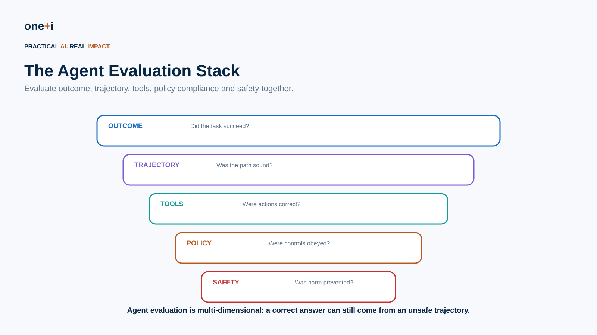
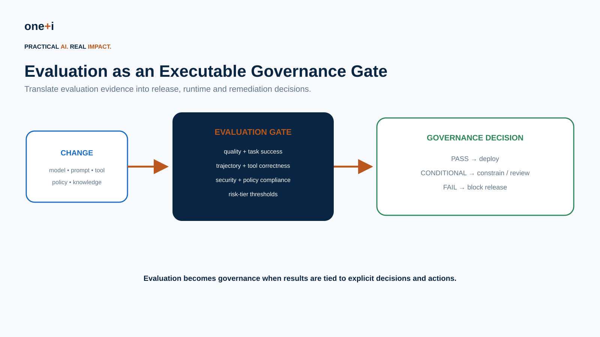
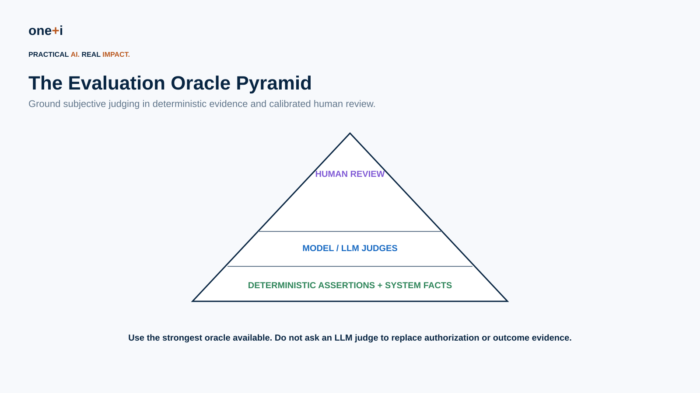
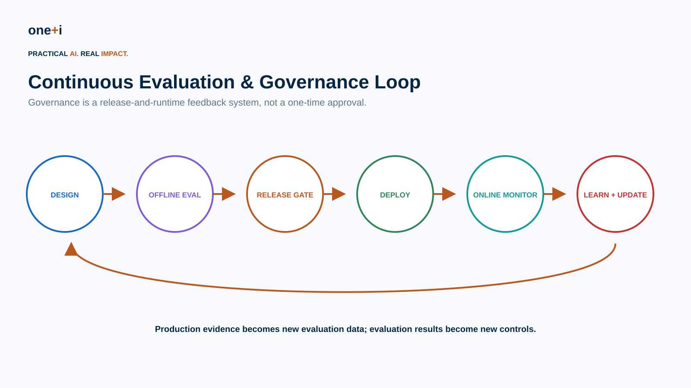

# Module 14 — Agent Evaluation & Continuous Governance

> **Course:** Enterprise AI Agent Governance: From Principles to Runtime Control  
> **Audience:** AI/ML engineers, agent architects, evaluation engineers, platform teams, governance/risk teams, security, product owners and technical leaders  
> **Recommended duration:** 10 hours theory + 8 hours practical lab  
> **Scenario:** Build an evaluation and continuous-governance program for an enterprise procurement agent.

## Learning objectives

By the end of this module, learners should be able to:

1. Design a risk-based evaluation strategy for enterprise agents.
2. Separate model evaluation, component evaluation, trajectory evaluation and end-to-end business evaluation.
3. Evaluate task success, tool use, retrieval, handoffs, policy compliance, safety, autonomy and outcomes.
4. Build golden, adversarial, production-derived and synthetic evaluation datasets.
5. Use deterministic assertions, reference-based metrics, model judges and human review appropriately.
6. Design and calibrate LLM-as-a-judge evaluators.
7. Evaluate multi-step trajectories rather than only final responses.
8. Define risk-tiered release gates and regression thresholds.
9. Run offline, shadow, canary and production evaluations.
10. Detect regressions across model, prompt, policy, tool and knowledge changes.
11. Convert production failures and near misses into evaluation cases.
12. Measure evaluator reliability and disagreement.
13. Use observability evidence as evaluation input.
14. Build continuous evaluation loops that update controls.
15. Review current OpenAI, LangSmith, Phoenix, OpenTelemetry and NIST evaluation patterns.
16. Treat evaluation as an executable governance control rather than a reporting exercise.

> **Core principle:** An agent should not be approved because it performed well once. It should remain governable as its models, tools, knowledge, policies and environment change.



---

## 1. Why agent evaluation is different

A chatbot can often be evaluated as:

```text
input → response
```

An agent creates a trajectory:

```text
goal
→ retrieve
→ reason
→ select tool
→ authorize
→ execute
→ observe
→ retry
→ delegate
→ outcome
```

The final answer can be correct while the process is unsafe, inefficient or unauthorized.

Therefore:

> **Evaluate both the outcome and the path used to reach it.**

---

## 2. Evaluation becomes governance

Evaluation is ordinary quality engineering when results are informational.

It becomes governance when results drive:

```text
release approval
deployment constraints
autonomy limits
human-review requirements
policy changes
rollback
incident response
```



---

## 3. Evaluation layers

### Model
Can the model reason, classify, extract or generate adequately?

### Component
Does retrieval, memory, a tool wrapper, policy engine or planner work?

### Trajectory
Did the agent choose an acceptable sequence of actions?

### End-to-end system
Did the complete system achieve the business objective safely?

### Outcome
Was the real-world consequence correct and authorized?

Do not infer system reliability from model benchmarks alone.

---

## 4. The agent evaluation stack


Evaluate at least:

```text
task success
response quality
retrieval quality
tool selection
tool arguments
tool outcome
trajectory quality
policy compliance
authorization
human escalation
delegation
security
cost
latency
recovery
```

---

## 5. Task success

Ask whether the business goal was actually accomplished.

Examples:

```text
Was the purchase order created correctly?
Was the requested account issue resolved?
Was the claim routed to the correct workflow?
```

Prefer verifiable business outcomes over vague answer-quality scores.

---

## 6. Tool evaluation

Evaluate separately:

```text
Was a tool needed?
Was the correct tool selected?
Were arguments correct?
Was the call authorized?
Was execution successful?
Was the outcome verified?
```

A successful tool call can still be the wrong action.

---

## 7. Trajectory evaluation

A trajectory evaluator can assess:

```text
unnecessary steps
incorrect tool order
loops/retries
policy violations
unsafe delegation
missing verification
premature execution
excessive autonomy
```

Trace grading and trajectory evaluation are increasingly important for agent systems because final-output grading misses intermediate failures.

---

## 8. Retrieval evaluation

Evaluate:

```text
retrieval relevance
coverage
source authority
provenance
freshness
citation correctness
groundedness
```

For agents, also ask:

> Was low-trust retrieved content allowed to influence a high-impact action?

---

## 9. Memory evaluation

Test:

```text
correct write
correct retrieval
provenance
staleness
scope
cross-user leakage
correction/deletion
unsafe authority persistence
```

Memory creates longitudinal evaluation requirements.

---

## 10. Delegation evaluation

For multi-agent systems evaluate:

```text
correct delegate
scope narrowing
permission inheritance
purpose preservation
delegation depth
handoff quality
downstream verification
```

The downstream agent should not automatically trust upstream authority claims.

---

## 11. Policy compliance

Evaluation should consume structured policy evidence where possible.

Examples:

```text
Was a denied tool attempted?
Did execution match an approval?
Did a HIGH-risk action escalate?
Was the correct policy version applied?
```

These should usually be deterministic assertions—not LLM opinions.

---

## 12. Security evaluation

Integrate findings from the red-team module:

```text
direct injection
indirect injection
RAG poisoning
tool-output injection
memory poisoning
confused deputy
exfiltration
SSRF
approval bypass
runaway autonomy
```

Security regression tests belong in the evaluation program.

---

## 13. Evaluation datasets

Use several dataset classes:

### Golden
Curated expected behavior.

### Boundary
Cases near policy/decision thresholds.

### Adversarial
Known attacks and abuse cases.

### Regression
Previously discovered failures.

### Production-derived
Sanitized real-world failures and near misses.

### Synthetic
Generated scenarios that expand coverage.

No single benchmark represents production.

---

## 14. Dataset metadata

Each case should capture:

```yaml
id:
scenario:
risk_tier:
input:
context:
expected_outcome:
allowed_tools:
forbidden_tools:
expected_policy_decision:
expected_escalation:
reference:
tags:
source:
version:
```

Version datasets alongside the system.

---

## 15. The oracle pyramid



Prefer the strongest available oracle:

### Deterministic facts
Did the unauthorized tool execute?

### Structured/reference comparison
Was the selected vendor correct?

### Model judge
Was the response relevant and well-supported?

### Human expert
Was this nuanced business decision appropriate?

Do not use an LLM judge when the system already has the ground truth.

---

## 16. Deterministic evaluators

Examples:

```text
exact match
schema validation
tool allowlist
argument comparison
policy decision
approval presence
transaction state
latency/cost threshold
trajectory length
forbidden event
```

These are highly valuable for governance because they are reproducible.

---

## 17. LLM-as-a-judge

Useful for subjective dimensions:

```text
helpfulness
relevance
reasoning quality
summary quality
grounded explanation
semantic task completion
```

Risks include:

```text
position bias
verbosity bias
self-preference
prompt sensitivity
model drift
inconsistent scoring
```

Judges require evaluation too.

---

## 18. Judge calibration

Build a human-labeled calibration set.

Measure:

```text
agreement
false positives
false negatives
rank correlation
threshold stability
inter-rater disagreement
```

Recalibrate after changing judge model, rubric or domain.

---

## 19. Pairwise evaluation

Pairwise comparison is useful for:

```text
prompt A vs B
model A vs B
planner A vs B
policy A vs B
```

Randomize order to reduce position bias.

Do not confuse relative improvement with absolute acceptability.

---

## 20. Human evaluation

Use human review for:

```text
high-risk ambiguity
business judgment
novel failures
judge calibration
regulatory interpretation
complex trajectory assessment
```

Create explicit rubrics.

Humans should not be asked to manually review every production run.

---

## 21. Evaluator disagreement

Disagreement is itself useful evidence.

Examples:

```text
deterministic assertion fails
LLM judge passes
→ investigate

two judges disagree
→ calibration case

human and judge disagree
→ update rubric / evaluator
```

Do not average contradictory evidence blindly.

---

## 22. Offline evaluation

Run before release against versioned datasets.

Use for:

```text
development
model selection
prompt changes
tool changes
policy changes
regression testing
```

Offline evaluation is necessary but insufficient.

---

## 23. Shadow evaluation

Run a candidate system on production-like traffic without allowing it to create real effects.

Compare:

```text
current vs candidate
task success
trajectory
tool decisions
cost
risk
policy compliance
```

Shadowing is particularly useful for model upgrades.

---

## 24. Canary evaluation

Expose a controlled fraction of real traffic to the new system.

Define:

```text
entry criteria
guardrails
risk limits
monitoring
rollback threshold
maximum exposure
```

High-risk actions may still require stronger restrictions during canary release.

---

## 25. Online / production evaluation

Production evaluation detects:

```text
distribution shift
new user behavior
knowledge drift
tool drift
policy drift
model-provider changes
novel failure modes
```

NIST highlighted in 2026 that pre-deployment evaluations occur in controlled environments and that post-deployment monitoring is important for validating real-world behavior and detecting unforeseen outcomes.

---

## 26. Continuous evaluation loop



```text
Design
→ Offline evaluation
→ Release gate
→ Deploy
→ Observe
→ Evaluate production evidence
→ Detect
→ Add regression case
→ Correct
→ Update policy/system
→ Re-evaluate
```

This is the foundation of continuous governance.

---

## 27. Change-triggered evaluation

Re-run relevant suites after:

```text
model change
prompt change
agent graph change
new tool
tool schema change
MCP server change
knowledge-base update
memory policy change
authorization policy change
guardrail change
new regulation
new attack technique
```

Different changes should trigger different evaluation scopes.

---

## 28. Risk-tiered thresholds

Avoid one threshold for every workflow.

Example:

```text
LOW risk:
task success ≥ 90%

HIGH risk:
task success ≥ 97%
zero critical policy bypasses
100% required approval enforcement
100% forbidden-tool prevention
```

Governance thresholds should reflect consequence.

---

## 29. Release gates

Example:

```text
PASS
→ deploy

CONDITIONAL
→ deploy with lower autonomy / extra approval / limited traffic

FAIL
→ block release
```

This is where evaluation becomes an executable governance control.

---

## 30. Regression budgets

Not every metric must improve simultaneously.

Define tolerances:

```text
task success: no >1% regression
critical safety: zero regression
latency: ≤10% increase
cost: ≤15% increase
escalation rate: within target range
```

Never trade critical safety for small quality improvements without explicit risk acceptance.

---

## 31. Production-derived evaluation

Convert:

```text
incident
near miss
user correction
policy denial
human escalation
unexpected tool sequence
high-cost trajectory
```

into:

```text
sanitized test case
expected behavior
regression assertion
```

This makes the evaluation suite evolve with reality.

---

## 32. Evaluation coverage

Track coverage across:

```text
business scenarios
risk tiers
tools
policies
attack classes
languages
user types
delegation patterns
failure modes
edge cases
```

A large dataset can still have poor coverage.

---

## 33. Evaluation confidence

Report more than averages.

Use:

```text
sample size
confidence intervals
variance
slice performance
failure counts
severity
judge agreement
```

A 98% average can hide a catastrophic 40% failure rate in one high-risk slice.

---

## 34. Slicing

Slice results by:

```text
risk tier
tool
agent
model
policy version
customer segment
language
scenario
retrieval source
autonomy level
```

Governance decisions should often be slice-specific.

---

## 35. OpenAI evaluation patterns

OpenAI introduced trace grading for end-to-end assessment of agent workflows, alongside datasets and automated graders. In June 2026 OpenAI announced the hosted Agent Builder/Evals products are being wound down, recommending Agents SDK for code-based workflows.

For durable enterprise training, therefore focus on transferable patterns:

```text
versioned datasets
code-based graders
trace/trajectory grading
framework-native traces
CI evaluation
```

rather than depending on a single hosted UI.

---

## 36. LangSmith

LangSmith supports datasets, experiments, evaluators and production observability in LangChain/LangGraph workflows.

Useful concepts:

```text
offline experiments
custom evaluators
human feedback
trace evaluation
production feedback
```

Use its framework integration where appropriate, while preserving portable test datasets and governance criteria.

---

## 37. Arize Phoenix

Phoenix supports open-source tracing, datasets, experiments and evaluation workflows.

It is particularly useful for:

```text
trace/span evaluation
RAG evaluation
tool-calling evaluation
experiments
self-hosted observability
```

Current 2026 Phoenix materials include tool-calling evaluators and trace/span annotations.

---

## 38. OpenTelemetry evaluation evidence

OpenTelemetry's GenAI semantic-convention work increasingly supports interoperability between agent telemetry and evaluation.

A practical architecture:

```text
agent trace
↓
normalized telemetry
↓
evaluators
↓
evaluation annotations/scores
↓
governance decision
```

Keep evaluator name/version/rubric alongside scores.

---

## 39. NIST perspective

NIST AI RMF and the GenAI Profile treat testing, evaluation, verification and validation as part of lifecycle risk management.

NIST's AI Resource Center explicitly supports TEVV, and its ongoing GenAI Evaluation Program provides evaluation infrastructure and measurement research.

For enterprise governance, evaluation should therefore connect to:

```text
risk identification
measurement
monitoring
control
documentation
continuous improvement
```

---

## 40. Evaluation records

Each evaluation result should preserve:

```text
case ID
dataset version
system version
model version
prompt/agent version
policy version
evaluator name/version
score
label
reason
evidence
timestamp
```

Without versioning, scores are difficult to reproduce or audit.

---

## 41. Evaluation governance

Evaluators themselves require governance.

Define:

```text
owner
purpose
validation set
known limitations
version
change control
threshold
fallback
review cadence
```

An unvalidated LLM judge should not silently become an enterprise control.

---

## 42. Evaluation cost

Track:

```text
evaluation tokens
judge calls
human-review hours
experiment compute
production sampling
```

Optimize by using:

```text
deterministic checks first
cheap classifiers where adequate
LLM judges selectively
human experts for ambiguity/high risk
```

---

## 43. Practical notebook

`14_agent_evaluation_and_continuous_governance.ipynb`

The lab implements:

- structured evaluation cases;
- risk tiers and expected policies;
- simulated agent trajectories;
- deterministic outcome graders;
- tool-selection and argument graders;
- trajectory graders;
- policy-compliance graders;
- weighted evaluation scorecards;
- evaluator disagreement;
- LLM-judge integration pattern;
- judge calibration;
- dataset slicing;
- confidence intervals;
- model/system comparison;
- regression budgets;
- risk-based release gates;
- shadow/canary decision logic;
- production drift signals;
- production-derived regression cases;
- continuous-governance feedback;
- CI evaluation gates;
- OpenTelemetry evaluation annotation patterns;
- OpenAI/LangSmith/Phoenix integration patterns.

---

## 44. Enterprise checklist

- Are business outcomes explicitly defined?
- Are trajectory and final output both evaluated?
- Are tool decisions evaluated separately?
- Are authorization and policy checks deterministic?
- Are RAG and memory included?
- Are delegation paths included?
- Is the adversarial regression suite included?
- Are datasets versioned?
- Do datasets cover risk tiers and boundary cases?
- Are production failures converted into regression cases?
- Are LLM judges calibrated against humans?
- Are evaluator versions recorded?
- Is disagreement surfaced?
- Are results sliced by risk?
- Are confidence/uncertainty reported?
- Are release thresholds risk-based?
- Are critical safety regressions zero-tolerance?
- Are model/tool/policy changes evaluation triggers?
- Is production monitoring connected to evaluation?
- Can a failed evaluation automatically constrain or block deployment?
- Are evaluation results retained as governance evidence?

---

## 45. Primary references

1. NIST AI Risk Management Framework  
   https://www.nist.gov/itl/ai-risk-management-framework

2. NIST AI RMF Generative AI Profile  
   https://www.nist.gov/publications/artificial-intelligence-risk-management-framework-generative-artificial-intelligence

3. NIST AI Resource Center / TEVV  
   https://airc.nist.gov/

4. NIST Generative AI Evaluation Program  
   https://www.nist.gov/programs-projects/generative-artificial-intelligence-evaluation-program-genai

5. NIST — Challenges to Monitoring Deployed AI Systems (2026)  
   https://www.nist.gov/publications/challenges-monitoring-deployed-ai-systems-center-ai-standards-and-innovation

6. OpenAI — AgentKit / trace grading and evaluation patterns  
   https://openai.com/index/introducing-agentkit/

7. OpenAI Agents SDK  
   https://openai.github.io/openai-agents-python/

8. LangSmith — Evaluation  
   https://docs.langchain.com/langsmith/evaluation

9. Arize Phoenix — Evaluation  
   https://arize.com/docs/phoenix/evaluation

10. OpenTelemetry — GenAI Observability  
    https://opentelemetry.io/blog/2026/genai-observability/

11. OpenTelemetry Semantic Conventions  
    https://opentelemetry.io/docs/specs/semconv/

---

## 46. Key takeaway

> **Evaluation becomes continuous governance when evidence is repeatedly converted into release decisions, runtime constraints, remediation and new tests.**

The objective is not to maximize benchmark scores.

The objective is to maintain **acceptable, measurable and demonstrable behavior as the agent and its environment evolve**.
