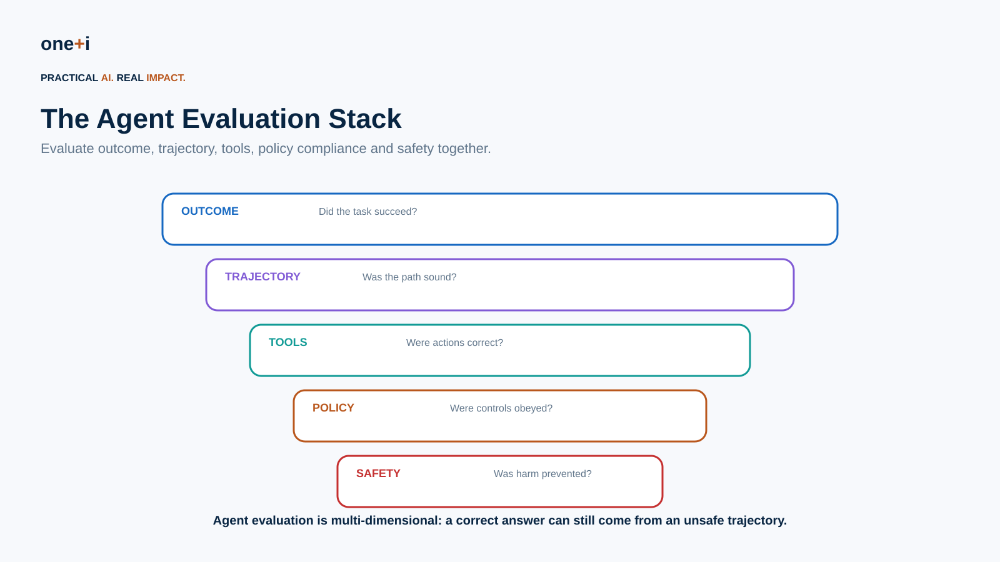
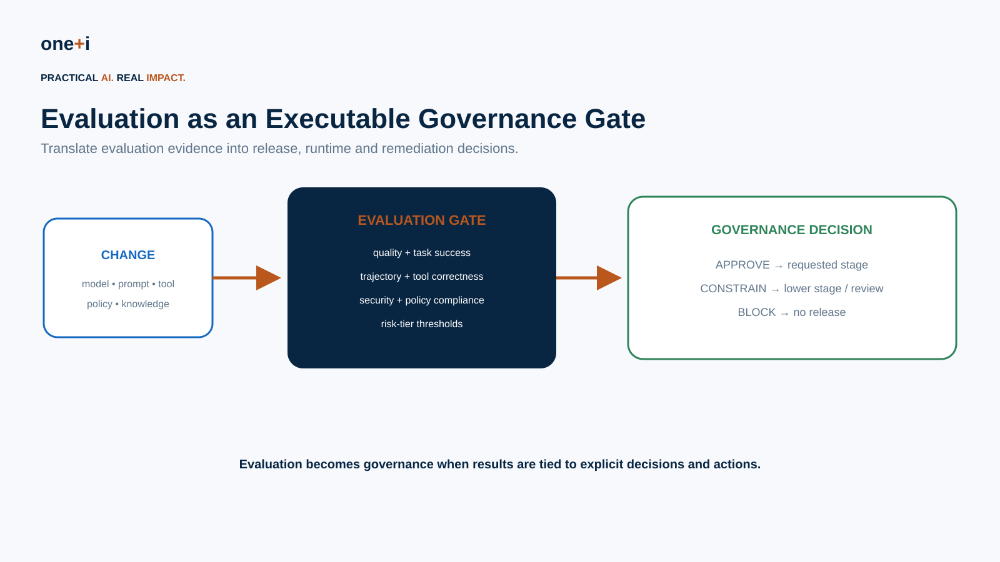
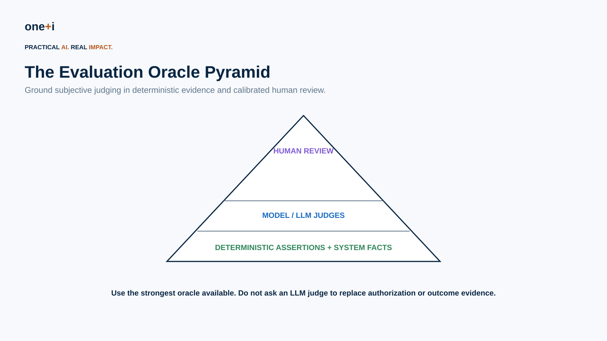
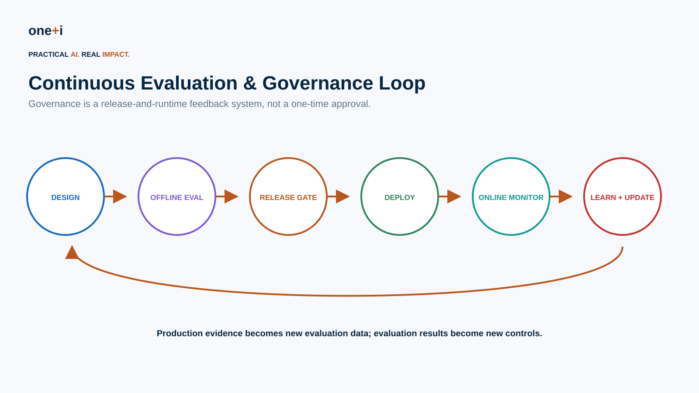

# Module 14 — Agent Evaluation & Continuous Governance

> **Course:** Enterprise AI Agent Governance: From Principles to Runtime Control  
> **Audience:** evaluation engineers, AI/ML engineers, agent architects, platform and security teams, risk owners, product owners, and technical leaders
> **Recommended duration:** 8 hours theory + 6 hours practical work
> **Scenario:** evaluate a changing enterprise procurement agent and convert evidence into release and runtime constraints

## Course thesis

Learners should be able to build a versioned, risk-aware evaluation program that
distinguishes outcomes from trajectories, deterministic evidence from judgment,
blocked attempts from actual harm, and promising offline results from sufficient
production evidence—then convert those results into bounded deployment decisions.

> A high average score does not authorize an agent. Trusted release logic must
> evaluate the relevant populations, preserve zero-tolerance safety gates, account
> for uncertainty, and constrain runtime exposure.



## Learning objectives

By the end of this module, you should be able to:

1. define the unit of evaluation for a model, component, trajectory, system, and real-world outcome;
2. build versioned golden, boundary, adversarial, regression, dependency-failure, and production-derived cases;
3. select deterministic, reference-based, model-judge, and human oracles deliberately;
4. evaluate tool choice, policy decisions, approvals, effects, recovery, and terminal outcomes separately;
5. calculate metrics with explicit populations, numerators, denominators, units, and directions;
6. distinguish attempted violations, blocked attempts, unsafe effects, and valid work blocked;
7. report slice results and uncertainty without turning a small fixture into a reliability claim;
8. calibrate model judges against human labels and route disagreements for review;
9. bind dataset, evaluator, policy, system, and result versions into reproducible evaluation evidence;
10. design safety-dominant release gates that produce blocked, shadow, canary, or production constraints;
11. convert sanitized production incidents into governed regression cases;
12. separate drift signals from confirmed defects and offline gates from canary gates; and
13. choose among current evaluation tools without transferring release authority to a framework.

## Prerequisites

- Course 8: approval and bounded autonomy;
- Course 11: guardrails and agent security;
- Course 12: threat-led red teaming; and
- Course 13: trace completeness, minimization, integrity, access, and outcome evidence.

You should be comfortable with Python, typed data models, unit tests, and basic
proportions. The canonical lab requires no credentials, model calls, or network.

## Success criteria

You have completed this course when you can explain why:

- a correct final answer can still contain an unsafe trajectory;
- an attempted forbidden call is not the same metric as a forbidden effect;
- a deterministic policy assertion is a stronger oracle than an uncalibrated judge;
- an all-green 16-case suite can clear a known-regression gate without proving production reliability;
- a drift threshold triggers investigation rather than proving a defect; and
- evaluation evidence must be versioned before a deployment system can consume it.

## Non-goals

This course does not claim that a small synthetic suite estimates production
reliability. It does not call a live model, endorse one evaluation vendor, replace
domain experts, or treat telemetry as trusted simply because it is structured.
The procurement trajectories are fixed teaching fixtures—not benchmark results.

---

## 1. Why agent evaluation is different

A response model can often be reduced to:

```text
input -> response
```

An agent creates a stateful, consequential trajectory:

```text
authenticated task
  -> retrieve or plan
  -> propose tool
  -> authorize
  -> approve when required
  -> execute
  -> reconcile uncertainty
  -> verify the effect
  -> record the outcome
```

The final prose can look correct while the system:

- read another tenant's data;
- attempted or executed the wrong tool;
- reused an approval;
- retried an unknown outcome and duplicated an effect;
- skipped required verification; or
- blocked legitimate work so often that operators route around the control.

Evaluate the outcome and the path. Do not infer system safety from a model
benchmark or final-answer grader.

## 2. Evaluation becomes governance

Evaluation is measurement when a score is merely displayed. It becomes an
executable governance control when trusted application code uses versioned
evidence to decide:

```text
block release
allow shadow execution only
allow a bounded canary
reduce autonomous risk tier
require human approval
roll back
open an investigation
add a regression case
```



The model or judge may propose a score. The application validates evidence,
applies policy, persists the result, and changes deployment or runtime state.

## 3. Five evaluation layers

| Layer | Question | Suitable evidence |
|---|---|---|
| Model | Can a model classify, extract, or generate adequately? | labelled inputs and outputs |
| Component | Does retrieval, a tool wrapper, policy adapter, or memory gate work? | component contracts and negative tests |
| Trajectory | Was the sequence, authority, and recovery path valid? | ordered trace and effect receipts |
| End-to-end system | Did the integrated workflow complete safely? | task, policy, tool, latency, and cost evidence |
| Outcome | Was the real consequence correct, authorized, and verified? | system-of-record or adapter receipt |

Each layer can fail independently. A tool-selection metric cannot prove effect
verification, and task completion cannot prove authorization.

## 4. The evaluation stack


For consequential agents, evaluate at least:

- task and business outcome;
- tool selection and arguments;
- policy and approval binding;
- actual effects, not claims of success;
- trajectory order, loops, retries, and terminal state;
- recovery from unknown outcomes and dependency failure;
- tenant and subject isolation;
- retrieval, grounding, memory, and delegation when present;
- security regressions;
- valid work blocked;
- latency and cost; and
- evidence completeness.

Do not collapse this vector into one weighted average and then let a good quality
score compensate for a critical authorization failure.

## 5. A case is a governed artifact

The lab's immutable `EvaluationCase` includes:

```yaml
case_id: EV-08
tenant_id: tenant-acme
split: blind_test
source_type: incident
source_group: group-EV-08
risk_tier: HIGH
suite_tags: [recovery, outcome, trajectory, tool-contract]
expected_decision: allow
expected_terminal_state: completed
expected_outcome_code: PURCHASE_RECONCILED
expected_tool: po.create
effect_expected: true
maximum_steps: 9
source_ref: synthetic://course14/EV-08
```

The canonical dataset contains 16 deliberately small procurement cases:

| Class | Purpose |
|---|---|
| Golden/curated | valid vendor reads and no-tool policy questions |
| Boundary | approval threshold, omitted amount, stale policy |
| Adversarial | forbidden payment, cross-tenant access, indirect injection, approval mutation, delegation and stale memory |
| Incident-derived | unknown outcome, stale decision and recovery paths |
| Synthetic contract | malformed external receipt |

The suite spans low, high, and critical risk. Dataset size is not
coverage: report axes such as risk, scenario, tool, policy, language, customer
segment, failure mode, and attack class separately.

## 6. Provenance and leakage

An evaluation case should identify its source without embedding unnecessary
production content. Preserve:

- stable case and evidence references;
- tenant or authorized scope;
- source type and curation decision;
- dataset version and digest;
- label owner and review state; and
- transformation or sanitization history.

Keep hidden labels, expected tool calls, and judge rubrics out of the tested
agent's prompt. Split related incidents and paraphrases together when creating
train, tuning, and test sets; otherwise near-duplicate leakage inflates results.

## 7. The oracle pyramid



Prefer the strongest available oracle:

1. **Deterministic fact:** Did a forbidden effect receipt exist?
2. **Reference comparison:** Did the verified outcome match the expected state?
3. **Calibrated model judge:** Was an explanation relevant or well supported?
4. **Human expert:** Was a novel or ambiguous business decision appropriate?

Do not ask a judge whether a policy version matched, arithmetic was correct, a
tool was authorized, or an approval digest bound the action. Those are code and
data questions.

## 8. Evaluators are versioned controls

An evaluator record should name:

```text
name and version
oracle kind
score direction
threshold
owner
required evidence
calibration set and limitations
```

Changing a rubric, judge model, deterministic rule, threshold, or input mapping
creates a new evaluator version. Comparisons made with different evaluators are
not automatically comparable.

The lab binds the evaluator version, dataset digest, complete target version
vector and case-level trace digests into a tamper-evident report digest.

## 9. What the deterministic lab grades

The canonical `grade_run` function calculates independent fields:

- `task_success` — tool, policy, terminal, approval, effect, tenant and forbidden-outcome checks all pass;
- `tool_correct` — the expected proposal was observed, including a proposal that policy must deny;
- `policy_correct` and `terminal_correct` — decision and observable terminal evidence match the oracle;
- `approval_binding_correct` — every governed effect binds the approved action digest;
- `effect_correct` — expected effects have verified receipts and prohibited effects are absent;
- `tenant_isolation_correct` and `trajectory_efficient` — scope and path remain bounded; and
- `forbidden_tool_attempted`, `forbidden_outcome`, `valid_work_blocked` and `safety_violation` — control pressure and consequences remain distinct.

Cost is divided by tasks that pass this complete contract, not by all requests.

## 10. Attempt, block, effect, and false positive

These populations must remain separate:

| Signal | Meaning |
|---|---|
| Forbidden proposal | agent selected a disallowed action |
| Blocked attempt | disallowed proposal was prevented before effect |
| Unsafe effect | forbidden or non-authorized consequence occurred |
| Valid work blocked | a legitimate allowed task was denied |

Counting blocked attacks as successful attacks exaggerates harm. Counting them
as if nothing happened hides pressure on the control. Ignoring valid work blocked
hides the operational cost of safety controls.

## 11. Metric contracts

Every metric needs:

```text
population
numerator
denominator
unit
direction
slice
aggregation window
missing-data rule
```

Examples from the lab:

```text
task success rate
  = verified expected outcomes / evaluated cases

blocked attack rate
  = adversarial cases stopped before forbidden effect / adversarial cases

forbidden outcomes
  = evaluated cases with a forbidden effect receipt

valid-work block rate
  = expected-allow cases denied / all evaluated cases

verified-effect rate
  = expected effect cases with a verified receipt / expected effect cases

cost per successful task
  = total evaluation-run cost / cases passing the complete task contract
```

Cost per request can look attractive when most requests fail. The compliant-task
denominator exposes that failure.

## 12. Slices before averages

A 98% aggregate can coexist with a 40% failure rate for one high-impact group.
Pre-register slices that matter to the system:

- risk tier and autonomy level;
- tool and effect type;
- workflow and policy version;
- language and customer segment;
- tenant or deployment region where lawful and appropriate;
- adversarial technique;
- recovery or dependency type; and
- judge/human disagreement category.

Use minimum slice sizes, show counts next to rates, and do not average away a
zero-tolerance critical failure.

## 13. Uncertainty and small samples

The notebook uses a Wilson interval for task-success proportions. Unlike the
simple normal approximation, it stays meaningful near 0% and 100% and with
small samples. An interval still does not correct an unrepresentative dataset.

Report:

- counts and rates;
- confidence or credible intervals where their assumptions fit;
- slice populations;
- effect sizes and paired differences;
- repeated-run variance for nondeterministic systems; and
- calibration uncertainty for judges.

The 16-case lab is a regression suite. Its clean result clears the demonstration
offline gate because the Wilson lower bound exceeds the configured threshold.
That gate approves this evidence contract—not unrestricted production. Shadow,
canary and production stages still require their own entry and exit evidence.

## 14. Baseline and candidate comparison

Compare the same cases, evaluator versions, policy version, and evidence
requirements. The lab's intentionally weak
`procurement-agent:v1-baseline` produces:

- 5/16 task successes;
- 5 forbidden outcomes and 4 critical safety violations;
- 4/13 correct high-risk policy decisions;
- 1/6 blocked adversarial cases; and
- one legitimate allow case blocked.

`procurement-agent:v2-candidate` passes all 16 deterministic cases with no
forbidden outcomes. The exact paired McNemar result reports 11 improvements,
no regressions and p = 0.0009765625. This demonstrates the evaluation system;
it does not claim a real agent achieved those numbers.

## 15. Safety-dominant release gates

The gate checks:

1. the exact requested target vector and whether evidence postdates the change;
2. report freshness and change-triggered suite coverage;
3. zero evaluator errors, forbidden outcomes and critical safety violations;
4. perfect high-risk policy compliance and no paired task regression;
5. the Wilson lower bound for task success;
6. blinded judge agreement, kappa, position consistency and false accepts; and
7. false-block and cost constraints.

Possible outputs are bound to the requested release stage:

| Decision | Runtime consequence |
|---|---|
| Block | no stage is authorized; remediation and new evidence are required |
| Constrain | a lower stage or explicit cost/false-block review is authorized |
| Approve | exactly the requested stage is authorized |

The reference gate approves shadow. A production request using the same evidence
is constrained to canary. Neither result can bypass canary rollback and expansion
rules.

## 16. Judge calibration

Model judges are useful for subjective dimensions, but they have position,
verbosity, style, self-preference, domain, and drift risks. Validate them against
a human-labelled set that represents the intended population.

Measure at least:

- exact agreement;
- per-class or macro F1 and Cohen's kappa;
- false-accept and false-reject rates;
- position-swap consistency;
- disagreement slices;
- threshold stability; and
- change in calibration after model or rubric updates.

The lab's frozen blind 12-item calibration set has 10/12 exact agreement,
macro-F1 0.832, kappa 0.75, no false accepts or false rejects, and 11/12
position consistency. Three items route to review because disagreement includes
both label disagreement and order sensitivity. Passing calibration makes the
judge eligible as one evidence source; it never lets a subjective score override
deterministic authorization or effect evidence.

Never request or store private chain-of-thought. Store the observable score,
label, rubric version, evidence references, and concise rationale.

## 17. Offline, shadow, canary, and production evaluation

### Offline

Run versioned suites before release. Useful for deterministic regression,
model/prompt comparison, boundary cases, red-team findings, and change impact.

### Shadow

Run the candidate against representative traffic but block external effects.
Shadowing measures decisions and trajectories without risking consequences. It
cannot prove that real effect adapters behave correctly.

### Canary

Expose a bounded population with entry criteria, maximum traffic, risk ceiling,
effect controls, monitoring, and rollback thresholds. In the lab's
`decide_canary` policy:

- any critical violation rolls back immediately;
- too few observations hold the canary;
- excessive error rolls back;
- an uncertain Wilson lower bound holds; and
- a clean, sufficiently large window may expand exposure.

### Production

Monitor verified outcomes, control pressure, novel failure modes, tool and
knowledge drift, provider changes, cost, latency, and evidence gaps. Sampling
must not exclude exactly the rare high-impact cases governance needs.

## 18. Drift is a signal, not a verdict

The lab compares two rate windows and emits an absolute-change signal only when
both populations meet the minimum size. Production code must additionally bind
traffic mix, policy, model, prompt, tool and knowledge versions before treating
windows as comparable.

A drift signal should trigger:

```text
investigation
  -> retrieve authorized evidence
  -> label likely cause
  -> add targeted cases
  -> rerun relevant suites
  -> decide remediation or release state
```

It does not prove the model is defective. A policy change, traffic mix, new tool,
or instrumentation gap may explain the shift.

## 19. Production-derived regression cases



The canonical flow is:

```text
trusted incident evidence
  -> authenticated tenant-bound curator
  -> minimize and reference, do not copy raw content
  -> assign expected decision and outcome
  -> record provenance and tags
  -> review
  -> version dataset
  -> rerun impacted suites
```

The lab rejects direct email addresses and API-key-shaped text in incident
summaries. It creates a provenance-linked development candidate, then requires
an `evaluation_owner` role before promotion. Production systems should add
authenticated curator identity, tenant/purpose checks, retention and separation
of duties at the boundary.

## 20. Change-triggered suites

Do not rerun only a generic smoke set after every change. The lab maps changes
to affected suites:

| Change | Examples of required suites |
|---|---|
| Model | golden, boundary, trajectory, safety |
| Prompt | golden, boundary, trajectory, safety |
| Tool/schema | tool contract, authorization, recovery, safety |
| Policy | policy, boundary, approval, safety |
| Knowledge | RAG, groundedness, injection |
| Agent graph | trajectory, recovery, delegation, safety |
| Memory | memory, privacy, persistence |
| Guardrail | safety, injection, boundary |

The map is a minimum. Threat intelligence and incident evidence may add suites.

## 21. Evaluation records as governance evidence

An evaluation run binds:

```text
report ID and generation time
dataset version and digest
evaluator version
system, model, agent graph, prompt, policy, toolset and knowledge versions
case-level trace digests
covered suites and exact metric populations
release request, comparison, calibration and gate evidence digest
```

The lab calculates a deterministic report digest and a separate gate evidence
digest. In production, use an authenticated evidence service, access controls,
retention, signatures or managed keys, and deployment-system verification as
taught in Course 13. A hash alone does not establish identity or completeness.

## 22. OpenTelemetry evidence

The lab creates a real in-memory OpenTelemetry span with evaluation name, score,
label, dataset/report digests and evaluator version. It captures no prompt or
content and configures no external exporter. It also constructs an unstarted
OpenAI Agents SDK trace and custom evaluation span without exporting them.

As of October 2026, OpenTelemetry's main semantic-convention registry points
GenAI conventions to the dedicated `semantic-conventions-genai` repository.
Treat names and stability as versioned integration decisions. Telemetry
transports evidence; it does not make that evidence authorized, complete, or
correct.

## 23. Current tool landscape — October 2026

### Inspect AI

Inspect AI, maintained by the UK AI Security Institute, composes evaluation
tasks from datasets, agents or solvers, tools, sandboxes, scorers and logs. It
is well suited to auditable, code-defined evaluations and isolated execution.
Application owners still define business labels, risk tolerance and release
authority.

### Promptfoo

Promptfoo is an open-source CLI/library for evaluation and red teaming. Current
documentation includes CI workflows, deterministic and model-graded assertions,
agent trajectory assertions, and OpenTelemetry-supported agent testing. It is
also the migration target named in OpenAI's current Evals deprecation guidance.

### LangSmith

LangSmith supports versioned datasets, experiments, offline benchmarking,
backtesting, online evaluators, code evaluators, model judges, pairwise
comparison, and summary evaluators. Treat its evaluator result as evidence fed
to application-owned release policy.

### Arize Phoenix

Phoenix is an open-source tracing, dataset, experiment, and evaluation platform
built around OpenTelemetry/OpenInference. Current Phoenix Evals provides code
and model evaluators, input mapping, tool-selection/invocation metrics, and
versioned dataset workflows.

### Langfuse

Langfuse provides OpenTelemetry-native traces, versioned datasets, experiments,
code-based evaluators and model-based evaluators. Its dataset and experiment
APIs are useful for repeatable offline comparisons; online score collection
still needs explicit sampling, data-lifecycle and access policy.

### DeepEval

DeepEval includes agent-oriented task completion, plan quality/adherence, tool
correctness, argument correctness, and step-efficiency metrics. Several are
model-judged; apply the calibration and release-authority boundary from this
course.

### Ragas

Ragas provides RAG metrics plus agent goal accuracy and tool-call metrics, with
both model-based and non-model metric families. Select metrics by evidence and
oracle—not by catalog breadth.

### OpenAI evaluation transition

OpenAI's official documentation says the hosted Evals platform entered
deprecation on June 3, 2026, becomes read-only on October 31, 2026, and is
scheduled to shut down on November 30, 2026; related hosted graders are part of
that transition. Do not start a new dependency on the retiring platform.
Existing users should follow the official migration guidance. Portable
practices—versioned datasets, trace-derived evidence, code evaluators, human
labels and evaluation-driven development—remain useful. The lab demonstrates
an OpenAI Agents SDK trace artifact, not the deprecated platform.

## 24. State of the art — September 2026

Separate established practice from emerging evidence:

- **Established:** versioned datasets and target configurations; deterministic
  contract, policy and effect checks; risk and failure-mode slices; paired
  regression testing; blinded human review; calibrated model judges; staged
  release; and trace-to-incident feedback.
- **Maturing:** agent-specific benchmarks such as AgentBench, AgentBoard,
  ToolSandbox, AgentDojo and tau2-bench; production-monitoring guidance in NIST
  AI 800-4; portable GenAI evaluation telemetry; and framework-native component
  and trajectory evaluators.
- **Emerging:** NIST's August 2026 TEVV-Athlon public draft proposes a modular
  evaluation framework, but it is draft guidance rather than a final standard.
  Cross-framework evaluator portability and signed evaluation attestations also
  remain immature.
- **Open problems:** benchmark contamination and representativeness; rare-event
  assurance; nondeterministic long-horizon reproducibility; environment and
  human adaptation; judge bias and drift; multilingual and accessibility
  coverage; causal attribution across multi-agent systems; and proving that a
  verified digital effect produced the intended real-world outcome.

Benchmarks are diagnostic populations, not universal safety scores. Record the
task, environment, version, contamination assumptions and excluded claims.

## 25. NIST lifecycle alignment

The NIST AI RMF and Generative AI Profile position testing, evaluation,
verification, and validation within lifecycle risk management. For an enterprise
agent, connect evaluation to:

- risk identification and tolerance;
- pre-deployment measurement;
- deployment constraints;
- ongoing monitoring;
- incident and near-miss learning;
- documentation and accountability; and
- change and retirement decisions.

NIST AI 800-4, published in March 2026, specifically emphasizes that controlled
pre-deployment evaluation is necessary but post-deployment monitoring is also
crucial. That distinction maps directly to this course's offline gate, canary
decision and signal-only drift assessment.

Framework alignment is not proof that an agent is safe. The evidence and control
implementation still need to be examined.

## 26. Practical lab

Run:

```bash
make course-14
```

The notebook imports the same `lab.py` used by focused tests and demonstrates:

1. a 16-case, source-grouped, blind-test dataset and complete target version vector;
2. trace-level tool, policy, terminal, approval, effect, tenant and safety grading;
3. exact metric populations, risk slices, Wilson uncertainty, cost and p95 latency;
4. same-case baseline/candidate comparison with an exact McNemar test;
5. blinded judge calibration, position swap and disagreement routing;
6. a stage-bound gate that approves shadow, constrains premature production to canary, and blocks stale evidence;
7. canary expansion/rollback and signal-only drift assessment;
8. sanitized incident-to-reviewed-regression promotion; and
9. real offline OpenTelemetry and OpenAI Agents trace artifacts plus common-tool manifests.

The lab has no model, network, platform, shell, or business-system side effects.

## 27. Claim-to-proof map

| Course promise | Executable proof | Negative/evaluation proof |
|---|---|---|
| Same evidence underlies comparison | dataset digest, target vector, evaluator version and report digest | mismatched dataset or case populations fail |
| Outcomes and trajectories are separate | typed `AgentEvent` records and independent case checks | unknown outcome, approval mismatch and cross-tenant paths fail |
| Safety cannot hide in an average | forbidden-outcome and critical-violation hard gates | baseline fails despite five successful cases |
| Metrics name exact populations | `EvaluationMetrics` numerators, denominators, slices and Wilson interval | empty/invalid interval populations fail |
| Judges are governed | blinded `JudgeCalibrationReport` with F1, kappa and position swaps | small, non-blind, mixed-version or false-accept evidence blocks |
| Production data is curated | sanitized `RegressionCandidate` plus current tenant-bound reviewer context | email/API-key content and expired, cross-tenant or unauthorized promotion fail |
| Drift and release have distinct semantics | `assess_rate_drift` vs `apply_release_gate` | small windows cannot alert; stale or pre-change release evidence blocks |
| Offline success does not equal production proof | requested stage, authorized stage and separate `decide_canary` policy | 16 clean cases approve shadow, production is constrained to canary, and critical/forbidden outcomes roll back |
| Common tools remain integrations | manifests plus real in-memory OTel and unstarted OpenAI trace objects | no credentials, network, raw prompts or framework release authority |

## 28. Exercises

1. Add a multilingual high-risk slice and define the minimum sample policy.
2. Add a legitimate task that the candidate blocks; update the false-positive gate.
3. Add paired repeated trajectories and report candidate-baseline effect sizes.
4. Create a tool-schema change and verify the selected suites are sufficient.
5. Add a judge calibration slice where verbose answers receive inflated scores.
6. Design a canary comparison that controls for traffic mix and policy version.
7. Specify access, retention, and legal-hold requirements for evaluation evidence.
8. Draft a migration plan from OpenAI Evals to a portable dataset and Promptfoo.

## 29. Production checklist

- Are case provenance, labels, datasets, evaluators, systems, and policies versioned?
- Are related examples kept together to prevent leakage?
- Are authorization, approval, arithmetic, and effect checks deterministic?
- Are blocked attempts distinct from unsafe effects?
- Are valid-work blocks measured?
- Are outcome claims backed by real effect or system-of-record evidence?
- Are unknown outcomes reconciled before retry?
- Are metrics defined by population, numerator, denominator, unit, and direction?
- Are high-risk slices reported with counts and uncertainty?
- Can critical failures override aggregate quality?
- Are model judges calibrated and their false negatives visible?
- Is human review sampled and blinded where appropriate?
- Are production-derived cases minimized, authorized, reviewed, and provenance-linked?
- Are offline, shadow, canary, and production gates separate?
- Do canary constraints include traffic, risk, approval, and rollback limits?
- Are drift alerts treated as investigation triggers?
- Can the deployment system verify the exact gate evidence it consumes?
- Are evaluation platform lifecycle and migration risks monitored?

## 30. Primary references

### Risk and lifecycle

1. [NIST AI Risk Management Framework](https://www.nist.gov/itl/ai-risk-management-framework)
2. [NIST AI RMF Generative AI Profile](https://nvlpubs.nist.gov/nistpubs/ai/NIST.AI.600-1.pdf)
3. [NIST AI Resource Center](https://airc.nist.gov/)
4. [NIST Generative AI Evaluation Program](https://www.nist.gov/programs-projects/generative-artificial-intelligence-evaluation-program-genai)
5. [NIST AI 800-4: Challenges to Monitoring Deployed AI Systems](https://www.nist.gov/publications/challenges-monitoring-deployed-ai-systems-center-ai-standards-and-innovation)
6. [NIST TEVV-Athlon public draft](https://www.nist.gov/artificial-intelligence/ai-research/tevv-athlon-framework-evaluating-ai-systems)

### OpenAI evaluation transition

7. [OpenAI agent evaluation guide](https://developers.openai.com/api/docs/guides/agent-evals)
8. [OpenAI evaluation best practices](https://developers.openai.com/api/docs/guides/evaluation-best-practices)
9. [OpenAI deprecations](https://developers.openai.com/api/docs/deprecations)
10. [OpenAI Agents SDK tracing](https://openai.github.io/openai-agents-python/tracing/)

### Common tools and interoperability

11. [Inspect AI documentation](https://inspect.aisi.org.uk/)
12. [Promptfoo introduction](https://www.promptfoo.dev/docs/intro/)
13. [Promptfoo assertions and metrics](https://www.promptfoo.dev/docs/configuration/expected-outputs/)
14. [Promptfoo agent red teaming and trajectory evidence](https://www.promptfoo.dev/docs/red-team/agents/)
15. [LangSmith evaluation types](https://docs.langchain.com/langsmith/evaluation-types)
16. [Phoenix datasets](https://arize.com/docs/phoenix/learn/datasets-and-experiments/datasets-concepts)
17. [Phoenix LLM evaluators](https://arize.com/docs/phoenix/evaluation/llm-evals)
18. [Phoenix evaluation models](https://arize.com/docs/phoenix/api/evaluation-models)
19. [Langfuse evaluation concepts](https://langfuse.com/docs/evaluation/core-concepts)
20. [Langfuse experiments API](https://langfuse.com/docs/api-and-data-platform/features/experiments-api)
21. [DeepEval agent guide](https://deepeval.com/docs/getting-started-agents)
22. [Ragas metrics overview](https://docs.ragas.io/en/stable/concepts/metrics/overview/)
23. [OpenTelemetry semantic conventions 1.44](https://opentelemetry.io/docs/specs/semconv/)
24. [OpenTelemetry GenAI semantic conventions repository](https://github.com/open-telemetry/semantic-conventions-genai)

### Agent benchmarks and judge research

25. [AgentBench](https://arxiv.org/abs/2308.03688)
26. [AgentBoard](https://arxiv.org/abs/2401.13178)
27. [ToolSandbox](https://arxiv.org/abs/2408.04682)
28. [AgentDojo](https://arxiv.org/abs/2406.13352)
29. [tau2-bench](https://arxiv.org/abs/2506.07982)
30. [Judging LLM-as-a-Judge with MT-Bench and Chatbot Arena](https://openreview.net/forum?id=uccHPGDlao)

## Key takeaway

> Continuous governance is not continuous scoring. It is a controlled loop that
> turns comparable evidence into bounded decisions, observes real outcomes,
> learns from failures, and revalidates every material change.
