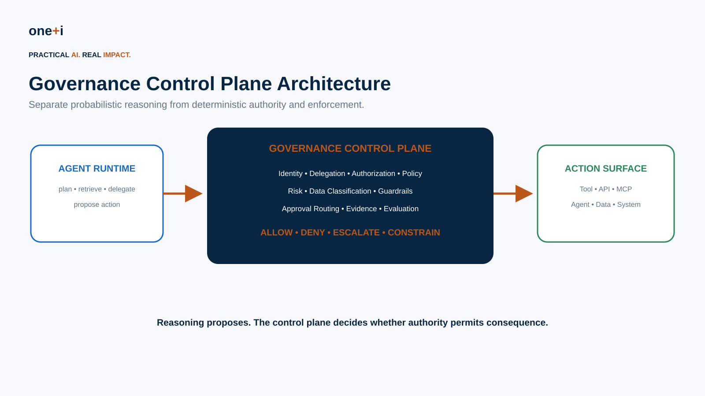
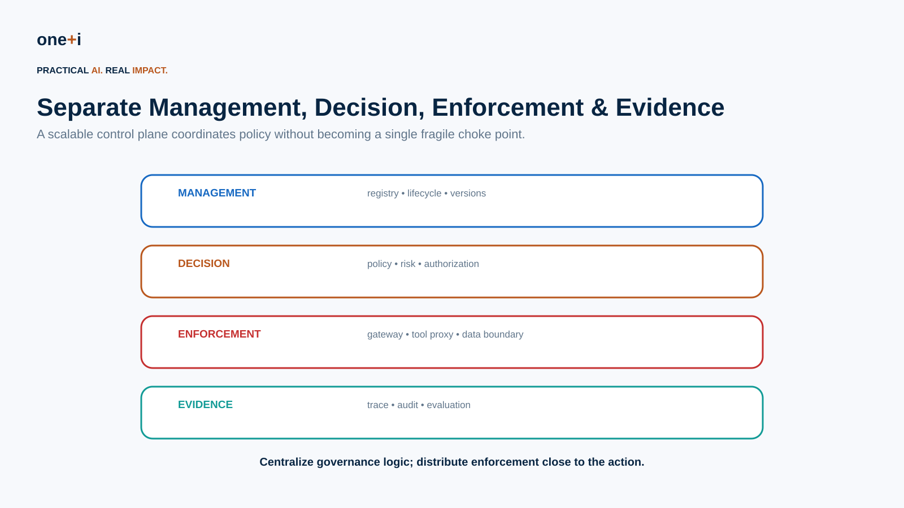
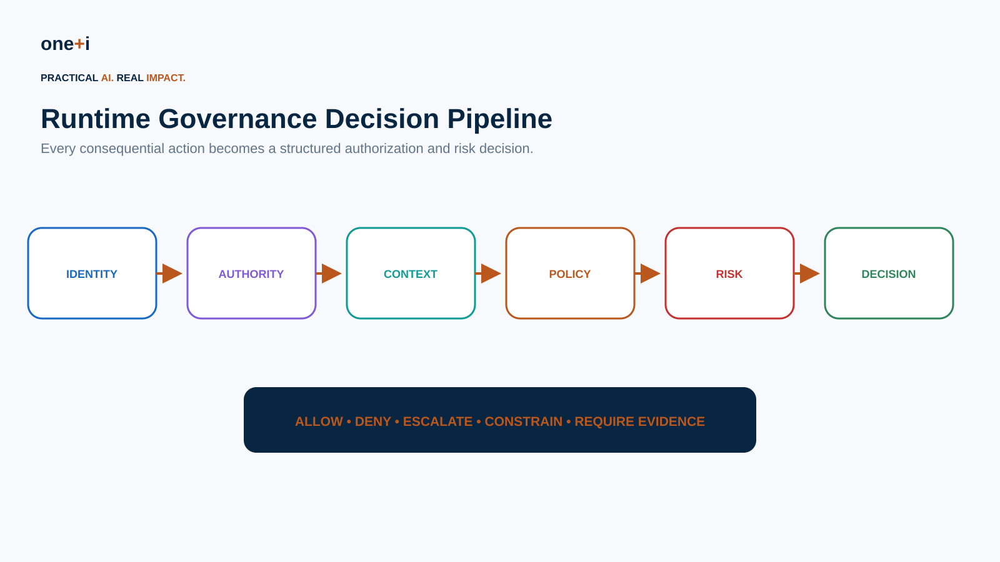
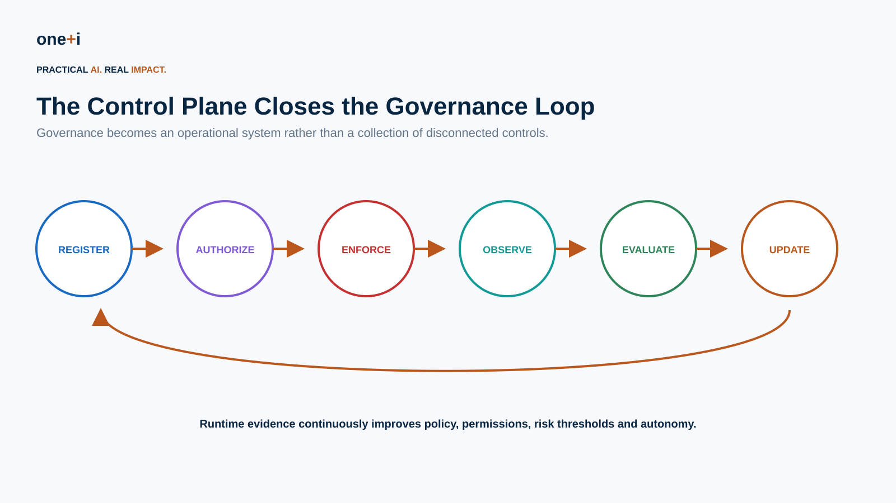

# Module 15 — Governance Control Plane Architecture

> **Course:** Enterprise AI Agent Governance: From Principles to Runtime Control  
> **Audience:** AI architects, agent engineers, security architects, IAM/platform teams, governance leaders, SRE, enterprise architects  
> **Recommended duration:** 10 hours theory + 8 hours practical lab  
> **Scenario:** Design and prototype a vendor-neutral governance control plane for an enterprise procurement-agent ecosystem.

## Learning objectives

Learners will be able to:

- explain why agent governance requires architectural enforcement, not only policies and prompts;
- separate reasoning, authority and execution;
- distinguish management, decision, enforcement and evidence responsibilities;
- design agent registration, identity and lifecycle controls;
- represent delegated authority as explicit machine-readable context;
- evaluate actions using identity, authority, purpose, data, risk and policy;
- implement ALLOW / DENY / ESCALATE / CONSTRAIN decisions;
- place policy enforcement points at tools, APIs, MCP servers, agents and data boundaries;
- design fail-closed behavior and break-glass paths;
- integrate human approvals without creating rubber-stamp workflows;
- externalize policy using policy-as-code patterns;
- create action-bound authorization and approval tokens;
- propagate governance context through multi-agent workflows;
- record decision evidence and action lineage;
- connect observability, evaluation and security feedback to policy updates;
- design for latency, availability, caching and degraded operation;
- avoid turning the control plane into a single point of failure;
- evaluate build-vs-buy and vendor-neutral integration patterns.

> **Core principle:** Reasoning can be probabilistic. Authority should be explicit, bounded and enforceable.



---

## 1. Why a governance control plane?

Enterprise agents combine models with:

```text
data
memory
tools
APIs
MCP servers
other agents
credentials
business systems
```

When controls remain scattered across prompts, service accounts, application code and tool integrations, organizations cannot consistently answer:

```text
Which agents exist?
Who owns them?
What may each agent do?
On whose authority?
Under what conditions?
Which policy applied?
What actually happened?
```

A governance control plane creates a shared architecture for those answers.

---

## 2. Control plane vs agent runtime

The agent runtime is responsible for capabilities such as:

```text
planning
reasoning
retrieval
memory
delegation
tool selection
```

The governance control plane is responsible for constraints such as:

```text
identity
authority
authorization
policy
risk
approval
data boundaries
evidence
```

Do not make the same probabilistic component both propose and independently authorize its own action.

---

## 3. Control plane vs data/action plane

Borrow a useful pattern from distributed systems.

### Control plane

Defines and coordinates:

```text
agents
policies
permissions
risk rules
registrations
versions
approval requirements
```

### Action/data plane

Actually executes:

```text
tool calls
API mutations
database changes
payments
messages
agent-to-agent calls
```

Controls should be centrally governable while enforcement can be distributed near the action.

---

## 4. Four architectural responsibilities



### Management

```text
agent registry
ownership
versions
lifecycle
tool registry
policy distribution
```

### Decision

```text
identity
authorization
risk
policy evaluation
approval routing
```

### Enforcement

```text
tool gateway
API proxy
MCP boundary
data access
agent gateway
```

### Evidence

```text
decision logs
traces
action lineage
evaluation
security events
audit
```

---

## 5. Agent registry

A production control plane needs a durable registry.

Example:

```yaml
agent_id: procurement-agent
version: 14
owner: procurement-platform
purpose: purchase-order-assistance
risk_tier: high
runtime: langgraph
allowed_tools:
  - vendor.read
  - po.prepare
  - po.create
max_autonomy: bounded
policy_bundle: procurement-v7
```

Identity must survive beyond an individual process invocation.

---

## 6. Tool registry

Register tools with governance metadata:

```yaml
tool: payment.execute
risk: critical
data_classification: restricted
reversible: false
required_permission: payment.execute
approval: multi_party
max_amount: 500000
```

The control plane should not infer tool consequence solely from a tool name.

---

## 7. Principal model

A decision may involve several principals:

```text
human principal
agent identity
service/workload identity
delegating agent
tenant
organization
```

Treat the acting agent and the authority source as separate concepts.

---

## 8. Delegated authority

Represent authority explicitly:

```json
{
  "delegator": "user:42",
  "delegate": "agent:procurement",
  "purpose": "purchase approved equipment",
  "permissions": ["vendor.read", "po.create"],
  "constraints": {"max_amount": 15000},
  "expires_at": "..."
}
```

Authority should normally attenuate as it is delegated.

---

## 9. Governance context envelope

Every consequential action should carry normalized context:

```text
principal
agent
delegation
purpose
requested action
resource
tool
data classification
risk
environment
session/workflow
```

This prevents every tool from inventing its own governance vocabulary.

---

## 10. Runtime decision pipeline



A practical decision:

```text
Who is acting?
↓
What authority exists?
↓
What is being requested?
↓
What data/resource is involved?
↓
Which policy applies?
↓
What is the risk?
↓
ALLOW / DENY / ESCALATE / CONSTRAIN
```

---

## 11. Beyond allow/deny

Agent governance benefits from richer decisions.

### ALLOW
Execute as proposed.

### DENY
Block.

### ESCALATE
Require human/stronger approval.

### CONSTRAIN
Execute with reduced scope.

Examples:

```text
reduce amount
remove sensitive fields
use read-only tool
limit destination
require sandbox
disable delegation
```

---

## 12. Policy decision point

The PDP evaluates policy using structured input.

Example:

```json
{
  "subject": {...},
  "action": {...},
  "resource": {...},
  "delegation": {...},
  "risk": {...},
  "environment": {...}
}
```

Return a structured decision with reasons—not merely `true`.

---

## 13. Policy enforcement points

Place PEPs where consequence occurs:

```text
tool gateway
API gateway
MCP server
database proxy
agent-to-agent gateway
message/email gateway
filesystem
cloud-control API
```

A policy that cannot stop the action is advisory, not enforcement.

---

## 14. OPA and policy-as-code

Open Policy Agent is a mature general-purpose policy engine using Rego.

It is useful for:

```text
fine-grained authorization
context-aware API decisions
central policy distribution
policy testing
decision logging
```

OPA supports externalized authorization where services ask the policy engine whether a request should execute.

The architecture matters more than the specific engine: policies should be versioned, testable and independent of agent prompts.

---

## 15. Risk engine

Authorization alone is not enough.

A user may technically have permission while the requested action is unusual or high impact.

Risk inputs can include:

```text
impact
amount
data sensitivity
novelty
confidence
irreversibility
anomaly score
destination
delegation depth
```

Policy can then combine authority with contextual risk.

---

## 16. Human approval router

Approval logic belongs in the control architecture.

Example:

```text
$40 reimbursement
→ ALLOW

$2,000 unusual expense
→ ESCALATE to reviewer

$25,000 vendor payment
→ manager approval

$500,000 irreversible payment
→ multi-party approval
```

Bind approval to the exact proposed action.

---

## 17. Action binding

A generic approval flag is unsafe.

Instead bind:

```text
tool
arguments
resource
amount
destination
policy version
expiry
```

using a signed or hashed action representation.

If the action changes, re-authorize it.

---

## 18. Tool gateway

A tool gateway can provide:

```text
tool discovery filtering
identity propagation
authorization
argument validation
risk evaluation
approval
rate limiting
DLP
execution
result classification
audit
```

This is especially useful when multiple agent frameworks use the same enterprise tools.

---

## 19. MCP governance

MCP expands the agent/tool ecosystem.

Govern:

```text
server identity
tool registration
tool provenance
capabilities
credentials
authorization
arguments
results
data egress
version/change
```

Do not assume discovery implies permission.

---

## 20. Agent-to-agent governance

For multi-agent calls, propagate:

```text
caller identity
delegator
purpose
scope
permissions
constraints
parent delegation
trace/evidence ID
```

The receiving agent must independently validate authority.

---

## 21. Data governance integration

The control plane should consume enterprise classification:

```text
PUBLIC
INTERNAL
CONFIDENTIAL
RESTRICTED
```

Policy can combine:

```text
agent permission
+
user authority
+
data classification
+
purpose
+
destination
```

---

## 22. Guardrails

Guardrails remain useful for:

```text
input/output validation
content safety
PII detection
schema enforcement
prompt-injection signals
```

But guardrails do not replace authorization.

A classifier saying an action looks safe does not grant authority.

---

## 23. Credential architecture

Avoid handing broad long-lived credentials to agents.

Prefer:

```text
workload identity
short-lived credentials
scoped tokens
token exchange
just-in-time access
capability attenuation
```

The control plane should help connect identity to least-privilege execution.

---

## 24. Fail closed vs fail open

For consequential actions:

```text
policy engine unavailable
→ usually fail closed
```

For low-risk read-only functions, carefully designed cached decisions or degraded modes may be appropriate.

Define this explicitly by risk tier.

---

## 25. Availability architecture

A centralized governance architecture must not become a fragile bottleneck.

Consider:

```text
local/sidecar enforcement
policy bundles
decision caching
regional replicas
timeouts
circuit breakers
degraded-mode policy
```

OPA, for example, supports policy/data bundles that can be distributed to policy instances.

---

## 26. Caching

Cache only when decision context is stable enough.

Cache key may include:

```text
agent
principal
permission
resource
policy version
delegation
risk class
```

Never reuse a cached approval for a materially different action.

---

## 27. Decision evidence

Each decision should emit:

```json
{
  "decision_id": "d-123",
  "decision": "ESCALATE",
  "agent": "procurement:v14",
  "policy": "procurement-v7",
  "reason_codes": ["HIGH_VALUE", "NEW_VENDOR"],
  "risk_score": 0.84,
  "authority": "delegation-882"
}
```

This connects the architecture to Module 13.

---

## 28. Observability integration

OpenTelemetry's GenAI semantic conventions help standardize runtime telemetry around model and agent operations.

Add organization-specific governance metadata such as:

```text
governance.decision.id
governance.policy.version
governance.risk.tier
governance.delegation.id
governance.approval.id
```

Avoid leaking sensitive content into traces.

---

## 29. Evaluation integration

The control plane should consume evaluation evidence.

Examples:

```text
security regression
→ disable tool

quality regression
→ lower autonomy

approval bypass discovered
→ block release

new attack pattern
→ update policy
```

This connects Module 14 directly to runtime governance.

---

## 30. Security integration

Feed control-plane events into:

```text
SIEM
SOC
DLP
identity analytics
fraud/anomaly systems
incident response
```

Agent governance should extend enterprise security architecture, not create an isolated island.

---

## 31. Governance loop



```text
Register
→ Authorize
→ Enforce
→ Observe
→ Evaluate
→ Update
```

This is the operational form of continuous governance.

---

## 32. Policy versioning

Every decision should be attributable to a policy version.

Support:

```text
Git/version control
review
tests
promotion
rollback
effective dates
decision logs
```

A governance incident should be reproducible against the policy active at that time.

---

## 33. Shadow policy evaluation

Before activating a new policy:

```text
production request
→ current policy → enforce
→ candidate policy → observe only
```

Compare decisions.

This reduces policy rollout risk.

---

## 34. Control-plane testing

Test:

```text
identity spoofing
delegation escalation
stale authorization
policy outage
approval replay
tool mutation
MCP tool change
data-classification change
multi-agent propagation
decision latency
evidence completeness
```

---

## 35. Correctness invariants

Useful architectural invariants:

### No action without identity
Every consequential action has an attributable agent/workload.

### No authority amplification
Delegation cannot create permissions the parent did not possess.

### No execution before authorization
The enforcement point must mediate the action.

### Approval binds to action
Changing consequential parameters invalidates approval.

### Every decision is reconstructable
Decision, policy, authority and outcome are linked.

---

## 36. NIST direction in 2026

NIST launched the **AI Agent Standards Initiative** in February 2026, explicitly focusing on interoperable and secure agents, open protocol ecosystems, and research into agent security and identity.

NIST's NCCoE also published an initial concept paper on applying identity and authorization standards to software and AI agents. It calls out identification, authorization, auditing, non-repudiation and prompt-injection mitigation as important areas.

This reinforces a central architectural direction:

> Agent identity and delegated authorization are becoming infrastructure concerns, not merely application features.

---

## 37. Emerging reference architectures

The term **agentic control plane** is increasingly used in enterprise architecture.

Treat vendor architectures as implementations of a broader pattern rather than a universal standard.

The portable primitives are:

```text
registry
identity
authority
policy
risk
enforcement
approval
evidence
evaluation
lifecycle
```

---

## 38. Build vs buy

### Build
Useful when:

```text
unique policies
specialized high-risk workflows
existing IAM/policy infrastructure
strong platform team
```

### Buy
Useful when:

```text
rapid standardization
many frameworks
cross-enterprise inventory
managed integrations
governance operations
```

Most large enterprises will likely use a hybrid architecture.

---

## 39. Avoid the mega-gateway anti-pattern

Do not force every model token and low-risk operation through one synchronous governance service.

Govern at meaningful boundaries:

```text
identity issuance
delegation
sensitive retrieval
tool execution
external communication
agent handoff
high-impact mutation
```

Use distributed enforcement and centrally managed policy.

---

## 40. Avoid prompt-only governance

Bad:

```text
SYSTEM:
Never spend more than $10,000.
```

Better:

```text
agent proposes payment
↓
control plane evaluates amount + authority + risk
↓
gateway enforces decision
```

Prompts influence behavior.

Enforcement controls authority.

---

## 41. Practical notebook

`15_governance_control_plane_architecture.ipynb`

The notebook builds:

- agent/tool registries;
- governance context envelopes;
- delegated authority;
- authority attenuation;
- risk scoring;
- policy decisions;
- ALLOW/DENY/ESCALATE/CONSTRAIN;
- action-bound approvals;
- tool gateway enforcement;
- MCP-like tool registration;
- multi-agent delegation;
- decision evidence;
- policy versioning;
- caching;
- fail-closed behavior;
- shadow policy comparison;
- OPA/Rego examples;
- OpenTelemetry metadata patterns;
- correctness invariants;
- governance CI tests.

---

## 42. Enterprise checklist

- Is every agent registered and owned?
- Are agent versions distinguishable?
- Are tools registered with consequence metadata?
- Is agent identity separate from user authority?
- Is delegated authority explicit?
- Does authority attenuate?
- Is purpose propagated?
- Are consequential actions mediated?
- Are policies externalized and versioned?
- Is risk evaluated separately from permission?
- Are approvals action-bound?
- Can decisions constrain instead of only allow/deny?
- Are MCP tools governed?
- Are agent-to-agent calls authorized?
- Is data classification integrated?
- Are credentials short-lived and scoped?
- Is fail-open/closed behavior defined by risk?
- Can the control plane survive outages?
- Are policies cached safely?
- Is every decision evidenced?
- Is evaluation connected to control updates?
- Can policy changes be shadow-tested?
- Can incidents reconstruct identity → authority → decision → action → outcome?

---

## 43. Primary references

1. NIST — AI Agent Standards Initiative  
   https://www.nist.gov/artificial-intelligence/ai-agent-standards-initiative

2. NIST NCCoE — Accelerating the Adoption of Software and AI Agent Identity and Authorization  
   https://csrc.nist.gov/pubs/other/2026/02/05/accelerating-the-adoption-of-software-and-ai-agent/ipd

3. Open Policy Agent — Policy Language  
   https://www.openpolicyagent.org/docs/policy-language

4. Open Policy Agent — HTTP API Authorization  
   https://www.openpolicyagent.org/docs/http-api-authorization

5. Open Policy Agent — Security  
   https://www.openpolicyagent.org/docs/security

6. OpenTelemetry — GenAI Observability  
   https://opentelemetry.io/blog/2026/genai-observability/

7. OpenTelemetry — Semantic Conventions  
   https://opentelemetry.io/docs/specs/semconv/

8. Tallam, K. — A Five-Plane Reference Architecture for Runtime Governance of Production AI Agents (2026)  
   https://arxiv.org/abs/2606.12320

---

## 44. Key takeaway

> **The governance control plane is the architecture that converts organizational authority and policy into enforceable runtime decisions around autonomous action.**

The goal is not one giant governance product.

The goal is a **coherent control architecture** in which identity, authority, policy, risk, approval, enforcement, evidence and evaluation work together.
