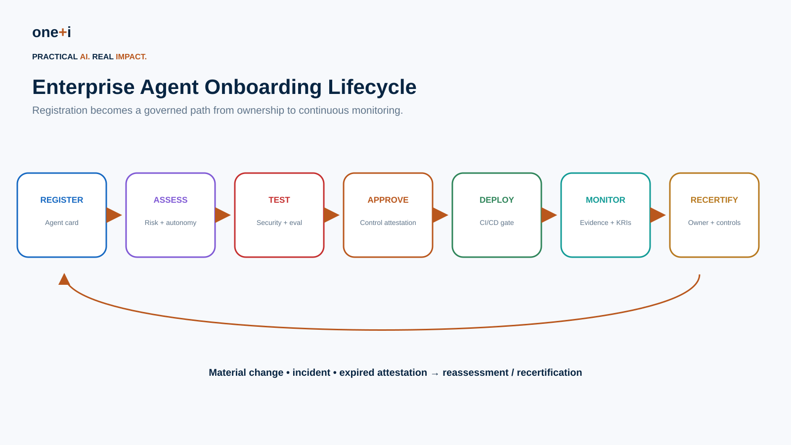
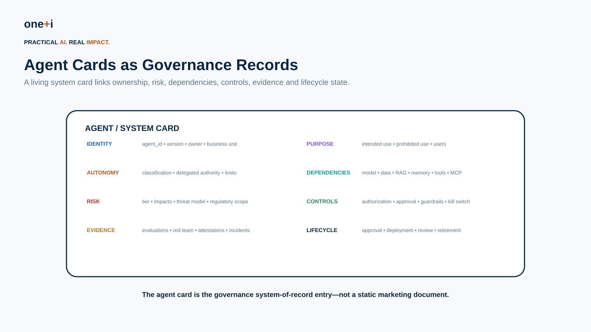
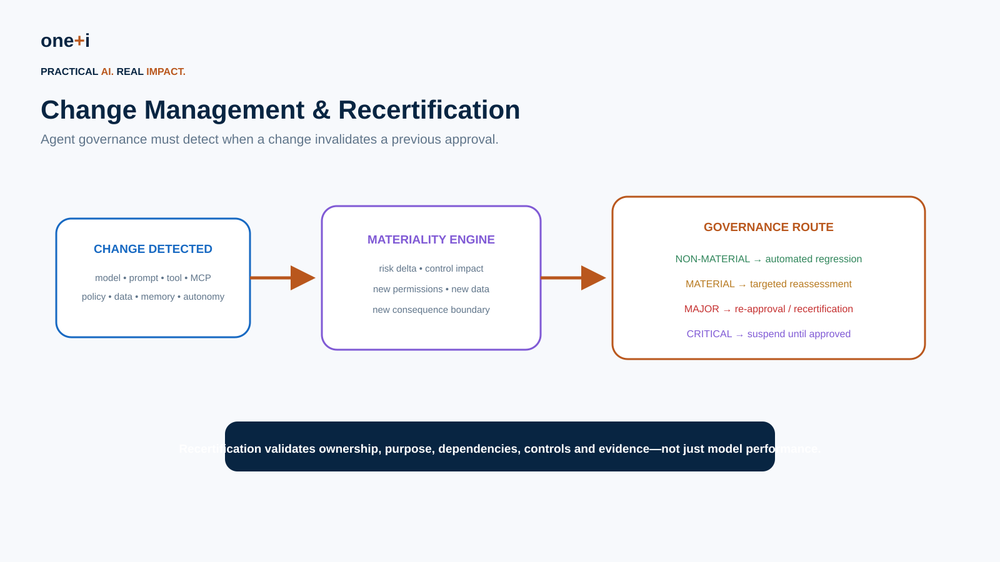
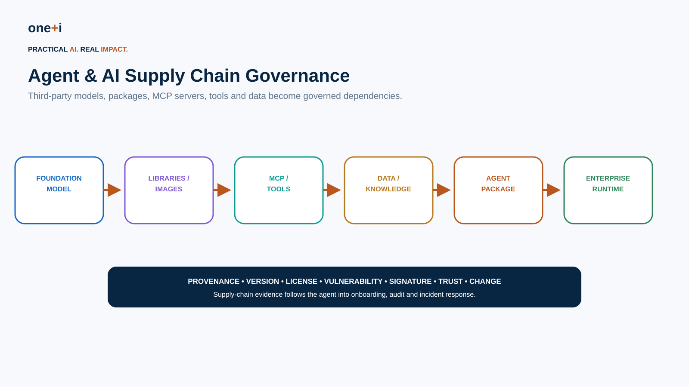
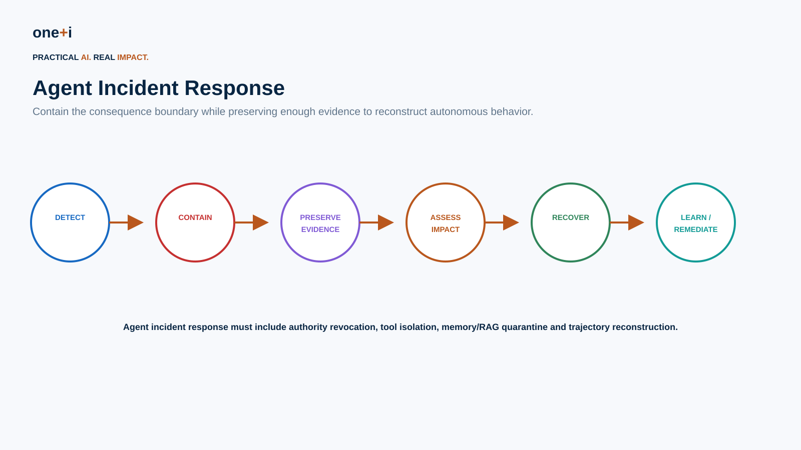

# Enterprise Agent Governance Operating Model

> **Course module:** Enterprise AI Agent Governance  
> **Audience:** AI governance leaders, AI platform teams, enterprise architects, product owners, security, risk, compliance, internal audit, procurement and engineering  
> **Recommended duration:** 10–12 hours theory + 8–12 hours practical lab  
> **Practical outcome:** Build an enterprise onboarding workflow from agent registration through risk assessment, testing, approval, deployment, continuous monitoring and recertification.

## Why this module exists

Agent governance becomes an enterprise problem as soon as organizations move beyond a few experiments.

The difficult questions are operational:

```text
Who owns this agent?
Who is allowed to register it?
What must be known before development starts?
Which controls are mandatory for its risk tier?
Which third-party models, tools and MCP servers does it depend on?
What evidence is required before production?
Who can approve residual risk?
What changes invalidate the approval?
When must the agent be recertified?
Who can suspend it during an incident?
How do auditors reconstruct the decision?
```

The goal is to turn governance from a document-review process into an **enterprise operating system for agent lifecycle management**.

NIST AI RMF treats governance as cross-cutting across the lifecycle, calls for AI inventories, clear roles, periodic review, third-party risk management, change management and incident response. This module translates those principles into an agent-specific operating model.



---

# 1. Learning objectives

By the end of this module, learners should be able to:

1. Design an enterprise agent governance operating model.
2. Define accountable ownership and decision rights.
3. Build an enterprise agent inventory and registration workflow.
4. Design an agent/system card as a living governance record.
5. Classify autonomy, impact and risk during onboarding.
6. Assign control baselines by risk tier.
7. Create control attestations and evidence requirements.
8. Route approvals according to materiality and residual risk.
9. Implement governance-as-code checks.
10. Integrate governance gates into CI/CD.
11. Define material-change triggers.
12. Design periodic and event-driven recertification.
13. Govern third-party agents and agent services.
14. Model the AI/agent software supply chain.
15. Define agent-specific incident response.
16. Design exception and waiver workflows.
17. Produce audit-ready evidence.
18. Define portfolio KPIs and KRIs.
19. Detect governance drift.
20. Automate enterprise onboarding without removing accountable human judgment.

---

# 2. Target operating model

A scalable pattern is:

```text
ENTERPRISE
policy • risk appetite • taxonomy • minimum controls • reporting
                         ↓
DOMAIN
risk interpretation • domain controls • approval authority
                         ↓
PRODUCT / AGENT TEAM
registration • implementation • testing • evidence • operations
                         ↓
TECHNICAL CONTROL PLANE
identity • authorization • policy • approvals • telemetry
```

This is a federated model:

**central standards + domain accountability + product ownership + technical enforcement**.

A central AI committee should not manually approve every low-risk change.

---

# 3. Ownership

Every production agent needs explicit human accountability.

Minimum roles:

| Role | Accountability |
|---|---|
| Business owner | Business purpose, impact and residual business risk |
| Product owner | Lifecycle, intended use and operational outcomes |
| Technical owner | Architecture and implementation |
| Agent/platform owner | Runtime and shared governance controls |
| Data owner | Data/RAG access and classification |
| Tool owner | Consequential tool/API behavior |
| Security | Threat model and security controls |
| AI governance / risk | Standards, challenge, risk acceptance routing |
| Compliance/legal/privacy | Applicable obligations |
| Internal audit | Independent assurance |

Do not assign all accountability to "AI Platform."

Shared infrastructure ownership is different from business-risk ownership.

---

# 4. Enterprise agent registration

Before development or production onboarding, register the agent.

Minimum registration fields:

```yaml
agent_id:
name:
version:
business_owner:
technical_owner:
business_unit:
purpose:
intended_users:
prohibited_uses:
autonomy_level:
risk_tier:
models:
tools:
mcp_servers:
data_sources:
memory:
delegation:
external_actions:
third_parties:
deployment_environment:
policy_bundle:
```

Registration gives the enterprise a portfolio view before autonomous capabilities become invisible infrastructure.

---

# 5. Agent cards / system cards



A useful agent card combines:

```text
identity
purpose
ownership
autonomy
authority
models
tools
data
RAG
memory
delegation
risk
controls
evaluation
security
approvals
incidents
change history
review status
```

Unlike a static model card, an enterprise agent card should be a **living system-of-record record**.

It should be machine-readable so CI/CD, policy engines and reporting can use it.

Example:

```yaml
apiVersion: governance.oneplusi.io/v1
kind: AgentCard
metadata:
  id: procurement-agent
  version: 3.2.0
spec:
  owner: procurement
  purpose: bounded purchasing
  autonomy: A2
  riskTier: HIGH
  permissions:
    - vendor.read
    - po.prepare
    - po.create
  limits:
    maxPurchase: 15000
  dependencies:
    models:
      - provider/model/version
    tools:
      - vendor.read
      - po.create
    mcp:
      - procurement-mcp
  controls:
    policyBundle: procurement-v7
    humanApproval: risk-based
    killSwitch: true
```

---

# 6. Onboarding workflow

A practical workflow:

```text
REGISTER
   ↓
OWNERSHIP VALIDATION
   ↓
AUTONOMY / RISK CLASSIFICATION
   ↓
THIRD-PARTY / SUPPLY-CHAIN REVIEW
   ↓
REQUIRED CONTROL BASELINE
   ↓
ARCHITECTURE / THREAT REVIEW
   ↓
EVALUATION + RED TEAM
   ↓
CONTROL ATTESTATION
   ↓
APPROVAL
   ↓
CI/CD RELEASE GATE
   ↓
DEPLOY
   ↓
CONTINUOUS MONITORING
   ↓
RECERTIFICATION
```

Low-risk agents can use a mostly automated path.

High/critical agents require stronger independent challenge.

---

# 7. Risk assessment

Risk should consider more than model capability.

A useful agent-specific model includes:

```text
autonomy
impact
access
irreversibility
uncertainty
data sensitivity
external exposure
financial authority
delegation depth
third-party dependency
novelty
```

Example:

```text
A0 + read-only + public data
→ LOW

A1 + internal sensitive data
→ MODERATE

A2 + write tools + financial consequence
→ HIGH

A3 + material irreversible actions
→ CRITICAL
```

Risk tier determines governance depth.

---

# 8. Control baselines

Example:

| Control | LOW | MODERATE | HIGH | CRITICAL |
|---|---:|---:|---:|---:|
| Agent card | ✓ | ✓ | ✓ | ✓ |
| Named owner | ✓ | ✓ | ✓ | ✓ |
| Dependency inventory | ✓ | ✓ | ✓ | ✓ |
| Threat model | Basic | ✓ | ✓ | Enhanced |
| Authorization review | Basic | ✓ | ✓ | ✓ |
| Evaluation | Basic | ✓ | ✓ | Enhanced |
| Red team | — | Targeted | ✓ | Enhanced |
| Human oversight | Optional | Risk-based | ✓ | Strong |
| Continuous monitoring | Basic | ✓ | ✓ | Enhanced |
| Kill switch | Optional | ✓ | ✓ | ✓ |
| Independent assurance | — | — | ✓ | ✓ |
| Executive/risk approval | — | — | Conditional | ✓ |

---

# 9. Control attestations

A control attestation says:

```text
what control is required
who owns it
who tested it
what evidence supports it
when it was tested
which version it applies to
when it expires
```

Example:

```yaml
control: AGENT-AUTHZ-04
agent: procurement-agent
version: 3.2.0
status: PASS
owner: iam-platform
tester: security-assurance
evidence: eval://authz-suite/2026-08-12
tested_at: 2026-08-12
expires_at: 2026-11-12
```

Attestation should be invalidated by relevant material changes.

---

# 10. Approval workflow

Approval should be bounded.

An approval should specify:

```text
agent version
purpose
autonomy
risk tier
data scope
tool scope
financial/action limits
conditions
residual risks
approver
expiry
```

Avoid:

> "Procurement Agent approved."

Prefer:

> "Procurement Agent v3.2 approved for A2 bounded purchasing with approved vendors up to $15k under policy bundle v7."

---

# 11. Governance-as-code

Governance requirements should increasingly become executable.

Examples:

```python
assert agent.owner is not None
assert agent.risk_tier is not None
assert all_dependencies_registered(agent)
assert required_controls_pass(agent)
assert no_expired_attestations(agent)
assert approval_matches_version(agent)
assert critical_findings == 0
```

This allows governance to become part of delivery rather than a separate paperwork process.

---

# 12. CI/CD gates

A deployment pipeline can evaluate:

```text
agent card schema
ownership
risk classification
dependency inventory
policy tests
security tests
evaluation thresholds
red-team regressions
attestation freshness
approval validity
artifact provenance
```

Example:

```text
PR
 ↓
schema validation
 ↓
governance checks
 ↓
security/evaluation suites
 ↓
policy tests
 ↓
artifact/signature verification
 ↓
approval gate
 ↓
deployment
```

HIGH/CRITICAL systems should fail closed on missing required evidence.

---

# 13. Change management

Agents change continuously.

Relevant changes include:

```text
model
system prompt
agent graph
tool
MCP server
permission
policy
knowledge source
memory behavior
data classification
autonomy
user population
deployment region
third-party provider
```



---

# 14. Materiality

Not every change requires full reapproval.

Classify changes:

### Non-material

```text
documentation
non-behavioral refactor
approved dependency patch
```

→ automated regression.

### Material

```text
prompt behavior
model version
knowledge source
tool implementation
```

→ targeted reassessment.

### Major

```text
new tool
new permission
new sensitive data
higher autonomy
new external action
```

→ reapproval / recertification.

### Critical

```text
new irreversible authority
major regulatory scope change
unresolved critical vulnerability
```

→ suspend until explicitly approved.

---

# 15. Recertification

Recertification should answer:

```text
Is the owner still valid?
Is the business purpose unchanged?
Is the agent still needed?
Is autonomy still appropriate?
Are dependencies current?
Are permissions still necessary?
Are attestations current?
Did evaluations regress?
Did incidents reveal new risks?
Are exceptions expired?
Does residual risk remain acceptable?
```

Recertification can be:

```text
periodic
+
event-driven
```

Risk-based example:

```text
LOW       → annual
MODERATE  → 6–12 months
HIGH      → quarterly / semiannual
CRITICAL  → more frequent + continuous evidence
```

Actual intervals should follow organizational risk appetite and applicable obligations.

---

# 16. Third-party agents

Third-party agent services require additional governance.

Assess:

```text
provider identity
service ownership
data processing
subprocessors
model dependencies
tool access
retention
training use
security posture
incident notification
audit rights
change notification
exit strategy
portability
```

Treat the provider's agent as part of your risk surface when it can act on your enterprise resources.

---

# 17. AI / agent supply chain



An agent can depend on:

```text
foundation models
embeddings
open-source libraries
containers
agent frameworks
MCP servers
plugins/tools
datasets
vector indexes
prompt packages
policy bundles
third-party APIs
```

For each dependency capture:

```text
source
version
provenance
license
integrity
signature / digest
known vulnerabilities
owner
trust level
change history
```

NIST AI RMF explicitly includes third-party systems/data in lifecycle governance and calls for regular monitoring of third-party AI risks.

---

# 18. Model and artifact signing

Supply-chain controls can include:

```text
cryptographic digest
signed model/artifact
SBOM
dependency lockfile
container signature
provenance attestation
verified build
```

OpenSSF Model Signing is an emerging mechanism for verifying the origin and integrity of ML model artifacts.

Do not assume signing proves a model is safe.

Signing proves provenance/integrity properties—not behavioral trustworthiness.

---

# 19. MCP / tool supply chain

For third-party MCP servers:

```text
identify publisher
verify package/source
pin version
review tool manifest
limit discovery
validate schemas
restrict network
use least privilege
monitor tool changes
reassess on capability expansion
```

A server adding a new tool can be a governance-relevant change.

---

# 20. Incident response



Agent incidents can include:

```text
unauthorized action
authority amplification
data leakage
prompt injection
memory poisoning
malicious tool behavior
third-party compromise
supply-chain compromise
policy bypass
runaway execution
incorrect high-impact decision
```

Agent incident response should extend normal enterprise IR rather than create a disconnected process.

---

# 21. Agent-specific containment

Containment options:

```text
disable agent
reduce autonomy
force approval
revoke delegated authority
revoke credentials
disable one tool
block MCP server
quarantine knowledge
disable memory writes
roll back model/prompt
activate safe mode
```

Predefine who can invoke each action.

---

# 22. Evidence preservation

Preserve:

```text
agent/version
principal
delegation chain
retrieved sources
tool calls
policy decisions
approvals
model/runtime version
dependency versions
security events
outcomes
```

Respect privacy and data-minimization requirements.

The objective is trajectory reconstruction, not indiscriminate logging.

---

# 23. Third-party incident response

Contracts and operating processes should define:

```text
notification timeframe
evidence availability
containment responsibilities
credential rotation
service suspension
forensic cooperation
dependency replacement
customer notification
```

A third-party agent can create enterprise consequences even if its internal runtime is outside your control.

---

# 24. Exceptions

An exception is not a permanent bypass.

Required fields:

```yaml
exception_id:
agent_id:
requirement:
reason:
risk:
compensating_controls:
owner:
risk_acceptor:
approved_at:
expires_at:
exit_plan:
```

Automatically surface:

```text
expired exceptions
exceptions near expiry
agents with repeated exceptions
critical controls under exception
```

---

# 25. Audit

Auditors should be able to answer:

```text
Which agents exist?
Who owns them?
Which are HIGH/CRITICAL?
What authority do they have?
Which third parties do they depend on?
What controls were required?
What evidence showed those controls worked?
Who approved deployment?
What changed afterward?
Were changes reassessed?
What incidents occurred?
Are exceptions current?
When was the agent last recertified?
```

Audit readiness should be produced continuously from the governance system of record.

---

# 26. Audit evidence package

A useful package:

```text
agent/system card
risk assessment
architecture
dependency manifest
threat model
control baseline
attestations
evaluation report
red-team report
approval
policy versions
deployment record
change history
incidents
exceptions
recertification
production metrics
```

---

# 27. Metrics

Do not measure governance only by number of reviews.

## Portfolio

```text
registered agents
agents by autonomy/risk
third-party agents
unowned agents
agents overdue for recertification
```

## Control health

```text
expired attestations
failed controls
critical vulnerabilities
policy violations
approval bypasses
```

## Lifecycle

```text
onboarding lead time
approval lead time
change reassessment time
recertification completion
retirement completion
```

## Security / operations

```text
incidents
time to detect
time to contain
kill-switch success
third-party incidents
```

## Governance quality

```text
exception aging
repeat exceptions
rework
audit findings
evidence completeness
governance automation rate
```

---

# 28. Key risk indicators

Examples:

```text
HIGH agent with expired approval
CRITICAL agent without current red-team evidence
agent with no active owner
unregistered MCP server
unsigned/unverified critical artifact
permission expansion without reassessment
stale third-party review
expired exception
recertification overdue
incident without closed remediation
```

---

# 29. Governance workflow states

A useful state machine:

```text
DRAFT
→ REGISTERED
→ ASSESSING
→ TESTING
→ PENDING_APPROVAL
→ APPROVED
→ ACTIVE
→ RECERTIFICATION_DUE
→ SUSPENDED
→ RETIRED
```

State transitions should require evidence.

Example:

```text
TESTING → PENDING_APPROVAL
requires:
  required tests complete
  no critical unresolved findings
  attestations present
```

---

# 30. Practical lab

The notebook `enterprise_agent_governance_operating_model.ipynb` implements an enterprise onboarding workflow.

Learners build:

1. Agent card schema.
2. Enterprise registry.
3. Ownership validation.
4. Risk/autonomy classification.
5. Control baseline assignment.
6. Third-party dependency inventory.
7. Supply-chain attestations.
8. Control attestations.
9. Evidence completeness checks.
10. Approval routing.
11. Bounded approval records.
12. Governance state machine.
13. Governance-as-code checks.
14. CI/CD deployment gate.
15. Material-change detection.
16. Reassessment routing.
17. Recertification.
18. Exception management.
19. Incident response routing.
20. Kill-switch authority.
21. Audit package generation.
22. Portfolio KPIs/KRIs.
23. Governance drift detection.

---

# 31. Practical enterprise scenario

The lab portfolio contains:

```text
Research Copilot
Procurement Agent
Payment Operations Agent
Third-Party Customer Support Agent
```

This lets learners compare:

```text
internal vs third-party
read-only vs transactional
low vs high autonomy
reversible vs irreversible
first-party vs supply-chain-heavy
```

The onboarding engine routes each system differently.

---

# 32. Suggested production technologies

The module is implementation-neutral, but useful technologies include:

### Governance records

```text
Git + YAML/JSON
internal governance registry
GRC platform
service catalog / CMDB integration
```

### Policy / authorization

```text
Open Policy Agent / Rego
Cedar
enterprise IAM / authorization service
```

### Supply chain

```text
SBOM
Sigstore
OpenSSF Model Signing
artifact registries
dependency scanners
```

### CI/CD

```text
GitHub Actions
GitLab CI
Jenkins
enterprise pipeline platform
```

### Observability / evidence

```text
OpenTelemetry
SIEM
agent observability platforms
evaluation platforms
```

### Workflow

```text
ServiceNow / Jira-style approval workflows
enterprise GRC workflow
custom orchestration
```

The important design is the governance contract, not the vendor.

---

# 33. Common anti-patterns

Avoid:

```text
governance only at launch
one approval forever
no agent inventory
platform team owns all risk
model card used as complete system documentation
third-party agent treated as SaaS with no agent-specific review
dependency versions not recorded
MCP servers not inventoried
manual spreadsheet-only attestations
exceptions without expiry
change management based only on model version
recertification that checks paperwork but not production evidence
audit evidence assembled manually after the request arrives
CI/CD allowed to deploy when governance evidence is missing
```

---

# 34. Enterprise design principle

The mature operating model is:

```text
REGISTER ONCE
        ↓
CONTINUOUSLY UPDATE THE GOVERNANCE RECORD
        ↓
AUTOMATICALLY REASSESS MATERIAL CHANGE
        ↓
CONTINUOUSLY COLLECT EVIDENCE
        ↓
ESCALATE MATERIAL RISK
        ↓
PERIODICALLY RECERTIFY ACCOUNTABILITY + CONTROLS
```

This is much more scalable than repeating a full governance review for every release.

---

# 35. References

- NIST AI RMF Core — GOVERN, MEASURE and MANAGE lifecycle outcomes
- NIST AI RMF Playbook — inventory, accountability, periodic review and incident-response practices
- NIST AI Agent identity and authorization work
- OWASP Agentic AI Threats and Mitigations
- OWASP State of Agentic AI Security and Governance 2.01
- OpenSSF AI/ML Security Working Group
- OpenSSF Model Signing
- ISO/IEC 42001 AI Management Systems
- Open Policy Agent
- Sigstore
- OpenTelemetry

See official links in the course bibliography or source notes.

---

# 36. Final takeaway

> **Enterprise agent governance is lifecycle management for autonomous authority.**

A scalable organization needs to know:

```text
what agents exist
who owns them
what they can do
what they depend on
what controls apply
what evidence proves those controls work
who approved the remaining risk
what changed
whether the approval is still valid
how the agent is contained when something goes wrong
```

The end state is not more paperwork.

It is **governance that is registered, testable, automatable, auditable and continuously connected to production reality**.
