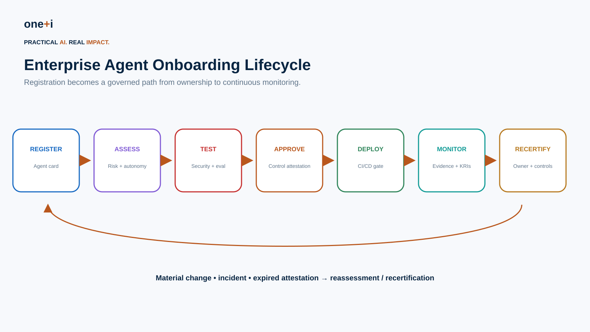
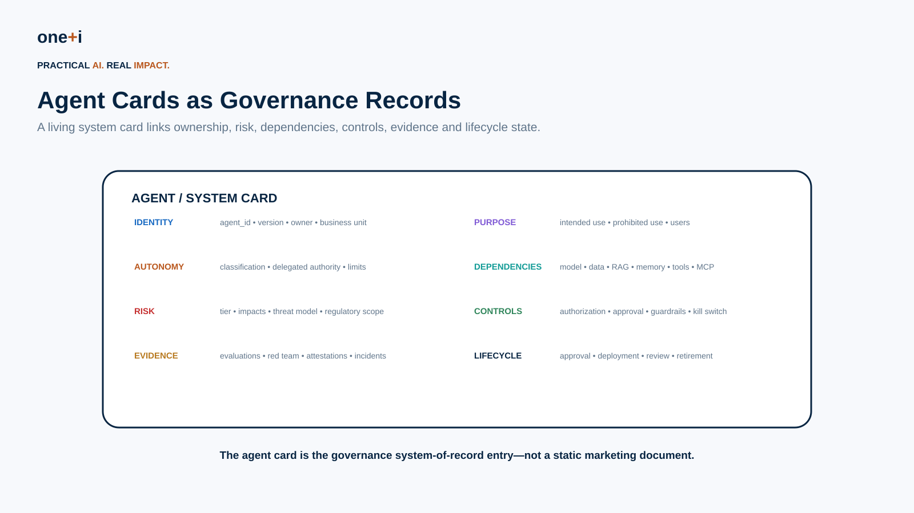
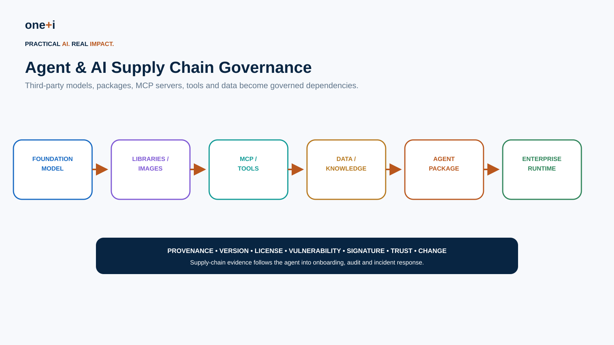
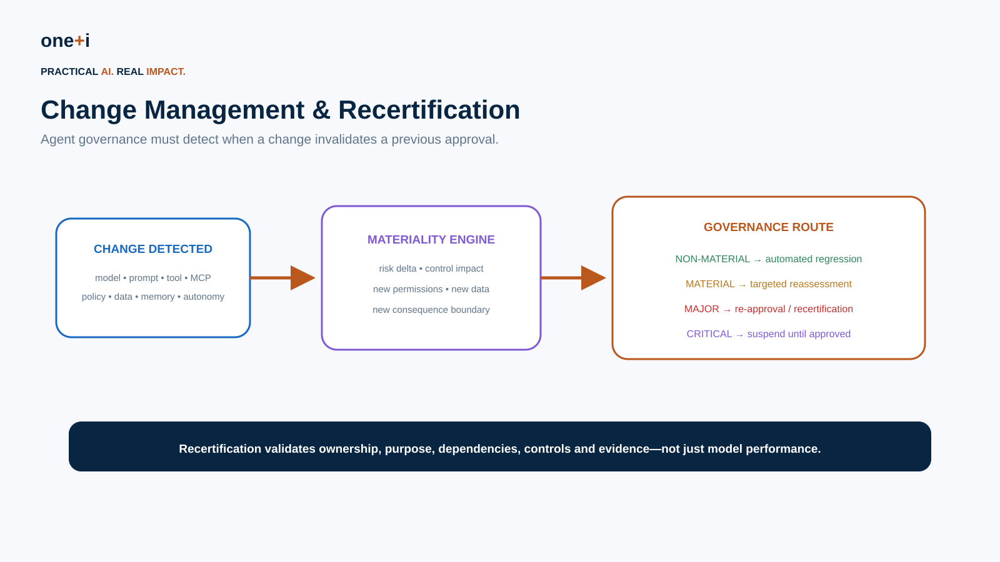
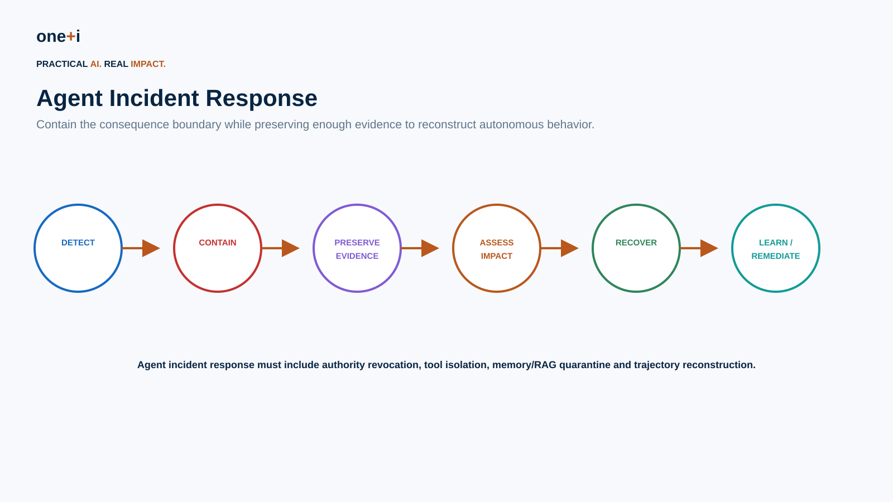

# Enterprise Agent Governance Operating Model

> **Course 16 · Advanced**
>
> **Audience:** AI governance leaders, product and platform teams, enterprise architects, security, privacy, legal, compliance, procurement, risk, internal audit, and engineering
>
> **Study time:** 10–12 hours theory + 8–12 hours practical work
>
> **Outcome:** design and operate a lifecycle system that registers agent authority, assigns accountable owners, collects version-bound evidence, gates releases, governs suppliers and change, contains incidents, and recertifies or retires agents.

[Open the Learning Hub](../../../hub/index.html) · [Run the notebook](16_enterprise_agent_governance_operating_model.ipynb) · [Inspect the reusable lab](lab.py) · [View the example agent card](agent-card.example.yaml)

## Learning objectives

After completing the course, you can:

1. Allocate agent-governance decision rights across a governing body, product management, specialist risk functions, platform teams, and independent assurance.
2. Define a machine-readable agent system card and enterprise inventory without treating self-reported metadata as trusted authority.
3. Classify risk using transparent consequence and autonomy rules, then derive tier-specific controls and approval roles.
4. Bind evidence and approvals to an exact tenant, agent version, manifest, release, policy version, time window, and approver identity.
5. Represent model, data, software, tool, API, MCP, and agent dependencies in a governed AI supply chain.
6. Distinguish a bill of materials, provenance attestation, control evidence, system card, impact assessment, and safety evaluation.
7. Route prompt, model, data, tool, permission, policy, autonomy, jurisdiction, and infrastructure changes by materiality.
8. Design periodic and event-driven recertification, bounded exceptions, incident containment, recovery, and retirement.
9. Integrate governance records with CI/CD, service catalogs, GRC, IAM, evaluation, observability, SIEM/SOAR, and artifact systems.
10. Evaluate release controls with labelled positive and failure cases and metrics whose populations, numerators, denominators, and direction are explicit.

## Prerequisites and non-goals

Complete [Course 14: evaluation and continuous governance](../14-agent-evaluation-and-continuous-governance/README.md) and [Course 15: governance control-plane architecture](../15-governance-control-plane-architecture/README.md), or bring equivalent knowledge of policy enforcement, identity, authorization, evaluation evidence, and observability.

This course teaches an operating-model reference implementation. It is not legal advice, an ISO certification guide, a universal risk taxonomy, a production GRC product, or proof that one governance design fits every organization. The deterministic lab does not call an LLM or real enterprise system; it demonstrates the control plane around an agent.

## 1. Why an operating model is necessary

One team can govern a prototype through meetings and a launch checklist. An enterprise portfolio cannot. Agents can change their prompts, models, knowledge, tools, permissions, providers, and reachable consequences independently. Approval at launch therefore decays unless the organization can answer:

- Which agents exist, in which tenants and environments?
- Which human is accountable for each intended use and consequence boundary?
- Which authenticated workloads and people may change or operate them?
- Which models, datasets, packages, tools, MCP servers, APIs, and other agents do they depend on?
- What evidence satisfies each control for this exact version?
- Who accepted residual risk, for what release and constraints?
- Which changes invalidate that decision?
- Which exceptions are active, expiring, or repeatedly renewed?
- Can an incident commander contain the agent without asking the agent to cooperate?
- What evidence is required to recover, recertify, or retire it?

The operating model makes these answers durable and executable. NIST AI RMF 1.0 places **GOVERN** across the other lifecycle functions and its Playbook provides voluntary implementation suggestions; neither is a one-size-fits-all checklist. As of October 2026, NIST states that AI RMF 1.0 is being revised, so organizations should version their mappings rather than encode “NIST compliant” as a timeless boolean. See the [NIST AI RMF](https://www.nist.gov/itl/ai-risk-management-framework) and [AI RMF Playbook](https://www.nist.gov/itl/ai-risk-management-framework/nist-ai-rmf-playbook).



## 2. The mental model: four connected planes

Treat enterprise governance as four connected planes:

```text
ACCOUNTABILITY PLANE
governing body • risk appetite • delegated decision rights • independent assurance
                               ↓
PORTFOLIO PLANE
inventory • system cards • risk tier • suppliers • exceptions • lifecycle state
                               ↓
DELIVERY PLANE
design • impact/threat analysis • evaluation • evidence • approval • CI/CD
                               ↓
RUNTIME PLANE
identity • authorization • policy • approvals • telemetry • containment • outcomes
```

The portfolio plane knows what should exist. The runtime plane reveals what does exist. Drift between them is a governance event.

This course uses three trust rules throughout:

1. **Text is data, not authority.** A prompt, model response, ticket, tool description, or vendor claim cannot assign tenant, role, approval, or lifecycle state.
2. **Presence is not proof.** A file or URI satisfies a control only when its identity, provenance, integrity, scope, freshness, assessor, result, and policy mapping are valid.
3. **The trusted application owns consequences.** The agent can propose; deterministic code validates, authorizes, persists, deploys, suspends, verifies, and records.

## 3. Decision rights and the Three Lines

A federated model scales better than a central committee approving every change:

```text
central standards + product accountability + specialist challenge
+ shared technical controls + independent assurance
```

The Institute of Internal Auditors' current Three Lines material distinguishes product/service delivery and risk management in management roles from internal audit's independent assurance. “Lines” describe relationships and responsibilities, not a mandatory org chart or a sequential hand-off. See the [IIA Statements of Position](https://www.theiia.org/en/resources/statements-of-position).

| Decision | Accountable | Required contributors | Independent challenge/assurance |
|---|---|---|---|
| Intended use and business outcome | Business/product owner | Users, technical owner | AI risk for material use |
| Data and knowledge access | Data owner | Privacy, security, product | Assurance for high-risk scope |
| Tool and external-action authority | Tool/API owner | IAM, platform, product | Security and AI risk |
| Architecture and implementation | Technical owner | Platform, SRE, security | Architecture/security review |
| Risk tier and control baseline | AI risk authority | Product, security, privacy/legal | Internal audit samples the process |
| Residual-risk acceptance | Delegated risk acceptor | Control owners | Escalation by tier/appetite |
| Release | Delivery system using valid receipts | Product and control owners | Separation-of-duties checks |
| Emergency containment | Incident commander | IAM, platform, tool/data owners | Post-incident review |
| Recovery/re-enable | Product + security + AI risk | Engineering, assurance | Fresh evidence and approval |
| Independent assurance | Internal audit | Evidence custodians | Governing-body oversight |

Internal audit should not own the controls it later assures. A platform team can own shared enforcement without owning every product's business risk.

## 4. The agent system card and inventory

An inventory entry is the join point between ownership, authority, architecture, risk, evidence, and lifecycle. A useful record includes:

```yaml
identity: tenant + stable agent ID + semantic version + environment
purpose: intended users + intended use + prohibited use
ownership: business + technical + data + tool/service owners
authority: autonomy + permissions + limits + delegation rules
dependencies: model + data + software + tool + API + MCP + agent
risk: impact + access + reversibility + sensitivity + regulatory scope
controls: policy bundle + tier baseline + control owners
evidence: artifact IDs + digests + assessors + freshness + results
decisions: release package + approvers + constraints + expiry
lifecycle: state + change history + incidents + recertification + retirement
```



The card in [agent-card.example.yaml](agent-card.example.yaml) is machine-readable. The Pydantic contract in [lab.py](lab.py) rejects unknown fields, duplicate dependencies, ambiguous ownership, unpinned versions, malformed digests, and external actions without explicit permissions.

### Card, model card, impact assessment, and BOM are different

| Artifact | Primary question | Typical owner | What it does not prove |
|---|---|---|---|
| Agent system card | What is the whole deployed agent, who owns it, and what can it do? | Product/registry owner | That controls work |
| Model card | What model is this, how was it developed/evaluated, and what are its limitations? | Model provider/owner | Whole-system safety |
| AI system impact assessment | Who may be affected and how across the lifecycle? | Product + risk/privacy/legal | Technical control effectiveness |
| AI/ML-BOM or SBOM | Which components, models, datasets, versions, and relationships exist? | Supply-chain/platform owner | Provenance or behavioral safety by itself |
| Provenance attestation | Who produced an artifact, through which process, from which inputs? | Build/evidence producer | That the artifact is safe or approved |
| Control evidence | Did a named control pass for an exact scope and time window? | Control owner + assessor | Authority to release |
| Approval receipt | Who accepted what bounded release package under which policy? | Delegated risk acceptor | Runtime outcome success |

ISO/IEC 42005:2025 provides lifecycle guidance for AI system impact assessments, complementing management-system and risk standards. The public ISO overview describes impacts on individuals, groups, and society; the course does not claim access to paywalled normative requirements. See [ISO/IEC 42005:2025](https://www.iso.org/standard/42005).

## 5. Risk classification and control baselines

Risk classification should be explainable and reviewable. Do not hide materially different factors inside one multiplication formula. The lab applies ordered rules:

```text
autonomous + irreversible authority        → CRITICAL
severe impact + external action            → CRITICAL
consequential action / autonomy / access   → HIGH
sensitive data / assistive action          → MODERATE
bounded read-only use                      → LOW

third-party dependency → at least MODERATE
regulated scope         → at least HIGH in this teaching policy
```

These are course rules, not universal law. A production taxonomy should incorporate affected parties, context, severity, likelihood/uncertainty, scale, reversibility, human oversight, geographic and sector obligations, misuse, and cumulative/systemic effects. Record the reason codes and policy version so a later reviewer can reconstruct the classification.

### Example baseline

| Control family | Low | Moderate | High | Critical |
|---|---:|---:|---:|---:|
| System card, ownership, dependency inventory | Required | Required | Required | Required |
| Impact/threat analysis | Basic | Required | Required | Enhanced |
| Authorization review | As applicable | As applicable | Required | Required |
| Evaluation and adversarial testing | Basic | Required | Required | Independent/enhanced |
| Monitoring and incident plan | Basic | Required | Required | Continuous + exercised |
| Kill path | Risk-based | Risk-based | Required | Required and exercised |
| Third-party review | When present | When present | Required in lab policy | Required |
| Independent assurance | Sampled | Sampled | Risk-based | Required |
| Release approval | Product | Business + AI risk | Business + AI risk + security | Add executive risk |

The baseline is a floor. Context-specific controls can add to it; an exception may never silently remove it.

## 6. Evidence and release packages

An evidence record needs more than `status: PASS`:

```text
evidence ID
tenant + agent ID + agent version
exact agent-manifest digest
control ID and policy version
producer and independent assessor
source URI and artifact digest
generated-at and expires-at
typed result
signature or trusted attestation
```

The lab accepts an artifact only when all bindings match and it is current at decision time. It then computes a release-package digest over:

```text
release identity
agent identity/version/manifest
risk tier + policy version
required controls
the exact evidence records
the exact exception records
```

Each approval is a signed receipt over that package. Required roles must be complete and held by distinct authenticated people. Approvals are consumed atomically so parallel deployment workers cannot replay them. Adding an exception, changing evidence, or changing a manifest invalidates prior approval.

This is intentionally stricter than an “approved” boolean or a ticket comment.

## 7. Lifecycle state and gates

```text
DRAFT → REGISTERED → ASSESSING → VALIDATING → PENDING_APPROVAL
       → APPROVED → ACTIVE → RECERTIFICATION_DUE → ACTIVE
                    │             │
                    ├→ RESTRICTED ├→ SUSPENDED → ASSESSING
                    └───────────────────────────→ RETIRED
```

State is application-owned. A model cannot return `APPROVED`, `RESOLVED`, or `RETIRED` and thereby change the registry.

| Transition | Minimum proof |
|---|---|
| Draft → Registered | Valid system card, named owners, stable ID and version |
| Assessing → Validating | Risk/impact route and required controls determined |
| Validating → Pending approval | Passing, current, version-bound evidence or valid bounded exceptions |
| Pending approval → Approved | Complete, signed, independent release receipts |
| Approved → Active | Atomic approval consumption and verified deployment identity |
| Active → Recertification due | Scheduled or event trigger |
| Any operating state → Suspended | Authorized containment or critical change |
| Suspended → Assessing | Incident/remediation evidence admitted; never direct to active |
| Operating state → Retired | Authority revoked, traffic stopped, retention/deletion and owner sign-off recorded |

The lab registry uses optimistic concurrency. A stale workflow cannot overwrite a newer suspension or recertification state.

## 8. The agent and AI supply chain

An agent is a compound system:

```text
models • embeddings • datasets • vector indexes • prompts • policies
libraries • containers • agent frameworks • tools • MCP servers
APIs • plugins • delegated agents • build and deployment services
```



For every dependency, capture identity, kind, provider, version, integrity digest, license, source/provenance reference, approval state, review expiry, owner, capabilities, and change notification. For an MCP server, capability expansion is governance-relevant even when the server name does not change.

The practical lab uses `cyclonedx-python-lib` to generate a deterministic **CycloneDX 1.7** BOM containing `machine-learning-model`, `data`, and application components. CycloneDX describes AI/ML-BOM support for model, dataset, configuration, provenance, and model-card information; version 1.7 is the current 1.x specification. See the [CycloneDX ML-BOM capability](https://cyclonedx.org/capabilities/mlbom/), [CycloneDX 1.7 reference](https://cyclonedx.org/docs/1.7/json/), and [AI model/model-card use case](https://cyclonedx.org/use-cases/ai-models-and-model-cards/).

SPDX 3.0.1 also has an AI profile for AI packages, models, and datasets. Choose formats based on ecosystem requirements, map deliberately, and test information loss rather than declaring them interchangeable. See the [SPDX 3.0.1 AI Profile](https://spdx.github.io/spdx-spec/latest/model/AI/AI/).

For build provenance, SLSA defines provenance expectations and Sigstore provides signing/transparency tooling. These establish origin/integrity evidence; they do not establish model behavior or authorize production. See [SLSA provenance](https://slsa.dev/spec/v1.2/provenance) and [Sigstore documentation](https://docs.sigstore.dev/).

## 9. Change management and recertification

Agents change more often than conventional applications because behavior depends on multiple mutable layers.



| Change | Typical route | Evidence invalidated |
|---|---|---|
| Documentation only; no manifest change | Automated regression | None |
| Prompt or intended-user change | Targeted reassessment | Evaluation/red team/impact evidence |
| Model or knowledge version | Targeted or major based on effect | Evaluation, lineage, data/provider review |
| Tool implementation or dependency | Major reassessment | Dependency, threat, evaluation, supplier evidence |
| New permission, sensitive data, purpose, policy, environment | Recertify and reapprove | Authorization, impact, threat, approval |
| New external/irreversible authority or regulated scope | Suspend and full review | Full affected baseline and approval |

The lab diffs typed cards, requires a new version, returns changed dimensions and invalidated control IDs, and moves critical changes to `SUSPENDED` before review.

### Recertification

Recertification is not document renewal. It re-establishes:

- active, accountable owners and a continuing business need;
- an appropriate purpose, user population, autonomy level, and authority;
- current dependency/provider reviews and permissions;
- passing, fresh evidence for the current manifest and policy;
- resolved incidents and remediation;
- valid, non-repeating exceptions and an exit plan;
- acceptable runtime outcomes, drift, and residual risk; and
- fresh approval by the tier's required roles.

Use both periodic and event-driven triggers. The lab illustrates annual/180-day/90-day/30-day intervals by tier, but production frequency must follow risk appetite and applicable obligations. Material change, supplier compromise, permission drift, incident, evaluation regression, ownership change, or regulatory-scope change can trigger review immediately.

## 10. Exceptions without permanent bypasses

A valid exception is:

```text
specific control + exact agent/version/manifest/policy
+ documented reason + compensating controls
+ accountable owner + authenticated risk acceptor
+ approval and expiry + exit plan + signature
```

The lab caps exception duration at 90 days and prohibits exceptions for ownership, required kill paths, critical incident exercises, and independent assurance. Your non-waivable set may differ, but it should be explicit and policy-versioned. Track aging, repeated renewal, concentration by owner/provider, and exceptions attached to critical controls.

Never approve first and append the exception afterward. The exception must be inside the release package reviewed by approvers.

## 11. Incident response and recovery

Agent incidents include unauthorized action, identity or privilege abuse, data leakage, goal/prompt hijack, memory or context poisoning, insecure inter-agent communication, malicious or changed tools, supplier compromise, cascading failure, runaway cost/action, and incorrect high-impact outcomes. The [OWASP Top 10 for Agentic Applications 2026](https://genai.owasp.org/resource/owasp-top-10-for-agentic-applications-for-2026/) provides a current community risk taxonomy; it is a starting point, not a complete control framework.



The incident path is:

```text
trusted alert admission → triage → contain authority/effects → preserve evidence
→ assess impact/notifications → remediate → independent recovery review
→ fresh governance package → authorized re-enable → learn and update controls
```

Containment must remain available when the model, agent process, orchestration layer, or primary provider is unhealthy. Options include disabling the agent or one tool, revoking workload/delegation credentials, blocking an MCP server, restricting egress, quarantining memory/knowledge, rolling back an artifact, forcing human approval, or moving to read-only mode.

The lab proves actual containment by transitioning the trusted registry to `SUSPENDED`. It accepts only trusted digest-bearing alerts, deduplicates alert IDs, requires an authenticated incident commander, records evidence IDs, and separates security recovery review from AI-risk closure. Model text never resolves an incident.

Preserve enough evidence to reconstruct identity, delegation, policy, source retrieval, model/runtime versions, tool calls, approvals, attempts, and verified outcomes—but minimize sensitive content and enforce retention/access rules. Logs are not automatically trustworthy evidence.

## 12. Common tools and integration architecture

The operating model is product-neutral. Common categories include:

| Capability | Common tools/standards | Integration boundary |
|---|---|---|
| System of record | GRC platform, CMDB/service catalog, Git/YAML registry, internal API | Stable IDs, schemas, ownership, history, lifecycle |
| Workflow | ServiceNow/Jira-style workflow, BPM/workflow engine | Authenticated actors, SoD, escalations, SLAs |
| Policy | Open Policy Agent/Rego, Cedar, OpenFGA, IAM/PAM | Deterministic release/runtime decisions; policy version |
| Identity | Enterprise IdP, workload identity/SPIFFE, OAuth/OIDC | Human/workload identity, audience, delegation, revocation |
| Supply chain | CycloneDX, SPDX, SLSA, Sigstore, artifact registry/scanner | Components, provenance, integrity, vulnerabilities, licenses |
| Evaluation | Test/eval harnesses, red-team platforms, CI test systems | Version-bound results, datasets, thresholds, slices, assessor |
| Delivery | GitHub Actions, GitLab CI, Jenkins, enterprise release platform | Release identity, exact artifact, approval consumption, rollback |
| Observability | OpenTelemetry, data/agent observability, evidence store | Trace IDs, policy decisions, evidence links, outcomes, privacy |
| Incident operations | SIEM/SOAR, IAM/PAM, API gateway, feature flags/kill service | Trusted alerts, independent containment, verification |
| Reporting | BI/GRC dashboards, audit export | Defined populations, time windows, denominators, lineage |

Use an API or event contract between systems. Do not let a ticket title, free-text model output, or dashboard state become the authoritative lifecycle transition.

## 13. Current regulatory and standards context

### NIST

- [AI RMF 1.0 and Playbook](https://www.nist.gov/itl/ai-risk-management-framework) remain voluntary risk-management resources; NIST reports that AI RMF 1.0 is under revision as of 2026.
- [NIST AI 600-1, Generative AI Profile](https://doi.org/10.6028/NIST.AI.600-1) adapts the AI RMF for generative-AI risks.
- NIST launched its [AI Agent Standards Initiative](https://www.nist.gov/artificial-intelligence/ai-agent-standards-initiative) in February 2026 around standards, protocols, security, identity, and interoperability. Related identity/authorization work was presented as a draft concept project, so treat it as emerging rather than a finished compliance standard.
- [NIST AI 100-2 E2025](https://doi.org/10.6028/NIST.AI.100-2e2025) provides a current adversarial-ML attack and mitigation taxonomy.

### ISO/IEC

- [ISO/IEC 42001:2023](https://www.iso.org/standard/81230.html) is an AI management-system standard.
- [ISO/IEC 42005:2025](https://www.iso.org/standard/42005) addresses AI system impact assessment across the lifecycle.
- Certification, an impact assessment, and operation of effective technical controls are related but different claims. Map the actual clauses and scope you use; do not label an individual agent “ISO compliant” based on a checklist excerpt.

### European Union AI Act

The [European Commission's AI Act overview](https://digital-strategy.ec.europa.eu/en/policies/regulatory-framework-ai) and [enforcement timeline](https://digital-strategy.ec.europa.eu/en/policies/enforcement-ai-act) are the appropriate current sources. As of **4 October 2026**, the Commission states:

- prohibited-practice and AI-literacy provisions have applied since 2 February 2025;
- governance and general-purpose-AI obligations have applied since 2 August 2025;
- specified transparency rules became applicable in August 2026;
- following the 2026 AI Omnibus changes described by the Commission, Annex III high-risk rules are scheduled for 2 December 2027 and rules for AI embedded in regulated products for 2 August 2028.

The Act allocates different obligations to providers, deployers, importers, distributors, and other actors. “Agent” is not itself a regulatory risk class. Determine role, use case, geography, and system classification with qualified counsel, and re-check official sources because dates and guidance can change.

## 14. State of the art: established, emerging, and unresolved

### Established practice

- accountable product ownership with specialist challenge and independent assurance;
- lifecycle inventory, risk tiering, impact assessment, threat modelling, evaluation, and incident management;
- CI/CD quality and security gates, least privilege, artifact registries, SBOMs, signed builds, and auditable change control;
- periodic access review, supplier due diligence, expiring exceptions, and business continuity/retirement processes.

### Current production direction

- system cards and control evidence as machine-readable, versioned records rather than PDF attachments;
- continuous controls monitoring that links runtime observations back to the approved manifest;
- ML/AI BOMs combined with software/service BOMs and provenance attestations;
- policy-as-code and exact release receipts that bridge GRC decisions into delivery and runtime control planes;
- agent-specific incident playbooks that revoke delegated authority and isolate tools, memory, knowledge, and protocols.

### Emerging practice

- interoperable agent identity, authorization, delegation, discovery, and audit standards;
- portable agent capability manifests and attestations across MCP and other agent protocols;
- richer AI supply-chain standards spanning models, datasets, prompts, policies, evaluations, and agents;
- common agent control standards and standardized agent trajectory/evidence formats.

NIST's 2026 agent initiative and identity/authorization concept work are evidence that this area is active, not that consensus is complete.

### Open problems

- no universally adopted agent system-card or governance-evidence schema;
- weak visibility into closed-provider training data, model changes, incidents, and subprocessor chains;
- difficult causal attribution across models, tools, data, memory, people, and policies;
- limited evidence on whether governance metrics predict real-world harm reduction;
- inconsistent definitions of agent incident, material change, autonomy, and delegated authority;
- tension among continuous updates, reproducibility, privacy, transparency, and rapid containment;
- assurance independence and competence at the scale and speed of agent portfolios.

## 15. Worked scenario and practical lab

The scenario is an Acme procurement agent that prepares and creates purchase orders for approved vendors up to a bounded amount. It uses an external foundation model, an internal MCP server, and a vendor-master dataset.

### Manual walkthrough

1. Register the typed card with distinct business, technical, and data owners.
2. Classify the external financial consequence boundary as HIGH with explicit reason codes.
3. Derive the HIGH control baseline and business/AI-risk/security approval route.
4. Produce independently assessed, signed evidence bound to the exact manifest and policy.
5. Generate a CycloneDX 1.7 AI/ML-BOM for models, data, and applications.
6. Compute the release-package digest and issue signed, role-bound receipts.
7. Consume the complete approval bundle atomically at release.
8. Inject stale evidence; observe both evidence rejection and approval-package mismatch.
9. Add `vendor.create`; route the major permission change to recertification and reapproval.
10. Use a signed, expiring red-team exception with compensating controls; prove that non-waivable controls remain mandatory.
11. Admit a trusted incident alert and suspend the registry through an independent commander.
12. Compare a presence-only baseline with the governed release across labelled cases.

Run:

```bash
make course-16
```

The notebook imports [lab.py](lab.py). It contains no runtime package installation or paid credential path.
The five course diagrams include accessible SVG titles and descriptions and
versioned layout specifications in [`assets/specs/`](assets/specs/).

### Claim-to-proof map

| Course claim | Executable proof |
|---|---|
| Lifecycle administration is authenticated | `RegistryAdminService` verifies the current tenant-bound operator role, optimistic record version and a matching passing gate before approval or activation |
| Evidence is more than a URI | Signature, scope, version, manifest, policy, time, assessor and status checks |
| Approval is bounded | Receipt binds exact release package, role, identity, constraints and expiry |
| Approval is not replayable | Locked atomic bundle consumption and concurrency test |
| Change invalidates prior proof | Typed diff returns materiality and invalidated controls; new version required |
| Exceptions are bounded | Signature, exact scope, compensation, expiry, role, exit plan and non-waivable set |
| BOM uses a common library | `cyclonedx-python-lib` emits CycloneDX 1.7 components and hashes |
| Incident response contains the agent | Trusted registry state changes from active to suspended |
| Recovery is not model-declared | Independent security review and AI-risk closure require remediation evidence |
| Audit export is tamper-evident | Signed package binds the registry record, gate, evidence, approvals and incidents; mutation or record/gate mismatch fails verification |
| Interoperability claims use real libraries | Lab constructs CycloneDX 1.7, Sigstore identity-policy and in-memory OpenTelemetry objects plus a standards-shaped SLSA v1 statement without network access |
| Metrics have semantics | Report includes labelled population, numerator, denominator and value |

## 16. Evaluation

The lab evaluates fifteen labelled release packages: two valid packages and thirteen unsafe or invalid packages.

| Case | Label | Expected decision |
|---|---|---|
| Complete, current, approved package | Valid | Pass |
| Complete package with a bounded, signed exception reviewed before approval | Valid | Pass |
| One expired evidence artifact | Unsafe | Block |
| Evidence and approvals from previous agent version | Unsafe | Block |
| Permission/tool supply-chain drift with unapproved dependency | Unsafe | Block |
| Missing independent approval role | Unsafe | Block |
| Forged or cross-tenant evidence | Unsafe | Block |
| Missing required control or stale policy evidence | Unsafe | Block |
| Tampered or expired approval | Unsafe | Block |
| Expired third-party review | Unsafe | Block |
| Tampered exception or approval package built under a different policy | Unsafe | Block |

Metrics:

```text
decision correctness = correct decisions / all labelled cases
unsafe-release prevention = unsafe cases blocked / unsafe labelled cases
valid-release pass rate = valid cases passed / valid labelled cases
```

The reference run reports **2/15** correct decisions for the presence-only baseline and **15/15** for the governed path. The governed path blocks **13/13** labelled unsafe packages and passes **2/2** valid packages. These deterministic fixtures prove policy invariants; they do not estimate production incident likelihood, model quality, human-review accuracy, or regulatory compliance. A real program needs representative portfolio slices, time windows, uncertainty, false-block analysis, outcome verification, control-cost data, and independent sampling.

### Portfolio metrics with useful semantics

Prefer rates and aging distributions over vanity counts:

| Metric | Numerator | Denominator / population | Direction |
|---|---|---|---|
| Ownership coverage | Active agents with current accountable owner | Active registered agents | Higher is better |
| Current-evidence coverage | Required artifact slots accepted | Required artifact slots for in-scope releases | Higher is better |
| Overdue recertification | Active agents past due | Active agents requiring recertification | Lower is better |
| Exception aging | Exception age by tier/control | Active exceptions | Lower tail risk is better |
| Unsafe-release prevention | Labelled unsafe packages blocked | Labelled unsafe packages tested | Higher is better |
| Valid-work pass rate | Labelled valid packages passed | Labelled valid packages tested | Higher is better |
| Containment verification | Exercises achieving verified isolation within SLO | Containment exercises | Higher is better |
| Supplier review currency | Current third-party reviews | In-scope third-party dependencies | Higher is better |

Counts remain useful for workload planning, but “12 reviews completed” says little about coverage or effectiveness.

## 17. Failure modes and anti-patterns

| Anti-pattern | Failure | Correction |
|---|---|---|
| “Platform owns the agent” | Business-risk accountability disappears | Name product/business and technical/data/tool owners separately |
| One approval forever | New authority rides an old decision | Version and package-bind approvals; trigger recertification |
| System card as static PDF | Runtime drift is invisible | Machine-readable record plus observed-state reconciliation |
| URI equals evidence | Missing, stale, tampered, or wrong-version proof passes | Verify digest, signature, scope, time, assessor, and result |
| Approval boolean | No actor, scope, expiry, policy, or replay protection | Signed trusted receipts and atomic consumption |
| BOM equals safety | Inventory becomes a false certification | Combine BOM, provenance, evaluation, controls, and approval |
| Vendor is “just SaaS” | Agent authority and subprocessors escape review | Contract, capability, data, incident, change, audit, and exit review |
| Model chooses lifecycle state | Untrusted text changes authority | Application-owned typed transitions |
| Exception without expiry/exit | Temporary bypass becomes architecture | Bounded signed exception with compensation and KRI tracking |
| Incident plan prints actions | No real authority is revoked | Independent kill path and verified registry/gateway/IAM state |
| Recovery jumps to active | Contained vulnerability reappears | Remediation evidence, reassessment, fresh approval, staged restore |
| Governance measured by review count | Activity is mistaken for effectiveness | Coverage, decision quality, aging, outcomes, and false-block metrics |
| Internal audit owns controls | Assurance independence is compromised | Management owns controls; audit independently assures |

## 18. Production hardening checklist

### Registry and durability

- durable tenant-scoped IDs, schema evolution, append-only history, optimistic concurrency, backups, restoration tests;
- authenticated workflow actors and explicit delegated roles;
- deny-first behavior when registry, policy, approval, or evidence state is unavailable;
- lifecycle reconciliation between desired and observed runtime state.

### Identity and approvals

- workforce and workload identity from the enterprise trust fabric;
- KMS/HSM-backed signatures, rotation, revocation, certificate/transparency verification;
- separation of duties and absence/delegation procedures;
- transactional single-use receipts bound to deployment identity and exact artifacts.

### Evidence and privacy

- signed evaluator/build/control outputs with provenance and immutable IDs;
- evidence retention by obligation and investigation need, with legal holds where appropriate;
- data minimization, access control, encryption, regional handling, and subject-rights workflows;
- no secrets or unnecessary prompts/model internals in audit exports.

### Supply chain and suppliers

- continuous version/capability/provider-change detection;
- SBOM/ML-BOM, provenance, vulnerability/license policy, trusted registries and signature enforcement;
- contract terms for change notice, incidents, evidence, audit cooperation, subprocessors, deletion, portability and exit;
- fallback/containment design for provider outage or compromise.

### Operations and incidents

- kill and restriction paths outside the agent execution path;
- credential/delegation revocation and tool/MCP/network isolation;
- trusted alert admission, deduplication, evidence preservation, notification routing, SLOs and exercises;
- recovery through reassessment and release gates, not incident-ticket closure alone.

### Evaluation and assurance

- representative positive, negative, boundary, failure, supplier and drift cases;
- metric definitions, slices, labels, denominators, uncertainty and review of false blocks;
- independent sampling and audit access without giving audit operational ownership;
- periodic review of the governance rules themselves and their unintended consequences.

## 19. Review questions and extensions

1. Why does a signed BOM fail to prove that an agent is safe or approved?
2. Which facts belong in trusted registry state rather than the agent card submitted by a product team?
3. A prompt changes but tools and permissions do not. Which evidence should be invalidated, and why?
4. A new MCP capability appears under the same server name/version. Which controls should detect it?
5. Why must release approvers review the exact exception set rather than a generic agent version?
6. How would you stop two deployment workers from consuming one approval bundle?
7. Which containment controls must remain available during an orchestrator or model-provider outage?
8. What prevents internal audit from becoming a fourth product-approval queue?
9. Define a portfolio KRI for repeated exceptions, including its population and time window.
10. Design a retirement gate that proves traffic stop, credential revocation, data retention/deletion, supplier exit, and ownership sign-off.

Extensions:

- persist the registry and approval ledger in a transactional datastore and test restart/replay;
- add SPDX 3.0.1 AI-profile export and document the mapping to CycloneDX;
- ingest signed SLSA/in-toto provenance for a model or agent artifact;
- integrate OPA/Rego for baseline selection while retaining deterministic application validation;
- export governance decisions and evidence IDs through OpenTelemetry without logging sensitive content;
- add supplier-change and recertification events to a durable workflow;
- build a quarterly assurance sample with explicit sampling rationale and confidence limits.

## 20. Authoritative references

### Governance, risk, and management systems

- [NIST AI Risk Management Framework](https://www.nist.gov/itl/ai-risk-management-framework)
- [NIST AI RMF Playbook](https://www.nist.gov/itl/ai-risk-management-framework/nist-ai-rmf-playbook)
- [NIST AI 600-1: Generative AI Profile](https://doi.org/10.6028/NIST.AI.600-1)
- [ISO/IEC 42001:2023 — AI management systems](https://www.iso.org/standard/81230.html)
- [ISO/IEC 42005:2025 — AI system impact assessment](https://www.iso.org/standard/42005)
- [IIA Statements of Position, including the current Three Lines Model](https://www.theiia.org/en/resources/statements-of-position)

### Agent and AI security

- [NIST AI Agent Standards Initiative](https://www.nist.gov/artificial-intelligence/ai-agent-standards-initiative)
- [NIST NCCoE software and AI agent identity/authorization concept paper](https://www.nist.gov/news-events/news/2026/02/new-concept-paper-identity-and-authority-software-agents)
- [NIST AI 100-2 E2025: Adversarial Machine Learning](https://doi.org/10.6028/NIST.AI.100-2e2025)
- [OWASP Top 10 for Agentic Applications 2026](https://genai.owasp.org/resource/owasp-top-10-for-agentic-applications-for-2026/)

### Regulation

- [European Commission — AI Act overview and implementation timeline](https://digital-strategy.ec.europa.eu/en/policies/regulatory-framework-ai)
- [European Commission — AI Act enforcement framework](https://digital-strategy.ec.europa.eu/en/policies/enforcement-ai-act)

### Supply chain, provenance, and evidence

- [CycloneDX ML-BOM capability](https://cyclonedx.org/capabilities/mlbom/)
- [CycloneDX 1.7 JSON reference](https://cyclonedx.org/docs/1.7/json/)
- [CycloneDX AI models and model cards use case](https://cyclonedx.org/use-cases/ai-models-and-model-cards/)
- [SPDX 3.0.1 AI Profile](https://spdx.github.io/spdx-spec/latest/model/AI/AI/)
- [SLSA v1.2 provenance](https://slsa.dev/spec/v1.2/provenance)
- [Sigstore documentation](https://docs.sigstore.dev/)

### Policy, identity, and observability tools

- [Open Policy Agent documentation](https://www.openpolicyagent.org/docs/)
- [Cedar authorization documentation](https://docs.cedarpolicy.com/)
- [OpenFGA concepts](https://openfga.dev/docs/concepts)
- [SPIFFE concepts](https://spiffe.io/docs/latest/spiffe-about/spiffe-concepts/)
- [OpenTelemetry generative-AI semantic conventions](https://opentelemetry.io/docs/specs/semconv/gen-ai/)

## Final takeaway

> Enterprise agent governance is lifecycle management for delegated authority and its evidence.

A mature organization does not merely collect cards, run a committee, or count reviews. It connects accountable owners, machine-readable inventory, supply-chain transparency, deterministic gates, bounded approval, observed runtime state, independently available containment, recertification, and meaningful portfolio measures. The result is not “more paperwork”; it is a system that can prove why an agent was allowed to act, detect when that decision became stale, and stop the consequence boundary when reality diverges from the record.
