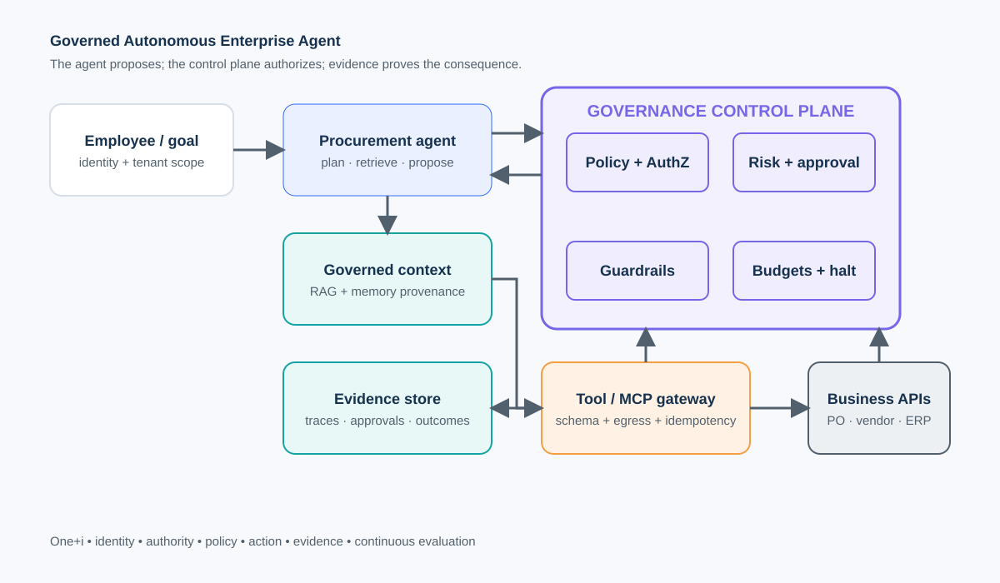
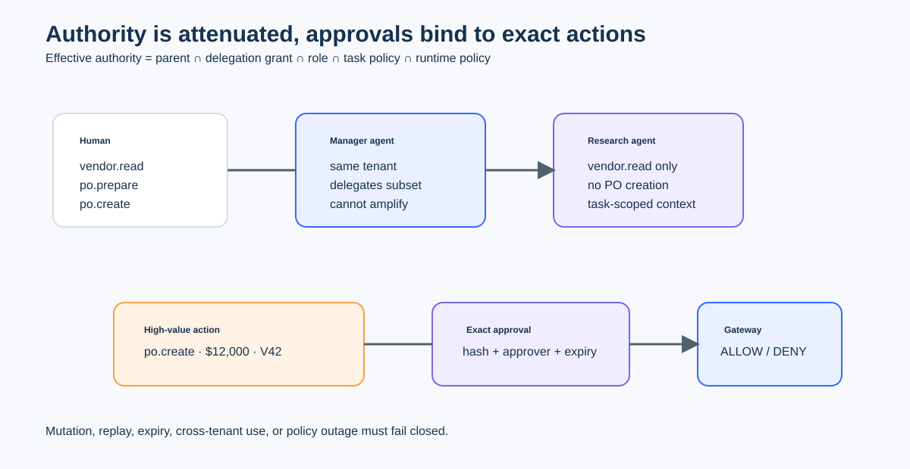
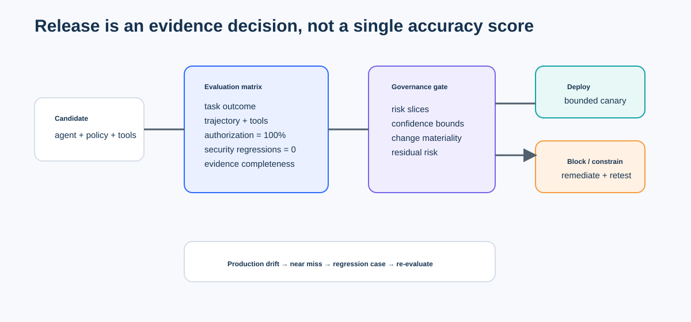
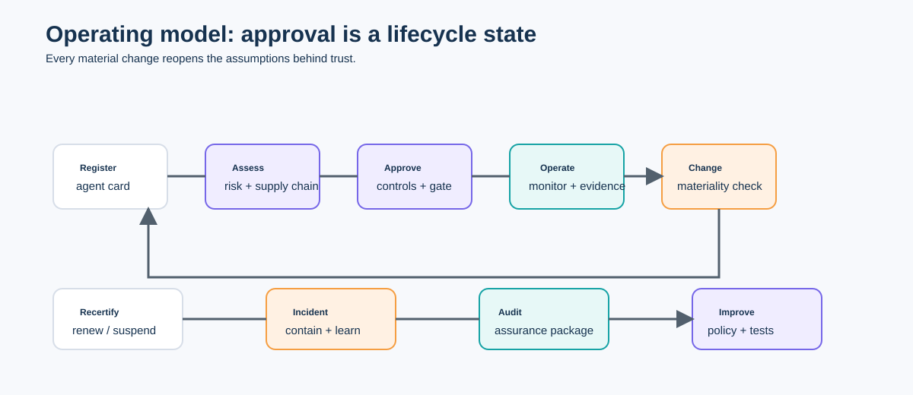

# Capstone: Governed Autonomous Enterprise Agent

**Full production architecture and trade-offs | One+i Agent Governance Curriculum**

This capstone integrates the course into a realistic **Enterprise Procurement Agent**. The agent can research vendors, prepare purchase orders, and propose actions—but a governance control plane decides whether any consequential action is allowed.

> The agent proposes. The control plane authorizes. The evidence system proves what happened.

## Learning outcomes

By completing this module, learners can:

- design a production architecture spanning identity, delegated authority, policy-as-code, governed RAG and memory, tools/MCP, multi-agent delegation, guardrails, approvals, observability, evaluation, and incident response;
- implement typed action contracts, least-privilege delegation, approval binding, idempotency, budgets, revocation, and kill switches;
- compare architectural choices such as manager-vs-handoff orchestration, centralized-vs-distributed policy, synchronous-vs-asynchronous approvals, and hosted-vs-portable state;
- run adversarial tests and convert findings into regression gates; and
- produce an assurance case that justifies a bounded autonomy decision.

## Scenario and boundaries

The procurement agent serves employees in a multi-tenant enterprise. It may read approved vendor and policy data, prepare purchase orders, and create an order only when authorization, policy, budget, and—when required—human approval all pass. It cannot make payments, change supplier bank details, access another tenant, or elevate its own authority.

The notebook is credential-free and deterministic. It simulates model reasoning and external systems so the governance mechanisms—not a provider SDK—remain the focus.

## Architecture









## Notebook path

1. Establish the baseline and threat model.
2. Define typed actions, identity, tenant scope, and delegated authority.
3. Add governed retrieval and memory with trust labels.
4. Route actions through policy, risk scoring, approvals, and a tool gateway.
5. Add specialist delegation with authority intersection.
6. Capture evidence and evaluate behavior, not just final text.
7. Inject failures: approval mutation, privilege amplification, poisoned retrieval, stale approval, and policy outage.
8. Turn findings into CI/CD release gates and a production assurance case.

## Key trade-offs

| Decision | Option A | Option B | Teaching judgment |
|---|---|---|---|
| Orchestration | Manager keeps control; specialists are tools | Handoff transfers control | Prefer manager-as-tools for high-risk actions; use handoffs when domain ownership and context transfer are explicit. |
| Policy | Central decision point | Policy embedded in services | Centralize high-consequence authorization; keep local validation for defense in depth and availability. |
| Approval | Synchronous block | Async workflow | Synchronous is simpler; async scales better but requires durable state, expiry, replay protection, and reconciliation. |
| Memory | Shared global memory | Tenant/task-scoped memory | Default to task and tenant scope; global memory requires provenance, retention, and poisoning controls. |
| Evidence | Full payload capture | Redacted structured evidence | Capture minimum sufficient evidence; protect sensitive content while preserving reconstruction. |
| Autonomy | High throughput | Bounded autonomy | Increase autonomy only when evidence, reversibility, control effectiveness, and residual risk justify it. |

## Run

```bash
python -m pip install -r requirements.txt
jupyter notebook capstone_governed_autonomous_enterprise_agent.ipynb
```

To run the reusable implementation:

```bash
python lab.py
```

## Exercises

1. Add a `vendor.bank_details.update` action and prove it is denied by default.
2. Replace manager-as-tools with handoffs. What evidence and revocation changes are required?
3. Add a second tenant and write a cross-tenant leakage regression test.
4. Change the policy service from fail-closed to fail-open for low-risk reads. Defend the boundary.
5. Add a material-change detector for model, prompt, tool, and knowledge versions.
6. Write an assurance case for conditional approval at autonomy level A2.

## References

- NIST, **AI Risk Management Framework 1.0**: https://www.nist.gov/itl/ai-risk-management-framework
- NIST, **AI RMF Generative AI Profile**: https://www.nist.gov/itl/ai-risk-management-framework/ generative-artificial-intelligence
- NIST, **AI Agent Standards Initiative**: https://www.nist.gov/artificial-intelligence/ai-agent-standards-initiative
- OWASP, **Top 10 for Agentic Applications**: https://owasp.org/www-project-top-10-for-agentic-applications/
- OpenTelemetry, **GenAI semantic conventions**: https://opentelemetry.io/docs/specs/semconv/gen-ai/
- OpenSSF, **AI/ML security**: https://openssf.org/

## License

Educational material for the One+i curriculum. Adapt the controls to your organization’s legal, regulatory, and risk requirements.
