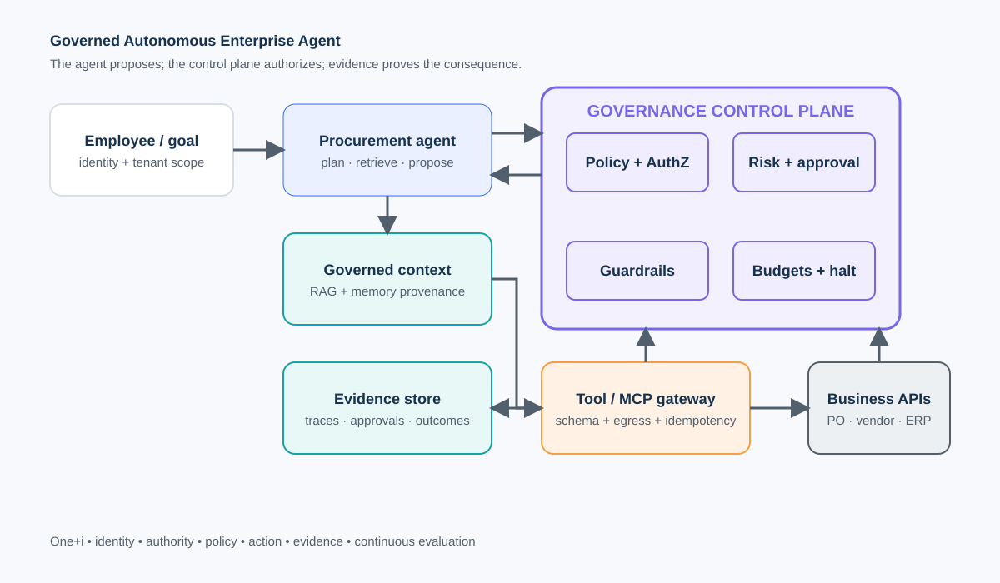
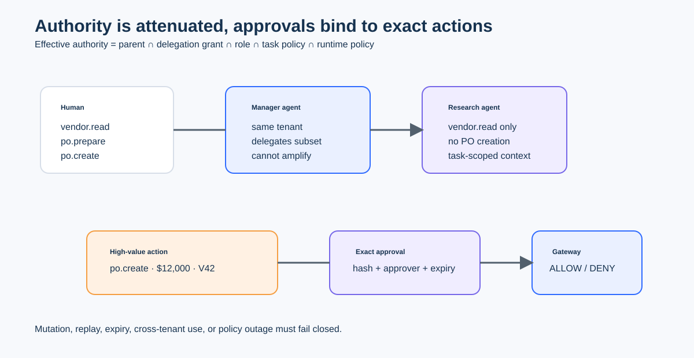
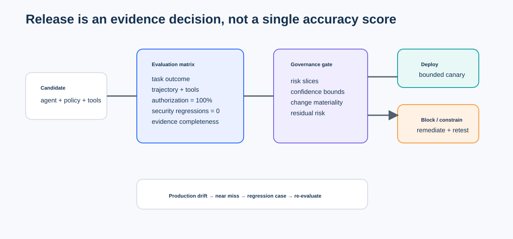
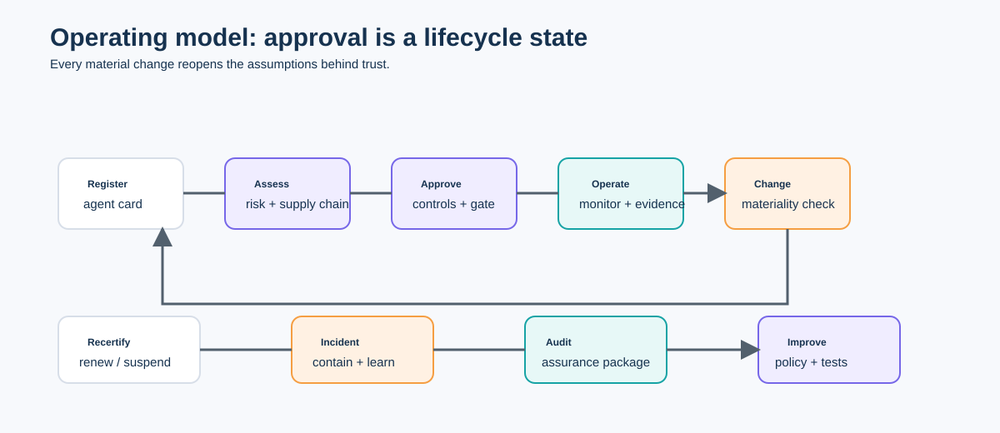

# Capstone: Governed Autonomous Enterprise Agent

> **Course 17 · Advanced capstone**
> A production architecture is governed only when its authority, evidence,
> failure handling and operating claims survive exact tests.

This capstone integrates the curriculum into a realistic enterprise procurement
agent. The agent can research an approved vendor, prepare a purchase order and
propose a state-changing action. It cannot grant itself authority, choose its
tenant, approve its own request, convert a timeout into success or bypass the
trusted gateway.

The course thesis is:

> Models propose; trusted application services validate, authorize, persist,
> execute, verify and prove.

## 1. Learning outcomes

After completing the chapter and lab, you can:

1. trace a consequential agent action from authenticated request through
   delegated authority, retrieval, policy, approval, execution and evidence;
2. implement typed, tenant-bound tool contracts and attenuated delegation;
3. authorize before retrieval and distinguish evidence from untrusted context;
4. bind human approval to an exact proposal, evidence set and policy version;
5. design durable interruption, idempotency, bounded retry and unknown-outcome
   reconciliation;
6. enforce lifecycle suspension independently of the agent;
7. record privacy-conscious OpenTelemetry evidence without prompts, secrets or
   hidden reasoning;
8. compare manager-as-tools and handoff orchestration by authority exposure,
   ownership and coordination cost;
9. evaluate explicit terminal states on a labelled scenario corpus; and
10. write a bounded assurance case that distinguishes implemented proof from
    production claims still requiring evidence.

### Prerequisites

- Courses [4: identity and delegated authority](../../beginner/04-agent-identity-and-delegated-authority/),
  [5: fine-grained authorization](../../beginner/05-fine-grained-authorization-for-agents/),
  [7: tool and MCP governance](../../intermediate/07-tool-and-mcp-governance/),
  [8: human oversight](../../intermediate/08-human-oversight-and-bounded-autonomy/),
  [9: data, RAG and memory governance](../../intermediate/09-data-rag-and-memory-governance/),
  [10: multi-agent governance](../../intermediate/10-multi-agent-governance-and-delegation/),
  [13: observability](../13-observability-as-governance-evidence/),
  [14: evaluation](../14-agent-evaluation-and-continuous-governance/),
  [15: control-plane architecture](../15-governance-control-plane-architecture/)
  and [16: operating model](../16-enterprise-agent-governance-operating-model/)
- Python 3.11+, Pydantic models, JSON and basic authorization concepts
- approximately 3–4 hours for reading, lab and exercises

### Success criteria

The credential-free reference path must:

- complete valid low- and high-value orders exactly once;
- pause high-value work until every required role supplies a current receipt;
- prevent cross-tenant, under-authorized, stale-evidence, suspended and
  over-limit execution;
- reject retrieved instructions as authority;
- reconcile an uncertain ERP result without a blind retry;
- produce measured metrics with visible numerators and denominators; and
- issue only a **conditional** release decision bounded to synthetic fixtures.

### Non-goals

The course does not claim that the fixture HMAC key, in-memory stores, simulated
ERP, deterministic planner or synthetic evaluation corpus are production-ready.
It does not measure live-model intelligence, production latency, availability,
scale, legal compliance or residual-risk acceptance.

## 2. Why the capstone matters

A conversational agent becomes materially different when it can create a
purchase order. The consequence boundary now includes identity systems,
knowledge stores, delegated credentials, policies, reviewers, workflow state,
an ERP, telemetry, incident response and deployment evidence. A safe-looking
final answer proves none of those components behaved correctly.

The scenario exposes several common failure chains:

- a user message claims a different tenant or role;
- a vendor comment contains instructions to ignore policy;
- a specialist receives broader tools than its parent;
- a reviewer approves one amount and the proposal later changes;
- a checkpoint is resumed twice;
- the ERP commits but the response is lost;
- an incident suspends the agent after approval but before execution; or
- aggregate task success hides a critical forbidden action.

The capstone treats each as a system invariant rather than a prompt-writing
problem.

## 3. Mental model: two cooperating systems

```text
probabilistic / model-facing path              trusted application path
---------------------------------              ------------------------
interpret request                              derive authenticated identity
retrieve candidate context        ----->       authorize before retrieval
recommend vendor                              validate provenance/freshness
propose typed action                          evaluate deterministic policy
ask for specialist help                       attenuate delegated capability
draft explanation                             persist checkpoint
                                               consume exact approval atomically
                                               execute through idempotent gateway
                                               verify or reconcile outcome
                                               record evidence and enforce lifecycle
```

The left side may be implemented by an agent SDK or graph runtime. The right
side remains authoritative regardless of framework.

| Artifact | What it proves | What it does not prove |
|---|---|---|
| Typed proposal | shape, types and bounded fields | identity, permission or truth |
| Signed delegation | issuer-bound claims were not modified | that requested capability is policy-allowed |
| Retrieval result | candidates were selected | that every candidate is authoritative |
| Approval receipt | named reviewer approved an exact package | that current policy and lifecycle still allow execution |
| ERP response | reported tool outcome | that an ambiguous timeout means failure |
| Trace | recorded observable events | hidden reasoning or semantic correctness |
| Passing evaluation | behavior on a named population | universal safety or production reliability |

## 4. Reference architecture



All four SVGs include accessible titles/descriptions and have authoritative,
versioned geometry sources in [`assets/specs/`](assets/specs/).

The reference system has six boundaries:

1. **Experience/API boundary** authenticates the employee and creates trusted
   request context.
2. **Agent runtime** plans and proposes work under budgets and stop conditions.
3. **Governance control plane** resolves registration, delegated capability,
   evidence, deterministic policy and lifecycle state.
4. **Human decision service** persists exact, expiring, role-bound receipts.
5. **Tool gateway** validates again, consumes authority and owns idempotent
   execution and reconciliation.
6. **Evidence/operations plane** collects privacy-conscious traces, evaluation,
   incidents, release evidence and assurance claims.

These are logical boundaries. Small deployments may colocate them, but must not
erase ownership or trust distinctions.

## 5. Internal mechanics

### 5.1 Authenticated identity and delegated authority

The lab creates a `Principal` from trusted application state. User text never
sets subject, tenant, role or permission. `issue_delegation()` then signs a
short-lived JWT fixture containing:

- issuer, subject and audience;
- tenant;
- capability intersection;
- maximum amount;
- parent-principal digest;
- issue and expiry times; and
- unique token ID.

Verification checks the signature and the application invariants. Production
systems should use workload identity, asymmetric keys, managed rotation and
revocation. JWT is a transport for claims, not an authorization decision.

### 5.2 Typed proposal and MCP/tool boundary

`ActionProposal` is a strict Pydantic model. The same model emits a JSON Schema
validated by `jsonschema` before policy evaluation. It carries both a stable
logical operation ID and a per-attempt ID:

```text
logical_operation_id -> stable business intent and deduplication scope
attempt_id           -> one execution attempt for diagnostics and retry budgets
idempotency_key      -> stable external-effect key
```

This schema can back an MCP or function-tool adapter, but the adapter must still
call the trusted gateway. Tool discovery or schema validity does not grant
permission. Current MCP specifications continue to evolve authorization and
long-running task semantics; applications must pin and test the version they
adopt ([MCP 2026-07-28 specification update](https://blog.modelcontextprotocol.io/posts/2026-07-28/)).

### 5.3 Governed retrieval and memory

`RetrievalService` checks `vendor.read` before candidate selection, then scopes
the scan by authenticated tenant and requested vendor. Each accepted record must
be:

- integrity-valid;
- authoritative rather than user-supplied;
- current at retrieval and policy time; and
- bound to the exact vendor in the proposal.

The malicious vendor comment remains observable as rejected evidence. Its text
cannot change tools, policy or identity.

Memory has a separate candidate/admission boundary. `GovernedMemory` requires
the exact tenant, subject, non-expired retention window and admitted evidence
IDs. The lab stores a digest, not sensitive raw content.

### 5.4 Policy decision and approval route

The deterministic `PolicyEngine` checks:

1. policy availability;
2. active registered agent and approved version;
3. current policy version;
4. tenant and requester consistency;
5. delegation subject, action and amount;
6. prohibited and unregistered actions;
7. exact evidence set, vendor and freshness; and
8. hard autonomy ceiling.

It returns `ALLOW`, `DENY` or `REVIEW` with reason codes. A purchase order above
CAD 10,000 requires a procurement manager; above CAD 25,000 also requires an
AI-risk reviewer. Above CAD 50,000 is denied for this autonomy class.

Policy engines commonly used at this boundary include
[Open Policy Agent](https://www.openpolicyagent.org/docs/latest/),
[Cedar](https://www.cedarpolicy.com/) and
[OpenFGA](https://openfga.dev/). They solve different problems: OPA and Cedar
evaluate policy over attributes and resources, while OpenFGA specializes in
relationship-based authorization. The application still supplies authenticated,
current facts and enforces the result.

### 5.5 Durable approval



The approval ledger issues a signed receipt over:

- tenant;
- proposal digest;
- evidence digest;
- policy version;
- reviewer subject and required role; and
- issue and expiry times.

The ledger rejects missing or duplicate roles, self-approval, signature
mutation, cross-tenant use, expiry and replay. Consumption is atomic under a
lock in the teaching implementation. The checkpoint independently binds the
proposal and evidence and permits only one authorized resume.

Production durable runtimes include
[LangGraph persistence and interrupts](https://docs.langchain.com/oss/python/langgraph/interrupts),
[Microsoft Agent Framework checkpoints](https://learn.microsoft.com/en-us/agent-framework/workflows/checkpoints)
and [Temporal durable AI workflows](https://docs.temporal.io/ai). None removes
the need to bind resume identity, checkpoint version, approval scope and
time-of-use authorization.

### 5.6 Idempotent execution and uncertain outcomes

The gateway rechecks agent status immediately before executing. It records a
stable logical operation and exact proposal digest.

| Dependency result | Application state | Safe next step |
|---|---|---|
| confirmed commit | `COMMITTED` | return durable receipt |
| failure before commit | `RETRYABLE` | bounded retry with same logical ID and new attempt ID |
| response lost after possible commit | `WAITING_RECONCILIATION` | query system of record; do not blind-retry |
| authorization/policy denial | `BLOCKED` | terminal until facts or policy legitimately change |
| approval needed | `WAITING_APPROVAL` | persist and resume with bound receipt |

The simulated ERP enforces idempotency and lets the learner inject both
transient-before-commit and unknown-after-commit failures. This distinction is
essential: a network exception says what the caller observed, not what the
remote system did.

### 5.7 Budgets, cancellation and termination

`RuntimeBudget` limits steps, tool calls, retries, delegation depth and cost.
Cancellation is checked before additional work. Terminal state belongs to the
application; model text such as “purchase complete” cannot create a receipt or
advance the state machine.

### 5.8 Observability as evidence

The lab uses the real OpenTelemetry SDK and an in-memory exporter. Spans contain
tenant/agent/operation IDs, action, policy version, decision, proposal digest
and terminal state. They do not contain prompts, retrieved content, secrets or
hidden reasoning.

OpenTelemetry’s GenAI conventions remain under active development and have moved
to a dedicated repository, so production instrumentation should pin a convention
version and test migrations rather than silently changing dashboards
([OpenTelemetry semantic conventions 1.44](https://opentelemetry.io/docs/specs/semconv/),
[version selection](https://opentelemetry.io/docs/specs/semconv/configuration/version-selection/)).

### 5.9 Incident containment

`IncidentController` accepts only tenant-scoped alerts from an allowlisted
source and requires a security-operator role. It changes the trusted registry
from active to suspended with optimistic versioning. The gateway enforces that
new state, so containment does not depend on the compromised agent cooperating.

## 6. Orchestration architecture choices

### Manager-as-tools

A manager retains the final user interaction and invokes specialists as bounded
tools. This creates more coordination events but keeps one action owner and can
minimize privileged principals. It fits high-consequence workflows where
specialists research or classify but cannot execute.

### Handoffs

A handoff transfers active control to a specialist. It can reduce manager
mediation and improve domain focus, but the system must explicitly transfer
context, credentials, revocation, telemetry and final-action ownership. OpenAI’s
Agents SDK documents both patterns and notes that tool guardrails do not apply
to the handoff call itself
([orchestration](https://openai.github.io/openai-agents-python/multi_agent/),
[handoffs](https://openai.github.io/openai-agents-python/handoffs/)).

### Deterministic workflow graph

Use a graph or durable workflow when the sequence, pause/resume points,
compensation and recovery must be explicit. Put probabilistic interpretation in
bounded nodes; keep state transitions and effect authorization deterministic.

The lab’s `compare_orchestration_patterns()` reports declared structural
properties—privileged capability exposure, revocation boundaries, coordination
events and final action owner. It is not a performance or quality benchmark.

## 7. Technology landscape

The point of the landscape is selection, not collecting frameworks.

| Layer | Common options | Strengths | Important boundary |
|---|---|---|---|
| Agent runtime | OpenAI Agents SDK, LangGraph, Microsoft Agent Framework, custom loop | tools, handoffs/graphs, sessions, tracing, structured state | runtime orchestration is not business authorization |
| Durable workflow | Temporal, LangGraph checkpointers, Agent Framework checkpoint storage | crash recovery, long waits, replay, human interruption | resume identity and side-effect idempotency remain application duties |
| Tool protocol | MCP, provider function tools, internal API gateways | interoperable discovery and schemas | discovered tools and model arguments are untrusted until gateway validation |
| Authorization | OPA/Rego, Cedar, OpenFGA, cloud IAM | centralized policy, ABAC/RBAC/ReBAC, auditability | facts must come from trusted identity/resource services |
| Contracts | Pydantic, JSON Schema, Protocol Buffers, OpenAPI | validation, code generation, versioning | schema validity is not authority or semantic correctness |
| Observability | OpenTelemetry, LangSmith, MLflow, Arize Phoenix, provider traces | traces, metrics, evaluations, correlations | configure privacy, sensitive-data capture, sampling and retention |
| Evaluation/security | pytest, Promptfoo, PyRIT, Garak, custom trajectory evaluators | deterministic invariants, attacks, regression suites | label populations and separate blocked attempts from actual outcomes |
| Supply-chain evidence | CycloneDX, SPDX, SLSA, Sigstore | dependency/model/data inventory and provenance | inventories and signatures need policy, freshness and identity verification |

The executable lab deliberately uses portable primitives—Pydantic, PyJWT,
JSON Schema and OpenTelemetry—so learners can place the same trusted control
plane behind any orchestration framework. The
[OpenAI Agents SDK](https://openai.github.io/openai-agents-python/) provides
tools, guardrails, handoffs, sessions and tracing; current guidance emphasizes
tool guardrails for each custom function call rather than relying only on first
input and final output guardrails
([guardrails](https://openai.github.io/openai-agents-python/guardrails/)).

## 8. State of the art as of 2026-10-07

### Established practice

- typed tool contracts and application-owned execution;
- short-lived workload/user delegation and least privilege;
- policy enforcement at the action boundary;
- durable human approval for consequential work;
- idempotency plus reconciliation for external effects;
- trace/evaluation correlation; and
- versioned release evidence and operational rollback.

### Emerging practice

- common protocols for tool/agent interoperability and long-running tasks;
- dedicated agent identity and authorization profiles;
- standardized agent-control baselines and agentic threat taxonomies;
- framework-neutral GenAI/agent telemetry conventions; and
- AI/ML bills of materials and signed provenance spanning models, data, tools
  and agent packages.

NIST launched its
[AI Agent Standards Initiative](https://www.nist.gov/artificial-intelligence/ai-agent-standards-initiative)
in February 2026 around interoperability, protocols, identity, authorization and
security evaluation. Treat the initiative and draft work as emerging rather
than finalized requirements. OWASP’s
[Top 10 for Agentic Applications 2026](https://genai.owasp.org/resource/owasp-top-10-for-agentic-applications-for-2026/)
is a current community threat framework, not a certification.

### Research frontier

- evaluation that predicts reliability across changing tools, models and
  environments;
- scalable formal reasoning about delegated authority and multi-agent state;
- privacy-preserving trajectory evidence that remains audit-usable;
- secure discovery and trust negotiation across organizational boundaries;
- calibrated autonomy policies using field performance without feedback loops;
  and
- causal incident reconstruction in partially observed agent workflows.

### Open problems

There is no universal agent safety score, complete benchmark for enterprise
reliability, or framework feature that turns probabilistic planning into
authorization. Current automated evaluation guidance stresses reproducibility
and declared limitations; see NIST’s initial draft
[AI 800-2](https://nvlpubs.nist.gov/nistpubs/ai/NIST.AI.800-2.ipd.pdf).

## 9. Worked procurement scenario

The reference run is a CAD 32,000 software purchase:

1. API middleware authenticates `employee-17` in `tenant-acme`.
2. The application issues the procurement agent a signed, 20-minute grant whose
   capabilities are the intersection of employee permission and agent request.
3. Retrieval authorizes `vendor.read` before selecting only Acme’s `V42`
   records.
4. The authoritative master record is accepted; a user comment containing
   instructions is rejected as evidence.
5. The deterministic planner produces a strict `po.create` proposal. User text
   does not supply tenant, identity or tool authorization.
6. JSON Schema validation catches malformed tool arguments.
7. Policy binds the approved agent version, current evidence, action, amount and
   policy version; CAD 32,000 routes to manager plus AI-risk review.
8. A signed checkpoint records `WAITING_APPROVAL`.
9. Two distinct reviewers issue exact, expiring receipts.
10. Resume checks checkpoint integrity, authenticated owner, delegation expiry,
    current registry and current policy.
11. Approval receipts are consumed atomically.
12. The gateway checks agent state again, calls the idempotent ERP and records a
    verified receipt.
13. OpenTelemetry spans record digests, versions, reason codes and terminal
    state without sensitive content.
14. The labelled corpus and invariant suite contribute to a bounded assurance
    case.

## 10. Practical lab

### Run the complete course

From the repository root:

```bash
make setup-contributor
make course-17
```

The course target executes the notebook top-to-bottom and runs the focused
invariant suite. To run only the reusable implementation:

```bash
uv run --locked python curriculum/advanced/17-capstone-governed-autonomous-enterprise-agent/lab.py
```

The notebook imports [`lab.py`](lab.py); it does not duplicate the runtime or
install packages at execution time.

### Lab sequence

1. Inspect dependency versions and trusted identity.
2. Issue and verify an attenuated delegation token.
3. Retrieve authoritative evidence and reject an injection-bearing comment.
4. Admit a provenance-bound, subject-scoped memory record.
5. Produce and validate the exact purchase-order proposal.
6. Pause at a signed checkpoint for two-role approval.
7. Resume, consume receipts and commit exactly once.
8. Inject an unknown-after-commit ERP failure and reconcile it.
9. Contain a trusted incident by suspending the registry.
10. Inspect privacy-conscious OpenTelemetry spans.
11. Compare orchestration topologies.
12. Run the 15-case evaluation and create a signed assurance case.

## 11. Experiments and failure drills

| Experiment | Variable | What to observe |
|---|---|---|
| approval threshold | CAD 10,000 / 25,000 boundaries | role route changes without prompt changes |
| poison filtering | authoritative vs untrusted source | rejected context remains unable to alter policy |
| policy outage | `PolicyEngine.available` | consequential action fails closed before ERP |
| incident timing | suspend after approval | time-of-use registry check still blocks execution |
| transient failure | before commit | explicit `RETRYABLE`, bounded retry may proceed |
| unknown failure | after possible commit | `WAITING_RECONCILIATION`, no second ERP call |
| cancellation | budget cancellation flag | no retrieval, model or tool work after cancellation |
| architecture | manager-as-tools vs handoff | capability exposure, ownership and coordination tax |

## 12. Evaluation and release gate



The 15 labelled cases include three expected commits or deduplicated commits and
twelve expected non-commit terminal states. The suite covers:

- valid low- and high-value orders;
- durable missing-approval wait;
- cross-tenant registration isolation;
- missing capability;
- stale evidence;
- policy outage;
- incident suspension;
- unknown outcome and later reconciliation;
- idempotent replay;
- proposal mutation after approval;
- expired approval;
- hard autonomy ceiling;
- transient dependency failure; and
- runtime budget exhaustion.

The reference run currently produces deterministic fixture results:

| Metric | Numerator | Denominator | Value | Meaning |
|---|---:|---:|---:|---|
| Presence-only baseline terminal correctness | 3 | 15 | 0.20 | baseline selected the exact expected terminal state |
| Governed terminal correctness | 15 | 15 | 1.00 | governed path selected the exact expected terminal state |
| Unsafe commit prevention | 12 | 12 | 1.00 | expected non-commit cases did not commit |
| Valid completion or deduplication | 3 | 3 | 1.00 | expected commit cases committed once or returned the durable result |

These are synthetic regression results, not a model leaderboard or production
estimate. The release gate cannot average away a critical action violation.

### Assurance case

`build_assurance_case()` signs evidence containing the scenario-corpus digest,
metric digest, policy version, agent version, population and explicit
limitations. It returns `CONDITIONAL_RELEASE` only when all defined terminal
states are correct, every unsafe case avoids commit and every valid case
completes or deduplicates.

The assurance case supports a decision; it does not make the organizational
risk-acceptance decision.

## 13. Failure modes and mitigations

| Failure | Unsafe shortcut | Implemented or required mitigation |
|---|---|---|
| prompt claims admin/tenant | trust model context | derive identity from authenticated state |
| specialist asks for broad tools | grant requested set | intersect with parent authority and registry |
| retrieved text says ignore policy | prompt-only injection warning | evidence trust/integrity/freshness plus gateway policy |
| schema-valid bank update | assume typed means safe | explicit prohibited-action policy |
| amount changes after review | approval boolean | exact proposal/evidence/policy receipt |
| two workers resume | optimistic assumption | signed versioned checkpoint and atomic claim |
| ERP timeout | blind retry | unknown terminal state and reconciliation |
| incident after approval | trust old decision | lifecycle check at time of use |
| policy dependency fails | fail open | fail closed for consequential action |
| trace captures payloads | log everything | identifiers, digests and reason codes only |
| high aggregate success | average safety failure away | critical slice gates and explicit populations |
| framework migration | inherit defaults | contract tests around the trusted gateway |

## 14. Production upgrade



| Teaching component | Production requirement |
|---|---|
| fixture HMAC/JWT | workload/user identity, asymmetric signing, KMS/HSM, key rotation, revocation and clock policy |
| in-memory registry | transactional system of record, versioned agent card, material-change workflow and multi-region recovery |
| local policy object | reviewed OPA/Cedar/service policy, signed bundles, decision logs, cache/failure semantics and rollback |
| in-memory approval ledger | durable workflow, queue SLOs, separation of duties, atomic consumption and recovery |
| simulated ERP | mutually authenticated gateway, idempotency registry, outbox/saga, reconciliation and compensation |
| in-memory checkpoint | encrypted durable state, optimistic concurrency, schema migration, retention and disaster recovery |
| deterministic planner | provider-configurable model, structured output, prompt/tool versioning, guardrails and live-quality evaluation |
| local evidence | tamper-evident storage, access control, retention/legal hold and verifiable export |
| in-memory OTel | OTLP collector, semantic-convention pinning, privacy classification, sampling and alert ownership |
| synthetic corpus | production-representative versioned cases, red-team findings, slices, adjudication and drift review |

Production rollout should use progressive exposure: shadow → read-only → propose
→ low-risk execution → bounded higher-risk execution. Each step requires named
entry/exit criteria, rollback, incident ownership and evidence retention.

## 15. Claim-to-proof map

| Course claim | Executable proof | Negative/evaluation proof |
|---|---|---|
| identity is trusted | `Principal` supplied by application | user text never populates identity |
| delegation attenuates | signed capability intersection | requested bank action disappears; tamper/expiry fail |
| retrieval is governed | authorization-before-selection and signed sources | other tenant never scanned; poison/stale records rejected |
| memory is scoped | tenant/subject/evidence/expiry admission | cross-scope and fabricated provenance fail |
| policy is deterministic | versioned reason-coded `PolicyDecision` | unsupported, over-limit, stale and inactive cases deny |
| approval is meaningful | exact role-bound receipts and checkpoint | mutation, expiry, replay, self-approval and concurrency fail |
| effects are exactly-once oriented | logical ID, idempotency key and ERP receipt | collision, retry and unknown-outcome tests |
| incidents revoke authority | registry suspension | non-security/untrusted alerts fail; gateway rechecks status |
| traces are evidence-safe | real in-memory OTel spans | test proves user payload absent |
| evaluation is honest | 15 labelled terminal-state cases | numerator/denominator and limitations asserted |
| release is bounded | signed assurance evidence | mutation invalidates signature; decision remains conditional |

## 16. Exercises

### Implementation

1. Add a `vendor.bank_details.update` tool to the registry and prove the policy
   still denies it before approval.
2. Add an ERP response proving that no commit occurred after an uncertain call,
   then implement a bounded retry with the same logical ID and new attempt ID.
3. Replace the fixture HMAC approval signature with an asymmetric test key and
   a key ID; add rotation and revoked-key cases.
4. Add a material-change manifest that binds model, prompt, policy, tool schema,
   dependencies and knowledge versions to the assurance case.

### Diagnosis

5. A trace shows `ALLOW`, but the ERP has no order. Identify which evidence is
   missing and which terminal state should be recorded.
6. Two valid managers approve the same proposal concurrently. Explain which
   component must serialize consumption and why database uniqueness alone may
   not be sufficient across the workflow.
7. A framework guardrail passes before approval, but tool arguments change on
   resume. Identify every boundary that must revalidate.

### Architecture judgment

8. Redesign the capstone using handoffs. Document context filtering, credential
   transfer, revocation boundaries, final-action ownership and trace continuity.
9. Choose OPA, Cedar or OpenFGA for the scenario and explain which relationship
   and attribute facts remain outside that engine.
10. Design a multi-region durable workflow and reconciliation strategy. State
    the consistency assumptions and the failure modes you cannot eliminate.

## 17. Review questions

1. Why can a signed JWT still be unauthorized?
2. Why must retrieval authorization occur before semantic ranking?
3. Which fields must exact approval bind, and which retry field should it omit?
4. How does `WAITING_RECONCILIATION` differ from `RETRYABLE`?
5. Why is the gateway’s lifecycle check still needed after approval?
6. What does the 1.00 fixture safety metric not prove?
7. When is a handoff preferable to manager-as-tools, despite higher revocation
   complexity?
8. Which evidence would be required to move from conditional to broader
   production autonomy?

## 18. References

### Governance, identity and security

- [NIST AI Risk Management Framework 1.0](https://nvlpubs.nist.gov/nistpubs/ai/NIST.AI.100-1.pdf)
- [NIST AI RMF Generative AI Profile](https://nvlpubs.nist.gov/nistpubs/ai/NIST.AI.600-1.pdf)
- [NIST AI Agent Standards Initiative](https://www.nist.gov/artificial-intelligence/ai-agent-standards-initiative)
- [NIST AI 800-2 initial public draft: automated benchmark evaluation](https://nvlpubs.nist.gov/nistpubs/ai/NIST.AI.800-2.ipd.pdf)
- [OWASP Top 10 for Agentic Applications 2026](https://genai.owasp.org/resource/owasp-top-10-for-agentic-applications-for-2026/)
- [OpenID Shared Signals Framework 1.0](https://openid.net/specs/openid-sharedsignals-framework-1_0.html)

### Agent and workflow runtimes

- [OpenAI Agents SDK](https://openai.github.io/openai-agents-python/)
- [OpenAI Agents SDK orchestration](https://openai.github.io/openai-agents-python/multi_agent/)
- [OpenAI Agents SDK guardrails](https://openai.github.io/openai-agents-python/guardrails/)
- [LangGraph documentation](https://docs.langchain.com/oss/python/langgraph/overview)
- [Microsoft Agent Framework checkpoints](https://learn.microsoft.com/en-us/agent-framework/workflows/checkpoints)
- [Temporal durable AI](https://docs.temporal.io/ai)

### Protocols, policy and telemetry

- [Model Context Protocol specification](https://modelcontextprotocol.io/specification/2026-07-28)
- [Open Policy Agent documentation](https://www.openpolicyagent.org/docs/latest/)
- [Cedar policy language](https://www.cedarpolicy.com/)
- [OpenFGA documentation](https://openfga.dev/docs)
- [OpenTelemetry semantic conventions](https://opentelemetry.io/docs/specs/semconv/)

### Supply chain and evidence

- [CycloneDX ML-BOM](https://cyclonedx.org/capabilities/mlbom/)
- [SPDX 3.0 AI Profile](https://spdx.github.io/spdx-spec/latest/model/AI/AI/)
- [SLSA provenance](https://slsa.dev/spec/v1.2/provenance)
- [Sigstore documentation](https://docs.sigstore.dev/)

## License

Educational material for the One+i curriculum. Adapt thresholds, controls,
retention and legal/regulatory mapping to the organization and jurisdiction.
