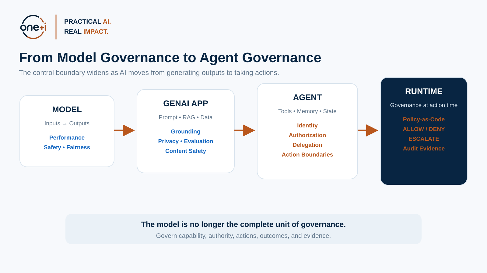
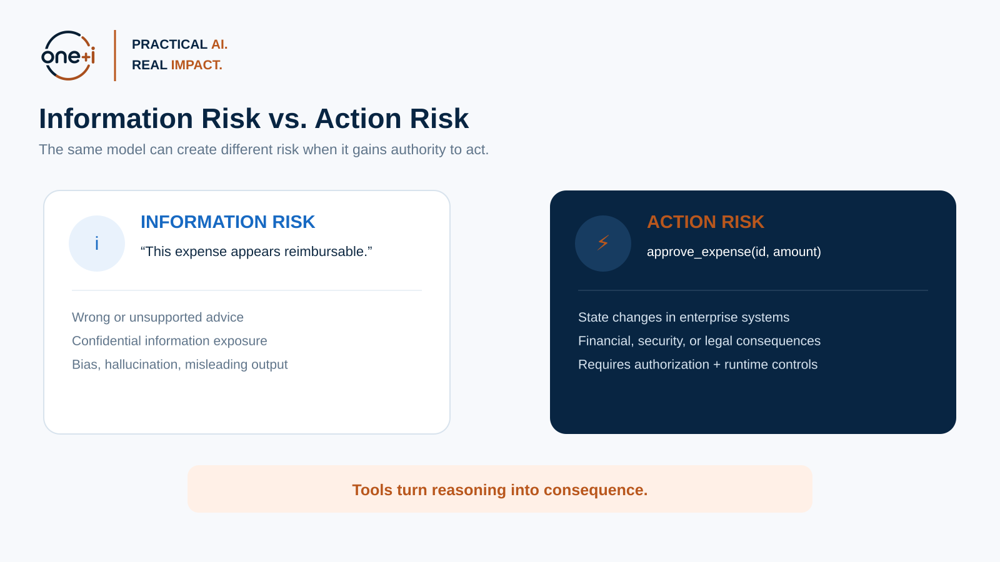
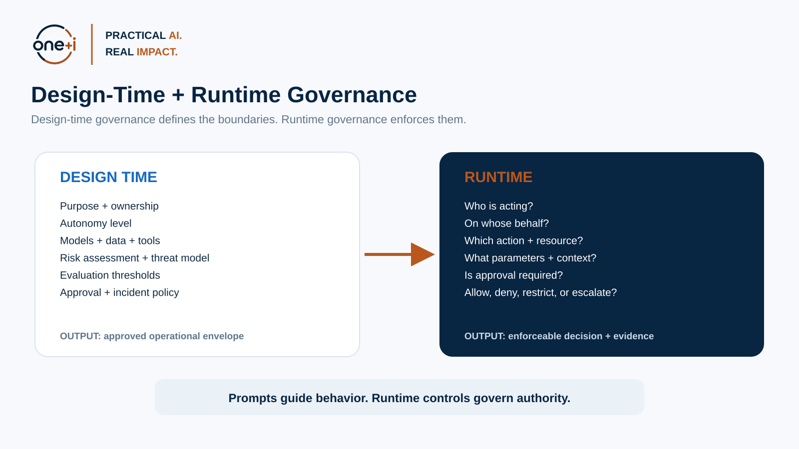
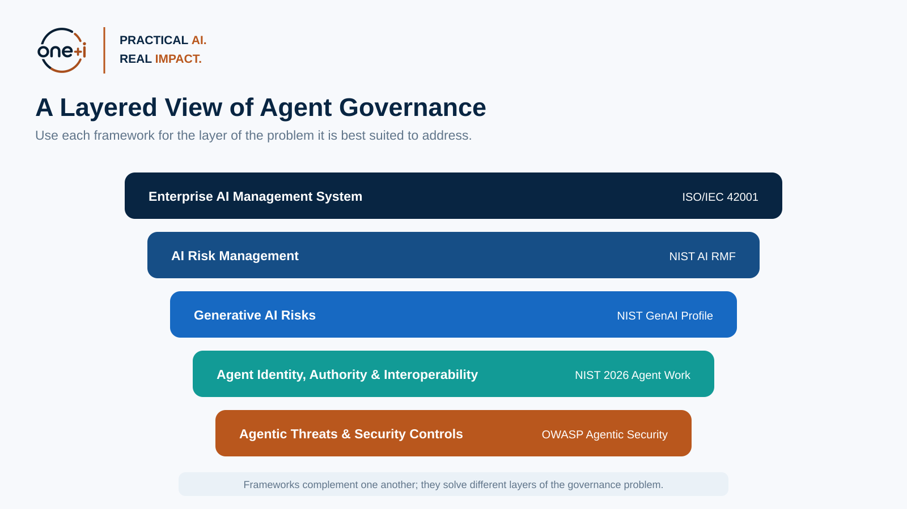

# Module 1 — From AI Governance to Agent Governance

> **Course:** Enterprise AI Agent Governance: From Principles to Runtime Control  
> **Module level:** Foundation  
> **Audience:** AI engineers, data scientists, ML engineers, security engineers, architects, technical leads, platform teams, governance and risk practitioners  
> **Recommended duration:** 3–4 hours theory + 2–3 hours practical notebook  
> **Scenario used throughout the course:** Enterprise Procurement Agent

---

## Learning objectives

By the end of this module, you should be able to:

1. Explain how **agentic and autonomous AI change the unit of governance** from a model or output to an end-to-end socio-technical system.
2. Distinguish **information risk** from **action risk**.
3. Describe why model-level guardrails and pre-deployment approval are necessary but insufficient for autonomous agents.
4. Identify the major **governance surfaces** of an agent: model, context, data, tools, memory, identity, permissions, delegation, runtime state, actions, and humans.
5. Apply **NIST AI RMF** concepts to an agentic system without treating the framework as a checklist.
6. Explain how **NIST AI RMF, the GenAI Profile, ISO/IEC 42001, NIST's 2026 agent work, and OWASP Agentic Security** complement each other.
7. Build an initial **agent system map**, **governance boundary map**, **risk register**, and **control hypothesis** for an enterprise agent.
8. Recognize the architectural principle that will recur throughout this course:

> **Agent intelligence is not agent authority.**

---

# 1. Why agent governance is a new engineering problem

AI governance originally developed around systems whose most visible behavior was a **prediction, score, recommendation, classification, or generated response**.

A conventional AI application often follows this structure:

```text
Input → Model → Output → Human or Application Decision
```

The model may still create serious risks: discrimination, privacy harm, unsafe recommendations, hallucinations, security weaknesses, or regulatory exposure. But the model itself normally does not have independent authority over enterprise systems.

An agentic system changes the execution model:

```text
Goal
  ↓
Interpret
  ↓
Plan
  ↓
Retrieve / Reason
  ↓
Choose Tool
  ↓
Take Action
  ↓
Observe Result
  ↓
Update State
  ↓
Continue / Stop / Escalate
```

An agent can therefore influence the world **through a sequence of decisions**, not only through one output.

That changes governance in three important ways:

### 1.1 Risk becomes trajectory-dependent

A single model output may appear harmless, while a series of individually plausible decisions can create a harmful outcome.

Example:

1. Agent searches for a supplier.
2. Agent finds an outdated approved-vendor list.
3. Agent selects a vendor that is no longer approved.
4. Agent generates a purchase order.
5. Agent invokes a payment tool.
6. Payment succeeds.

The final action cannot be governed effectively by evaluating only the natural-language response.

### 1.2 Risk becomes capability-dependent

The same model can have radically different risk depending on what it is connected to.

Compare:

- Agent A can read public product documentation.
- Agent B can read customer records.
- Agent C can change customer records.
- Agent D can initiate payments.

The model may be identical. The **authority and blast radius are not**.

### 1.3 Governance becomes a runtime concern

A pre-deployment review can determine whether a system is fit for an intended purpose. It cannot anticipate every resource, tool argument, user context, delegated authority, retrieved document, or policy state the agent will encounter after deployment.

For agents, some governance decisions must therefore be made **at the moment of action**.



---

# 2. Information risk vs. action risk

A useful distinction for enterprise teams is the difference between **information risk** and **action risk**.

## Information risk

Information risk arises when AI produces, exposes, transforms, or recommends information incorrectly or inappropriately.

Examples:

- hallucinated policy guidance,
- biased recommendations,
- leaking confidential information,
- unsupported claims,
- unsafe generated content,
- wrong classification,
- misleading financial analysis.

## Action risk

Action risk arises when an AI system can **cause a state change** in another system or the physical/business environment.

Examples:

- issuing a refund,
- changing an insurance claim,
- creating a user account,
- deleting a record,
- sending an email,
- approving a purchase,
- changing a production configuration,
- deploying code,
- initiating a financial transaction.

### Why the distinction matters

Consider an employee-support AI.

**Assistant mode**

> “Based on policy, this expense appears reimbursable.”

**Agent mode**

```python
approve_expense(expense_id="E-1024", amount=3200)
```

The first system can misinform a user.

The second can **create an organizational consequence**.

The appropriate governance controls therefore differ.

| Dimension | Informational assistant | Autonomous/agentic system |
|---|---|---|
| Primary output | Text, score, recommendation | Decisions and actions |
| Main boundary | Model/application output | Tool and resource boundary |
| Human role | Usually consumes output | May delegate authority |
| Key control | Output evaluation | Authorization + policy + runtime enforcement |
| Audit focus | What was generated? | What was attempted, allowed, executed, and why? |
| Failure consequence | Misinformation | State change, financial loss, security incident |
| Recovery | Correct output | Reverse action, revoke authority, investigate trajectory |

**Important:** The distinction is not binary. Many enterprise systems contain both information and action risk.



---

# 3. The unit of governance is the system, not the model

A recurring mistake in GenAI governance is to use the **foundation model** as the primary unit of analysis.

Model governance is still necessary. But an agent's behavior emerges from a larger system:

```text
Business Goal
    ↓
User / Delegator
    ↓
Agent Instructions
    ↓
Model
    ↓
Context + Retrieved Evidence
    ↓
Memory + Runtime State
    ↓
Planner / Orchestrator
    ↓
Tools / APIs / Other Agents
    ↓
Enterprise Systems
    ↓
Action / Outcome
```

Each layer can introduce risk independently.

## Model

Questions include:

- Is the model appropriate for the task?
- Is performance adequate?
- What are known limitations?
- What security/privacy properties apply?

## Instructions and policy prompts

Questions include:

- Are system instructions clear?
- Are behavioral boundaries explicit?
- Can untrusted content override them?
- Are critical controls incorrectly implemented only as prompts?

## Context and retrieval

Questions include:

- What sources can enter context?
- Are sources authorized for the current user?
- Can retrieved text contain malicious instructions?
- Is provenance retained?

## Memory

Questions include:

- What can be stored?
- Who can read it?
- How long does it persist?
- Can false memory be corrected?
- Can data leak across users or tenants?

## Tools and APIs

Questions include:

- Which tools are exposed?
- Which operations can mutate state?
- Are parameters constrained?
- Are sensitive actions reversible?
- What rate or monetary limits exist?

## Identity and authority

Questions include:

- Who is the agent?
- On whose behalf is it acting?
- What authority was delegated?
- How long does that authority last?
- What happens when the agent delegates to another agent?

## Runtime state and orchestration

Questions include:

- Can the agent loop indefinitely?
- Can it recursively spawn agents?
- Are budgets and stop conditions enforced?
- Can the workflow recover safely?

## Humans

Questions include:

- Who owns the system?
- Who approves high-risk actions?
- Who investigates incidents?
- Can humans understand what they are approving?

This leads to the first major design principle of the course:

> **Govern the complete capability chain, not only the model.**

---

# 4. From AI governance to agent governance

A useful way to understand the evolution is to view governance as a widening control boundary.

### Stage 1 — Model governance

Primary question:

> Can we trust and approve this model for the intended use?

Focus:

- validation,
- performance,
- fairness,
- explainability,
- security,
- model documentation,
- lifecycle controls.

### Stage 2 — GenAI application governance

Primary question:

> Can we govern the application that surrounds the model?

Additional focus:

- prompts,
- RAG,
- data provenance,
- hallucination,
- content safety,
- privacy,
- evaluation,
- monitoring.

### Stage 3 — Agent governance

Primary question:

> What is this system allowed to access, decide, and do?

Additional focus:

- agent identity,
- tools,
- authorization,
- memory,
- delegation,
- autonomy boundaries,
- human approvals.

### Stage 4 — Runtime governance

Primary question:

> Should this specific proposed action be allowed **now**, in this context?

Additional focus:

- policy-as-code,
- contextual authorization,
- risk-based escalation,
- runtime enforcement,
- audit evidence.

This course focuses on the transition from Stages 2–4.

---

# 5. Design-time governance vs. runtime governance

Agent governance should not replace existing governance processes. It should add **runtime controls** to them.

## Design-time governance

Design-time governance answers questions such as:

- What is the intended purpose?
- What is explicitly out of scope?
- What autonomy level is acceptable?
- Who owns the agent?
- What data classifications may it access?
- What tools may it use?
- What evaluation thresholds must it meet?
- What regulatory or organizational obligations apply?
- Which actions require human approval?
- What incidents require shutdown or restriction?

Artifacts may include:

- system/agent card,
- architecture diagram,
- risk assessment,
- threat model,
- data-flow map,
- tool inventory,
- evaluation report,
- approval record,
- deployment checklist.

## Runtime governance

Runtime governance answers questions such as:

- Is this caller authorized?
- Is this agent identity valid?
- Is this tool allowed for this task?
- Is the requested amount within policy?
- Is this customer record within the user's scope?
- Is the retrieved data permitted?
- Is the action reversible?
- Does policy require human approval?
- Has the agent exceeded its budget?
- Should the agent be restricted because of anomalous behavior?

Runtime outputs often look like:

```text
ALLOW
DENY
ESCALATE
REQUIRE_ADDITIONAL_VERIFICATION
READ_ONLY
TERMINATE
```

### Core principle

Prompts can express desired behavior.

**Prompts are not a complete authorization boundary.**

A system prompt saying:

> Never approve purchases above $10,000.

is useful instruction.

A policy enforcement point rejecting a `$25,000` purchase is a control.

We will build the latter in later modules.



---

# 6. Governance surfaces for autonomous agents

A practical governance review should explicitly enumerate the surfaces that affect agent behavior.

Use this **Agent Governance Surface Map**.

| Surface | Key question | Example control |
|---|---|---|
| Purpose | What is the agent meant to accomplish? | Approved use-case definition |
| Ownership | Who is accountable? | Named business + technical owner |
| Model | Is the model suitable? | Evaluation + approved model list |
| Instructions | What behavioral rules apply? | Versioned system instructions |
| Context | What can the model see? | Context filtering |
| Retrieval | What evidence can be searched? | Permission-aware retrieval |
| Data | What classifications are allowed? | Data access policies |
| Memory | What can persist? | Retention + scope + provenance |
| Identity | Who is the agent? | Workload/agent identity |
| Delegation | On whose behalf does it act? | Delegated authority token |
| Tools | What capabilities exist? | Tool registry |
| Parameters | What values are permissible? | Schema + range constraints |
| Authorization | Is action permitted? | Policy engine |
| Autonomy | What may happen without humans? | Autonomy tier |
| Human oversight | When must humans intervene? | Risk-based approval |
| Execution | Where is action enforced? | Gateway/PEP |
| Observability | Can the trajectory be reconstructed? | Distributed tracing |
| Evaluation | Does behavior meet requirements? | Offline + online evals |
| Security | Can behavior be manipulated? | Threat model + red teaming |
| Incident response | How can autonomy be reduced? | Restrict/read-only/disable |
| Audit | Can we prove what happened? | Immutable evidence trail |

**Exercise:** Take any AI agent you know and fill one row for each surface. If you cannot answer a row, you have discovered a governance gap.

---

# 7. Framework lens 1 — NIST AI RMF

The **NIST AI Risk Management Framework (AI RMF 1.0)** provides a voluntary, cross-sector framework for managing AI risk. NIST organizes the Core around four functions:

- **GOVERN**
- **MAP**
- **MEASURE**
- **MANAGE**

NIST explicitly treats GOVERN as a cross-cutting function and describes risk management as continuous across the AI lifecycle. NIST also notes that AI RMF 1.0 is currently being revised, so enterprise courses should teach its durable concepts while tracking future revisions.

Official resources:

- NIST AI RMF: https://www.nist.gov/itl/ai-risk-management-framework
- AI RMF Core: https://airc.nist.gov/airmf-resources/airmf/5-sec-core/
- AI RMF Playbook: https://airc.nist.gov/airmf-resources/playbook/

## Applying the four functions to agents

### GOVERN

For an agent:

- define ownership,
- establish autonomy policy,
- define acceptable-use boundaries,
- establish approval authority,
- maintain tool/model inventories,
- define exception processes,
- establish incident-response responsibility.

### MAP

For an agent:

- identify users and affected parties,
- document intended and foreseeable uses,
- map tools and external dependencies,
- identify decision/action boundaries,
- map data and memory flows,
- analyze potential impact and blast radius.

### MEASURE

For an agent:

- evaluate task success,
- measure tool-selection accuracy,
- test authorization boundaries,
- evaluate policy compliance,
- test prompt injection and tool abuse,
- measure autonomy and escalation rates,
- test failure recovery,
- measure audit completeness.

### MANAGE

For an agent:

- prioritize high-impact risks,
- enforce runtime controls,
- restrict unsafe tools,
- adjust autonomy,
- update policies,
- respond to incidents,
- recertify after material changes.

## Do not turn NIST AI RMF into a checkbox exercise

NIST's Playbook explicitly states that it is not a one-size-fits-all checklist.

For agent governance, use the RMF as a **risk reasoning structure**.

Wrong question:

> Did we complete GOVERN, MAP, MEASURE, and MANAGE?

Better question:

> What risks does this specific autonomous capability create, and how do the RMF functions help us govern those risks over time?

---

# 8. Framework lens 2 — NIST Generative AI Profile

The **NIST AI RMF Generative AI Profile (NIST AI 600-1)** is a companion resource that helps organizations identify and manage risks specific to generative AI.

Official publication:

https://www.nist.gov/publications/artificial-intelligence-risk-management-framework-generative-artificial-intelligence

For agent systems, the GenAI Profile is useful because agents inherit classic GenAI concerns such as:

- confabulation,
- privacy,
- data provenance,
- content risks,
- information security,
- human over-reliance,
- third-party dependencies,
- evaluation challenges.

But agents add something important:

> **A generated error can become an executed action.**

Example:

```text
Confabulation
    ↓
Incorrect plan
    ↓
Wrong tool
    ↓
Valid credentials
    ↓
Real state change
```

This is why agent governance must connect GenAI risk controls with identity, authorization, execution controls, and observability.

---

# 9. Framework lens 3 — ISO/IEC 42001

**ISO/IEC 42001:2023** specifies requirements for establishing, implementing, maintaining, and continually improving an Artificial Intelligence Management System (AIMS).

Official overview:

https://www.iso.org/standard/42001

ISO 42001 is especially useful for enterprise governance because it pushes organizations to think beyond one AI application and establish an **organizational management system**.

For agent governance, useful themes include:

- accountability,
- policies and objectives,
- roles and responsibilities,
- risk and opportunity management,
- lifecycle processes,
- monitoring,
- documented evidence,
- continual improvement.

### NIST AI RMF vs. ISO 42001

They should not be taught as competitors.

A practical interpretation:

| NIST AI RMF | ISO/IEC 42001 |
|---|---|
| Risk-management framework | Management-system standard |
| Flexible outcomes and actions | Organizational management requirements |
| Strong risk reasoning structure | Strong governance operating model |
| Useful for system/use-case analysis | Useful for enterprise-wide management |
| Voluntary framework | Certifiable management-system standard |

An enterprise can use ISO 42001 to establish the organizational management system while using NIST AI RMF concepts to structure system-level risk management.

---

# 10. Framework lens 4 — NIST's 2026 AI agent work

Agent governance is becoming explicit in current standards work rather than being treated only as an extension of chatbot governance.

## AI Agent Standards Initiative

NIST announced an **AI Agent Standards Initiative** in February 2026 focused on interoperable and secure agent adoption.

The initiative highlights areas such as:

- secure agent interactions,
- interoperability,
- authentication and identity infrastructure,
- security evaluation,
- protocol ecosystems.

Official resource:

https://www.nist.gov/artificial-intelligence/ai-agent-standards-initiative

## Agent Identity and Authorization

NIST's National Cybersecurity Center of Excellence published a 2026 concept paper on applying identity standards and best practices to software and AI agents.

It highlights issues including:

- identification,
- authorization,
- auditing,
- non-repudiation,
- access to diverse datasets, tools, and applications,
- prompt-injection mitigation.

Official resource:

https://csrc.nist.gov/pubs/other/2026/02/05/accelerating-the-adoption-of-software-and-ai-agent/ipd

### Why this matters

This is evidence of a broader architectural shift:

```text
Model safety
     ↓
Application safety
     ↓
Agent identity
     ↓
Delegated authority
     ↓
Runtime authorization
     ↓
Auditable action
```

Later modules will focus deeply on identity, delegation, authorization, and policy enforcement.

---

# 11. Framework lens 5 — OWASP Agentic Security

The **OWASP Agentic Security Initiative** focuses specifically on autonomous agents and multi-step workflows.

Official resources:

- Initiative: https://genai.owasp.org/initiatives/agentic-security-initiative/
- OWASP Top 10 for Agentic Applications 2026: https://genai.owasp.org/resource/owasp-top-10-for-agentic-applications-for-2026/

OWASP's current agentic work is particularly valuable because governance and security overlap heavily once agents can execute actions.

Representative concerns include:

- agent goal hijacking,
- tool misuse,
- identity and privilege abuse,
- supply-chain vulnerabilities,
- unexpected code execution,
- memory/context poisoning,
- insecure inter-agent interactions,
- cascading failures.

### Governance takeaway

Security asks:

> How can an attacker abuse this capability?

Governance also asks:

> What should the system be allowed to do even when nobody is attacking it?

A mature agent program needs both perspectives.

---

# 12. How the major frameworks fit together

Use frameworks according to the problem they are good at.



| Layer | Primary source | What it contributes |
|---|---|---|
| Enterprise management | ISO/IEC 42001 | Organizational AI management system |
| AI risk management | NIST AI RMF | Govern/Map/Measure/Manage risk reasoning |
| GenAI-specific risks | NIST GenAI Profile | GenAI-specific risk considerations |
| Agent standardization | NIST Agent Standards Initiative | Secure/interoperable agent ecosystem direction |
| Identity + authorization | NIST NCCoE agent concept work | Agent identity and access-management focus |
| Agent threat model | OWASP Agentic Security | Practical agentic threat categories |
| Internal controls | Enterprise policy architecture | Organization-specific enforceable requirements |

Do not ask:

> Which framework should we choose?

Ask:

> Which framework helps us solve each layer of the governance problem?

---

# 13. Enterprise governance-by-design

Governance-by-design means risk controls are considered while architecture is still flexible.

A useful sequence is:

```text
1. Define business goal
2. Define actor and owner
3. Define agent autonomy
4. Identify data and tools
5. Map intended actions
6. Identify high-impact actions
7. Define authorization boundary
8. Define human escalation
9. Define observability
10. Define evaluations
11. Threat-model the system
12. Deploy with minimum necessary authority
13. Increase autonomy only with evidence
```

## Anti-pattern: governance after implementation

```text
Build agent
    ↓
Connect all tools
    ↓
Give broad service account
    ↓
Demo works
    ↓
Ask governance team to approve
```

This makes governance expensive because controls now require redesign.

## Better pattern

```text
Business Goal
    ↓
Risk + Autonomy Boundary
    ↓
Architecture
    ↓
Controls
    ↓
Implementation
    ↓
Evaluation
    ↓
Restricted Deployment
    ↓
Evidence
    ↓
Progressive Autonomy
```

---

# 14. Autonomy is a governance variable

Not every system that uses an agent framework is equally autonomous.

A practical maturity model:

## Level 0 — Informational

Agent recommends.

Human acts.

Example:

> Recommend three approved vendors.

## Level 1 — Assisted execution

Agent prepares an action.

Human explicitly approves execution.

Example:

> Prepare purchase order PO-728 and request approval.

## Level 2 — Bounded autonomy

Agent independently executes predefined low-risk operations.

High-risk or unusual actions escalate.

Example:

> Auto-order approved office supplies under $500.

## Level 3 — High autonomy

Agent plans and executes multi-step workflows inside explicit policy boundaries.

Example:

> Manage low-risk procurement workflow from request through vendor communication and ordering.

Governance burden generally rises with:

```text
Autonomy
× Impact
× Access
× Irreversibility
× Uncertainty
```

This is not intended as a mathematically precise universal formula. It is a useful **risk-thinking heuristic**.

---

# 15. Case study — Enterprise Procurement Agent

We will use the same evolving scenario throughout this course.

## Business goal

Reduce procurement cycle time for routine purchases while maintaining financial, security, vendor, and compliance controls.

## Initial capabilities

The Procurement Agent can:

1. receive a purchase request,
2. retrieve procurement policy,
3. identify approved vendors,
4. search product catalogues,
5. compare prices,
6. recommend a purchase.

Later modules will add:

- purchase-order creation,
- supplier communication,
- delegated authority,
- payments,
- agent-to-agent delegation,
- persistent memory,
- runtime policy,
- observability,
- human approval,
- red teaming.

## Initial architecture

```text
Employee
   ↓
Procurement Agent
   ├── LLM
   ├── Procurement Policy RAG
   ├── Vendor Catalogue
   └── Product Search
   ↓
Recommendation
   ↓
Human Buyer
```

At this stage, the system is primarily informational.

Now imagine adding:

```text
Purchase Order API
Supplier Email Tool
Payment API
```

Risk changes immediately.

### Exercise: capability delta

For each capability below, identify what new governance question appears.

| Capability added | Governance question |
|---|---|
| Read procurement policy | ? |
| Read vendor database | ? |
| Email a supplier | ? |
| Create a purchase order | ? |
| Approve a purchase | ? |
| Initiate payment | ? |
| Delegate to a research agent | ? |
| Store vendor preference in memory | ? |

Suggested discussion:

- Does the agent need its own identity?
- What authority is inherited from the employee?
- Which operations should remain human-approved?
- Which actions are reversible?
- Which failures could create financial or legal consequences?
- What telemetry must be retained?

---

# 16. Practical method — Agent System Map

Before writing governance controls, draw the system.

Use five categories.

## Actors

Examples:

- employee,
- business owner,
- technical owner,
- agent,
- sub-agent,
- administrator,
- approver.

## Intelligence

Examples:

- foundation model,
- embedding model,
- reranker,
- policy classifier.

## Knowledge and state

Examples:

- RAG index,
- databases,
- conversation history,
- memory,
- runtime state.

## Capabilities

Examples:

- APIs,
- MCP servers,
- databases,
- email,
- payment service,
- code execution.

## Controls

Examples:

- authentication,
- authorization,
- policy engine,
- guardrails,
- approval service,
- logging,
- evaluation,
- monitoring.

The map should answer:

> **Where can the agent cross from reasoning into consequence?**

Those points are governance boundaries.

---

# 17. Practical method — Governance Boundary Map

For every boundary, document:

| Field | Question |
|---|---|
| Boundary | Where does execution cross into another trust zone? |
| Principal | Who/what is making the request? |
| Delegator | On whose behalf? |
| Capability | What is being requested? |
| Resource | What system/data is affected? |
| Impact | What could go wrong? |
| Authorization | How is permission decided? |
| Policy | Which organizational rule applies? |
| Human review | Is approval necessary? |
| Observability | What evidence is recorded? |
| Recovery | Can action be reversed? |

Example:

```yaml
boundary: purchase_order_api
principal: procurement_agent
delegator: employee_123
action: create_purchase_order
resource: vendor_987
impact: financial_commitment
authorization: contextual_policy
approval:
  required_if_amount_gt: 5000
logging:
  - principal
  - delegator
  - amount
  - vendor
  - policy_decision
  - approval_id
reversible: partially
```

This is only a conceptual example. Later modules will implement real authorization and policy engines.

---

# 18. Practical method — Initial Agent Risk Register

Use a risk register that reflects agent-specific behavior.

Example:

| Risk | Cause | Consequence | Initial control hypothesis | Measure |
|---|---|---|---|---|
| Wrong vendor selected | Stale retrieval | Financial/compliance issue | Approved-vendor filter | Vendor-policy violation rate |
| Unauthorized purchase | Excessive tool authority | Financial loss | Runtime authorization | Denied unauthorized actions |
| Prompt injection | Malicious supplier content | Tool misuse | Trust boundaries + validation | Attack success rate |
| Wrong amount | Reasoning/tool argument error | Financial loss | Parameter limits | Invalid tool-call rate |
| Approval bypass | Agent misinterprets prompt | Policy violation | External policy enforcement | Policy bypass rate |
| Cross-user data leak | Shared context/memory | Privacy incident | Scoped context/memory | Isolation test failures |
| Runaway workflow | Looping/retries | Cost/outage | Budgets + stop conditions | Steps/task, cost/task |
| Untraceable delegation | Multi-agent handoff | Accountability loss | Delegation provenance | Trace completeness |

---

# 19. What belongs in prompts, and what belongs outside them?

This is one of the most important distinctions in agent engineering.

## Good uses of prompts

Prompts are appropriate for:

- task instructions,
- workflow guidance,
- preferred behavior,
- explanation requirements,
- reasoning constraints,
- escalation guidance,
- output structure.

## Controls that should not rely only on prompts

Critical boundaries generally require external enforcement:

- authentication,
- authorization,
- monetary limits,
- access-control rules,
- tenant isolation,
- tool allowlists,
- rate limits,
- sensitive resource restrictions,
- irreversible-action approval,
- credential scope.

Example:

### Weak boundary

```text
System prompt:
"Never issue refunds greater than $500."
```

### Stronger architecture

```text
Agent proposes:
issue_refund(customer="C123", amount=1200)

        ↓

Policy enforcement:
amount > 500

        ↓

DENY or ESCALATE
```

The prompt still helps the agent behave correctly.

The policy layer prevents the system from relying entirely on probabilistic compliance.

---

# 20. Common enterprise anti-patterns

## Anti-pattern 1 — “The model is approved, so the agent is approved”

Why it fails:

The agent adds tools, data, memory, policies, and workflows that change risk.

## Anti-pattern 2 — Shared superuser credentials

Why it fails:

You lose least privilege, attribution, and meaningful auditability.

## Anti-pattern 3 — Governance rules only in the system prompt

Why it fails:

Prompts are behavioral instructions, not deterministic enforcement.

## Anti-pattern 4 — Human approval for everything

Why it fails:

Approval fatigue makes oversight meaningless.

## Anti-pattern 5 — Logging only the final answer

Why it fails:

You cannot reconstruct the trajectory or authorization decision.

## Anti-pattern 6 — Permanent memory by default

Why it fails:

Incorrect, sensitive, or poisoned information can affect future decisions.

## Anti-pattern 7 — Unlimited tool loops

Why it fails:

Failures compound into latency, cost, and potentially repeated side effects.

## Anti-pattern 8 — Governance team reviews after the architecture is fixed

Why it fails:

Necessary controls become expensive retrofits.

---

# 21. Best-practice checklist for Module 1

Use this checklist when reviewing a new agent use case.

### Purpose and accountability

- [ ] A concrete business purpose is documented.
- [ ] Out-of-scope behavior is documented.
- [ ] Business and technical owners are named.
- [ ] Human accountability remains explicit.

### Autonomy

- [ ] The autonomy level is documented.
- [ ] High-impact actions are identified.
- [ ] Reversibility is understood.
- [ ] Human escalation points are defined.

### System boundary

- [ ] Models are inventoried.
- [ ] Data sources are inventoried.
- [ ] Tools and APIs are inventoried.
- [ ] Memory/state stores are inventoried.
- [ ] Other agents/delegations are inventoried.

### Authority

- [ ] The agent identity strategy is known.
- [ ] Delegated authority is defined.
- [ ] Least privilege is the default.
- [ ] Critical boundaries are enforced outside the LLM.

### Assurance

- [ ] Evaluation requirements are defined.
- [ ] Security threats are mapped.
- [ ] Runtime observability is planned.
- [ ] Incident containment is possible.
- [ ] Governance evidence can be retained.

---

# 22. State of the art — what is changing now?

The important trend is not a new single governance library.

The trend is the convergence of several previously separate disciplines:

```text
Responsible AI
     +
AI Risk Management
     +
Identity and Access Management
     +
Application Security
     +
Policy-as-Code
     +
Agent Evaluation
     +
Observability
     +
Human Oversight
     =
Agent Governance Engineering
```

Current developments worth tracking include:

### Agent standards and identity

NIST's 2026 Agent Standards Initiative and agent identity/authorization concept work indicate that secure agent authentication, authorization, auditing, and interoperability are becoming dedicated standards topics.

### Agent-specific security taxonomies

OWASP's Agentic Security Initiative and Top 10 for Agentic Applications 2026 provide threat categories aimed specifically at autonomous, tool-using systems.

### Runtime governance

Enterprise platforms increasingly place authorization and policy enforcement between agent reasoning and tool execution rather than relying exclusively on prompts.

### Governance evidence from telemetry

Agent observability is increasingly expected to record not only model calls, but retrievals, tool calls, policy decisions, approvals, delegation, and outcomes.

### Progressive autonomy

A mature enterprise pattern is to begin with constrained permissions and increase autonomy only after evaluation and production evidence justify additional authority.

---

# 23. Module 1 practical notebook specification

The companion notebook should be named:

```text
01_from_ai_governance_to_agent_governance.ipynb
```

## Scenario

**Enterprise Procurement Agent**

## Notebook objectives

Learners will:

1. Implement a minimal agent-like decision loop without external credentials.
2. Compare an informational assistant with an action-capable agent.
3. Define tool metadata for read-only and state-changing capabilities.
4. Classify actions by impact and autonomy.
5. Build an Agent Governance Surface Map programmatically.
6. Generate a Governance Boundary Map.
7. Create a starter risk register.
8. Simulate `ALLOW / DENY / ESCALATE` decisions with simple deterministic Python rules.
9. Demonstrate why prompt-only restrictions are weaker than external enforcement.
10. Produce a governance evidence record for a simulated transaction.

## Suggested notebook flow

### Part A — Baseline assistant

Input:

```text
"I need 10 laptops for the new analytics team."
```

Output:

```text
Recommended vendor and product.
```

No action.

### Part B — Add capability

Expose:

```python
create_purchase_order(...)
```

Discuss how the risk model changes.

### Part C — Add autonomy levels

```python
INFORMATIONAL
ASSISTED
BOUNDED
HIGH_AUTONOMY
```

### Part D — Add deterministic boundary

Example:

```python
def authorize_purchase(amount: float, approved_vendor: bool):
    if not approved_vendor:
        return "DENY"
    if amount > 5_000:
        return "ESCALATE"
    return "ALLOW"
```

The function is deliberately simple. The point is architectural separation, not a production policy engine.

### Part E — Compare prompt-only vs. external policy

Simulate a malicious or mistaken agent proposal:

```python
proposal = {
    "vendor": "unapproved_vendor",
    "amount": 25_000,
}
```

Show:

```text
Agent wants to proceed
Policy layer denies
```

### Part F — Produce governance evidence

Example record:

```json
{
  "task_id": "T-001",
  "agent_id": "procurement-agent-v1",
  "delegated_by": "employee-123",
  "proposed_action": "create_purchase_order",
  "amount": 25000,
  "vendor": "vendor-x",
  "policy_decision": "DENY",
  "reason": "vendor_not_approved",
  "executed": false
}
```

### Part G — Reflection questions

1. What controls belong in prompts?
2. What controls require deterministic enforcement?
3. When did this application become an agent-governance problem?
4. Which risks came from the model?
5. Which risks came from authority and system design?
6. What would need to change before real enterprise deployment?

---

# 24. Knowledge check

### Q1

An LLM used by two systems is identical. One system summarizes documents; the other can execute refunds. Why do they require different governance?

**Expected answer:** Governance depends on the complete system's capabilities, authority, data, tools, and consequences—not only the model.

### Q2

Why is a system prompt such as “never transfer more than $10,000” insufficient as the only control?

**Expected answer:** It relies on probabilistic model compliance. Critical authorization rules should also be enforced outside the model.

### Q3

Which NIST AI RMF function is cross-cutting?

**Expected answer:** GOVERN.

### Q4

What is the key difference between design-time and runtime governance?

**Expected answer:** Design-time governance defines intended boundaries and controls; runtime governance decides whether specific actions are allowed under current identity, resource, parameter, policy, and risk context.

### Q5

What is the most important conceptual shift when moving from GenAI governance to agent governance?

**Expected answer:** The unit of governance expands from model/output risk to system/action/authority risk.

---

# 25. Practitioner assignment

Choose one enterprise agent use case.

Examples:

- customer-service refund agent,
- claims-processing agent,
- software-engineering agent,
- HR onboarding agent,
- procurement agent,
- finance reconciliation agent,
- security operations agent.

Create:

1. **One-page system map**
2. **Autonomy classification**
3. **Agent Governance Surface Map**
4. **Top 10 risk register**
5. **Governance Boundary Map**
6. **Design-time control list**
7. **Runtime control list**
8. **Three actions that must be externally enforced**
9. **Human escalation policy**
10. **Minimum observability evidence**

### Review question

> If the LLM were perfectly accurate, which risks would still remain?

That question is an excellent test of whether you are thinking about **agent governance** rather than only **model governance**.

---

# 26. Key takeaways

1. **Agent governance is system governance.**
2. Agents introduce **action risk**, not merely output risk.
3. The same model can have different risk depending on tools, data, permissions, memory, and autonomy.
4. Governance must exist at **design time and runtime**.
5. NIST AI RMF provides a useful risk-management structure, but should not be treated as a checklist.
6. NIST's GenAI Profile helps address risks inherited from generative AI.
7. ISO/IEC 42001 provides an enterprise AI management-system perspective.
8. NIST's 2026 agent work makes identity, authorization, interoperability, and agent security explicit areas of standardization.
9. OWASP Agentic Security provides a practical threat-oriented complement to governance frameworks.
10. **Prompts guide behavior; external controls govern authority.**
11. Autonomy should increase only when risk controls and evidence justify it.
12. The foundational principle for the rest of this course is:

> **Agent intelligence is not agent authority.**

---

# 27. Primary references and further reading

## Standards and government guidance

1. **NIST — Artificial Intelligence Risk Management Framework (AI RMF 1.0)**  
   https://www.nist.gov/publications/artificial-intelligence-risk-management-framework-ai-rmf-10

2. **NIST AI Resource Center — AI RMF Core**  
   https://airc.nist.gov/airmf-resources/airmf/5-sec-core/

3. **NIST — AI RMF Playbook**  
   https://airc.nist.gov/airmf-resources/playbook/

4. **NIST — Artificial Intelligence Risk Management Framework: Generative Artificial Intelligence Profile (NIST AI 600-1)**  
   https://www.nist.gov/publications/artificial-intelligence-risk-management-framework-generative-artificial-intelligence

5. **NIST — AI Agent Standards Initiative**  
   https://www.nist.gov/artificial-intelligence/ai-agent-standards-initiative

6. **NIST NCCoE — Accelerating the Adoption of Software and AI Agent Identity and Authorization (2026 concept paper)**  
   https://csrc.nist.gov/pubs/other/2026/02/05/accelerating-the-adoption-of-software-and-ai-agent/ipd

7. **ISO/IEC 42001:2023 — Artificial intelligence management systems**  
   https://www.iso.org/standard/42001

## Security

8. **OWASP — Agentic Security Initiative**  
   https://genai.owasp.org/initiatives/agentic-security-initiative/

9. **OWASP — Top 10 for Agentic Applications 2026**  
   https://genai.owasp.org/resource/owasp-top-10-for-agentic-applications-for-2026/

## Suggested supplementary reading

10. **NIST AI RMF Playbook — GOVERN**  
    https://airc.nist.gov/airmf-resources/playbook/govern/

11. **NIST AI RMF Playbook — MAP**  
    https://airc.nist.gov/airmf-resources/playbook/map/

---

# 28. Next module

## Module 2 — Agent Risk Modeling & Autonomy Classification

The next module turns the concepts introduced here into a practical risk methodology.

You will learn how to evaluate agent risk using:

- autonomy,
- impact,
- access,
- reversibility,
- uncertainty,
- blast radius,
- misuse scenarios,
- threat modeling,
- FMEA-style failure analysis,
- and enterprise risk tiers.

The practical notebook will convert a proposed agent use case into a **risk tier and required governance control set**.
