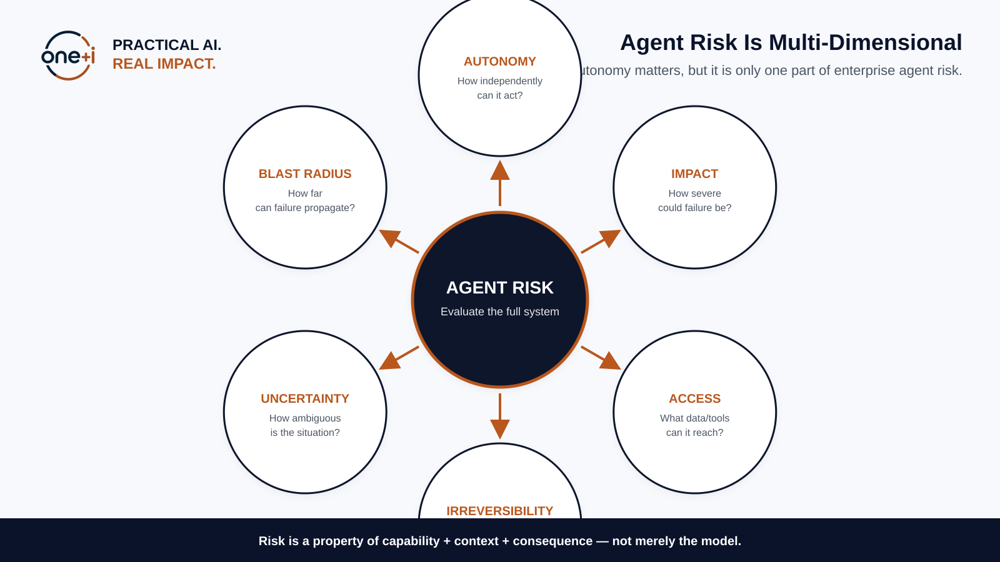
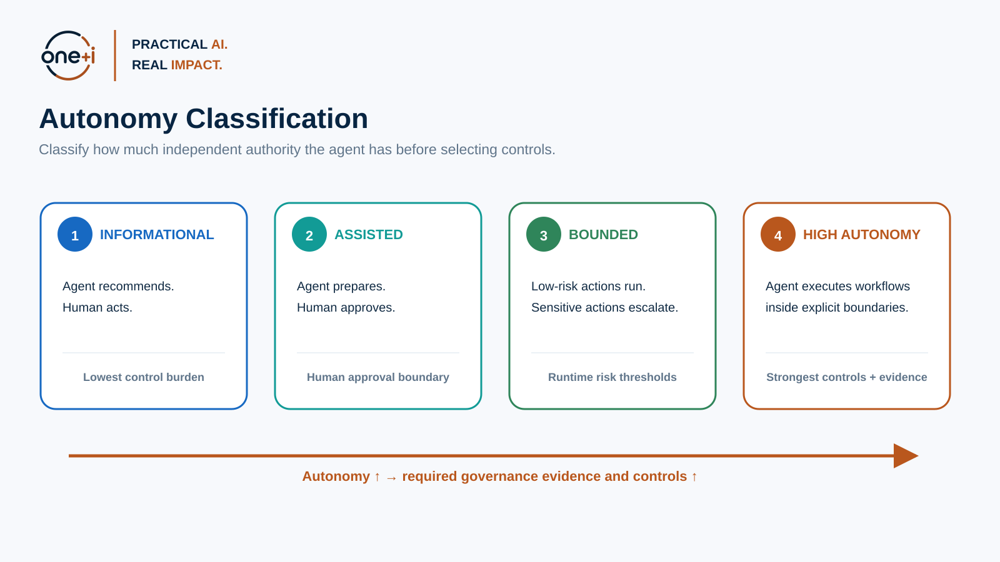
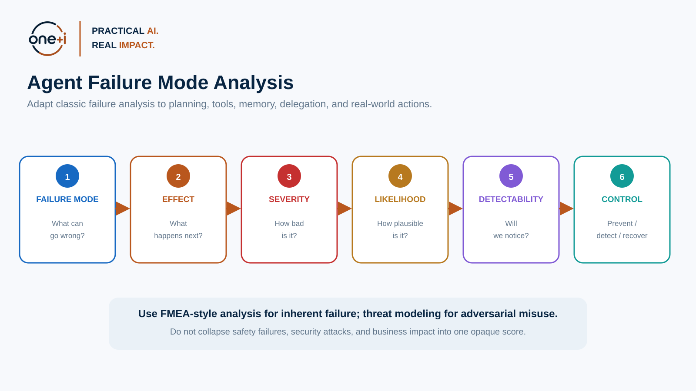
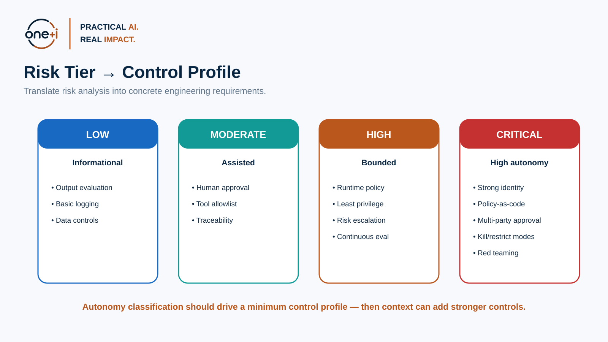

# Module 2 — Agent Risk Modeling & Autonomy Classification

> **Course:** Enterprise AI Agent Governance: From Principles to Runtime Control  
> **Audience:** AI engineers, architects, security engineers, governance practitioners, ML/LLM engineers, technical leads  
> **Recommended duration:** 4–5 hours theory + 3–4 hours practical lab  
> **Scenario:** Enterprise Procurement Agent

---

## Module thesis

After this module, a learner should be able to classify autonomy from observable
authority, build operational and adversarial risk scenarios with visible
dimensions and evidence, analyze downstream blast radius, translate inherent
risk into control requirements, and refuse to lower residual risk when control
claims are untested, stale, or irrelevant to the scenario.

## Prerequisites

- [Module 1 — From AI Governance to Agent Governance](../01-from-ai-governance-to-agent-governance/README.md).
- Basic Python, API, graph, and risk-register literacy.
- No cloud account, model credential, policy server, or production system is
  required. The canonical lab is deterministic and credential-free.

## Success criteria

You have completed the module when you can:

- explain why autonomy, impact, access, irreversibility, uncertainty, and scope
  must remain visible instead of being hidden behind one score;
- produce separate operational-failure and adversarial-misuse scenarios;
- report exact reachable, writable, severe, cross-zone, and delegated graph
  facts;
- distinguish inherent risk from residual risk without inventing control-
  effectiveness percentages; and
- connect every accepted risk reduction to current, scenario-specific evidence.

## Non-goals and boundaries

The lesson does not define a universal enterprise risk formula, legal
classification, or automatic deployment authority. Its tier rules are a
versioned teaching policy. Organizations must adapt thresholds to their risk
appetite, sector, obligations, affected people, assets, and evidence. A model may
suggest candidate scenarios; accountable humans and trusted governance systems
own classification, treatment, acceptance, and exceptions.

## Learning objectives

By the end of this module, you should be able to:

1. Build an **agent-specific risk model** that goes beyond model accuracy.
2. Classify an agent's **autonomy level** from informational to high autonomy.
3. Evaluate risk across **autonomy, impact, access, irreversibility, uncertainty, and blast radius**.
4. Distinguish **inherent failure risk** from **adversarial/security risk**.
5. Apply **FMEA-style failure analysis** to agent trajectories, tools, memory, and delegation.
6. Use **OWASP Agentic Security** and **MITRE ATLAS** to enrich threat scenarios.
7. Translate risk tiers into **minimum control profiles**.
8. Produce a defensible **risk register, autonomy classification, control recommendation, and evidence package**.
9. Understand why risk scoring should support decisions—not hide them behind a single number.

> **Core principle:** Do not classify an agent by what framework it uses. Classify it by what it can affect, how independently it can act, and how difficult failure is to contain.

---

# 1. Why agent risk modeling needs its own discipline

Traditional model risk often concentrates on questions such as:

- Is the model accurate?
- Is it robust?
- Is it biased?
- Can we explain outputs?
- Does it protect private information?

Those remain important.

An autonomous agent introduces additional questions:

- What systems can it reach?
- What tools can it invoke?
- Can it mutate state?
- Can it spend money?
- Can it communicate externally?
- Can it delegate to another agent?
- Can it retain memory?
- Can an action be reversed?
- Can failure propagate?
- Will a human see the decision before it executes?

The risk unit is therefore the **agent capability in context**, not just the model.



---

# 2. A practical agent-risk model

For this course, evaluate at least six dimensions.

## 2.1 Autonomy

**How independently can the agent choose and execute actions?**

Questions:

- Does it only recommend?
- Does it prepare actions?
- Can it execute without approval?
- Can it plan multi-step workflows?
- Can it create or delegate to sub-agents?
- Can it decide when the task is finished?

## 2.2 Impact

**What is the consequence of a wrong action?**

Consider:

- financial loss,
- customer harm,
- privacy,
- security,
- regulatory exposure,
- operational disruption,
- reputational damage,
- safety.

## 2.3 Access

**What can the agent reach?**

Examples:

- public information,
- internal documents,
- confidential customer data,
- production systems,
- payment tools,
- privileged administrative APIs,
- external communications.

## 2.4 Irreversibility

**How difficult is it to undo the action?**

Examples:

| Action | Reversibility |
|---|---|
| Search catalogue | Very high |
| Draft email | High |
| Send email | Medium |
| Create purchase order | Medium/Low |
| Delete production data | Low |
| Transfer funds | Low |
| Disclose secret externally | Effectively irreversible |

## 2.5 Uncertainty

Risk increases when the system is acting with:

- weak evidence,
- ambiguous intent,
- low confidence,
- unfamiliar situations,
- conflicting policies,
- incomplete data.

## 2.6 Blast radius

Ask:

> If this goes wrong once, how far can the damage propagate?

A bad recommendation may affect one user.

A compromised agent with administrative access may affect thousands of users or multiple systems.

---

# 3. Autonomy maturity model

A practical enterprise model is:



## Level 1 — Informational

Agent recommends. Human acts.

Typical controls:

- output evaluation,
- data governance,
- basic monitoring,
- source/citation controls.

## Level 2 — Assisted execution

Agent prepares an action. Human approves.

Add:

- explicit approval,
- tool schemas,
- audit evidence,
- identity context.

## Level 3 — Bounded autonomy

Agent executes low-risk actions within constraints.

Add:

- least privilege,
- runtime policy,
- authorization,
- risk thresholds,
- anomaly monitoring,
- continuous evaluation.

## Level 4 — High autonomy

Agent can plan and execute multi-step workflows within policy boundaries.

Add:

- strong workload identity,
- task-scoped permissions,
- policy-as-code,
- human escalation,
- containment modes,
- red teaming,
- continuous recertification,
- complete trajectories.

### Important

Autonomy is not the same as risk.

A highly autonomous sandbox agent can be lower risk than a moderately autonomous agent connected to a payment system.

Therefore:

> **Autonomy is a risk dimension, not the entire risk model.**

---

# 4. NIST AI RMF as the risk-management backbone

The NIST AI Risk Management Framework remains useful because it is system- and use-case-oriented rather than tied to one technology.

As of August 2026, NIST states that **AI RMF 1.0 is being revised**. Teach the durable risk-management concepts while tracking revisions.

Use the functions:

- **GOVERN**
- **MAP**
- **MEASURE**
- **MANAGE**

For risk modeling:

### MAP

Identify:

- intended use,
- foreseeable misuse,
- affected stakeholders,
- tools,
- data,
- privileges,
- dependencies,
- impacts.

### MEASURE

Estimate or test:

- task success,
- policy violations,
- attack success,
- autonomy rates,
- recovery,
- tool-selection accuracy,
- trajectory quality.

### MANAGE

Translate risk into:

- constraints,
- approval requirements,
- tool restrictions,
- evaluation gates,
- monitoring,
- incident response.

Primary sources:

- https://www.nist.gov/itl/ai-risk-management-framework
- https://airc.nist.gov/airmf-resources/airmf/
- https://www.nist.gov/publications/artificial-intelligence-risk-management-framework-generative-artificial-intelligence

---

# 5. ISO/IEC 23894 — AI risk-management guidance

**ISO/IEC 23894:2023** provides guidance for organizations developing, deploying, or using AI to integrate AI risk management into organizational activities.

Use it as an enterprise risk-management complement to NIST AI RMF.

Primary source:

https://www.iso.org/standard/77304.html

Useful lesson:

> Agent risk modeling should fit into the organization's existing risk process—not become an isolated AI-only spreadsheet.

---

# 6. Separate inherent failure from adversarial risk

Do not treat every failure as an attack.

## Inherent / operational risk

Examples:

- hallucinated vendor policy,
- wrong plan,
- wrong tool selection,
- malformed tool arguments,
- stale memory,
- workflow loop,
- incorrect confidence,
- missing approval.

## Adversarial risk

Examples:

- prompt injection,
- goal hijacking,
- tool poisoning,
- credential theft,
- privilege escalation,
- malicious MCP server,
- memory poisoning,
- data exfiltration.

NIST's **Adversarial Machine Learning: A Taxonomy and Terminology of Attacks and Mitigations (NIST AI 100-2e2025)** provides a current security taxonomy and explicitly separates adversarial concerns from inherent implementation/model errors.

Primary source:

https://csrc.nist.gov/pubs/ai/100/2/e2025/final

---

# 7. Agentic threat sources: OWASP + MITRE ATLAS

## OWASP Top 10 for Agentic Applications 2026

OWASP's agentic framework is useful for identifying risks unique to autonomous, tool-using systems.

Use it to ask:

- Can the goal be hijacked?
- Can a legitimate tool be misused?
- Can identity or privilege be abused?
- Can an agentic dependency be compromised?
- Can unsafe code execute?
- Can memory or context be poisoned?
- Can agent-to-agent trust be exploited?
- Can failure cascade?

Primary source:

https://genai.owasp.org/resource/owasp-top-10-for-agentic-applications-for-2026/

## MITRE ATLAS

MITRE ATLAS is a living knowledge base of adversary tactics and techniques against AI-enabled systems. Its current matrix includes **Agentic AI** as a filter/platform.

Use it to enrich:

- threat scenarios,
- attack paths,
- mitigations,
- red-team plans.

Primary source:

https://atlas.mitre.org/

---

# 8. FMEA-style failure analysis for agents

FMEA is especially useful for **non-adversarial failures**.



For each capability, ask:

1. **Failure mode** — What can fail?
2. **Effect** — What happens?
3. **Severity** — How bad is the consequence?
4. **Likelihood** — How plausible/frequent?
5. **Detectability** — Would controls notice before harm?
6. **Controls** — Prevent, detect, recover.

Classic Risk Priority Numbers often multiply ordinal ratings such as:

`Severity × Occurrence × Detectability`

Use caution: ordinal categories do not become measured probabilities merely
because they are multiplied. Different severity/occurrence/detectability vectors
can produce the same RPN while requiring different treatment. Treat RPN as an
**ordering aid**, retain the vector, and add explicit override rules for severe,
irreversible, broad, privileged, safety, or regulatory consequences.

For agent systems, keep the raw dimensions visible.

---

# 9. Trajectory-based risk analysis

Agent failures often emerge over several steps.

Example:

```text
User goal
  ↓
Retrieves supplier document
  ↓
Indirect prompt injection
  ↓
Agent changes plan
  ↓
Selects unapproved vendor
  ↓
Calls purchasing tool
  ↓
Creates binding order
```

The risky object is the **trajectory**, not one response.

Your risk register should therefore include:

- initiating condition,
- intermediate decisions,
- tools,
- policy boundaries,
- eventual impact,
- detection points,
- recovery points.

---

# 10. Blast-radius modeling

A useful enterprise pattern is to model the systems/resources reachable from an agent.

Represent the environment as a graph:

```text
Agent
 ├── Vendor DB
 ├── Email
 ├── Purchase API
 │     └── ERP
 │          └── Finance
 └── Research Agent
       └── Web
```

Risk rises when:

- the agent has many reachable systems,
- downstream resources are privileged,
- permissions propagate,
- write operations dominate read operations,
- access crosses trust zones.

The practical notebook uses **NetworkX** to report inspectable graph facts:

- exact reachable and writable assets;
- severe downstream assets;
- trust-zone crossings;
- delegated hops; and
- the delta after a capability or edge is removed.

This is more actionable than a normalized blast-radius decimal whose units and
denominator are difficult to defend.

---

# 11. Risk appetite and thresholds

A risk score is useless without an organizational decision.

Define:

- **acceptable**
- **acceptable with controls**
- **requires escalation**
- **prohibited**

Example:

| Risk tier | Decision |
|---|---|
| Low | Standard controls |
| Moderate | Human approval + monitoring |
| High | Runtime policy + least privilege + continuous eval |
| Critical | Restricted autonomy or prohibit until controls improve |

Risk appetite is a **business/governance decision**, not something the agent chooses.

---

# 12. Risk tier → control profile



A risk assessment should produce engineering requirements.

Treat higher-tier profiles as cumulative minimums: a critical capability still
needs the ownership, validation, telemetry, traceability, identity, and
authorization controls introduced at lower tiers.

Example:

### Low

- output evaluation,
- data controls,
- basic telemetry.

### Moderate

- explicit approval,
- tool allowlist,
- traceability.

### High

- external authorization,
- policy-as-code,
- least privilege,
- risk-based escalation,
- continuous evaluation.

### Critical

- reduce autonomy,
- multi-party approval,
- strong identity,
- isolated execution,
- red teaming,
- containment modes,
- continuous evidence.

---

# 13. Avoid common scoring mistakes

## Mistake 1 — One opaque score

A result such as `risk = 72` hides the reason.

Keep the underlying dimensions.

## Mistake 2 — False precision

Do not pretend `0.63` is objectively safer than `0.67`.

Use bands and expert judgment.

## Mistake 3 — Giving controls automatic credit

Assess both:

- **inherent risk** before controls,
- **residual risk** after controls.

But do not lower a dimension because a control is named in a spreadsheet. Bind
the claim to a scenario and dimension, then require current test or operational
evidence that covers the relevant failure. Documented design intent is useful,
but it is not operating-effectiveness proof.

## Mistake 4 — Scoring only the model

Include:

- identity,
- tools,
- memory,
- data,
- delegation,
- external systems.

## Mistake 5 — Ignoring cumulative risk

Ten small autonomous actions can create a high-impact workflow.

## Mistake 6 — Treating security risk as likelihood-only

A rare but catastrophic privilege-abuse path can still justify strong controls.

---

# 14. Enterprise risk register template

Each risk should include:

| Field | Purpose |
|---|---|
| Risk ID | Stable reference |
| Scenario | What can happen |
| Trigger | Initiating condition |
| Capability | Agent/tool involved |
| Impact | Consequence |
| Affected assets | Systems/data/people |
| Autonomy | Level |
| Severity | Consequence score |
| Likelihood | Plausibility |
| Detectability | Likelihood of detection |
| Blast radius | Reach |
| Inherent risk | Before controls |
| Existing controls | Prevent/detect/recover |
| Residual risk | After controls |
| Owner | Accountable team/person |
| Evidence | How control effectiveness is demonstrated |
| Treatment | Accept/reduce/transfer/avoid |
| Review date | Recertification |

---

# 15. Procurement-agent case study

Capabilities:

- search catalogues,
- read vendor records,
- email suppliers,
- create purchase orders,
- potentially issue payments.

Example risk scenarios:

1. Wrong vendor selected due to stale data.
2. Prompt injection from supplier content.
3. Purchase exceeds delegated budget.
4. Agent loops and creates duplicate orders.
5. Sub-agent inherits excessive privileges.
6. Memory stores an obsolete exception.
7. Payment tool is called without approval.
8. Procurement data leaks to an external service.

Learners should assess each scenario twice:

- **before controls**
- **after controls**

The second assessment may lower a dimension only when evidence supports the
specific mitigation claim. Otherwise residual risk remains equal to inherent
risk and the decision requests more evidence.

---

# 16. Practical lab and experiments

The canonical artifacts are:

- [`02_agent_risk_modeling_and_autonomy_classification.ipynb`](02_agent_risk_modeling_and_autonomy_classification.ipynb) — guided offline lab;
- [`lab.py`](lab.py) — reusable evidence-aware implementation; and
- [`tests/test_module02_risk_modeling.py`](../../../tests/test_module02_risk_modeling.py) — invariant tests.

Run them from the repository root:

```bash
make course-02
```

The lab compares an opaque weighted-average baseline with explicit decision
rules, classifies autonomy from observable authority, keeps risk dimensions and
assumptions visible, separates failures from attacks, measures graph reachability
with NetworkX, and demonstrates that documented, expired, or wrong-scenario
controls receive no residual-risk credit.

The labelled fixture reports its exact three-case denominator. Its 100% local
classification result proves only that the teaching rules match those three
labels; it is not evidence of production safety or generalization.

## 16.1 Technology and method landscape

| Need | Common method or tool | Strength | Limitation / selection criterion |
|---|---|---|---|
| Enterprise AI risk lifecycle | NIST AI RMF, ISO/IEC 23894 | Connects context, measurement, treatment, ownership, and review | Neither supplies one universal agent-risk score |
| Operational failure | FMEA, bow-tie analysis, STPA for safety constraints | Makes failure, cause, effect, prevention, detection, and recovery inspectable | RPNs can hide different risk shapes; STPA requires deeper system modeling |
| Adversarial threat | OWASP Agentic Top 10, MITRE ATLAS, NIST AI 100-2 | Current threat language, techniques, mitigations, and attack paths | Taxonomy mapping is not proof that a control works |
| Capability/dependency graph | NetworkX, architecture inventories, attack-graph platforms | Exact reachability and trust-zone analysis | Results are only as current as inventory and permission data |
| Structured risk artifacts | Pydantic, JSON Schema, governance systems of record | Repeatable validation and versionable records | Schema-valid inputs can still be unsupported or wrong |
| Adversarial validation | PyRIT and deterministic custom harnesses | Converts threats into executable tests with explicit targets and scorers | Oracles, datasets, and environments must be representative |
| Candidate discovery | LLM structured extraction | Accelerates scenario brainstorming | Model candidates remain untrusted and cannot accept risk |

Use the smallest combination that produces traceable decisions. Spreadsheets can
support workshops; code improves repeatability; graph tools reveal capability
paths; red-team harnesses test exploitability. No library replaces accountable
risk ownership.

---

# 17. Best practices

- Classify **capabilities**, not marketing labels.
- Keep raw risk dimensions visible.
- Separate inherent and residual risk.
- Model both accidental failure and adversarial misuse.
- Include reachable systems in blast-radius analysis.
- Use autonomy classification to drive minimum controls.
- Treat human approval as a control with its own failure modes.
- Reassess after tool/model/policy changes.
- Test risk assumptions with telemetry and red teaming.
- Increase autonomy only after evidence supports it.
- Keep internal risk tier, regulatory applicability, and business risk-acceptance
  decisions separate but linked.
- Version the methodology, graph snapshot, thresholds, evidence, exceptions, and
  review triggers.

---

# 18. State of the art — September 2026 snapshot

## Established practice

System risk management, least privilege, threat modeling, FMEA, separation of
duties, secure software practices, attack-surface analysis, release gates, and
incident response remain foundational. Agent systems extend these methods to
model-driven tool selection, long trajectories, memory, delegation, and
probabilistic behavior.

## Current agent-specific practice

OWASP's 2026 agentic list offers an operational starting point for agent goal
hijacking, tool misuse, privilege abuse, supply-chain compromise, memory/context
poisoning, insecure inter-agent behavior, and cascading failures. MITRE ATLAS is
a living knowledge base and currently exposes an Agentic AI platform filter,
including techniques for agent context/tool poisoning and tool invocation.

NIST AI 800-5 summarizes 2026 stakeholder input on agent security. It reports
broad agreement that existing cybersecurity principles remain relevant but need
adaptation, and highlights the need for measurement, implementation guidance,
information sharing, and standards. It is evidence about ecosystem needs—not a
complete risk methodology or control certification.

## Research frontier and open problems

Open problems include representative long-horizon risk datasets, calibrated
agent failure likelihoods, compositional risk across agents and tools,
authorization-aware attack graphs, human/agent coordination risk, drift and
recertification triggers, cross-organization evidence exchange, and measuring
whether autonomy produces enough value to justify added exposure and control
cost. These gaps are a reason to expose uncertainty, not to manufacture decimal
precision.

---

# 19. Knowledge check

1. Why is autonomy not equivalent to risk?
2. What does irreversibility capture that impact does not?
3. Why should security and inherent failures be analyzed separately?
4. What is blast radius?
5. Why can a single numeric risk score be misleading?
6. What is the difference between inherent and residual risk?
7. When is FMEA useful for agents?
8. How do OWASP Agentic Security and MITRE ATLAS complement FMEA?
9. What should happen when an agent moves from assisted to bounded autonomy?
10. What evidence would justify lowering a risk tier?

---

# 20. Practitioner assignment

For one enterprise agent:

1. Build a capability inventory.
2. Assign an autonomy level.
3. Rate the risk dimensions and document evidence, assumptions, and uncertainty.
4. Build 10 failure scenarios.
5. Add 5 adversarial scenarios.
6. Perform FMEA on the top 5 inherent failures.
7. Build a blast-radius graph.
8. Assign an inherent risk tier using explicit, versioned decision rules.
9. Add current/planned controls.
10. Reassess residual risk only for evidence-backed mitigation claims.
11. Generate a minimum control profile.
12. Define evidence required for approval.

---

# 21. Primary references

1. NIST AI Risk Management Framework  
   https://www.nist.gov/itl/ai-risk-management-framework

2. NIST AI RMF Core / AIRC  
   https://airc.nist.gov/airmf-resources/airmf/

3. NIST Generative AI Profile (NIST AI 600-1)  
   https://www.nist.gov/publications/artificial-intelligence-risk-management-framework-generative-artificial-intelligence

4. ISO/IEC 23894:2023 — AI risk management  
   https://www.iso.org/standard/77304.html

5. NIST AI 100-2e2025 — Adversarial Machine Learning taxonomy  
   https://csrc.nist.gov/pubs/ai/100/2/e2025/final

6. OWASP Top 10 for Agentic Applications 2026  
   https://genai.owasp.org/resource/owasp-top-10-for-agentic-applications-for-2026/

7. OWASP Agentic Security Initiative  
   https://genai.owasp.org/initiatives/agentic-security-initiative/

8. MITRE ATLAS  
   https://atlas.mitre.org/

9. PyRIT Scoring  
   https://azure.github.io/PyRIT/

10. NIST AI 800-5 — Summary Analysis of Responses Regarding Security Considerations for AI Agents
    https://www.nist.gov/publications/summary-analysis-responses-request-information-regarding-security-considerations-ai

11. NetworkX documentation
    https://networkx.org/documentation/stable/

---

# 22. Next module

## Module 3 — Standards, Regulation & Governance Operating Model

The next module turns risk classification into an enterprise operating model:

**Inventory → Ownership → Risk Tier → Controls → Approval → Evidence → Monitoring → Recertification**
