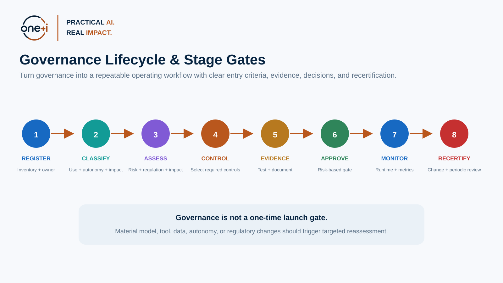
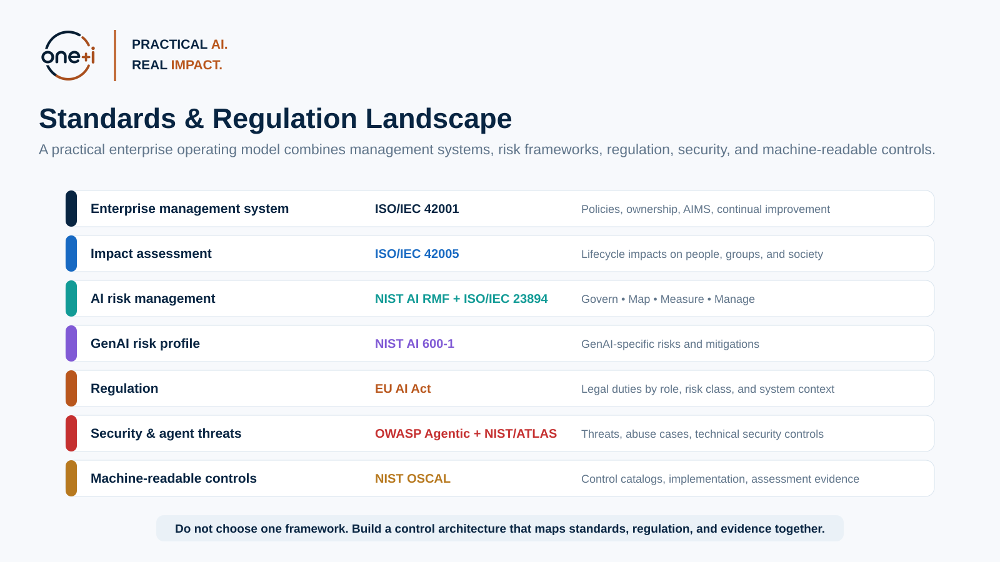
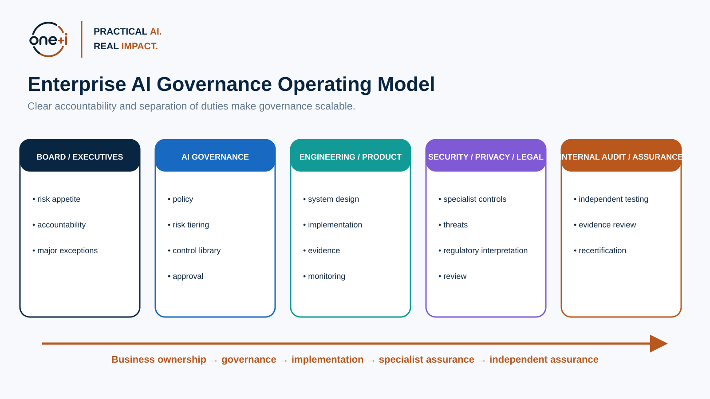
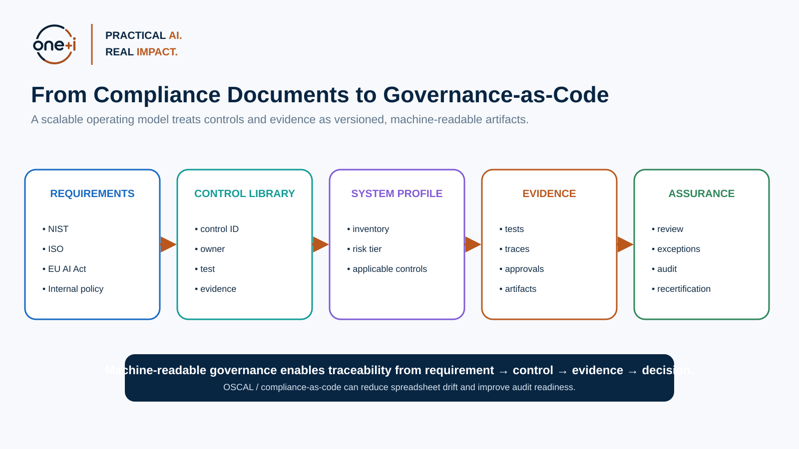

# Module 3 — Standards, Regulation & Governance Operating Model

> **Course:** Enterprise AI Agent Governance: From Principles to Runtime Control  
> **Audience:** AI governance leads, architects, AI engineers, security/privacy teams, legal/compliance partners, model risk teams, internal audit, technical leaders  
> **Recommended duration:** 5–6 hours theory + 3–4 hours practical lab  
> **Scenario:** Enterprise Procurement Agent  
> **Important:** This module is educational and technical. It is **not legal advice**.

---

## Learning objectives

By the end of this module, you should be able to:

1. Explain the different roles of **NIST AI RMF, NIST GenAI Profile, ISO/IEC 42001, ISO/IEC 42005, ISO/IEC 23894, the EU AI Act, OWASP Agentic Security, and NIST OSCAL**.
2. Build an enterprise governance operating model that connects **business ownership, governance, engineering, security/privacy/legal, and assurance**.
3. Create an **AI/agent system inventory** suitable for risk classification and audit.
4. Map standards and regulatory requirements into a reusable **control library**.
5. Build a **RACI / accountability model**.
6. Design **risk-based governance stage gates** rather than one universal approval process.
7. Define **evidence requirements** for each control.
8. Use **change triggers and periodic recertification** to keep governance current.
9. Understand the current 2026 EU AI Act implementation timeline at a high level and separate **legal applicability analysis** from internal engineering controls.
10. Use **OSCAL and compliance-as-code** concepts to make controls more machine-readable, versionable, and auditable.
11. Produce a practical governance package for the Procurement Agent: inventory, applicability profile, control crosswalk, RACI, approval record, exception log, and evidence plan.

> **Core principle:** Standards define expectations. An operating model turns those expectations into ownership, controls, evidence, decisions, and continuous governance.

---

# 1. Why enterprises need an operating model

A governance framework alone does not govern an AI system.

A policy document does not:

- register an agent,
- identify its owner,
- classify its autonomy,
- determine which controls apply,
- collect evidence,
- block a high-risk release,
- assign an exception,
- recertify the system after a material change.

An enterprise operating model translates governance concepts into a **repeatable system of work**.

A practical governance loop is:

```text
Register
  ↓
Classify
  ↓
Assess
  ↓
Select Controls
  ↓
Implement
  ↓
Collect Evidence
  ↓
Approve / Reject / Exception
  ↓
Monitor
  ↓
Reassess / Recertify
```



---

# 2. Standards and regulation solve different problems

Do not treat every framework as interchangeable.



## NIST AI Risk Management Framework

NIST AI RMF is a voluntary, cross-sector risk-management framework structured around:

- **GOVERN**
- **MAP**
- **MEASURE**
- **MANAGE**

As of August 2026, NIST states that **AI RMF 1.0 is being revised**.

Use it for:

- risk reasoning,
- governance outcomes,
- lifecycle risk management,
- organizational roles,
- measurement and treatment.

Primary source:

https://www.nist.gov/itl/ai-risk-management-framework

## NIST Generative AI Profile — NIST AI 600-1

Use the GenAI Profile to extend AI RMF with risks and actions that are especially relevant to generative AI.

Primary source:

https://www.nist.gov/publications/artificial-intelligence-risk-management-framework-generative-artificial-intelligence

## ISO/IEC 42001:2023

ISO/IEC 42001 specifies requirements for establishing, implementing, maintaining, and continually improving an **Artificial Intelligence Management System (AIMS)**.

ISO describes it as an organization-wide management system using a Plan-Do-Check-Act approach.

Use it for:

- governance structure,
- accountability,
- policies/objectives,
- lifecycle processes,
- risk/opportunity management,
- continual improvement,
- management-system assurance.

Primary source:

https://www.iso.org/standard/42001

## ISO/IEC 42005:2025

ISO/IEC 42005 provides guidance for **AI system impact assessment** across the lifecycle, focusing on impacts on individuals, groups, and society.

Use it when a technical risk register is not enough and you need to examine broader impacts.

Primary source:

https://www.iso.org/standard/42005

## ISO/IEC 23894:2023

ISO/IEC 23894 provides guidance on AI-related risk management.

Use it to integrate AI risk into broader organizational risk-management practices.

Primary source:

https://www.iso.org/standard/77304.html

## OWASP Agentic Security

Use OWASP for practical agentic threat categories, abuse cases, and security controls.

Primary source:

https://genai.owasp.org/initiatives/agentic-security-initiative/

## NIST OSCAL

OSCAL is a NIST-led initiative for machine-readable control-based information using JSON, YAML, and XML.

NIST describes uses including:

- machine-readable control catalogs,
- control baselines,
- system implementation information,
- assessment plans/results,
- automation of control monitoring and assessment.

Primary source:

https://pages.nist.gov/OSCAL/

---

# 3. Current EU AI Act context — August 2026

The EU AI Act is **law**, not merely a best-practice framework.

For an enterprise course, teach two distinct questions:

### Regulatory applicability

- Is the organization a provider, deployer, importer, distributor, or another relevant role?
- Does the system fall into a prohibited, high-risk, transparency, GPAI, or other category?
- Which jurisdiction and dates apply?
- Which documentation, quality, monitoring, transparency, oversight, or conformity obligations apply?

### Internal control implementation

- Which technical and process controls will the organization use to meet those duties?
- What evidence proves the control operates?

Do not confuse the legal classification with the internal risk tier.

## Current high-level timeline

According to the European Commission's current 2026 implementation guidance:

- prohibited practices, definitions, and AI literacy provisions have applied since **2 February 2025**;
- governance rules and GPAI obligations became applicable on **2 August 2025**;
- following the 2026 AI Omnibus, rules for certain high-risk AI systems are scheduled for **2 December 2027**;
- rules for high-risk AI embedded in regulated physical products are scheduled for **2 August 2028**.

The regulatory landscape continues to evolve. Always verify the current European Commission guidance before using dates operationally.

Primary sources:

- https://digital-strategy.ec.europa.eu/en/faqs/navigating-ai-act
- https://digital-strategy.ec.europa.eu/en/policies/ai-act-governance-and-enforcement
- https://digital-strategy.ec.europa.eu/en/policies/ai-act-standardisation

### Practical lesson

A governance system needs to store:

```text
internal risk tier
+
regulatory applicability
+
standards/control profile
```

as separate but connected fields.

---

# 4. Build a governance operating model, not a governance committee

A scalable operating model has clear layers.



## Board / executive accountability

Responsibilities:

- define AI risk appetite,
- approve major policy,
- assign accountable executives,
- approve material exceptions.

## AI governance function

Responsibilities:

- maintain AI policy,
- define risk methodology,
- maintain control library,
- manage inventory,
- coordinate governance decisions,
- maintain evidence requirements.

## Business / product owner

Responsibilities:

- own purpose and business outcome,
- identify affected users,
- accept business risk,
- fund controls,
- maintain use-case validity.

## AI engineering / platform

Responsibilities:

- implement architecture and controls,
- maintain technical evidence,
- instrument monitoring,
- manage models/tools/data.

## Security / privacy / legal / compliance

Responsibilities vary by system:

- security threat modeling,
- privacy assessment,
- regulatory interpretation,
- data governance,
- contractual/supplier controls.

## Independent assurance / audit

Responsibilities:

- independently evaluate process/control effectiveness,
- test evidence,
- challenge assumptions,
- support certification or audit.

---

# 5. Three lines of accountability — adapted pragmatically

Many enterprises use a three-lines model.

A practical AI interpretation:

### First line — builders and owners

They own and operate the system.

They do **not** outsource risk ownership to the governance team.

### Second line — governance, risk, security, privacy, compliance

They define/challenge policy and risk expectations, provide specialist oversight, and monitor adherence.

### Third line — internal audit / independent assurance

They independently assess whether governance and controls work as intended.

Avoid one common failure:

> The AI governance team becomes the owner of every AI risk.

That weakens accountability.

---

# 6. The AI / Agent System Inventory

You cannot govern what you cannot identify.

An enterprise inventory should capture more than:

```text
Name: Procurement Agent
Model: GPT-X
```

Recommended fields:

## Ownership

- system ID
- business owner
- technical owner
- governance owner
- support team

## Purpose

- intended use
- users
- affected parties
- prohibited/out-of-scope use

## Technical architecture

- models
- agent framework
- retrieval sources
- memory
- tools/APIs
- sub-agents
- deployment environment

## Authority

- autonomy level
- agent identity
- delegated authority
- write capabilities
- financial limits
- human approval requirements

## Data

- data classifications
- personal/sensitive data
- data residency
- external transfers

## Risk

- internal risk tier
- impact assessment
- threat model
- residual risk

## Regulation

- jurisdictions
- organization role
- AI Act applicability
- sector obligations

## Lifecycle

- version
- approval status
- approval date
- next review
- material-change triggers
- incidents/exceptions

---

# 7. Control libraries

A control library turns abstract requirements into reusable expectations.

Example:

```yaml
control_id: AG-AUTH-001
title: Runtime authorization for state-changing tools
objective: >
  Prevent an agent from executing a state-changing capability
  outside delegated authority.
applies_when:
  - agent_can_mutate_state
implementation_examples:
  - policy_engine
  - task_scoped_authorization
evidence:
  - policy_test_results
  - denied_action_trace
owner: security_architecture
```

A mature control should define:

- stable ID,
- objective,
- applicability,
- implementation guidance,
- test method,
- evidence,
- frequency,
- owner,
- mapped standards/regulations.

---

# 8. Control crosswalks

Crosswalks reduce duplicate work.

One internal control may support several frameworks.

Example:

| Internal control | NIST AI RMF | ISO 42001 theme | EU AI Act concern |
|---|---|---|---|
| Agent inventory | GOVERN | Context / system governance | documentation / role identification |
| Risk assessment | MAP/MANAGE | risk management | risk-management obligations |
| Human oversight | GOVERN/MANAGE | operational control | human oversight |
| Traceability | MEASURE | monitoring/evidence | record keeping |
| Runtime authorization | MANAGE | operational control | security / control effectiveness |

**Important:** A crosswalk is an engineering/governance aid. It is not a legal opinion that one control automatically establishes regulatory compliance.

---

# 9. Governance stage gates

Do not use one approval process for every AI system.

Suggested lifecycle:

## Gate 0 — Intake

Minimum:

- owner,
- purpose,
- architecture sketch,
- initial autonomy.

## Gate 1 — Classification

Determine:

- internal risk tier,
- impact-assessment need,
- regulatory review need,
- agent/autonomy profile.

## Gate 2 — Design review

Validate:

- control architecture,
- security/privacy design,
- human oversight,
- data/tool boundaries.

## Gate 3 — Pre-production assurance

Require:

- evaluation results,
- policy tests,
- security tests,
- evidence completeness,
- open-risk acceptance.

## Gate 4 — Production approval

Decision:

```text
APPROVE
APPROVE_WITH_CONDITIONS
REJECT
EXCEPTION_REQUIRED
```

## Gate 5 — Ongoing governance

Monitor:

- incidents,
- policy violations,
- drift,
- autonomy,
- cost,
- security findings,
- control failures.

---

# 10. RACI for agent governance

A RACI prevents invisible ownership gaps.

Example:

| Activity | Business Owner | AI Eng | AI Governance | Security | Legal/Privacy | Audit |
|---|---|---|---|---|---|---|
| Define purpose | A/R | C | C | I | C | I |
| Architecture | C | A/R | C | C | I | I |
| Risk classification | A | C | R | C | C | I |
| Security threat model | I | C | C | A/R | I | I |
| Production approval | A | C | R | C | C | I |
| Runtime monitoring | A | R | C | C | I | I |
| Independent assurance | I | I | I | I | I | A/R |

Tailor this to organizational structure.

---

# 11. Exceptions and risk acceptance

Not every control gap blocks deployment.

But exceptions must be explicit.

An exception should contain:

- missing control,
- rationale,
- risk,
- compensating control,
- accountable risk accepter,
- expiration date,
- remediation plan,
- evidence,
- review trigger.

Never allow:

```text
“temporary exception”
```

to silently become permanent architecture.

---

# 12. Change management and recertification

A system may remain approved while its risk changes underneath it.

Material-change triggers can include:

- new model,
- materially different model version,
- new tool/API,
- new data class,
- new country/jurisdiction,
- new autonomy,
- new memory,
- new agent delegation,
- higher transaction limit,
- new affected user population,
- major incident,
- material evaluation regression.

Use risk-based reassessment:

```text
Small change → targeted regression
Major capability change → partial/full recertification
```

---

# 13. Evidence as a first-class artifact

A control without evidence is difficult to assure.

Evidence examples:

### Design evidence

- architecture,
- data-flow diagram,
- threat model,
- impact assessment.

### Implementation evidence

- policy files,
- IaC configuration,
- access-control model,
- tool registry.

### Test evidence

- evaluation report,
- red-team findings,
- policy tests,
- authorization tests.

### Runtime evidence

- traces,
- policy decisions,
- approval records,
- incidents,
- monitoring metrics.

### Governance evidence

- approval decision,
- exceptions,
- RACI,
- control attestations,
- recertification record.

---

# 14. Governance-as-code and OSCAL



NIST OSCAL provides machine-readable formats for control catalogs, profiles, implementation descriptions, and assessment information.

It is especially relevant when governance content currently lives across:

- spreadsheets,
- Word documents,
- tickets,
- wikis,
- email approvals.

OSCAL can help create a standards-based representation that tools can exchange.

## Compliance Trestle

The OSCAL Compass **compliance-trestle** project is an actively developed open-source compliance-as-code platform.

Its current v4 line supports OSCAL 1.2.1 and Git/CI-oriented compliance artifact workflows.

Project:

https://github.com/oscal-compass/compliance-trestle

Install:

```bash
pip install compliance-trestle
```

Trestle is useful for:

- OSCAL document management,
- schema validation,
- human-friendly Markdown authoring,
- Git workflows,
- CI/CD integration.

### Important

Do not force every AI governance concept directly into a security-control schema.

Use OSCAL where structured control/evidence exchange adds value, while maintaining AI-specific inventory and risk metadata where needed.

---

# 15. Governance metrics

Useful operating-model metrics include:

## Inventory

- % systems registered,
- % with named owner,
- % with current risk tier.

## Review efficiency

- median time to approval,
- backlog,
- % requiring rework.

## Control health

- evidence completeness,
- overdue tests,
- open high-risk findings,
- exception age.

## Runtime governance

- policy violations,
- escalations,
- unauthorized action attempts,
- autonomy rate,
- incidents.

## Recertification

- overdue reviews,
- systems changed without reassessment,
- exception expirations.

Avoid optimizing only for:

> “number of approved AI use cases.”

Fast approval with weak evidence is not mature governance.

---

# 16. Practical enterprise scenario

For the Procurement Agent, the module produces:

1. system inventory record,
2. owner/RACI,
3. autonomy and internal risk tier,
4. simplified regulatory applicability record,
5. control profile,
6. framework crosswalk,
7. evidence plan,
8. gate decision,
9. exception record,
10. recertification triggers.

The practical notebook implements these artifacts as structured data.

---

# 17. Practical notebook specification

Notebook:

`03_standards_regulation_governance_operating_model.ipynb`

Libraries/tools:

- **Pydantic** — typed inventory/control/evidence artifacts
- **pandas** — crosswalks and governance dashboards
- **NetworkX** — dependency / responsibility analysis
- **jsonschema** — governance artifact validation
- **Compliance Trestle / OSCAL** — optional compliance-as-code workflow
- **Jinja2** — evidence/approval pack generation
- **OpenAI SDK** — optional structured extraction from architecture descriptions

Lab outcomes:

- AI inventory,
- applicability classifier,
- RACI,
- control library,
- standard/regulatory crosswalk,
- stage-gate decision,
- exception process,
- material-change detector,
- evidence completeness score,
- machine-readable export.

---

# 18. Best practices

- Separate **legal applicability** from internal risk classification.
- Store both in the governance record.
- Make the business owner accountable for purpose and risk.
- Reuse controls through a central library.
- Use specialist reviews only when triggered by risk.
- Keep control evidence versioned.
- Make exceptions expire.
- Trigger reassessment on material change.
- Move from documents toward structured governance artifacts.
- Treat regulation as changing input: verify dates and guidance continuously.
- Do not claim that a framework mapping automatically equals legal compliance.

---

# 19. Anti-patterns

## Framework shopping

> “Which one framework covers everything?”

None does.

## Spreadsheet-only governance

Works at small scale; becomes difficult to version, crosswalk, and audit.

## Governance owns the product risk

Business/system owners should remain accountable.

## Same approval for every system

Creates both bottlenecks and under-governance.

## Evidence collected at audit time

Evidence should be produced by engineering and runtime processes continuously.

## Permanent exceptions

Every exception needs owner, expiration, and remediation.

## Regulation hard-coded forever

Regulatory dates, standards, and guidance evolve.

---

# 20. Primary references

## NIST

- AI RMF: https://www.nist.gov/itl/ai-risk-management-framework
- AI Resource Center: https://airc.nist.gov/
- GenAI Profile: https://www.nist.gov/publications/artificial-intelligence-risk-management-framework-generative-artificial-intelligence
- OSCAL: https://pages.nist.gov/OSCAL/

## ISO

- ISO/IEC 42001:2023: https://www.iso.org/standard/42001
- ISO/IEC 42005:2025: https://www.iso.org/standard/42005
- ISO/IEC 23894:2023: https://www.iso.org/standard/77304.html

## EU

- AI Act navigation FAQ: https://digital-strategy.ec.europa.eu/en/faqs/navigating-ai-act
- Governance/enforcement: https://digital-strategy.ec.europa.eu/en/policies/ai-act-governance-and-enforcement
- Standardisation: https://digital-strategy.ec.europa.eu/en/policies/ai-act-standardisation

## Agent security

- OWASP Agentic Security Initiative: https://genai.owasp.org/initiatives/agentic-security-initiative/

## Compliance-as-code

- OSCAL: https://pages.nist.gov/OSCAL/
- Compliance Trestle: https://github.com/oscal-compass/compliance-trestle

---

# 21. Next module

## Module 4 — Agent Identity & Delegated Authority

The next module moves from governance organization to technical identity:

```text
Human identity
  ↓
Delegated authority
  ↓
Agent identity
  ↓
Task scope
  ↓
Resource/tool access
  ↓
Revocation + audit
```
