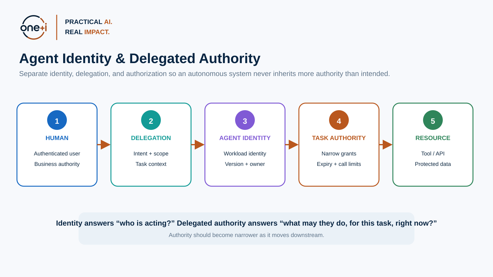
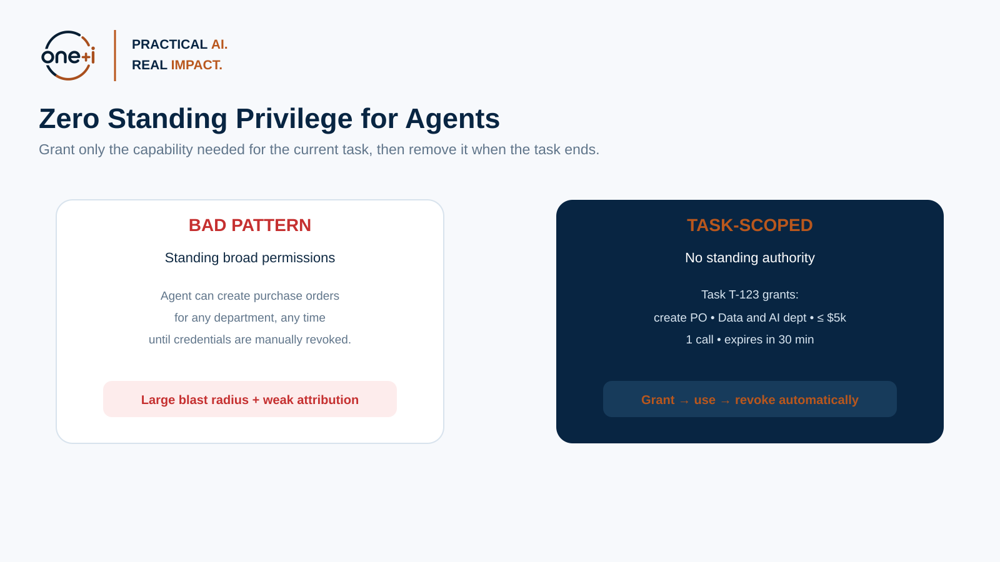
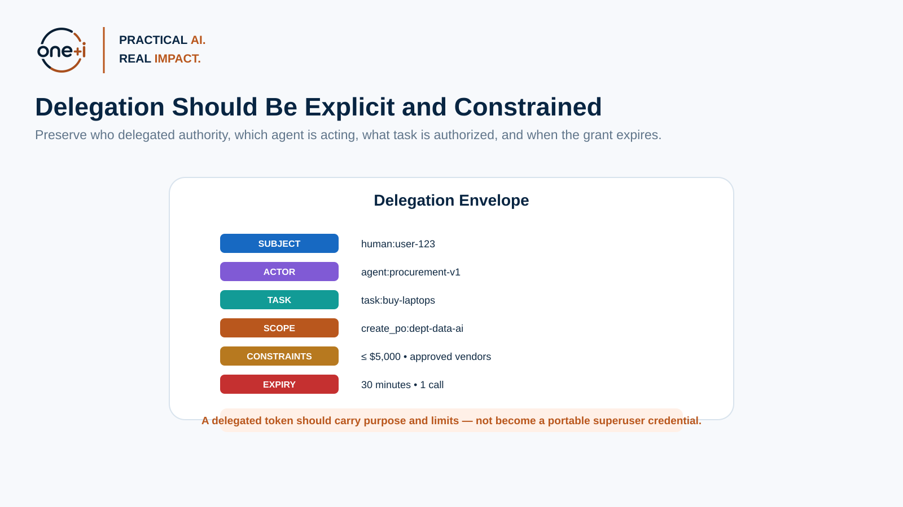
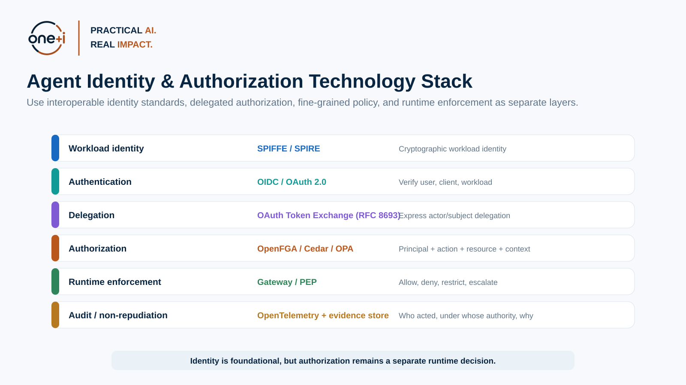

# Module 4 — Agent Identity & Delegated Authority

> **Course:** Enterprise AI Agent Governance: From Principles to Runtime Control  
> **Audience:** AI engineers, IAM/security engineers, cloud architects, platform teams, agent developers, governance practitioners  
> **Recommended duration:** 5–6 hours theory + 4 hours practical lab  
> **Scenario:** Enterprise Procurement Agent

---

## Learning objectives

By the end of this module, you should be able to:

1. Distinguish **human identity, agent identity, workload identity, delegation, and authorization**.
2. Explain why an agent should not reuse a human's broad access token or a shared service account.
3. Design an explicit **authority chain** from user → agent → task → sub-agent/tool.
4. Apply **least privilege, zero standing privilege, task-scoped authorization, expiry, call limits, audience restriction, and revocation**.
5. Understand current NIST work on **software and AI agent identity and authorization**.
6. Explain the role of **SPIFFE/SPIRE** for workload identity.
7. Explain how **OAuth 2.0 Token Exchange (RFC 8693)** supports delegation and impersonation patterns.
8. Apply current OAuth security guidance from **RFC 9700**.
9. Compare **OpenFGA, Cedar, OPA, Amazon Verified Permissions, and AgentCore Policy**.
10. Implement a signed **delegation envelope** and validate identity, task, resource, audience, expiry, and call limits.
11. Model **task-scoped authorization** and narrower sub-agent delegation.
12. Produce auditable identity/delegation evidence.

> **Core principle:** Authentication tells us who the actor is. Authorization decides what that actor may do under the current delegated authority.

---

# 1. Why agent identity is now a governance problem

Traditional enterprise systems already distinguish human identities, service identities, and workloads.

Agentic AI combines several of them:

```text
Human intent
  ↓
Agent identity
  ↓
Workload identity
  ↓
Delegated task authority
  ↓
Tool / API action
```

An enterprise needs to reconstruct:

- which human or business process initiated the task,
- which agent/version acted,
- which workload executed it,
- which authority was delegated,
- which resource and action were authorized,
- whether the grant was still valid,
- whether a sub-agent inherited more access than intended.

NIST's 2026 concept paper on agent identity and authorization explicitly highlights **identification, authorization, auditing, non-repudiation, and prompt-injection controls** for software and AI agents.

Primary reading:

- https://www.nist.gov/news-events/news/2026/02/new-concept-paper-identity-and-authority-software-agents
- https://csrc.nist.gov/pubs/other/2026/02/05/accelerating-the-adoption-of-software-and-ai-agent/ipd
- https://www.nist.gov/artificial-intelligence/ai-agent-standards-initiative



---

# 2. Identity, authentication, delegation, and authorization are different

## Identity

A stable identifier for an actor.

Examples:

```text
human:user-123
agent:procurement-v1
spiffe://enterprise.example/prod/procurement-agent
```

## Authentication

Evidence that an actor really controls the claimed identity.

Examples:

- OIDC login,
- mTLS certificate,
- SPIFFE X.509-SVID,
- JWT-SVID,
- signed client assertion.

## Delegation

A principal grants another actor constrained authority to act on its behalf.

Example:

```text
User
  ↓ delegates
Procurement Agent
  ↓ may
Create one PO
  ↓ constrained to
Data & AI department
Approved vendors
Maximum $5,000
30-minute lifetime
```

## Authorization

A runtime decision:

> Can this principal perform this action on this resource in this context?

Cedar expresses this as:

**Principal + Action + Resource + Context**

OpenFGA models authorization through relationships, tasks, tuples, and conditions.

---

# 3. Identity is not authorization

Knowing:

```text
agent = procurement-v1
```

does not answer:

```text
May procurement-v1 create a $25,000 purchase order?
```

Authorization may depend on:

- delegating user,
- task,
- department,
- resource,
- vendor,
- amount,
- time,
- risk level,
- approval state.

> **Identity is input to authorization, not a substitute for authorization.**

---

# 4. Preserve the authority chain

A safe enterprise pattern is:


Each hop should preserve:

- subject/delegator,
- agent identity,
- workload identity,
- task,
- permissions,
- resources,
- limits,
- expiry,
- provenance.

Authority should normally become **narrower downstream**.

---

# 5. Workload identity with SPIFFE / SPIRE

SPIFFE defines standards for portable workload identity.

Core concepts:

- **SPIFFE ID** — workload identity name,
- **SVID** — verifiable identity document,
- **Workload API** — runtime mechanism for workloads to obtain identity.

SPIRE is a production-ready implementation that performs workload/node attestation and issues SVIDs.

Primary sources:

- https://spiffe.io/docs/latest/spiffe-specs/spiffe/
- https://spiffe.io/docs/latest/spiffe-specs/spiffe_workload_api/
- https://spiffe.io/docs/latest/spire-about/spire-concepts/

A workload identity can prove:

> This request came from the attested procurement-agent workload.

It still does not prove:

> This workload is allowed to spend $25,000.

That second question belongs to authorization.

---

# 6. Avoid broad human-token forwarding

A common shortcut is:

> Give the agent the user's access token.

Problems:

- excessive scope,
- long lifetime,
- weak attribution,
- unsafe reuse,
- difficult revocation,
- sub-agent leakage,
- confused-deputy risk.

A better pattern derives narrower authority for the agent/task.



---

# 7. OAuth 2.0 Token Exchange — RFC 8693

RFC 8693 defines a Security Token Service pattern for exchanging one token for another and explicitly supports **impersonation and delegation**.

Conceptually:

```text
User token
+
Agent identity
   ↓
Authorization Server / STS
   ↓
Narrow task token
```

A new token can be restricted by:

- audience,
- scope,
- lifetime,
- downstream service,
- actor/subject relationship.

Primary source:

https://datatracker.ietf.org/doc/rfc8693/

The practical lesson is **authority attenuation**: derive less authority than the original principal holds.

---

# 8. OAuth security — RFC 9700

RFC 9700 is the current IETF Best Current Practice for OAuth 2.0 Security.

Agent systems should pay particular attention to:

- token leakage,
- audience confusion,
- bearer-token misuse,
- short-lived access,
- secure redirect/client patterns where relevant,
- sender-constrained token strategies where appropriate,
- deprecated/insecure OAuth patterns.

Primary source:

https://datatracker.ietf.org/doc/rfc9700/

---

# 9. Task-scoped authorization

OpenFGA's current guidance includes task-based authorization for agents.

Pattern:

1. agent has no standing permissions,
2. create a task,
3. associate required resource permissions with the task,
4. assign the agent to the task,
5. check access in task context,
6. delete task-related tuples after completion.

For sub-agents, OpenFGA documents two patterns:

- share the task,
- create a **narrower task**.

Primary source:

https://openfga.dev/docs/modeling/agents/task-based-authorization


---

# 10. Delegation envelope

A useful application abstraction is:



Example:

```json
{
  "subject": "human:user-123",
  "actor": "agent:procurement-v1",
  "workload": "spiffe://enterprise.example/prod/procurement-agent",
  "task": "task-123",
  "audience": "procurement-api",
  "permissions": ["purchase_order:create"],
  "resources": ["department:data-ai"],
  "constraints": {
    "max_amount": 5000,
    "approved_vendors": ["vendor-acme"],
    "max_calls": 1
  },
  "expires_at": "..."
}
```

This is useful as a mental/application model.

For production, use a standards-based identity provider / STS and external authorization system rather than inventing a proprietary security-token protocol.

---

# 11. Sub-agent authority attenuation

Suppose the Procurement Agent can:

```text
vendor:read
purchase_order:create
supplier:email
```

A Research Agent only needs:

```text
vendor:read
```

The child grant should be a **subset**.

Never let delegation accidentally amplify privilege.

---

# 12. OpenFGA

OpenFGA is a fine-grained authorization system inspired by Zanzibar.

Its current documentation includes:

- agents as principals,
- task-based authorization,
- delegated permissions,
- contextual tuples,
- conditions,
- cleanup/revocation after task completion.

Python SDK:

```bash
pip install openfga_sdk
```

Official docs:

- https://openfga.dev/docs/modeling/agents
- https://openfga.dev/docs/modeling/agents/task-based-authorization
- https://openfga.dev/docs/getting-started/install-sdk

OpenFGA is particularly useful for relationship-rich questions:

> Is this agent assigned to this task, and does the task grant access to this resource?

---

# 13. Cedar

Cedar is an authorization policy language designed around:

```text
Principal
Action
Resource
Context
```

It supports fine-grained policy decisions and separates authorization logic from application logic.

Primary sources:

- https://cedarpolicy.com/
- https://docs.cedarpolicy.com/
- https://docs.cedarpolicy.com/auth/authorization.html

Example:

```cedar
permit (
  principal == Agent::"procurement-v1",
  action == Action::"CreatePurchaseOrder",
  resource
)
when {
  context.task == "task-123" &&
  context.amount <= 5000 &&
  context.vendorApproved == true
};
```

---

# 14. Amazon Verified Permissions and AgentCore Policy

Amazon Verified Permissions is a managed authorization service using Cedar.

AgentCore Policy also uses Cedar for runtime agent/tool policy evaluation.

These are useful concrete enterprise examples of:

```text
Agent proposes tool call
  ↓
Policy Enforcement Point
  ↓
Authorization engine
  ↓
ALLOW / DENY
```

Sources:

- https://docs.aws.amazon.com/verifiedpermissions/
- https://docs.aws.amazon.com/bedrock-agentcore/latest/devguide/policy.html
- https://docs.aws.amazon.com/bedrock-agentcore/latest/devguide/policy-create-policies.html

---

# 15. OpenFGA vs Cedar vs OPA

| Technology | Strong fit |
|---|---|
| OpenFGA | relationships, delegated tasks, resource membership |
| Cedar | principal/action/resource/context authorization |
| OPA/Rego | broad general policy evaluation |

They can be layered.

Example:

```text
OpenFGA:
Is this agent assigned to Task T?

Cedar:
May this assigned agent create this PO for this amount/vendor?

OPA:
Does the wider workflow satisfy enterprise policy?
```

---

# 16. Technology stack



A mature enterprise stack may combine:

```text
SPIFFE / cloud workload identity
        ↓
OIDC / OAuth 2.0
        ↓
Token exchange / delegation
        ↓
OpenFGA / Cedar / OPA
        ↓
Gateway / enforcement point
        ↓
OpenTelemetry / audit
```

---

# 17. Security properties of delegated authority

Good delegated authority should be:

- **narrow** — minimal permissions/resources,
- **short-lived** — minutes rather than months,
- **audience-bound** — usable only by intended service,
- **task-bound** — linked to business intent,
- **revocable** — task completion or incident removes access,
- **non-amplifying** — sub-agent grants are equal or narrower,
- **observable** — every use creates evidence,
- **replay-resistant** where required — nonce, call count, sender constraints, idempotency, or server state.

---

# 18. Confused-deputy risk

A confused deputy occurs when a component with authority is tricked into using that authority for another principal/resource.

Example:

```text
Finance user
  ↓
Procurement Agent
  ↓
Uses Data & AI procurement grant
  ↓
Attempts Finance purchase
```

Even if the agent is authenticated, the resource/task mismatch must be denied.

---

# 19. Anti-patterns

## Shared superuser service account

Weak attribution and excessive privilege.

## Human-token forwarding

Transfers too much authority.

## Long-lived API keys in prompts/memory

Credential leakage.

## Scope-only authorization

Often too coarse for resource/amount/context rules.

## Child agent inherits parent permissions

Privilege amplification.

## Authorization determined by the LLM

The actor cannot be the sole authority over its own privileges.

---

# 20. Audit and non-repudiation evidence

For sensitive actions, preserve:

- subject,
- agent/actor,
- workload,
- task,
- grant ID,
- parent grant,
- token audience,
- authorization model/policy version,
- resource,
- action,
- constraints,
- authorization result,
- expiry,
- approval,
- execution result,
- timestamp.

This enables governance, incident response, and audit.

---

# 21. Practical notebook specification

Notebook:

`04_agent_identity_and_delegated_authority.ipynb`

The lab implements:

- agent/user/workload identity contracts,
- signed JWT delegation envelope,
- expiry/audience/task/resource validation,
- call-limited grants,
- revocation,
- sub-agent authority attenuation,
- OAuth token-exchange request modeling,
- OpenFGA model and task tuples,
- optional OpenFGA SDK integration,
- Cedar policy examples,
- confused-deputy tests,
- audit evidence,
- regression tests.

Libraries:

- **Pydantic**
- **PyJWT**
- **cryptography**
- **openfga_sdk**
- **pandas**
- **requests**

---

# 22. Best practices

- Give agents explicit identities.
- Preserve the human/business delegator.
- Separate logical agent and runtime workload identity.
- Prefer short-lived task authority.
- Scope audience, action, resource, amount, and lifetime.
- Enforce zero standing privilege where practical.
- Revoke authority on task completion.
- Attenuate permissions for sub-agents.
- Keep authorization outside LLM reasoning.
- Test expired, replayed, wrong-audience, wrong-resource, and over-scoped cases.
- Record every delegation and authorization decision.

---

# 23. Primary references

1. NIST — Software and AI Agent Identity and Authorization  
   https://csrc.nist.gov/pubs/other/2026/02/05/accelerating-the-adoption-of-software-and-ai-agent/ipd

2. NIST AI Agent Standards Initiative  
   https://www.nist.gov/artificial-intelligence/ai-agent-standards-initiative

3. OpenFGA task-based authorization  
   https://openfga.dev/docs/modeling/agents/task-based-authorization

4. OpenFGA Python SDK  
   https://openfga.dev/docs/getting-started/install-sdk

5. SPIFFE  
   https://spiffe.io/docs/latest/spiffe-specs/spiffe/

6. SPIFFE Workload API  
   https://spiffe.io/docs/latest/spiffe-specs/spiffe_workload_api/

7. SPIRE concepts  
   https://spiffe.io/docs/latest/spire-about/spire-concepts/

8. OAuth 2.0 Token Exchange — RFC 8693  
   https://datatracker.ietf.org/doc/rfc8693/

9. OAuth 2.0 Security BCP — RFC 9700  
   https://datatracker.ietf.org/doc/rfc9700/

10. Cedar  
    https://docs.cedarpolicy.com/

11. Amazon Verified Permissions  
    https://docs.aws.amazon.com/verifiedpermissions/

12. Amazon Bedrock AgentCore Policy  
    https://docs.aws.amazon.com/bedrock-agentcore/latest/devguide/policy.html

---

# 24. Next module

## Module 5 — Fine-Grained Authorization for Agents

Next we go deeper into:

```text
RBAC
  ↓
ABAC
  ↓
ReBAC
  ↓
Task-scoped authorization
  ↓
Contextual policy
  ↓
Runtime enforcement
```
