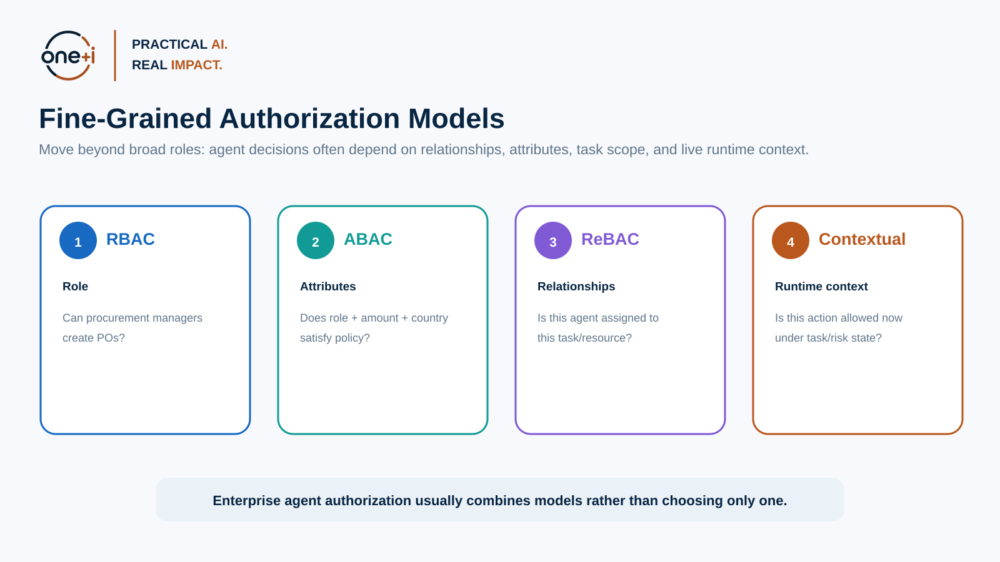
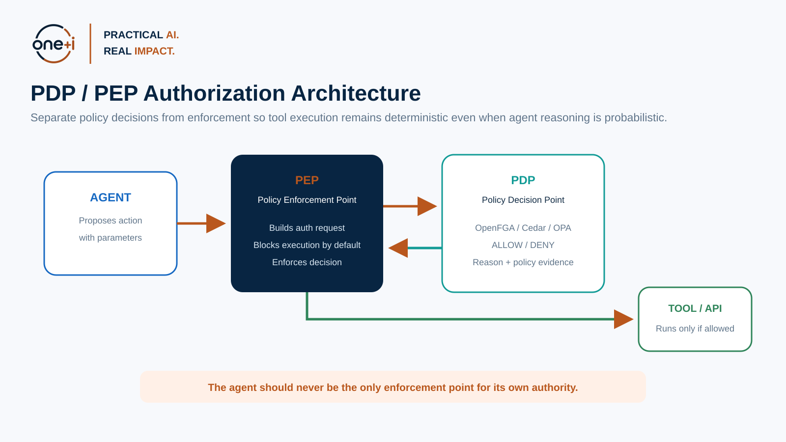
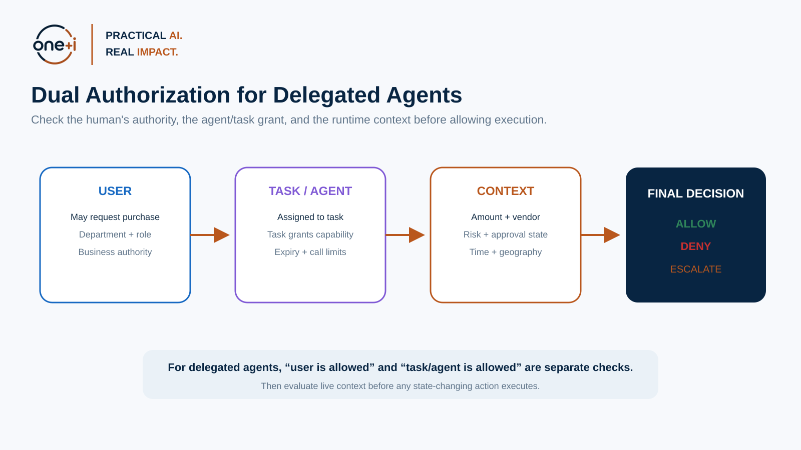
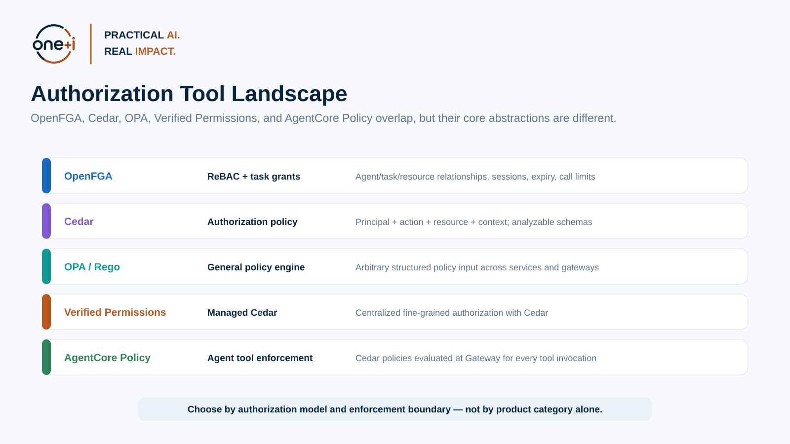

# Module 5 — Fine-Grained Authorization for Agents

> **Course:** Enterprise AI Agent Governance: From Principles to Runtime Control  
> **Audience:** AI/agent engineers, security and IAM engineers, cloud architects, platform engineers, governance architects  
> **Recommended duration:** 6 hours theory + 4–5 hours practical lab  
> **Scenario:** Enterprise Procurement Agent

---

## Learning objectives

By the end of this module, you should be able to:

1. Explain why **authentication and OAuth scopes alone are usually insufficient** for autonomous agent authorization.
2. Compare **RBAC, ABAC, ReBAC, contextual authorization, and task-based authorization**.
3. Design separate **Policy Decision Points (PDPs)** and **Policy Enforcement Points (PEPs)**.
4. Implement the principle of **deny by default** for state-changing agent capabilities.
5. Perform **dual authorization**: user/business authority + task/agent authority.
6. Use **OpenFGA** for agent/task/resource relationships and task-scoped permissions.
7. Use **Cedar** for principal/action/resource/context authorization.
8. Use **OPA/Rego** for general structured policy evaluation.
9. Understand how **Amazon Verified Permissions** and **Amazon Bedrock AgentCore Policy** implement managed Cedar-based authorization.
10. Apply runtime constraints such as **amount, vendor, time, geography, risk, approval state, call count, and expiry**.
11. Test authorization policies with positive, negative, boundary, and mutation-style tests.
12. Prevent common authorization failures such as confused deputy, privilege amplification, wildcard grants, stale task grants, and policy bypass.
13. Understand emerging 2026 research on intent-aware and verifier-guided agent authorization without treating experimental systems as production standards.

> **Core principle:** The agent can decide which action it wants to take. The authorization system decides whether that action may execute.

---

# 1. Why coarse permissions fail for agents

Traditional applications often rely on broad application scopes:

```text
calendar.write
email.send
tickets.write
```

An agent may receive a credential that technically allows hundreds of operations.

But the user's actual intent may be:

> Send one message to vendor ACME for Task T-123.

The gap between:

```text
credential capability
```

and:

```text
task intent
```

is where fine-grained authorization becomes necessary.

OpenFGA's current agent authorization documentation explicitly calls out this problem: agents often hold broad internal or third-party credentials, and task-based authorization can further constrain what they may do at runtime. Agents can begin with zero permissions and receive narrow grants for a task, including conditions such as expiration, call count, session scoping, and agent binding.

Primary reading:

- https://openfga.dev/docs/modeling/agents
- https://openfga.dev/docs/modeling/agents/task-based-authorization

---

# 2. Authorization models



## RBAC — Role-Based Access Control

Decision based on role.

Example:

```text
ProcurementManager → CreatePurchaseOrder
```

Good for:

- stable organizational roles,
- coarse permissions,
- simple administration.

Weakness for agents:

- role may be too broad,
- does not naturally represent one task,
- runtime amount/vendor/risk may matter.

## ABAC — Attribute-Based Access Control

Decision based on attributes.

Example:

```text
role = ProcurementManager
department = DataAI
amount < 5000
country = CA
```

Useful for contextual policy.

## ReBAC — Relationship-Based Access Control

Decision based on relationships.

Example:

```text
agent is assignee of task
task has write relationship to project
vendor is approved_for department
```

OpenFGA is a strong fit.

## Contextual authorization

Authorization also depends on live request state:

- task,
- amount,
- risk score,
- approval,
- time,
- call count,
- user confirmation,
- policy version.

Most enterprise agent systems combine these models.

---

# 3. Authentication, consent, scope, and authorization

These are different.

## Authentication

Who is the user/agent/workload?

## Consent

What did the user agree to allow an application to request?

## OAuth scope

What classes of API capability can the token potentially invoke?

## Fine-grained authorization

Is this **specific action** on this **specific resource** under this **specific task/context** permitted?

An OAuth token may say:

```text
scope = purchase.write
```

The authorization layer can still decide:

```text
DENY
because:
amount = $22,000
task limit = $5,000
```

---

# 4. Policy Decision Point and Policy Enforcement Point



## PDP

The Policy Decision Point evaluates policy.

Examples:

- OpenFGA check,
- Cedar evaluator,
- Amazon Verified Permissions,
- OPA,
- AgentCore Policy engine.

## PEP

The Policy Enforcement Point intercepts the operation and enforces the PDP decision.

Examples:

- API gateway,
- MCP gateway,
- tool wrapper,
- service middleware,
- AgentCore Gateway.

The important boundary:

> A model/tool description is not a PEP.

A tool should not run before authorization.

---

# 5. Deny by default

State-changing agent tools should generally follow:

```text
No matching allow rule
       ↓
DENY
```

Avoid:

```text
If policy service is unavailable → let the agent continue.
```

Failure behavior should be explicit:

- fail closed,
- become read-only,
- use narrowly scoped cached decision,
- escalate to human.

---

# 6. Dual authorization for delegated agents



OpenFGA's task-based guidance specifically describes performing both user and task authorization.

For a delegated agent, ask:

### User check

Does the original user have access to the resource?

### Task/agent check

Has the task/agent been granted this action?

### Context check

Does the current action satisfy dynamic constraints?

This prevents an agent from using:

- a valid user's authority,
- for the wrong task,
- on the wrong resource.

---

# 7. OpenFGA for agent authorization

OpenFGA now has dedicated agent authorization documentation covering:

- first-party authorization,
- third-party/tool authorization,
- agents as principals,
- task-based authorization,
- RAG authorization,
- MCP authorization.

Primary source:

https://openfga.dev/docs/modeling/agents

## Task-based authorization

Current OpenFGA guidance supports:

- task-level grants,
- session-level grants,
- agent-level grants,
- expiration conditions,
- maximum call count,
- binding an agent to the task,
- narrower sub-agent tasks,
- tuple cleanup when tasks complete.

This is highly relevant to autonomous systems.

---

# 8. OpenFGA model pattern

Conceptual model:

```text
type task

type agent
  relations
    define task: [task]

type tool
  relations
    define calling_agent: [agent]
    define can_call: [task] and task from calling_agent
```

This requires:

1. task is granted access,
2. calling agent is actually bound to the task.

That is stronger than checking:

```text
task has access
```

without confirming which agent is using it.

---

# 9. Cedar

Cedar is an open-source authorization language.

Its current documentation describes authorization around:

- **principal**
- **action**
- **resource**
- **context**

Cedar supports attributes on principals/resources/context and common RBAC and ABAC use cases.

Primary sources:

- https://docs.cedarpolicy.com/
- https://cedarpolicy.com/

As of 2026, Cedar continues to evolve; use the current language/version documentation when implementing production policies.

## Example

```cedar
permit (
  principal is Agent,
  action == Action::"CreatePurchaseOrder",
  resource is PurchaseOrder
)
when {
  context.amount <= 5000 &&
  context.vendorApproved == true &&
  context.task == "task-123"
};
```

---

# 10. Cedar forbid semantics

Cedar supports explicit `forbid` policies.

A practical pattern:

```text
permit low-risk purchase

forbid if:
restricted vendor
or sanctioned region
or critical risk state
```

Explicit restrictions are important because an additional permit should not accidentally override a critical prohibition.

Amazon AgentCore's current Cedar-based policy documentation notes **forbid-wins** semantics for applicable policies.

---

# 11. Open Policy Agent / Rego

OPA is a CNCF-graduated general-purpose policy engine.

It decouples:

```text
policy decision-making
```

from:

```text
policy enforcement
```

OPA accepts structured data and evaluates declarative Rego policies.

Primary sources:

- https://www.openpolicyagent.org/docs
- https://www.openpolicyagent.org/docs/policy-language

## Example use

```json
{
  "agent": "procurement-v1",
  "task": "task-123",
  "tool": "create_po",
  "amount": 7000,
  "vendor": "vendor-acme",
  "risk": 0.45
}
```

OPA can produce:

```json
{
  "allow": false,
  "escalate": true,
  "reason": "Manager approval required"
}
```

OPA is broader than a dedicated authorization graph.

---

# 12. OpenFGA vs Cedar vs OPA



## OpenFGA

Strong fit:

- relationships,
- resource hierarchy,
- task grants,
- agent binding,
- session/task permissions.

## Cedar

Strong fit:

- fine-grained authorization,
- attributes,
- principal/action/resource/context,
- policy analysis and schema validation.

## OPA/Rego

Strong fit:

- arbitrary policy decisions,
- infrastructure/application policy,
- policy over structured JSON,
- broader workflow constraints.

Many systems can use more than one.

---

# 13. Amazon Verified Permissions

Amazon Verified Permissions is a managed authorization service based on Cedar.

It is useful when an enterprise wants:

- centralized policy stores,
- managed authorization APIs,
- Cedar policy/schema lifecycle,
- fine-grained application authorization.

Primary source:

https://docs.aws.amazon.com/verifiedpermissions/

---

# 14. Amazon Bedrock AgentCore Policy

AgentCore Policy is a particularly relevant current agent-native implementation.

AWS currently documents that AgentCore Policy:

- intercepts agent requests through Gateway,
- evaluates authorization outside agent code,
- uses Cedar,
- supports fine-grained conditions based on identity and tool input parameters,
- applies policies to tool invocation,
- logs policy decisions.

Primary sources:

- https://docs.aws.amazon.com/bedrock-agentcore/latest/devguide/policy.html
- https://docs.aws.amazon.com/bedrock-agentcore/latest/devguide/policy-core-concepts.html

This demonstrates the core pattern taught in this course:

```text
Agent
  ↓
Gateway / PEP
  ↓
Policy Engine / PDP
  ↓
Tool
```

---

# 15. Context should be structured

Do not pass authorization context as unstructured prose.

Bad:

```text
"The user seems authorized and this is probably under budget."
```

Good:

```json
{
  "principal": "agent:procurement-v1",
  "delegator": "user:123",
  "task": "task:123",
  "action": "purchase_order:create",
  "resource": "department:data-ai",
  "amount": 4500,
  "vendor_id": "vendor-acme",
  "vendor_approved": true,
  "risk_score": 0.31,
  "approval_state": "not_required"
}
```

Authorization engines require reliable structured inputs.

---

# 16. Authorization source of truth

A difficult production question is:

> Where do authorization attributes come from?

Examples:

- identity provider,
- HR directory,
- task service,
- agent registry,
- vendor master data,
- risk engine,
- approval service.

Do not let the LLM invent security attributes.

The model may propose:

```text
vendorApproved = true
```

The authorization layer should obtain the real value from an authoritative source.

---

# 17. TOCTOU — time-of-check to time-of-use

Agent workflows may be long-running.

Risk:

1. authorization check succeeds,
2. policy/resource state changes,
3. tool executes later.

For sensitive actions:

- authorize immediately before execution,
- keep decisions short-lived,
- bind decision to action parameters,
- recheck material context,
- use idempotency.

---

# 18. Authorization caching

Caching can reduce latency.

But cached authorization may become stale.

Consider:

- decision TTL,
- resource sensitivity,
- revocation propagation,
- policy version,
- task expiry,
- high-impact actions.

A payment should generally tolerate less stale authorization than a read-only search.

---

# 19. Human approval is not authorization

Approval answers:

> Did an authorized human accept this decision?

Authorization still asks:

> Is this principal/action/resource permitted?

A human cannot necessarily approve:

- cross-tenant data access,
- sanctioned resource,
- expired task grant,
- prohibited policy.

Approval should be an additional input, not a universal override.

---

# 20. Authorization testing

At minimum test:

## Positive tests

Expected access succeeds.

## Negative tests

Unauthorized access fails.

## Boundary tests

- $4,999 vs $5,001,
- before/after expiry,
- allowed/disallowed vendor.

## Cross-resource tests

Valid task, wrong department.

## Wrong-agent tests

Valid task used by another agent.

## Replay/call-count tests

Grant is reused.

## Failure-mode tests

PDP unavailable.

## Policy-change tests

Old cached decision after policy change.

---

# 21. Policy generation with LLMs — state of the art

Generating policy code from natural language is an active research area.

Recent 2026 work includes verifier-guided approaches for Cedar and pipelines that translate natural-language policy into Rego.

The important engineering lesson is:

> Generated policy must be validated against reviewed intent and tested mechanically.

Do not deploy an LLM-generated authorization policy solely because it compiles.

Emerging research worth reviewing:

- **AutoCedar** — verifier-guided Cedar synthesis (2026)
- **Prose2Policy** — natural-language to Rego pipeline (2026)
- **FAVA** — evidence-backed permission graphs and formal authorization for agents (2026)

These are research directions, not default enterprise standards.

---

# 22. Practical notebook specification

Notebook:

`05_fine_grained_authorization_for_agents.ipynb`

It implements:

- RBAC baseline,
- ABAC policy,
- ReBAC/task graph,
- dual authorization,
- structured runtime context,
- PEP/PDP wrapper,
- OpenFGA model,
- OpenFGA task/session/agent grants,
- Cedar policy examples,
- OPA/Rego policy,
- comparison test suite,
- deny-by-default behavior,
- TOCTOU test,
- authorization cache with TTL,
- policy regression tests,
- decision evidence.

Libraries/tools:

- **Pydantic**
- **OpenFGA Python SDK**
- **requests**
- **pandas**
- **OPA/Rego** optional local server
- **Cedar** examples / optional Cedar CLI or managed service
- optional **boto3** for Amazon Verified Permissions / AgentCore extension.

---

# 23. Enterprise authorization decision schema

A useful internal request:

```json
{
  "request_id": "...",
  "subject": "human:user-123",
  "actor": "agent:procurement-v1",
  "task": "task-123",
  "action": "purchase_order:create",
  "resource": "department:data-ai",
  "context": {
    "amount": 4500,
    "vendor_id": "vendor-acme",
    "risk": 0.31,
    "approval": "not_required"
  }
}
```

Decision:

```json
{
  "decision": "ALLOW",
  "policy_version": "authz-2026-08-1",
  "reason": "Task, resource, vendor, and amount satisfy policy",
  "expires_at": "...",
  "evidence_id": "..."
}
```

---

# 24. Best practices

- Default deny.
- Separate PDP and PEP.
- Check user + agent/task authority.
- Bind grants to agent identity.
- Use authoritative attributes.
- Keep task grants short-lived.
- Reauthorize immediately before high-impact execution.
- Do not treat human approval as universal override.
- Avoid wildcard agent grants.
- Remove task tuples/grants when complete.
- Test authorization as code.
- Log decisions and policy versions.
- Fail safely if authorization infrastructure is unavailable.

---

# 25. Primary references

1. OpenFGA — Authorization for Agents  
   https://openfga.dev/docs/modeling/agents

2. OpenFGA — Task-Based Authorization  
   https://openfga.dev/docs/modeling/agents/task-based-authorization

3. OpenFGA — Agents as Principals  
   https://openfga.dev/docs/modeling/agents/agents-as-principals

4. Cedar Policy Language  
   https://docs.cedarpolicy.com/

5. Open Policy Agent  
   https://www.openpolicyagent.org/docs

6. OPA Rego  
   https://www.openpolicyagent.org/docs/policy-language

7. Amazon Verified Permissions  
   https://docs.aws.amazon.com/verifiedpermissions/

8. Amazon Bedrock AgentCore Policy  
   https://docs.aws.amazon.com/bedrock-agentcore/latest/devguide/policy.html

9. AutoCedar (research)  
   https://arxiv.org/abs/2607.03656

10. Prose2Policy (research)  
    https://arxiv.org/abs/2603.15799

11. FAVA (research)  
    https://arxiv.org/abs/2607.27267

---

# 26. Next module

## Module 6 — Policy-as-Code & Runtime Governance

Next we move from authorization modeling into full runtime governance:

```text
Proposed action
  ↓
Policy-as-Code
  ↓
Risk + authorization + organizational policy
  ↓
ALLOW / DENY / ESCALATE
  ↓
Continuous policy testing + rollout + monitoring
```
