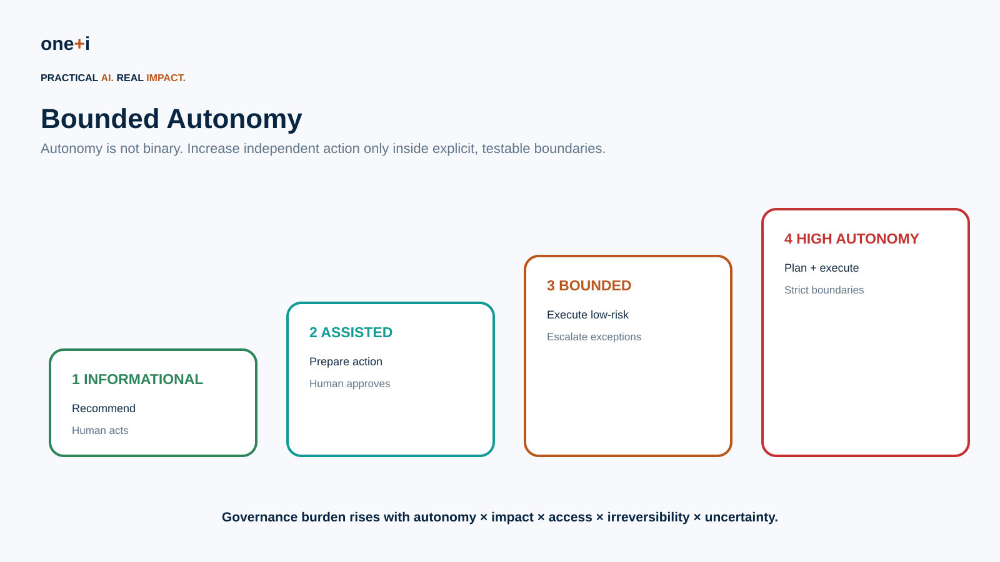
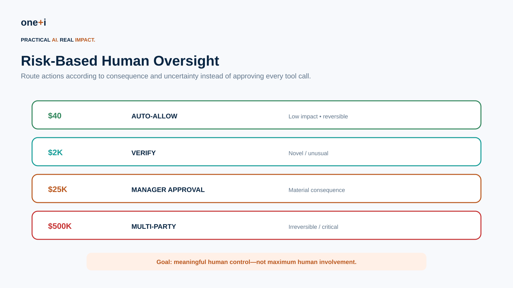
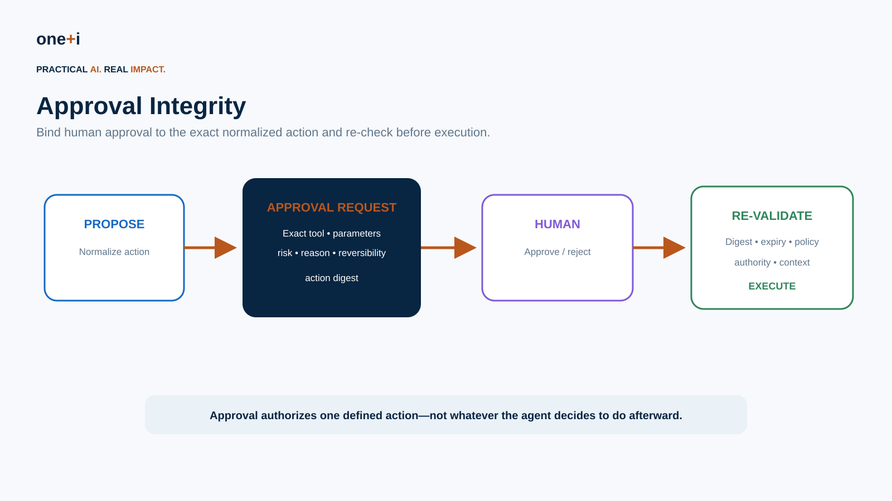
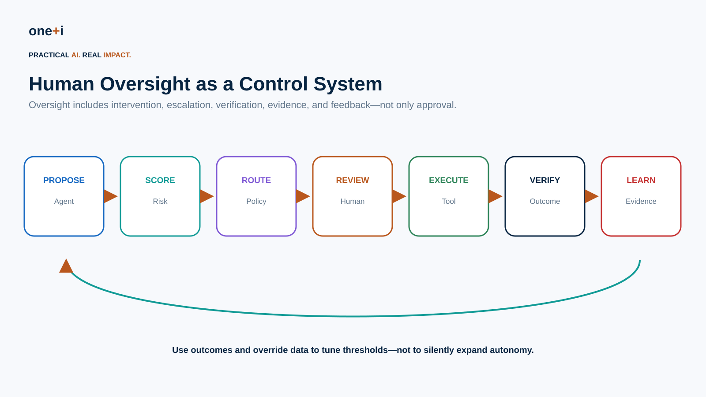

# Module 8 — Human Oversight & Bounded Autonomy

> **Course:** Enterprise AI Agent Governance: From Principles to Runtime Control  
> **Audience:** AI engineers, agent architects, product owners, security teams, governance/risk teams, platform engineers, operations leaders  
> **Recommended duration:** 7 hours theory + 5 hours practical lab  
> **Scenario:** Enterprise Procurement Agent with progressively increasing authority

---

## Learning objectives

By the end of this module, you should be able to:

1. Treat **autonomy as a governed risk dimension**, not a binary feature.
2. Define practical autonomy levels from recommendation to high autonomy.
3. Design **bounded autonomy envelopes** for agents.
4. Replace universal HITL with **risk-based human oversight**.
5. Route actions to auto-allow, verification, single approval, multi-party approval, or denial.
6. Bind approvals to exact normalized actions and prevent post-approval mutation.
7. Design durable pause/resume workflows for long-running approvals.
8. Implement approval expiry, separation of duties, quorum, and escalation.
9. Design pause, redirect, kill, and safe-shutdown controls.
10. Measure approval quality, reviewer load, override rates, and automation coverage.
11. Detect approval fatigue and rubber-stamp behavior.
12. Use current framework capabilities from OpenAI Agents SDK and Microsoft Agent Framework.
13. Connect technical controls to EU AI Act human-oversight expectations and ISO/IEC 42001 management-system practices.
14. Test human-oversight controls under failure, delay, manipulation, and adversarial scenarios.

> **Core principle:** The goal is not maximum human involvement. It is meaningful human control at the points where judgment and accountability matter.

---

# 1. Human-in-the-loop is not a governance strategy by itself

A checkbox saying:

```text
Human approval required
```

does not answer:

- which actions?
- which human?
- what information do they see?
- how much time do they have?
- what happens if they do nothing?
- can the agent modify the action after approval?
- can the reviewer stop execution later?
- is the reviewer independent?
- are approvals audited?
- does approval override hard policy?

A human can be present and still provide ineffective oversight.

---

# 2. Autonomy is a continuum



A practical enterprise model:

## Level 1 — Informational

```text
Agent recommends.
Human acts.
```

## Level 2 — Assisted execution

```text
Agent prepares.
Human approves.
System executes.
```

## Level 3 — Bounded autonomy

```text
Agent independently executes low-risk actions.
Exceptions and sensitive actions escalate.
```

## Level 4 — High autonomy

```text
Agent plans and executes workflows independently
inside explicit technical and business boundaries.
```

The governance burden should rise with:

```text
Autonomy × Impact × Access × Irreversibility × Uncertainty
```

---

# 3. Define an autonomy envelope

Do not grant an agent abstract permission to "work autonomously."

Define an envelope:

```yaml
agent: procurement-agent
purpose: routine procurement
allowed_tools:
  - vendor.lookup
  - po.create
autonomous_amount: 5000
task_spend_limit: 10000
approved_vendor_only: true
irreversible_actions: false
external_communication: false
max_delegation_depth: 1
risk_score_max: 0.55
approval_required_above: 5000
hard_stop_above: 25000
valid_until: 2026-12-31
```

Autonomy becomes measurable and enforceable.

---

# 4. Risk-based oversight



Example:

```text
$40 routine reimbursement
→ AUTO-ALLOW

$2,000 unusual expense
→ ADDITIONAL VERIFICATION

$25,000 purchase
→ MANAGER APPROVAL

$500,000 irreversible transaction
→ MULTI-PARTY APPROVAL / HARD CONTROL
```

Useful routing inputs:

```text
impact
confidence
novelty
reversibility
policy
data sensitivity
anomaly score
delegation depth
external trigger
```

Do not use model confidence as the sole risk signal.

---

# 5. Human oversight is broader than approval

Effective oversight can include:

- pre-action approval,
- monitoring,
- intervention,
- pause,
- redirect,
- kill/terminate,
- escalation,
- post-action review,
- outcome verification,
- accountable sign-off.

OWASP's 2026 autonomous-system guidance increasingly treats graduated autonomy and human intervention as a control family rather than a single approval button.

---

# 6. Regulatory and standards context

## EU AI Act

Article 14 establishes human-oversight requirements for high-risk AI systems, with the objective of preventing or minimizing risks to health, safety, and fundamental rights. The design should enable assigned people to understand capabilities and limitations, monitor operation, interpret outputs appropriately, disregard/override/reverse outputs where appropriate, and intervene or interrupt operation.

For agentic systems, translate this into technical design:

```text
understand → operator context
monitor → telemetry
override → reject/redirect
reverse → compensation
interrupt → pause/kill
```

## ISO/IEC 42001

ISO/IEC 42001:2023 establishes an AI management system for responsible development/use and continuous improvement. Human oversight should therefore be connected to organizational roles, risk treatment, operational controls, evidence, review, and improvement—not implemented as an isolated UI feature.

---

# 7. Approval should be based on the actual action

Bad approval:

> The agent would like to continue. Approve?

Good approval:

```text
ACTION
Create purchase order

VENDOR
ACME Ltd.

AMOUNT
CAD 24,500

TASK
T-123

REQUESTING AGENT
procurement-agent-v3

RISK
0.61 / elevated

WHY ESCALATED
Amount > autonomous limit

REVERSIBLE
Yes — cancel_po available
```

Show the reviewer the **normalized executable action**.

---

# 8. Approval integrity



Approval should bind to:

```text
tool
arguments
resource
task
agent
delegating user
policy version
expiry
```

A practical pattern is an action digest:

```text
digest = SHA256(canonical(action))
```

Store the digest with the approval.

Before execution:

```text
current_digest == approved_digest
```

Otherwise, request approval again.

This prevents:

```text
Approve $5,000
→ agent changes amount
→ execute $50,000
```

---

# 9. Re-check after approval

Time may pass between:

```text
approval
```

and:

```text
execution
```

Re-check:

- policy version,
- authorization,
- task status,
- vendor status,
- risk,
- amount,
- approval expiry,
- action digest.

Approval is evidence of human authorization, not a bypass token for every other control.

---

# 10. Hard policy beats human approval

A reviewer should not accidentally override non-overridable controls.

Example:

```text
sanctioned vendor → DENY
```

Even:

```text
CEO approved → DENY
```

unless the enterprise explicitly defines a legally valid exception workflow.

Model:

```text
hard prohibition > approval > autonomous allow
```

Keep exception authority explicit.

---

# 11. Separation of duties

For high-risk actions:

```text
proposer != approver
```

and potentially:

```text
approver_1 != approver_2
```

Examples:

- payment creator vs payment approver,
- production deployer vs change approver,
- privilege requester vs security approver.

An agent acting for the user should not count as an independent approver for the same user's request.

---

# 12. Multi-party approval

Critical actions may require:

```text
2 of 3
```

or staged approval:

```text
Manager
   ↓
Finance
   ↓
Compliance
```

Define:

- quorum,
- roles,
- ordering,
- expiry,
- rejection semantics,
- reassignment,
- escalation,
- emergency path.

Microsoft's current ecosystem includes multistage approval patterns and durable workflow support suitable for these enterprise processes.

---

# 13. Durable approval workflows

Human response can take minutes, hours, or days.

Do not keep an HTTP request or agent process alive.

Persist:

```text
workflow state
pending action
approval request
policy version
action digest
expiry
correlation ID
```

Then resume from the checkpoint.

Current OpenAI Agents SDK supports serializing `RunState` and resuming approval-interrupted runs. Microsoft Agent Framework workflows similarly support request/response pause points.

---

# 14. OpenAI Agents SDK HITL

The current OpenAI Agents SDK supports approval on:

- function tools,
- agents exposed as tools,
- shell tools,
- patch tools,
- local MCP servers,
- hosted MCP tools.

Pattern:

```python
@function_tool(needs_approval=True)
async def cancel_order(order_id: int):
    ...
```

The run pauses and exposes `interruptions`. The application approves/rejects items in `RunState`, then resumes the original run.

Current SDK behavior also supports:

- conditional `needs_approval`,
- nested-agent approvals surfacing to the outer run,
- state serialization,
- streaming approvals,
- long-running pause/resume,
- custom rejection messages,
- pre-approval input guardrails.

Primary source:

https://openai.github.io/openai-agents-python/human_in_the_loop/

---

# 15. Pre-approval and post-approval validation

A subtle but important pattern:

```text
validate
 ↓
show approval
 ↓
human approves
 ↓
validate again
 ↓
execute
```

Why twice?

Because state can change while waiting.

The current OpenAI Agents SDK explicitly supports pre-approval tool input guardrails while still running input guardrails again before execution.

This is a strong enterprise pattern even outside that SDK.

---

# 16. Microsoft Agent Framework

Microsoft Agent Framework currently supports approval-required function tools and workflow request/response patterns.

Examples include:

```python
@tool(approval_mode="always_require")
def send_email(...):
    ...
```

and workflow `RequestPort` / request-info mechanisms that pause execution until external input arrives.

Current Agent Framework guidance also distinguishes:

```text
always_require
never_require
conditional
```

approval modes.

Primary sources:

- https://learn.microsoft.com/en-us/agent-framework/
- https://learn.microsoft.com/en-us/agent-framework/workflows/human-in-the-loop
- https://learn.microsoft.com/en-us/agent-framework/integrations/ag-ui/human-in-the-loop

---

# 17. Framework approval is a mechanism, not the policy

This is critical.

SDK feature:

```text
needs_approval=True
```

does not define enterprise governance.

Your policy must decide:

```text
when approval is needed
who may approve
what they may approve
how long approval lasts
whether multiple people are required
what information is shown
what controls remain after approval
```

Frameworks provide interruption/resume mechanics.

Governance defines the rules.

---

# 18. Approval fatigue

If reviewers see hundreds of low-value requests:

```text
approve
approve
approve
approve
```

oversight becomes a rubber stamp.

Monitor:

```text
approvals/reviewer/day
median decision time
approval rate
rejection rate
actions reviewed
risk distribution
repeat approvals
after-hours approvals
```

Signals of ineffective oversight:

- 99.9% approval,
- decisions in <1 second,
- very high queue volume,
- identical decisions regardless of risk,
- frequent "approve all."

---

# 19. Optimize for decision quality

Human attention is scarce.

Use automation for:

```text
known + low impact + reversible + policy-conforming
```

Reserve human attention for:

```text
novel
high impact
irreversible
uncertain
anomalous
policy exception
```

This creates **risk-weighted human attention**.

---

# 20. Reviewer context

An approver needs enough information to make a real decision.

Include:

- requested action,
- exact parameters,
- initiator,
- agent,
- task/purpose,
- relevant source evidence,
- policy/risk reason,
- alternatives,
- reversibility,
- deadline.

Avoid overwhelming reviewers with raw chain-of-thought or huge traces.

Present decision-relevant evidence.

---

# 21. Reviewer authority

Route approval to someone who actually has authority.

Example:

```text
$2K → team lead
$25K → manager
$100K → director + finance
critical security change → security duty officer
```

Resolve reviewer authority from trusted organizational systems rather than asking the model whom to contact.

---

# 22. Timeout policy

What happens if nobody responds?

Do not default to:

```text
timeout → approve
```

Safer patterns:

```text
timeout → deny
timeout → expire
timeout → escalate
```

based on risk.

For emergency operations, define a separate audited break-glass process.

---

# 23. Pause, redirect, and kill

For long-running agents, pre-action approval is insufficient.

Operators may need:

```text
PAUSE
REDIRECT
TERMINATE
```

Design semantics carefully.

### Pause

Stop new consequential actions; persist safe state.

### Redirect

Change task objective or constraints through an authenticated control channel.

### Terminate

Revoke active authority and stop execution.

A kill control that leaves credentials/tokens usable is incomplete.

---

# 24. Revocation

Autonomy can be revoked.

Triggers:

- incident,
- policy change,
- anomalous behavior,
- user revocation,
- role change,
- tool compromise,
- model/version change,
- risk threshold breach.

Revocation should propagate to:

- credentials,
- task grants,
- sessions,
- gateway policy,
- pending approvals,
- cached decisions.

---

# 25. Outcome verification

Approval before execution does not prove the action succeeded correctly.

After high-risk execution:

```text
verify actual outcome
```

Example:

```text
Approved: pay vendor ACME $25,000
Executed: transaction TX-91
Verify:
  recipient == ACME
  amount == 25,000
  currency == CAD
  status == settled
```

This closes the control loop.

---

# 26. Human oversight as a control system



```text
Propose
 ↓
Risk score
 ↓
Route
 ↓
Review if needed
 ↓
Execute
 ↓
Verify
 ↓
Observe outcomes
 ↓
Improve thresholds/policy
```

Do not silently widen autonomy based on observed approvals.

Policy changes should remain explicit, reviewed, versioned changes.

---

# 27. Measuring bounded autonomy

Useful metrics:

## Autonomy coverage

```text
autonomous actions / total actions
```

## Escalation rate

```text
escalated actions / total actions
```

## Override rate

How often humans reject or modify agent proposals.

## False-escalation rate

Low-risk actions unnecessarily sent to humans.

## Missed-escalation rate

Actions that should have been reviewed but were not.

## Approval latency

Time between request and decision.

## Reviewer load

Requests per reviewer/time period.

## Post-approval mutation rate

Approved actions that changed before execution.

## Intervention rate

Paused/redirected/killed runs.

## Outcome discrepancy

Approved intent vs actual external outcome.

---

# 28. Autonomy budgets

Beyond per-action rules, define budgets:

```text
max autonomous spend/day
max external messages/hour
max records modified/task
max tool calls/run
max delegation depth
max runtime
max cumulative risk
```

A series of individually low-risk actions can create high aggregate risk.

---

# 29. Dynamic autonomy

Autonomy can decrease when risk increases.

Example:

```text
normal state
→ bounded autonomy

anomaly detected
→ assisted execution

incident declared
→ informational only
```

Prefer **degrading autonomy** under uncertainty rather than granting broader authority dynamically without explicit policy.

---

# 30. Testing human oversight

Test more than the happy path.

### Approval integrity
Change parameters after approval.

### Expiry
Resume after approval expires.

### Policy change
Approve under v1, execute under v2.

### Reviewer authority
Wrong role attempts approval.

### Separation of duties
Requester approves own action.

### Quorum
Only one of two required approvers responds.

### Timeout
No response.

### Revocation
Authority revoked while paused.

### Duplicate response
Same approval submitted twice.

### Replay
Old approval reused for new action.

### Fatigue
High-volume low-value queue.

### Kill
Terminate during multi-step execution.

### Outcome mismatch
Tool reports different effect than approved.

---

# 31. Practical notebook

`08_human_oversight_and_bounded_autonomy.ipynb`

The lab implements:

- autonomy envelopes,
- multi-factor risk scoring,
- routing to ALLOW / VERIFY / APPROVE / MULTI_APPROVE / DENY,
- approval requests with normalized actions,
- cryptographic action digests,
- approval expiry,
- role-based reviewer authority,
- separation of duties,
- quorum,
- durable pause/resume state,
- re-validation after approval,
- hard-policy precedence,
- revocation,
- autonomy budgets,
- kill switch,
- outcome verification,
- approval-fatigue metrics,
- adversarial regression tests,
- framework examples for OpenAI Agents SDK and Microsoft Agent Framework.

---

# 32. Best practices

- Define autonomy explicitly.
- Start narrow and expand through evidence.
- Route oversight by risk.
- Show reviewers the actual executable action.
- Bind approval to exact parameters.
- Re-check policy after approval.
- Keep hard prohibitions outside approval.
- Enforce reviewer authority.
- Use separation of duties for high-impact actions.
- Expire approvals.
- Fail safe on timeout.
- Support pause/redirect/kill for long-running agents.
- Revoke credentials and authority together.
- Verify outcomes.
- Monitor reviewer fatigue.
- Measure autonomy and escalation quality.
- Version autonomy policies.
- Treat autonomy expansion as a governed change.

---

# 33. Primary references

1. OpenAI Agents SDK — Human in the Loop  
   https://openai.github.io/openai-agents-python/human_in_the_loop/

2. OpenAI Agents SDK — Running Agents / Durable Execution  
   https://openai.github.io/openai-agents-python/running_agents/

3. Microsoft Agent Framework — Human-in-the-Loop Workflows  
   https://learn.microsoft.com/en-us/agent-framework/workflows/human-in-the-loop

4. Microsoft Agent Framework — AG-UI Human-in-the-Loop  
   https://learn.microsoft.com/en-us/agent-framework/integrations/ag-ui/human-in-the-loop

5. ISO/IEC 42001:2023  
   https://www.iso.org/standard/42001

6. EU AI Act — Regulation (EU) 2024/1689, Article 14  
   https://eur-lex.europa.eu/eli/reg/2024/1689/oj

7. OWASP — State of Agentic AI Security and Governance 2.01  
   https://genai.owasp.org/resource/state-of-agentic-ai-security-and-governance/

8. OWASP — Human Oversight and Intervention  
   https://owasp.org/APTS/standard/3_Human_Oversight/

---

# 34. Next module

## Module 9 — Memory, Data & Context Governance

Next:

```text
Observe
 ↓
Classify
 ↓
Decide what may enter context/memory
 ↓
Provenance + scope
 ↓
Retention + access
 ↓
Validation + correction
 ↓
Deletion
```

The focus shifts to preventing agent memory and context from becoming an ungoverned enterprise database and authority channel.
