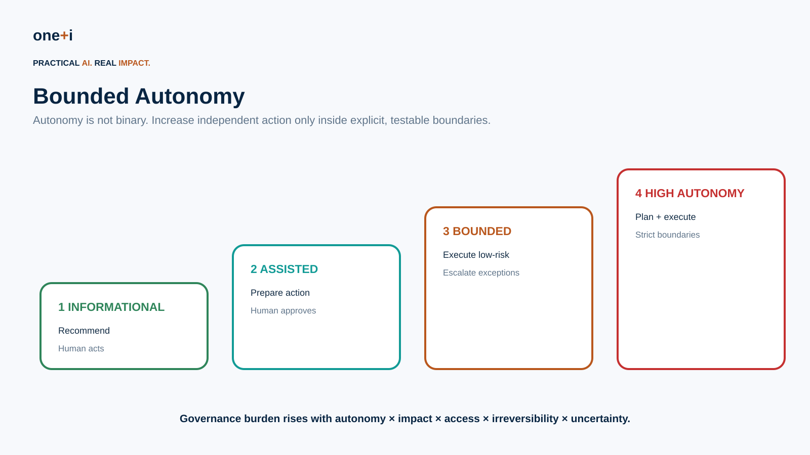
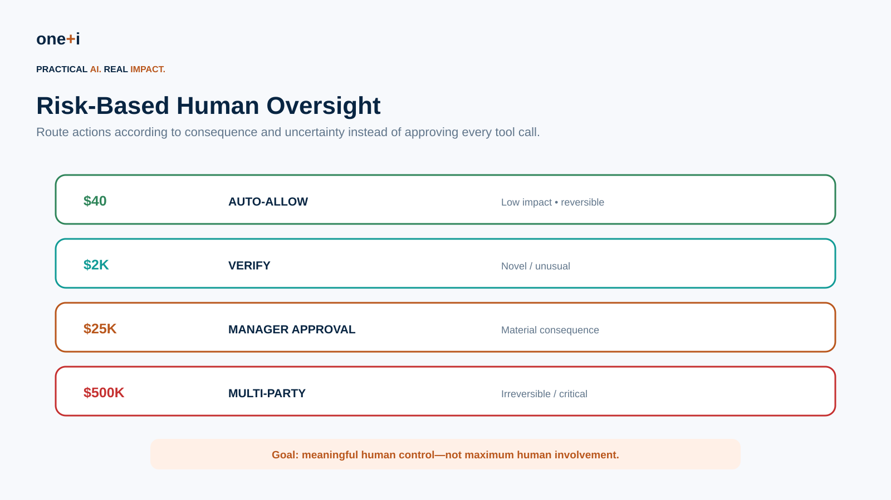
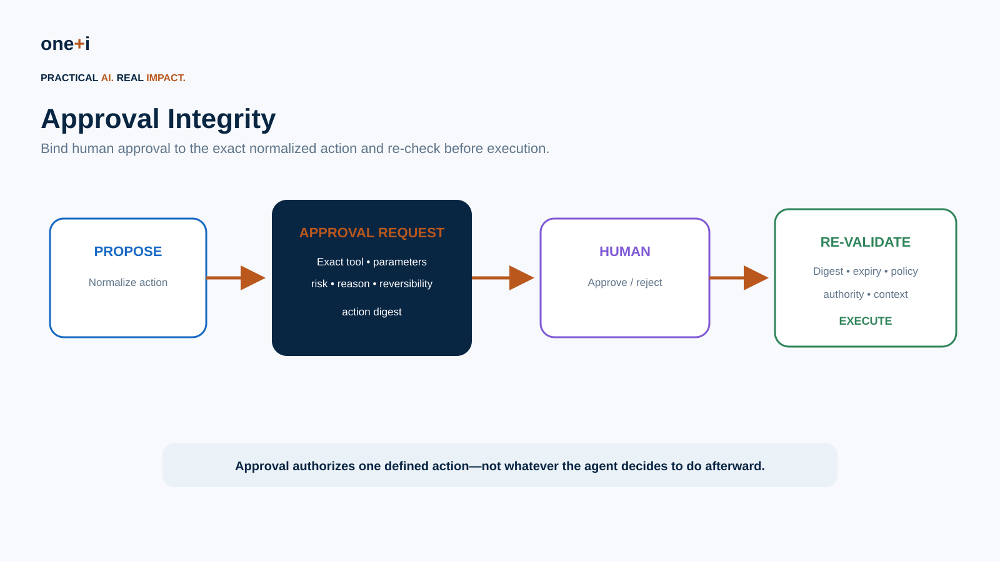
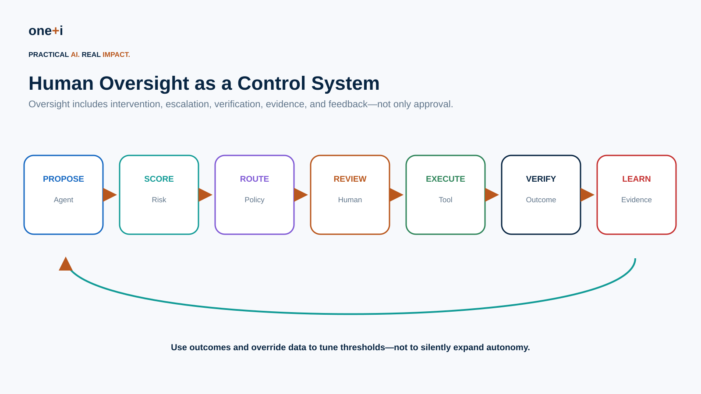

# Module 8 — Human Oversight and Bounded Autonomy

> **Course:** Enterprise AI Agent Governance: From Principles to Runtime Control  
> **Audience:** AI engineers, agent architects, product owners, security and risk teams, platform engineers, and operations leaders
> **Duration:** 7 hours of guided study plus a 5-hour practical lab
> **Scenario:** A procurement agent that proposes and executes purchase orders inside a governed autonomy envelope

## Course thesis

Human oversight is effective only when the application—not the model—decides where judgment is required, gives an authorized reviewer the exact action and relevant evidence, preserves that decision across a durable pause, and revalidates every safety condition immediately before the external effect.

The objective is not to put a person in every path. Universal approval creates queues and fatigue while still allowing a human to override rules that should never be overridable. The objective is **meaningful human control**: hard denial for prohibited actions, trusted verification where facts are missing, proportionate approval for judgment calls, and bounded automation for routine actions.



## Prerequisites

You should be comfortable with:

- Python data models, functions, exceptions, and unit tests;
- authentication, authorization, tenant isolation, and audit concepts;
- idempotency keys and optimistic concurrency;
- the distinction between an agent proposal and an application-authorized effect;
- Courses 1–7, especially policy enforcement, runtime guardrails, and tool authorization.

The lab is deterministic and credential-free. It uses the repository environment and creates real OpenAI Agents SDK and Microsoft Agent Framework tool descriptors without making model or network calls.

## Learning objectives

By the end of this module, you can:

1. define a versioned autonomy envelope for a workload;
2. route an action to auto-allow, trusted verification, single approval, multi-party approval, or hard denial;
3. keep model claims outside the trusted computing base;
4. bind a decision to the exact action, tenant, requester, task, policy version, and fact version;
5. authenticate and authorize reviewers while enforcing separation of duties and quorum;
6. use immutable records, single-use transitions, expiry, and optimistic concurrency;
7. pause, checkpoint, restore, redirect, resume, terminate, and revoke safely;
8. re-evaluate policy and trusted facts immediately before execution;
9. reserve budgets atomically and reconcile ambiguous external effects by idempotency key;
10. verify the actual effect rather than treating an API response as proof;
11. measure reviewer latency, workload concentration, disagreement, and fast-approval behavior;
12. map these controls to current framework mechanisms and authoritative governance sources.

## Success criteria

You have completed the course when you can explain and demonstrate all of the following:

- a prohibited action remains denied even if a reviewer wants to approve it;
- changing an approved action invalidates the decision;
- two simultaneous decisions cannot both win the same versioned transition;
- manager and finance quorum requires different people in different roles;
- stale identity, policy, facts, verification, and approval fail closed;
- an ambiguous post-commit response is reconciled before retry;
- the final vendor, amount, currency, operation, and status match the proposal;
- the ten-case evaluation improves routing accuracy from 2/10 to 10/10 while reducing human-review routes from 10 to 4 and overriding zero of four hard denials.

## Non-goals

This module does not claim that:

- a framework approval decorator is a complete governance system;
- model confidence is calibrated risk evidence;
- every workflow should use the same amount thresholds or quorum;
- the in-memory lab is a production database or workflow engine;
- approval transfers accountability from the deploying organization to a reviewer;
- a kill switch can recall an external effect that has already committed.

## Claim-to-proof map

| Claim | Executable proof |
|---|---|
| Model assertions cannot grant authority | `test_model_claims_do_not_change_routing` |
| Hard rules dominate approval | hard-policy parameterized tests and four labelled denial cases |
| Approval is exact and single-use | action digest, immutable models, version checks, and approval tests |
| Reviewers are authenticated, authorized, independent, and tenant-bound | reviewer identity, tenant, role, separation-of-duties, and quorum tests |
| Delayed reviews survive restart | `checkpoint()` / `restore()` test |
| State changes invalidate stale authority | redirect, policy-version, fact-version, pause/resume, and expiry tests |
| Budget enforcement is atomic | concurrent execution budget test |
| Ambiguous outcomes are not blindly retried | before-commit and after-commit failure-injection tests |
| External effects are verified | operation, vendor, amount, currency, and status mismatch tests |
| Framework examples are genuine artifacts | tests inspect OpenAI and Microsoft tool descriptor fields |
| Reviewer-quality metrics have exact populations | deterministic event-population test |
| Candidate routing beats universal HITL | ten-case baseline-versus-candidate evaluation |

---

## 1. Human presence is not meaningful human control

“Human approval required” leaves the important questions unanswered:

- Which actions require judgment, and which are prohibited regardless of approval?
- Which identity may decide, for which tenant, in which role?
- What exact action and evidence does that person see?
- Can the proposal change after approval?
- What happens on timeout, duplicate submission, restart, policy change, or incident?
- Can execution be paused or terminated before the effect?
- Is the result checked against the approved intent?

A useful design separates three concerns:

```text
agent proposal
    ↓ untrusted intent
application control plane
    ↓ authenticated, policy-checked, versioned authority
effect adapter
    ↓ least-privileged external operation
outcome verification
```

The model may propose an amount, explain its reasoning, and even claim an action is safe. It must not create its own approval, choose its reviewer, alter a policy version, or hold the credential that produces the real effect.

## 2. Autonomy is a governed envelope

Autonomy is not a binary “on/off” capability. It is authority over a defined operation, identity, scope, value, duration, and context.

| Level | Typical behavior | Suitable controls |
|---|---|---|
| Informational | Agent recommends; human performs the action | provenance, review, no effect credential |
| Assisted | Agent prepares; human authorizes; application executes | exact-action approval, expiry, effect verification |
| Bounded | Agent executes routine cases; exceptions escalate | envelope, risk routing, budgets, monitoring, kill control |
| High autonomy | Agent runs a multi-step process inside strict limits | durable orchestration, dynamic degradation, continuous assurance |

The lab uses this immutable envelope:

```python
AutonomyEnvelope(
    policy_version="oversight-policy/2026-09-27",
    workload_id="procurement-agent",
    allowed_tools=frozenset({"procurement.create_po"}),
    auto_limit_cents=100_000,
    verify_limit_cents=250_000,
    single_approval_limit_cents=1_000_000,
    hard_limit_cents=5_000_000,
    task_spend_limit_cents=6_000_000,
    task_action_limit=6,
    valid_until=...,
)
```

An enterprise envelope should also cover allowed resources, destinations, data classes, delegation depth, time window, velocity, retry policy, and incident-state behavior. A version is essential: an approval under policy A must not silently execute under policy B.

## 3. Route risk; do not send everything to approval



The lab has five mutually exclusive routes:

| Route | Meaning | Example |
|---|---|---|
| `AUTO_ALLOW` | Trusted facts show a routine, reversible action inside the envelope | CAD 500 approved-vendor order |
| `VERIFY` | A trusted application source must confirm facts before execution | CAD 2,000 order in the verification band |
| `APPROVE` | One authorized manager must exercise judgment | CAD 6,000 order |
| `MULTI_APPROVE` | Distinct manager and finance decisions are required | CAD 20,000 or irreversible action |
| `DENY` | Policy prohibits the action; no approval can override it | sanctioned vendor or hard-limit breach |

The transparent risk score uses impact, irreversibility, sensitivity, novelty, and anomaly. It is a triage signal, not the policy itself. Hard rules run first. Model-reported risk and model-reported approval are stored only to prove that they do not influence authority.

The route also degrades dynamically. An elevated incident moves a normally autonomous action to approval; a critical incident stops it. This is safer than assigning a permanent autonomy level to an agent.

### Why universal HITL is an unsafe baseline

The baseline routes every case to one approval. In the labelled population it:

- gets only 2 of 10 expected routes correct;
- creates 10 human-review cases;
- makes all 4 hard denials human-overridable.

The candidate control plane gets 10 of 10 correct, creates 4 human-review cases, and preserves all 4 hard denials. The population is fixed and reported with counts rather than a misleading percentage over an unspecified dataset.

## 4. Exact-action approval



An approval request must show the real decision surface:

```text
Operation: OP-1001
Tool: procurement.create_po
Tenant: tenant-north
Requester: usr-requester-1042
Vendor: VEN-101
Amount: CAD 6,000.00
Reversible: yes
Policy: oversight-policy-2026-09
Facts: vendor-master-v42
Required role: manager
Expires: 2026-09-27T16:00:00Z
```

The lab canonicalizes the immutable action and computes a SHA-256 digest. The request binds that digest to the tenant, requester, workload, task, operation, tool, policy version, fact version, roles, quorum, and expiry.

At execution time, the control plane checks the digest again. Editing the amount, vendor, tool, or any other action field requires a new decision. This prevents the dangerous pattern “approve a general plan, then let the agent decide the final parameters.”

Approval never overrides a deny. Routing occurs before the approval request is created and again immediately before execution.

## 5. Reviewer identity, authority, and independence

A client-supplied `reviewer_id` is not authentication. Production systems should derive reviewer identity, tenant, and role from a validated session or workload identity, then apply server-side authorization.

The lab enforces:

- fresh authenticated reviewer context;
- tenant equality between reviewer and workflow;
- an eligible role for the route;
- separation of duties between requester and reviewer;
- one role per quorum slot;
- distinct people for distinct decisions;
- terminal rejection;
- exact request and action binding;
- expiry and optimistic version checks.

For `MULTI_APPROVE`, a manager decision alone leaves the workflow pending. Finance must be a different reviewer. Two manager approvals do not substitute for the required roles.

### Reviewer experience is a safety control

The review interface should prioritize material facts, not flood the reviewer with generated prose. Include:

- the exact action and consequence;
- policy reason codes and comparison to thresholds;
- provenance and freshness of trusted facts;
- anomalies, alternatives, and reversibility;
- conflicts of interest and required roles;
- expiry and the effect of approval, rejection, or timeout.

Do not use dark patterns such as a prominent green Approve button, preselected approval, hidden differences, or a countdown that pressures judgment.

## 6. Durable state and single-use transitions

Approval often takes longer than an HTTP request, process lifetime, or agent run. The application must persist a server-owned workflow record and resume from it.

The lab models an explicit state machine:

```text
PENDING ──verify/review──▶ READY ──execute──▶ EXECUTING ──verify──▶ COMPLETED
   │                         │                    │
   ├──reject──▶ REJECTED     ├──terminate──▶ TERMINATED
   ├──expire──▶ EXPIRED      └──pause──▶ PAUSED ──resume──▶ revalidated state
   └──terminate──▶ TERMINATED
                                                mismatch ──▶ FAILED
```

Every mutation carries an expected version. Under concurrent decisions, only one transition from version *n* to *n+1* succeeds; stale writers receive `VERSION_CONFLICT`. This is the teaching analogue of an atomic database compare-and-set.

The checkpoint exercise serializes typed workflow and budget state and restores pending work after a simulated restart. The JSON is deliberately simple. It assumes trusted server-side storage. Production snapshots require access control, tenant/owner binding, integrity authentication or encryption, schema migration, replay protection, retention controls, and transactional persistence.

## 7. Verification is not approval

The `VERIFY` route is for an application fact check, not human judgment. For example, a vendor-master service can confirm that an account is active and matches the tenant.

The verification receipt binds:

- action digest;
- tenant;
- trusted source version;
- verification time and expiry.

Execution rejects a missing, expired, or action-mismatched receipt. It also rejects a different current fact version. This avoids laundering an untrusted model answer into “verified” status.

## 8. Revalidate immediately before the effect

Time passes between proposal, review, and execution. Before using any external credential, the lab checks:

1. expected workflow version;
2. ready state;
3. requester, workload, tenant, and task context;
4. current authentication, envelope, hard rules, incident state, and risk route;
5. policy version and trusted-fact version;
6. approval or verification expiry and digest;
7. required roles and quorum;
8. atomic action-count and spend budgets.

If a vendor becomes sanctioned while approval is pending, yesterday’s approval is not authority to execute today. If the risk route changes, the workflow must return for the newly required control.

## 9. Pause, redirect, terminate, and revoke



Meaningful control includes more than a pre-action button:

- **Pause** freezes a pending or ready workflow without losing its prior state.
- **Resume** revalidates policy and facts before restoring that state.
- **Redirect** replaces the proposed action, clears prior decisions and verification, recomputes routing, and creates new authority.
- **Terminate** moves a pre-effect workflow to a terminal state.
- **Revoke** is modeled by policy/fact change, expiry, or termination before execution.

Once an external effect has committed, “kill” cannot erase reality. A production design needs compensating operations—cancel a purchase order, freeze a payment, recall a message—plus a record of whether compensation is possible and who may authorize it.

## 10. Execution, budgets, and ambiguous outcomes

The real procurement adapter is reachable only through an unforgeable capability held by the oversight gateway. This illustrates an important architecture rule: the agent-facing tool should create a proposal; the controlled adapter should hold effect authority.

Before execution, action-count and spend budgets are reserved in the same lock as the transition to `EXECUTING`. Checking a budget and incrementing it later would allow concurrent requests to overspend.

The adapter is idempotent by `(tenant_id, operation_id)` and supports two injected failures:

- **before commit:** no effect exists; the workflow fails closed;
- **after commit:** the response is unknown, so the gateway reconciles by idempotency key before considering a retry.

Blind retry after an unknown response can create duplicate payments, orders, or messages. Production systems need provider idempotency, a reconciliation endpoint or ledger, bounded retry policy, and an operator path for unresolved outcomes.

The lab conservatively keeps a budget reservation after a failed attempt. A production implementation may release it only after authoritative proof that no effect exists.

## 11. Verify the outcome

An API call returning without an exception is not proof that the approved action happened. The lab checks that the effect receipt matches:

- operation ID;
- vendor ID;
- amount;
- currency;
- committed status.

A mismatch ends in `FAILED` with `OUTCOME_MISMATCH`. Real verification may use a read-after-write query, independent ledger, signed receipt, downstream event, or reconciliation job. Prefer evidence independent of the agent’s own narrative.

## 12. Measure human oversight quality

For a clearly defined review-event population and time window, monitor:

- event count and approval count;
- approval rate;
- median decision latency;
- fast approvals below a justified threshold;
- disagreement with a labelled or independently reviewed outcome;
- workload concentration on the busiest reviewer;
- queue age, expiry, escalation, and post-approval incident rate in production.

No single metric proves fatigue. A high approval rate may reflect excellent upstream routing. Investigate combinations: very fast approvals, low disagreement in suspicious cases, concentrated load, growing queues, after-hours decisions, and poor recall in reviewer sampling.

## 13. Framework mechanisms and their boundary

The lab creates genuine descriptors from the installed libraries:

```python
@function_tool(needs_approval=True)
def openai_create_po(vendor_id: str, amount_cents: int) -> str:
    return f"proposal only: {vendor_id}:{amount_cents}"

@microsoft_tool(approval_mode="always_require")
def microsoft_create_po(vendor_id: str, amount_cents: int) -> str:
    return f"proposal only: {vendor_id}:{amount_cents}"
```

Tests inspect `needs_approval` and `approval_mode`; these are not pseudocode. They demonstrate framework integration while keeping policy and effect authority in application code.

### OpenAI Agents SDK

The current Python SDK supports approval on function tools, returns approval interruptions instead of executing the tool, and exposes `to_state()` so the application can serialize and later resume the same paused run. OpenAI's SDK guidance is explicit about the boundary: the server owns deployment, tool implementations, state storage, and approval decisions. The SDK mechanism does not replace authenticated reviewer identity, exact-action binding, expiry, or current-policy checks.

### Microsoft Agent Framework

Microsoft Agent Framework supports approval-required tools and workflow request/response ports. Workflow checkpoints preserve pending requests and can re-emit them after restore. The framework supplies orchestration primitives; the application still owns reviewer authentication, authorization, separation of duties, expiry, policy precedence, and external-effect verification.

### Durable workflow products

At production scale, consider a durable engine rather than reproducing scheduling and recovery yourself:

- Camunda 8 user tasks stop a process until human work is completed and provide task applications and BPMN routing.
- LangGraph interrupts pause a graph and require a checkpointer for persistent resume.
- General durable-execution engines can host approval signals, timers, retries, and compensation, but product durability does not automatically make the approval semantically safe.

Evaluate tenant isolation, authorization hooks, immutable history, timers, concurrency, migration, retention, regional controls, operator tooling, and reconciliation—not only whether a product has an “approval” node.

## 14. State of the art: established, emerging, and unsettled

### Established practice

- application-owned policy enforcement and least-privileged effect adapters;
- immutable action binding, authenticated reviewers, expiry, and audit records;
- durable state machines, idempotency keys, optimistic concurrency, and compensation;
- risk-tiered routing with hard non-overridable constraints;
- pre-effect revalidation and post-effect verification.

### Emerging practice

- framework-native interrupts and approval metadata across function, hosted, local, and agent tools;
- dynamic autonomy that degrades during incidents, drift, or weak evidence;
- reviewer-assistance interfaces that summarize evidence while preserving source access;
- policy-as-code linked to traces, evaluation cases, and runtime decisions;
- oversight for multi-agent delegation and subagent authority chains.

### Research and open questions

- how to calibrate when human review improves outcomes rather than adding automation bias;
- how to measure reviewer comprehension and meaningful control without surveillance theater;
- how to allocate responsibility across model provider, deployer, operator, and reviewer;
- how to validate safe autonomy thresholds under distribution shift;
- how to design reversible actions and compensation for partially completed agent plans;
- how to preserve oversight when actions cross organizations and jurisdictions.

Avoid presenting these open questions as solved simply because a framework exposes an interrupt primitive.

## 15. Regulatory and standards mapping

### EU AI Act Article 14

For high-risk AI systems, Article 14 requires effective human oversight proportionate to risk, autonomy, and context. Assigned natural persons need appropriate interfaces and the ability to understand capabilities and limitations, remain aware of automation bias, interpret outputs, disregard or override them where appropriate, and intervene or interrupt operation.

This course maps those expectations to reviewer context, risk routing, exact evidence, independent decision paths, pause/redirect/terminate controls, and telemetry. This mapping is engineering guidance, not a legal determination that every procurement agent is a high-risk system.

### ISO/IEC 42001:2023

ISO/IEC 42001 specifies an AI management system with roles, risk management, operational controls, monitoring, and continual improvement. The workflow evidence in this lab can support that management system, but implementing this code does not itself establish conformity or certification.

### ISO/IEC DIS 42105

ISO/IEC DIS 42105 is a **draft international standard**, not a published final standard. Its current scope addresses human oversight across the AI lifecycle, stakeholders, system configuration, human-machine interaction, and intervention. Use it as emerging guidance and track changes before relying on clause-level requirements.

### NIST AI RMF

NIST AI RMF Govern 3.2 calls for documented roles and responsibilities for human-AI configurations and oversight. NIST is revising the AI RMF; teams should record the version and retrieval date of the profile or playbook they use.

## 16. Practical lab

Open [`08_human_oversight_and_bounded_autonomy.ipynb`](08_human_oversight_and_bounded_autonomy.ipynb). The notebook imports the canonical [`lab.py`](lab.py); it does not duplicate control logic.

You will:

1. inspect real SDK approval descriptors;
2. compare universal HITL with the five-route policy on ten labelled cases;
3. execute the trusted-verification path;
4. approve an exact manager-routed action;
5. enforce distinct manager-and-finance quorum;
6. reject requester self-approval and stale identity;
7. checkpoint and restore a pending review;
8. redirect an action and observe invalidation;
9. pause, resume, terminate, and revalidate changed facts;
10. exercise concurrency and atomic budgets;
11. inject before-commit, after-commit, and mismatched-effect failures;
12. compute reviewer-quality metrics over an exact population;
13. write a production architecture decision for your own domain.

Run it with:

```bash
make course-08
```

Or run the focused invariant suite:

```bash
uv run --locked pytest -q tests/test_module08_human_oversight.py
```

### Production extension assignment

Replace the in-memory control plane with a design for your organization. Include:

- persistent schema and atomic transition boundary;
- identity provider claims and server-side role mapping;
- action normalization and digest rules;
- policy and trusted-fact versioning;
- approval/verification TTL and escalation policy;
- workflow recovery, schema migration, and replay protection;
- idempotency, unknown-outcome reconciliation, and compensation;
- audit event schema, retention, privacy, and access controls;
- reviewer workload SLOs and quality evaluation;
- red-team cases for action mutation, tenant crossing, replay, race, and reviewer manipulation.

## 17. Production checklist

Before granting agent authority, verify:

- [ ] Effect credentials are unavailable to the model and proposal layer.
- [ ] The autonomy envelope is explicit, versioned, scoped, and expiring.
- [ ] Hard denials cannot be converted to approvals.
- [ ] Trusted facts have provenance, version, freshness, and tenant binding.
- [ ] Approval binds the exact normalized action and relevant context.
- [ ] Reviewer identity and roles come from authenticated server-side context.
- [ ] Separation of duties and quorum are enforced atomically.
- [ ] Reject, expire, redirect, pause, resume, terminate, and revoke are explicit transitions.
- [ ] Workflow state is durable, integrity-protected, owner-bound, and migratable.
- [ ] Policy, facts, identity, budgets, and route are rechecked before the effect.
- [ ] Unknown outcomes reconcile before retry.
- [ ] External outcomes are verified independently.
- [ ] Reviewer load, latency, disagreement, and incidents are measured over defined populations.
- [ ] Incident mode can reduce or remove autonomy.
- [ ] Compensation exists where a committed effect is reversible.
- [ ] Tests cover bypass, replay, races, mutation, stale state, and partial failure.

## Authoritative references

### Governance, law, and standards

- [Regulation (EU) 2024/1689, Article 14 — Human oversight](https://eur-lex.europa.eu/eli/reg/2024/1689/oj/eng)
- [ISO/IEC 42001:2023 — AI management systems](https://www.iso.org/standard/42001.html)
- [ISO/IEC DIS 42105 — Human oversight of AI systems (draft)](https://www.iso.org/obp/ui/#iso:std:iso-iec:42105:dis:ed-1:v1:en)
- [NIST AI RMF Core — Govern](https://airc.nist.gov/airmf-resources/airmf/5-sec-core/)

### Frameworks and workflow systems

- [OpenAI API — Guardrails and human review](https://developers.openai.com/api/docs/guides/agents/guardrails-approvals)
- [OpenAI API — Results and resumable state](https://developers.openai.com/api/docs/guides/agents/results)
- [OpenAI API — Running agents and paused-run continuation](https://developers.openai.com/api/docs/guides/agents/running-agents)
- [OpenAI API — Agents SDK ownership boundary](https://developers.openai.com/api/docs/guides/agents/sdk)
- [Microsoft Agent Framework — Human-in-the-loop workflows](https://learn.microsoft.com/en-us/agent-framework/workflows/human-in-the-loop)
- [Microsoft Agent Framework — Tool approval](https://learn.microsoft.com/en-us/agent-framework/agents/tools/tool-approval)
- [Microsoft Agent Framework — Checkpoints](https://learn.microsoft.com/en-us/agent-framework/workflows/checkpoints)
- [Camunda 8 — User tasks](https://docs.camunda.io/docs/components/modeler/bpmn/user-tasks/)
- [LangGraph — Thinking in LangGraph: interrupts and persistence](https://docs.langchain.com/oss/javascript/langgraph/thinking-in-langgraph)

### Supporting security guidance

- [OWASP Top 10 for LLM Applications](https://genai.owasp.org/llm-top-10/)
- [NIST SP 800-53 Rev. 5 — Access Control and Audit controls](https://csrc.nist.gov/pubs/sp/800/53/r5/upd1/final)

## Closing perspective

The strongest oversight system does not ask a human to bless every model decision. It narrows agent authority, makes judgment points explicit, preserves hard limits, equips the right people with the right evidence, survives delay and failure, and proves that the executed effect still matches the authorized intent.

That is bounded autonomy: not trust in the agent, but controlled authority with verifiable transitions.
