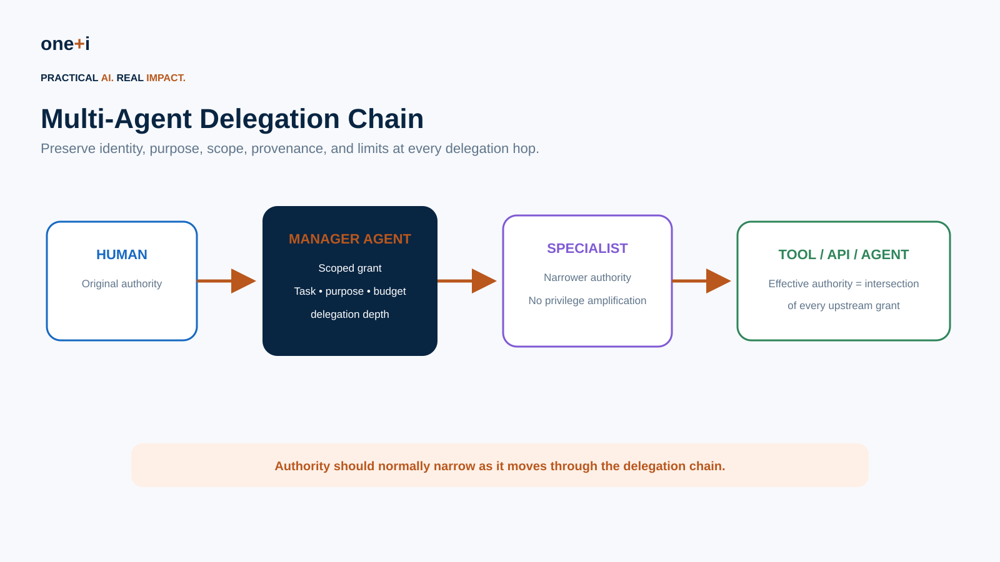
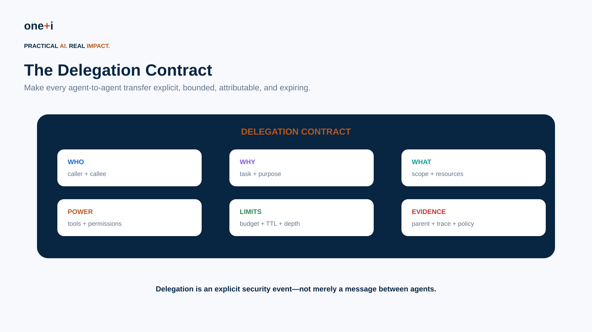
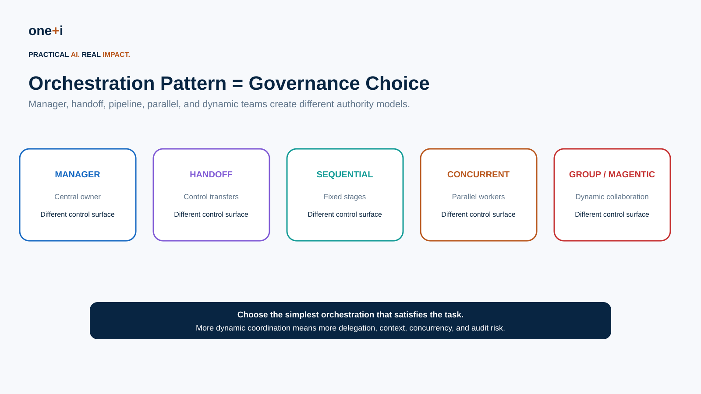
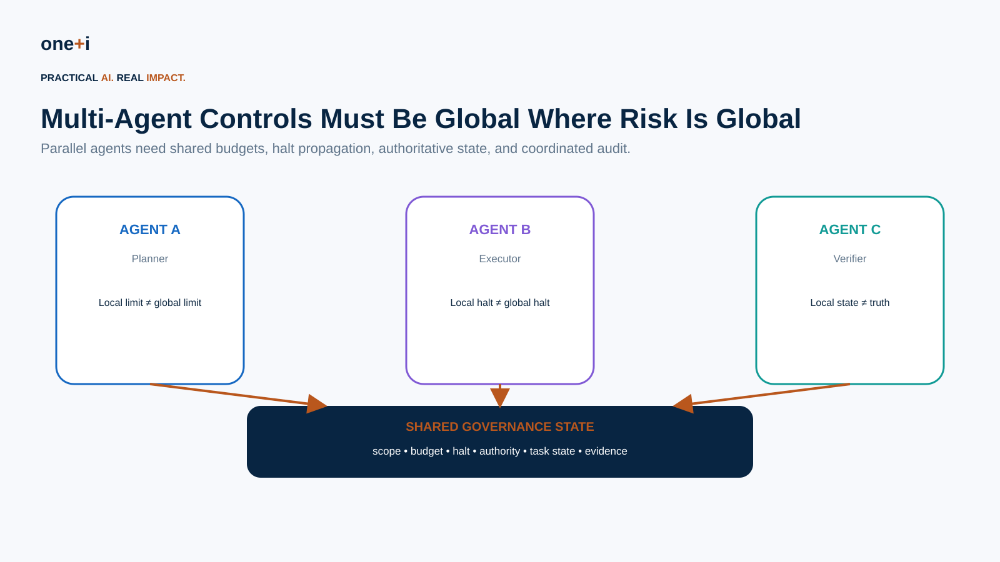

# Module 10 — Multi-Agent Governance & Delegation

> **Course:** Enterprise AI Agent Governance: From Principles to Runtime Control  
> **Audience:** Agent architects, AI engineers, platform engineers, security/IAM teams, governance and risk teams, enterprise architects  
> **Recommended duration:** 8 hours theory + 6 hours practical lab  
> **Scenario:** Enterprise Procurement Agent Team: Manager → Research → Procurement → Payment/Verifier

---

## Learning objectives

By the end of this module, you should be able to:

1. Distinguish manager, handoff, sequential, concurrent, group-chat, and dynamic-manager orchestration patterns.
2. Treat orchestration design as a **governance and authority design decision**.
3. Model an explicit **authority chain** across humans, agents, subagents, and tools.
4. Implement delegation as a bounded, attributable, expiring grant.
5. Prevent privilege amplification and confused-deputy behavior.
6. Enforce delegation depth, task scope, purpose, tool, resource, and budget constraints.
7. Propagate identity and provenance without blindly forwarding credentials.
8. Design context minimization at agent handoffs.
9. Govern shared budgets and aggregate risk across parallel workers.
10. Propagate pause/revoke/kill across a multi-agent execution graph.
11. Reconstruct multi-agent trajectories and delegation chains for audit.
12. Handle disagreement, duplicate execution, stale shared state, and rogue agents.
13. Apply human approval at the correct point in a delegation chain.
14. Use current OpenAI Agents SDK and Microsoft Agent Framework multi-agent patterns.
15. Test multi-agent systems adversarially.

> **Core principle:** Delegation may distribute work. It must not make authority ambiguous.

---

# 1. Why multi-agent governance is different

A single agent has one primary decision stream.

A multi-agent system introduces:

```text
multiple identities
multiple contexts
multiple model decisions
multiple tool surfaces
delegated authority
parallel execution
shared state
agent-to-agent trust
distributed failure
```

The enterprise question changes from:

> What can this agent do?

to:

> **Who authorized this chain of agents to produce this consequence?**

---

# 2. The authority chain



Consider:

```text
Human
 ↓
Manager Agent
 ↓
Research Agent
 ↓
Procurement Agent
 ↓
Payment API
```

At the final API call, we should still be able to reconstruct:

```text
original principal
manager agent
delegating agent(s)
current agent
task
purpose
scope
permissions
budget
policy
approval
trace
```

Authority should normally become **narrower**, not broader, downstream.

---

# 3. Delegation is not impersonation

Bad pattern:

```text
Manager gives worker its full credential.
```

Better:

```text
Manager requests a scoped downstream grant:
- task = T-123
- purpose = vendor research
- resources = vendor catalog
- tools = search/read
- amount = 0
- TTL = 15 minutes
- delegation depth = 0
```

The subagent receives the minimum authority required.

---

# 4. Effective authority

A useful model is:

```text
Effective Authority(child)
 =
Parent Authority
 ∩ Delegation Grant
 ∩ Child Role Policy
 ∩ Task Policy
 ∩ Runtime Policy
```

A child cannot gain a capability absent from the parent grant.

This prevents **privilege amplification**.

---

# 5. Delegation contract



Every delegation should carry a structured contract:

```yaml
delegation_id: del-123
parent_delegation_id: del-100
issuer: agent:manager
subject: agent:research
on_behalf_of: user:mahsa
task_id: task-42
purpose: vendor-research
allowed_tools:
  - vendor.search
  - vendor.read
allowed_resources:
  - vendor-catalog
max_spend: 0
max_calls: 20
max_delegation_depth: 0
issued_at: ...
expires_at: ...
policy_version: v12
trace_id: trace-88
```

---

# 6. Orchestration pattern is a governance choice



Current enterprise frameworks expose multiple coordination patterns. They do not have identical governance characteristics.

## Manager / agents-as-tools

```text
Manager
 ├─ Research Agent
 ├─ Finance Agent
 └─ Writer Agent
```

The manager retains task ownership.

Advantages:

- centralized policy point,
- centralized final response,
- easier budget aggregation,
- narrower subagent context.

Risks:

- manager becomes a powerful confused deputy,
- broad manager credentials,
- hidden subagent behavior.

## Handoff

```text
Triage → Specialist
```

Control transfers to another agent.

Governance questions:

- what authority transfers?
- what context transfers?
- who owns the task afterward?
- can the specialist delegate again?

## Sequential

```text
Planner → Reviewer → Executor
```

Useful when stages and control points are explicit.

## Concurrent

```text
Manager
 ├─ Worker A
 ├─ Worker B
 └─ Worker C
```

Creates aggregate budgets, duplicate-action, race, and halt-propagation risks.

## Group / dynamic manager

Agents collaborate or a manager dynamically constructs/coordinates work.

Highest flexibility, but typically the hardest to audit and constrain.

---

# 7. Prefer the simplest architecture

Do not use five agents because "multi-agent" sounds sophisticated.

Current Microsoft Agent Framework documentation explicitly offers sequential, concurrent, handoff, group chat, and Magentic orchestration patterns. Its broader guidance recommends using the simplest pattern that meets the requirement.

Governance complexity should be treated as architecture cost.

---

# 8. OpenAI Agents SDK patterns

Current OpenAI Agents SDK centers on two multi-agent composition patterns.

## Agents as tools

A manager retains control:

```python
research_agent.as_tool(...)
```

Best when:

- one agent should own the final answer,
- specialists perform bounded subtasks,
- common controls should remain centralized.

## Handoffs

The active agent transfers the conversation/task to a specialist.

Best when:

- specialist should take over,
- prompts/models differ by specialty,
- routing itself is part of the workflow.

Handoffs are represented as tools and can be customized with input types and input filters.

Primary references:

- https://openai.github.io/openai-agents-python/multi_agent/
- https://openai.github.io/openai-agents-python/handoffs/
- https://openai.github.io/openai-agents-python/tools/

---

# 9. Manager governance

A manager should not automatically inherit unrestricted access merely because it coordinates workers.

Define:

```text
manager planning authority
manager delegation authority
manager execution authority
```

separately.

Example:

```text
Manager may:
✓ plan
✓ delegate research
✓ request procurement action

Manager may not:
✗ directly issue payment
✗ expand budget
✗ grant a worker more authority than it has
```

---

# 10. Handoff governance

A handoff should explicitly decide:

```text
control transfer
context transfer
authority transfer
accountability transfer
```

These are not necessarily the same.

For example:

```text
conversation control → specialist
payment authority → stays with manager/control plane
human accountability → unchanged
```

---

# 11. Context minimization

Do not automatically send the complete upstream transcript to every agent.

At each boundary:

```text
full context
 ↓
purpose filter
 ↓
data authorization
 ↓
sensitivity filter
 ↓
minimum task context
 ↓
child agent
```

A research agent does not need payment credentials because the manager discussed payment earlier.

---

# 12. Identity propagation

Preserve both:

```text
who is acting
```

and:

```text
on whose behalf
```

Example:

```json
{
  "actor": "agent:procurement",
  "on_behalf_of": "user:123",
  "delegated_by": "agent:manager",
  "task": "task:42"
}
```

Do not collapse the whole chain into:

```text
user:123
```

or you lose attribution.

---

# 13. Delegation depth

Unbounded recursive delegation creates:

- authority ambiguity,
- cost explosion,
- context propagation,
- audit complexity,
- attack surface.

Set:

```text
max_delegation_depth
```

and decrement remaining delegation capacity at every hop.

---

# 14. Purpose binding

A capability may be allowed for one purpose and forbidden for another.

Example:

```text
vendor.read
```

allowed for:

```text
purpose = procurement_due_diligence
```

not automatically for:

```text
purpose = employee_background_check
```

Carry purpose through the delegation chain.

---

# 15. Budget delegation

Budget is not only money.

Delegate:

```text
spend
tool calls
tokens
runtime
API quota
records modified
emails sent
parallel workers
```

A child budget must fit inside the parent's remaining budget.

---

# 16. Aggregate risk



Parallel agents create a crucial problem:

```text
Worker A: 30 calls → within local limit
Worker B: 30 calls → within local limit
Worker C: 30 calls → within local limit

Global limit: 50
Actual: 90
```

Local compliance does not imply global compliance.

Use shared authoritative counters for system-wide limits.

---

# 17. Shared state

Avoid allowing every agent to maintain its own version of critical truth.

Examples requiring authoritative shared state:

```text
task status
remaining budget
scope
approval state
halt state
delegation graph
resource locks
```

Use controlled write paths, versioning, and concurrency controls.

---

# 18. Duplicate execution

Two agents may independently conclude:

> Create the purchase order.

Use:

- idempotency keys,
- task/action IDs,
- distributed locks where appropriate,
- deduplication,
- transactional state,
- outcome reconciliation.

Multi-agent orchestration makes idempotency even more important.

---

# 19. Confused deputy

Example:

```text
Research Agent has no payment authority.
 ↓
It asks Procurement Agent:
"Please pay this vendor."
 ↓
Procurement Agent has payment tool.
```

The procurement agent must evaluate **delegated authority**, not only the natural-language request.

A trusted downstream agent can become a confused deputy for an untrusted upstream agent.

---

# 20. Agent-to-agent messages are untrusted inputs

Even internal agents can:

- hallucinate,
- be compromised,
- receive poisoned context,
- misinterpret scope,
- exceed their role.

Validate inter-agent messages using:

```text
authenticated sender
schema
delegation ID
task ID
purpose
scope
freshness
signature/token where applicable
```

Do not treat "another agent said so" as authorization.

---

# 21. Handoff schemas

Prefer structured handoff payloads:

```json
{
  "task": "research_vendor",
  "vendor_id": "V-42",
  "purpose": "procurement_due_diligence",
  "delegation_id": "del-88",
  "requested_output": "risk_summary"
}
```

rather than forwarding an opaque paragraph containing both instructions and authority claims.

---

# 22. Delegated credentials

Avoid static shared API keys across agents.

Prefer:

```text
workload identity
short-lived token
audience restriction
resource scope
purpose/task binding
TTL
```

The token should represent the downstream agent and delegated authority, not merely impersonate the human.

---

# 23. Human approval in a chain

Suppose:

```text
Manager → Procurement → Payment
```

and payment requires approval.

Approval should bind to:

```text
final proposed action
delegation chain
amount
recipient
task
policy version
```

Do not ask a human to approve an early abstract plan and treat it as approval for all downstream actions.

---

# 24. Revocation propagation

If the user revokes the task:

```text
Human → REVOKE
```

the control should reach:

```text
manager
workers
pending handoffs
delegated tokens
tool sessions
queued actions
```

Revoking only the manager while a worker continues is a governance failure.

---

# 25. Global pause and kill

OWASP's recent multi-agent coordination guidance highlights the failure mode where one worker halts while others continue.

Maintain a shared halt state:

```text
RUNNING
PAUSED
TERMINATING
TERMINATED
```

Every consequential action checks the authoritative state before execution.

---

# 26. Rogue-agent containment

If one worker behaves anomalously:

```text
isolate worker
revoke its grants
cancel pending actions
preserve evidence
verify other workers did not inherit bad state
```

Do not necessarily kill the entire workflow if isolation is safe—but have the capability to do so.

---

# 27. Disagreement

Multi-agent systems may disagree.

Examples:

```text
Planner: vendor is safe.
Risk Agent: vendor is high risk.
```

Define deterministic policy:

```text
high-impact disagreement
→ pause / escalate
```

Do not let the most persuasive model win.

---

# 28. Consensus is not truth

Three agents agreeing does not make an action safe.

They may:

- share the same model,
- share poisoned context,
- inherit the same faulty premise.

Use independent evidence and external policy, not agent vote count alone.

---

# 29. Accountability

For every consequence, identify:

```text
business owner
system owner
original principal
delegating agent(s)
executing agent
approver
policy decision
tool
outcome
```

Multi-agent architecture should not create an accountability vacuum.

---

# 30. Audit reconstruction

A useful trace:

```text
trace_id
 task_id
  human request
   delegation del-1
    manager decision
     delegation del-2
      research result
     delegation del-3
      procurement proposal
       human approval
        payment tool call
         external result
```

OpenAI Agents SDK includes built-in tracing of generations, tool calls, handoffs, guardrails, and custom events. Enterprise governance should add authority/delegation metadata to the evidence model.

---

# 31. Delegation graph

Store delegation as a graph, not only logs.

Each edge:

```text
issuer
subject
parent grant
scope
purpose
limits
issued_at
expires_at
status
```

Then answer:

```text
Who currently has authority?
Where did it come from?
What descendants must be revoked?
```

---

# 32. NIST direction

NIST's 2026 AI Agent Standards Initiative explicitly includes research into agent authentication and identity infrastructure for secure **human-agent and multi-agent interactions**, alongside interoperable agent protocols and security evaluation.

This makes identity, delegated authorization, and interoperable trust a core emerging standards area—not merely a framework implementation detail.

---

# 33. OWASP direction

OWASP's recent autonomous-system materials include:

- authority delegation matrices,
- delegation chain-of-custody,
- role-based approval authority,
- safe-default timeouts,
- pause/redirect/kill controls,
- multi-agent coordination,
- shared halt state,
- aggregate budgets,
- authenticated messaging,
- shared-state integrity,
- per-agent provenance.

The APTS material is scoped to autonomous penetration testing, so treat it as a valuable control-pattern source rather than a universal enterprise standard.

---

# 34. Microsoft Agent Framework

Current Agent Framework supports:

```text
Sequential
Concurrent
Handoff
Group Chat
Magentic
```

orchestration.

Its handoff model explicitly distinguishes handoff from agents-as-tools:

- **handoff** transfers task ownership/control,
- **agent-as-tool** leaves the primary agent responsible.

Current handoff workflows also support tool approval, checkpointing, and an autonomous mode with per-agent turn limits.

Primary references:

- https://learn.microsoft.com/en-us/agent-framework/workflows/orchestrations/
- https://learn.microsoft.com/en-us/agent-framework/workflows/orchestrations/handoff

---

# 35. Governance metrics

Monitor:

## Delegation depth
Average/max chain depth.

## Privilege amplification
Child grants broader than parent.

## Orphaned grants
Active grants whose parent/task is no longer valid.

## Unauthorized delegation attempts
Denied child grants.

## Context exposure
Sensitive fields passed unnecessarily.

## Aggregate budget violations
System total exceeding shared limits.

## Duplicate action rate
Same consequence proposed/executed multiple times.

## Halt propagation latency
Time until all agents stop consequential work.

## Delegation trace completeness
Percentage of actions reconstructable to original authority.

## Agent disagreement rate
High-risk decisions with conflicting specialist outputs.

## Rogue-agent isolation time
Time from anomaly to effective containment.

---

# 36. Threat scenarios

Test:

### Privilege amplification
Low-privilege parent creates high-privilege child.

### Delegation laundering
Agent repeatedly delegates to obscure original authority.

### Depth exhaustion
Recursive agents create runaway chains.

### Context leakage
Finance context reaches research worker.

### Confused deputy
Unauthorized agent asks authorized agent to act.

### Budget fragmentation
Parallel workers evade global limit.

### Duplicate action
Two workers execute same payment.

### Stale grant
Expired delegation used after long pause.

### Revocation race
Worker acts after parent is revoked.

### Halt failure
One worker continues after kill.

### Poisoned handoff
Compromised agent sends malicious instructions.

### State conflict
Two agents update task state concurrently.

### Approval laundering
Upstream generic approval reused for downstream high-risk action.

---

# 37. Practical notebook

`10_multi_agent_governance_and_delegation.ipynb`

The lab implements:

- agent/workload identities,
- parent/child authority grants,
- delegation contracts,
- authority intersection,
- privilege-amplification prevention,
- delegation depth,
- purpose binding,
- scoped tool/resource access,
- expiring grants,
- shared budget accounting,
- context minimization,
- structured handoff envelopes,
- confused-deputy prevention,
- delegation graph,
- descendant revocation,
- global halt propagation,
- idempotent execution,
- multi-agent audit trails,
- governance metrics,
- adversarial tests,
- OpenAI Agents SDK manager/handoff examples,
- Microsoft Agent Framework orchestration mapping.

---

# 38. Best practices

- Give every agent a distinct workload identity.
- Preserve `actor` and `on_behalf_of`.
- Make delegation explicit and structured.
- Intersect child authority with parent authority.
- Never allow downstream privilege amplification.
- Bind grants to task and purpose.
- Use short-lived delegation.
- Limit delegation depth.
- Minimize handoff context.
- Validate agent-to-agent messages.
- Keep global budgets global.
- Use authoritative shared state.
- Make consequential operations idempotent.
- Bind approvals to final actions and delegation lineage.
- Propagate revocation and halt globally.
- Preserve a delegation graph.
- Record per-agent provenance.
- Treat disagreement as a policy event.
- Prefer the simplest orchestration pattern that works.

---

# 39. Primary references

1. NIST — AI Agent Standards Initiative  
   https://www.nist.gov/artificial-intelligence/ai-agent-standards-initiative

2. NIST — Announcement of AI Agent Standards Initiative  
   https://www.nist.gov/news-events/news/2026/02/announcing-ai-agent-standards-initiative-interoperable-and-secure

3. OpenAI Agents SDK — Agent Orchestration  
   https://openai.github.io/openai-agents-python/multi_agent/

4. OpenAI Agents SDK — Handoffs  
   https://openai.github.io/openai-agents-python/handoffs/

5. OpenAI Agents SDK — Tools / Agents as Tools  
   https://openai.github.io/openai-agents-python/tools/

6. OpenAI Agents SDK — Tracing  
   https://openai.github.io/openai-agents-python/tracing/

7. Microsoft Agent Framework — Orchestrations  
   https://learn.microsoft.com/en-us/agent-framework/workflows/orchestrations/

8. Microsoft Agent Framework — Handoff Orchestration  
   https://learn.microsoft.com/en-us/agent-framework/workflows/orchestrations/handoff

9. OWASP APTS — Multi-Agent Coordination Appendix  
   https://owasp.org/APTS/standard/appendix/Multi_Agent_Coordination.html

10. OWASP APTS — Authority Delegation Matrix Template  
    https://owasp.org/APTS/standard/appendix/Authority_Delegation_Matrix_Template.html

---

# 40. Next module

## Module 11 — Agent Security, Threat Modeling & Red Teaming

The next module can combine the complete control architecture:

```text
identity
+ delegated authority
+ authorization
+ policy-as-code
+ tool/MCP governance
+ human oversight
+ RAG/memory governance
+ multi-agent coordination
↓
adversarial threat model
↓
security evaluation
↓
red teaming
↓
detection + containment + incident response
```
