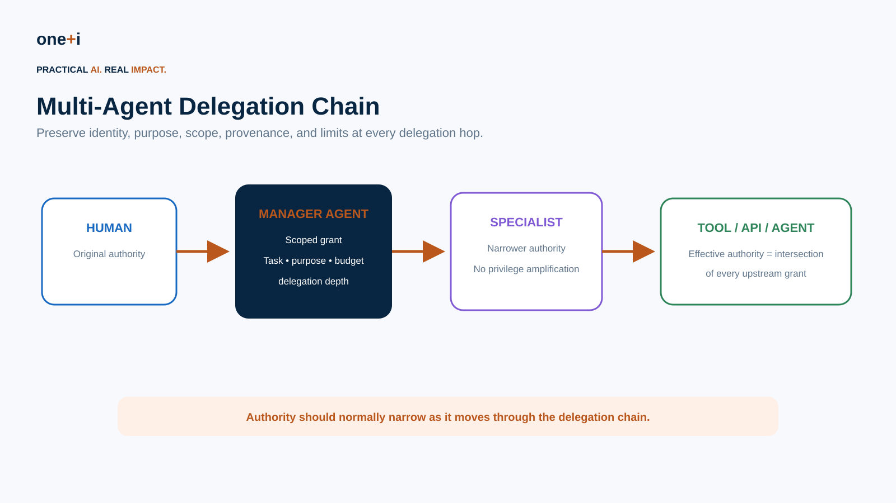
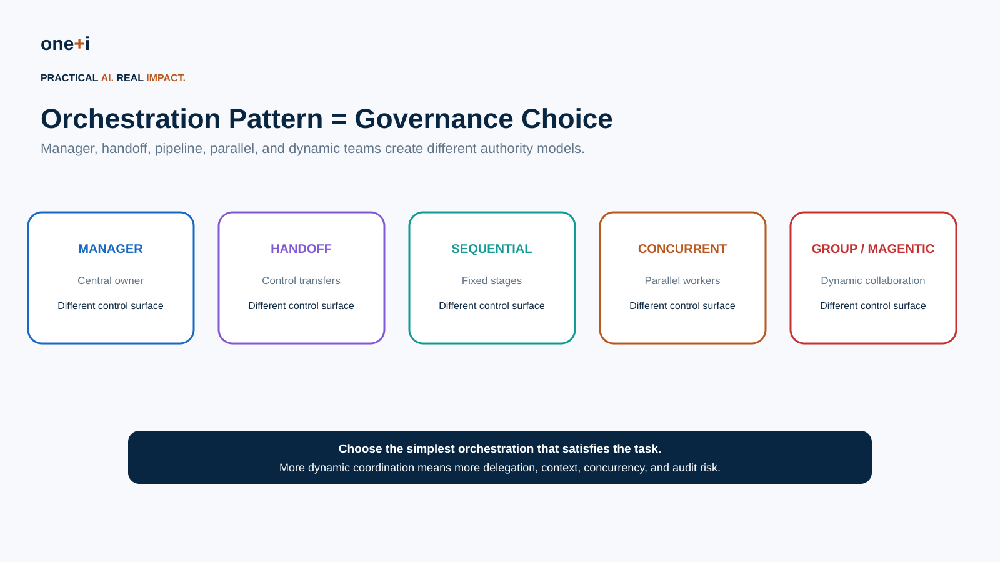
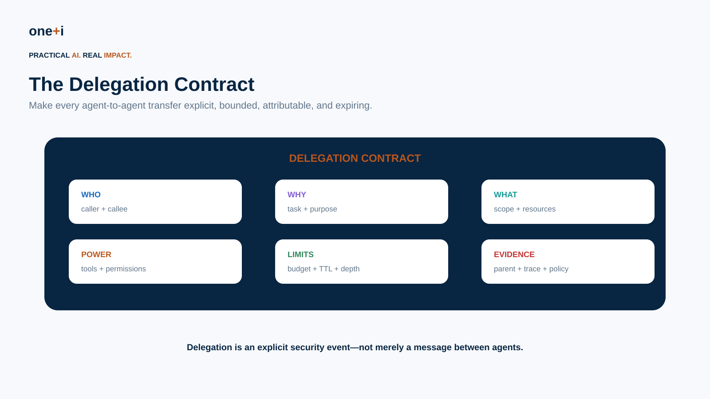
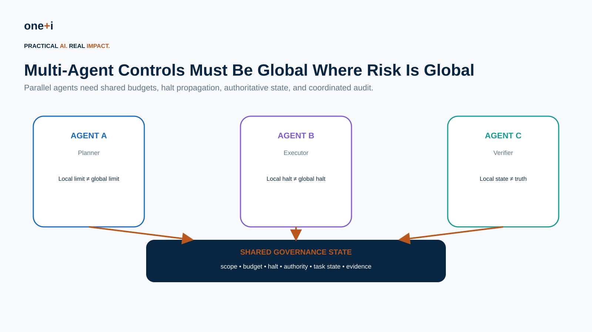

# Module 10 — Multi-Agent Governance & Delegation

> **Course:** Enterprise AI Agent Governance: From Principles to Runtime Control
> **Audience:** Agent architects, AI engineers, platform and IAM engineers, security teams, and governance leaders
> **Duration:** 7 hours of guided study plus a 5-hour practical lab
> **Scenario:** A procurement manager delegates vendor research and purchase-order work to specialist agents

## Course thesis

Multi-agent coordination is safe only when conversational control and application authority remain separate. A manager or specialist may propose a handoff, but trusted application code must authenticate every actor, issue an attenuated grant, validate the exact recipient and task, enforce shared budgets and lifecycle state, and independently authorize every consequential tool call.



## Prerequisites

You should be comfortable with Python data models and tests, agent tool calling, and the identity and authorization boundaries from:

- [Course 4 — Agent Identity & Delegated Authority](../../beginner/04-agent-identity-and-delegated-authority/README.md);
- [Course 5 — Fine-Grained Authorization](../../beginner/05-fine-grained-authorization-for-agents/README.md);
- [Course 7 — Tool & MCP Governance](../07-tool-and-mcp-governance/README.md); and
- [Course 8 — Human Oversight & Bounded Autonomy](../08-human-oversight-and-bounded-autonomy/README.md).

The lab runs locally without credentials. It uses Pydantic, the OpenAI Agents SDK, Microsoft Agent Framework metadata, locks, and deterministic fixtures. No model or external service is called.

## Learning objectives

By the end of the course, you can:

1. decide whether one agent, a manager, a handoff, a pipeline, or parallel workers best fits a task;
2. separate task ownership, context transfer, and conversational routing from authority transfer;
3. represent root and child authority as application-issued, task-bound, expiring grants;
4. prove that child tools, resources, amount, budgets, depth, purpose, tenant, task, and lifetime never exceed the parent;
5. prevent confused-deputy and privilege-amplification attacks at the tool boundary;
6. preserve `actor`, `on_behalf_of`, issuer, audience, lineage, and policy version;
7. minimize and integrity-protect handoff context;
8. enforce global spend, call, pause, kill, replay, and revocation controls across workers;
9. compare OpenAI Agents SDK and Agents API, Microsoft Agent Framework, LangGraph, AutoGen, Google ADK, CrewAI, A2A, and MCP by control surface;
10. evaluate a baseline and governed architecture against one labelled population.

## Success criteria

You have completed the course when you can demonstrate that:

- all seven forbidden cases in the lab are blocked while the legitimate case succeeds;
- changing tenant, task, purpose, recipient, tool, resource, amount, expiry, budget, or depth fails closed;
- the same operation replays safely but changed arguments under the same operation ID are rejected;
- six concurrent CAD 4,000 attempts cannot exceed the CAD 20,000 task budget;
- pausing, terminating, expiring, or revoking a lineage prevents the next consequence;
- a handoff to research releases only the allowlisted vendor fields, while poisoned or excessive context fails closed;
- real OpenAI Agents SDK manager/handoff objects and a Microsoft Agent Framework handoff workflow can be constructed without turning their configuration into authorization.

## Non-goals

This course does not claim that:

- multiple agents are inherently better than one well-scoped agent;
- a role name, system prompt, schema-valid message, Agent Card, or framework route grants authority;
- an immutable Pydantic model or in-memory registry is a production token issuer or authorization service;
- a process-local lock or ledger replaces a transactional database across replicas;
- tracing proves that an action was authorized or that its external outcome occurred;
- consensus among agents establishes truth;
- A2A or MCP supplies business authorization merely because transport authentication succeeds.

## Claim-to-proof map

| Claim | Executable proof |
|---|---|
| Child authority cannot exceed parent or role policy | tool, resource, amount, budget, depth, purpose, tenant, task, lifetime tests |
| A delegation is attributable and cannot mutate on retry | application registry, lineage, stable operation digest, and mutation tests |
| Handoff is not authority | recipient/boundary/context-digest tests plus independent action authorization |
| Context is minimized | positive allowlist and sensitive-key exclusion tests |
| A privileged specialist is not a confused deputy | actor, audience, tool, resource, tool-resource pair, and amount tests |
| Parallel workers share aggregate limits | concurrent spend and call-budget tests |
| Lifecycle controls reach descendants | expiry, pause, termination, and revocation-cascade tests |
| Retries do not duplicate consequences | stable operation ID, same receipt, mutation rejection |
| Framework objects are composition artifacts | credential-free OpenAI `Agent`, `as_tool`, and `handoff` construction |
| Governance changes measured outcomes | eight-case baseline-versus-governed evaluation |

---

## 1. Why multi-agent governance is different

A second agent is not merely another prompt. It creates another identity, context, state machine, credential path, failure domain, and source of potentially untrusted messages. Parallel and recursive work also creates aggregate risk that no local agent can see.

The central question is not “which agent said this?” It is:

> Which authenticated principal authorized this exact chain to cause this exact consequence, under which policy and remaining budget?

Use the same boundary throughout the course:

```text
model or agent      → proposes route, delegation, arguments, result
trusted application → authenticates, attenuates, validates, authorizes,
                      reserves budget, executes, verifies, records
```

An agent message is data. It can request authority; it cannot manufacture it.

## 2. Start with one agent

The OpenAI orchestration guide recommends adding specialists only when the contract changes—for example, different tools, policy, instructions, or ownership. Handoffs transfer conversational ownership; “agents as tools” lets the manager keep ownership of the final response. This distinction is useful, but neither pattern defines business authority by itself ([OpenAI, Orchestration and handoffs](https://developers.openai.com/api/docs/guides/agents/orchestration)).

Choose the simplest architecture that satisfies the task:

| Pattern | Best fit | Authority/control benefit | Typical failure |
|---|---|---|---|
| One agent | one policy and tool surface | fewest boundaries | overloaded prompt or excessive tools |
| Manager / agents as tools | bounded specialists, central synthesis | central final owner and budget view | powerful confused deputy; bottleneck |
| Handoff | specialist should own the next interaction | explicit ownership change | context/authority accidentally move together |
| Sequential workflow | ordered, reviewable stages | deterministic control points | stale or poisoned intermediate state |
| Concurrent workers | independent evidence gathering | lower wall time | duplicated work, shared-budget race |
| Group/dynamic manager | open-ended collaboration | flexible decomposition | loops, unclear ownership, high coordination tax |



Record why the extra agent is needed. Evaluate the coordination tax: more model calls, context copies, traces, handoffs, failure paths, and privileged capability exposure.

## 3. Four transfers that must not be conflated

A handoff may change any of these independently:

1. **Conversational control** — which agent produces the next reply.
2. **Task ownership** — which component is responsible for completion.
3. **Context** — which facts or history the recipient receives.
4. **Authority** — which application actions the recipient may perform.

Example: the procurement specialist may take ownership of drafting a purchase order and receive vendor facts, while payment authority stays in a separate trusted service and human accountability stays with the procurement lead.

Microsoft Agent Framework documents the same ownership distinction: a handoff transfers control and task ownership, while an agent-as-tool returns control to the primary agent. Its handoff runtime can synchronize conversation context and filter tool-control contents, but application designers still own data minimization and authorization ([Microsoft, Handoff orchestration](https://learn.microsoft.com/en-us/agent-framework/workflows/orchestrations/handoff/)).

## 4. Authority attenuation

Let a grant be a set of permitted consequences and limits. A child grant must satisfy:

```text
ChildAuthority ⊆ ParentAuthority ∩ ChildRolePolicy ∩ TaskPolicy ∩ RuntimePolicy
```

Check every dimension, not only a list of tools:

```text
tenant        child == parent
task          child == parent
purpose       child == parent
tools         child ⊆ parent and child role
resources     child ⊆ parent and child role
tool/resource pair must be permitted by application policy
max amount    child ≤ parent
spend/calls   child ≤ parent; actual consumption shared at root
depth         child depth ≤ parent maximum
expiry        child expiry ≤ parent expiry
```

Independent set checks are insufficient. A grant containing both `po.create` and `vendor-catalog` must not imply that `po.create(vendor-catalog)` is valid. The lab therefore checks the tool-resource pair at execution.

## 5. Delegation contract



The lab’s immutable `DelegationGrant` includes:

```yaml
grant_id: GRANT-...
parent_grant_id: GRANT-root
issuer_id: agent:manager
subject_agent_id: agent:procurement
on_behalf_of: user:procurement-lead
tenant_id: tenant-acme
task_id: task:buy-laptops
purpose: approved_procurement
allowed_tools: [vendor.read, po.create]
allowed_resources: [vendor-catalog, procurement]
allowed_tool_resource_pairs: [[vendor.read, vendor-catalog], [po.create, procurement]]
allowed_vendors: [V-42]
maximum_action_spend_cad: 10000
maximum_calls: 10
remaining_delegation_depth: 1
issued_at: 2026-09-27T12:00:00Z
expires_at: 2026-09-27T12:20:00Z
policy_version: policy-10.1
trace_id: trace-procurement-0042
version: 1
```

The application registry accepts only grants it issued and rejects a repeated operation whose canonical request digest changed. In production, use workload identity plus a durable authorization service and managed token or reference-grant issuer; a frozen local object is only a teaching mechanism.

### Capability versus bearer token

A short-lived capability can encode or reference authority, but possession alone should not erase actor identity. Bind it to subject/audience, tenant, task, purpose, and policy. OAuth 2.0 Token Exchange standardizes one way to exchange a subject token and optional actor token for a downstream token; it is a protocol building block, not a substitute for the business policy in this course ([RFC 8693](https://www.rfc-editor.org/rfc/rfc8693)).

## 6. Issuance and idempotency

Only trusted application code issues grants. The control plane derives the root grant from an authenticated context, then checks each child request against the recorded parent and role policy.

Issuance has two IDs:

- `operation_id` is stable across retries;
- `grant_id` is derived from the canonical request.

Repeating the same operation returns the same grant. Reusing the operation ID with different scope fails with `DELEGATION_OPERATION_MUTATION` (or the corresponding task, handoff, approval, action, or lease mutation code). This prevents a timed-out retry from minting a second authority object or silently changing the original.

## 7. Identity and provenance

Keep these identities distinct:

```text
principal       authenticated human or service
issuer          agent/service delegating authority
subject         exact agent workload receiving the grant
on_behalf_of     original represented principal
executor        workload calling the tool
approver         trusted actor approving a final proposal, when required
```

Do not infer identity from an agent name, prompt, message body, or tool argument. Bind workload identity through the runtime and verify that the tool caller equals the grant subject.

The delegation graph is operational state, not merely a trace. It answers who has authority now, where it came from, and which descendants revocation must reach.

## 8. Handoff envelope and context minimization

The lab handoff carries parties, grant reference, tenant, task, purpose, requested output, intentionally selected context, and a payload digest. Validation checks the authenticated sender's tenant and task, matches the complete envelope to the application-issued registry record, and fails the whole handoff if a field or classification exceeds the recipient policy. The local registry is the integrity authority; the digest alone is not a signature and cannot resist an attacker who can replace both data and digest.

Use a positive allowlist:

```text
full upstream context
  → role/task allowlist
  → remove secrets and unrelated sensitive data
  → digest exact minimized payload
  → recipient
```

Do not broadcast a complete transcript merely because a framework can. Conversation history may contain credentials, unrelated customer data, instructions from a compromised agent, or authority claims. Tool-control messages are especially dangerous when forwarded as normal content.

## 9. Confused deputy defense

A confused deputy has legitimate power but uses it for a caller that lacks authority:

```text
Research agent: “Pay vendor V-42.”
Procurement agent: has a privileged tool.
```

The procurement agent’s role and the natural-language request are not enough. Immediately before execution, the trusted adapter checks:

- caller workload equals grant subject;
- grant is recorded, current, unexpired, and not revoked;
- all ancestors remain valid;
- tenant, task, and purpose match;
- tool, resource, and the tool-resource pair are allowed;
- amount is within the grant;
- global run state and root budgets permit the action;
- operation ID is new or an exact replay.

The check occurs again at the consequence boundary even if the orchestrator already routed or validated the message.

### Proposal-bound human approval

The lab requires approval above CAD 5,000. `ApprovalReceipt` binds the exact proposal digest, grant, lineage-version digest, tenant, task, approver group, policy version, issue time, and expiry. It is consumed atomically with the simulated action. Changing the amount or lineage invalidates it; an exact operation replay returns the existing receipt rather than consuming approval twice.

The returned `ActionReceipt` is deliberately marked `status="simulated"` with a `SIM-PO-...` identifier. It proves the local authorization and idempotency path only. A production adapter must call the external system, capture its authoritative outcome identifier, and reconcile unknown outcomes before retrying.

## 10. Aggregate budgets and concurrency



Local limits do not bound aggregate risk:

```text
Workers A–F each request CAD 4,000
Task budget is CAD 20,000
```

All six workers can be locally compliant. The lab uses one lock-protected task ledger, so exactly five simulations can be recorded. Production systems should reserve and consume budgets with transactional rows, compare-and-swap, serializable transactions, or another linearizable service. A cache or eventually consistent counter is not adequate for hard financial limits.

Track budgets for spend, tool calls, tokens, runtime, records changed, messages, handoffs, depth, and parallelism as the domain requires. Report both wall-clock latency and total work: parallelism may reduce one while increasing the other.

The lab also issues expiring `WorkerLease` records under one task-wide parallelism cap. Four concurrent lease attempts against a limit of three produce three leases and one denial. Production leases need durable fencing so a delayed worker cannot act after its slot was reassigned.

## 11. Pause, termination, expiry, and revocation

Every consequential adapter reads the authoritative run state before acting:

```text
RUNNING → PAUSED → RUNNING
RUNNING or PAUSED → TERMINATING → TERMINATED
```

`TERMINATED` cannot transition back. Revoking a parent marks all current descendants revoked. A queued worker still needs to recheck immediately before execution; cancellation only stops the next work, not an external effect already committed.

Real distributed systems also need:

- token/session revocation or very short TTLs;
- queue cancellation and stale-message rejection;
- fencing tokens for workers that may resume late;
- reconciliation for unknown external outcomes;
- evidence preservation for incident response.

## 12. Shared state and result contracts

Keep critical truth in authoritative application state:

```text
task lifecycle, current owner, grant lineage, budget, policy version,
approval state, run state, operation receipts, external outcome
```

Agent scratchpads and chat history are not authoritative stores. Use optimistic version checks or transactions for concurrent state transitions. A specialist result should be typed and attributable, but still treated as untrusted evidence until schema, provenance, and domain checks pass.

When specialists disagree, deterministic policy decides the disposition. The lab escalates conflicting low/high vendor-risk findings and preserves their evidence IDs; it does not let a majority vote or the most persuasive response authorize work.

Avoid text-based terminal conditions such as “DONE” or “RESOLVED.” Completion is an application-owned state reached only after required results and external outcomes are verified.

## 13. Orchestration and protocol landscape

| Technology | Useful primitives | Strengths | Governance caveat | Best fit |
|---|---|---|---|---|
| OpenAI Agents SDK | `Agent`, `as_tool`, `handoff`, sessions, tracing | compact manager/handoff composition | route and trace do not grant business authority | in-process agent applications |
| OpenAI Agents API | independently addressable agents, subagent tasks, shared environments, concurrency limits | hosted delegation and parallel specialist execution | task dispatch and shared state do not replace business authorization | hosted asynchronous agent workloads |
| Microsoft Agent Framework | sequential, concurrent, handoff, group, Magentic, checkpoints | explicit/durable workflow options and approvals | synchronized context can exceed least data | enterprise .NET/Python workflows |
| LangGraph | state graph, checkpoints, interrupts | explicit state transitions and recovery | graph state still needs IAM and tenant isolation | durable custom workflows |
| AutoGen | conversational teams and group coordination | flexible experimentation | dynamic conversations enlarge audit/control surface | research and bounded collaboration |
| Google ADK | LLM, sequential, parallel, and loop agents; subagents; A2A | multi-language workflow and remote-agent options | parent/child routing and session state are not delegated business authority | Google-oriented and A2A applications |
| CrewAI | Crews, Flows, agents, tasks, tools | combines autonomous teams with structured event-driven flows | role goals and task delegation still need external identity and consequence controls | hybrid flow-and-team automation |
| A2A | Agent Card, messages, tasks, artifacts, streaming | cross-language/runtime interoperability | discovery metadata and transport auth are not delegated authority | remote agent-to-agent tasks |
| MCP | tools, resources, prompts | common agent-to-tool/context interface | tool description is untrusted metadata; server scope needs policy | tool and data integration |

The table is a selection aid, not a maturity ranking. Current official material describes independent subagents and shared environments in the OpenAI Agents API, subagents and workflow agents in Google ADK, structured Flows plus autonomous Crews in CrewAI, and subagent/handoff/router/custom-workflow patterns in LangChain. The governance questions stay the same: who owns state, which context crosses the boundary, how authority narrows, and where the final effect is checked.

The A2A 1.0 specification defines discovery, messages, tasks, artifacts, operations, and multiple protocol bindings for opaque remote agents. It aims to avoid exposing internal memory or tools, but its Agent Card describes capability and security requirements rather than proving authorization for a particular business consequence ([A2A specification](https://a2a-protocol.org/v1.0.0/specification)).

MCP and A2A solve different edges: MCP commonly connects an AI application to tools and context; A2A coordinates independent agent systems. Either can carry untrusted content. Apply the same identity, scope, provenance, budget, and execution-boundary checks.

## 14. OpenAI manager and handoff artifacts

The lab constructs real SDK objects without a model call:

```python
research = Agent(name="Vendor research specialist", instructions="...")

manager = Agent(
    name="Procurement manager",
    tools=[research.as_tool(tool_name="research_vendor", tool_description="...")],
)

procurement_handoff = handoff(procurement)
```

The manager pattern keeps reply ownership central. A handoff transfers the next interaction to the specialist. In both cases, the SDK artifact is composition metadata; `MultiAgentControlPlane` still issues the grant, and the application adapter still authorizes the tool.

## 15. Microsoft handoff and durable workflow mapping

Microsoft Agent Framework’s `HandoffBuilder` expresses routing among participants and can integrate checkpoints and approval-required tools. Use stable agent IDs when rehydrating checkpointed workflows, bind resumed state to the original principal/task, and revalidate policy, grant freshness, approvals, and budgets before the next effect. A checkpoint restores workflow state; it does not freeze authorization forever.

For deterministic business processes, a custom or sequential workflow may be easier to review than open-ended group chat. For cross-boundary remote agents, A2A may be appropriate, but isolate remote results from privileged adapters.

## 16. Evaluation design

The lab evaluates the same eight labelled cases against two architectures:

- **baseline:** the selected role profile is trusted without a task grant or lineage check;
- **governed:** issued grant plus tool-boundary checks.

Population:

| Slice | Count | Cases |
|---|---:|---|
| Legitimate | 1 | bounded purchase order |
| Forbidden | 7 | cross-tenant actor; wrong actor; unavailable executor tool; excessive amount; paused task; revoked lineage; confused-deputy requester |

Metrics:

```text
forbidden outcome rate = forbidden actions executed / 7
legitimate block rate  = legitimate actions denied / 1
```

Expected deterministic result:

| Architecture | Forbidden outcomes | Legitimate blocks |
|---|---:|---:|
| Role-profile baseline | 5/7 | 0/1 |
| Governed control plane | 0/7 | 0/1 |

This proves only the listed invariants for the local fixture. It is not a claim about model quality, production attack coverage, latency, or cryptographic deployment strength.

## 17. Failure injection and anti-patterns

| Failure | Why it fails | Lab control |
|---|---|---|
| Forward the manager credential | worker inherits excessive authority | subject-bound child grant |
| Trust “I am admin” in a message | content impersonates identity | authenticated workload/context |
| Check tool but not resource pair | capabilities recombine incorrectly | tool-resource policy |
| Give every child the full parent budget | sibling work amplifies aggregate authority | root ledger |
| Retry with a new operation ID | duplicate external consequences | stable idempotency key and receipt |
| Reuse an ID with changed arguments | ambiguous/mutated request | request digest mismatch |
| Broadcast full conversation | sensitive and poisoned context propagates | positive context allowlist |
| Revoke only the manager | descendants continue | lineage cascade plus boundary recheck |
| Restore a checkpoint and continue | stale authority/policy survives restart | reauthorization on resume |
| Let agents vote on authorization | correlated agents can agree on a bad action | deterministic application policy |

Also test unknown external outcome, queue redelivery, lost budget reservation, stale Agent Card, compromised remote agent, partial revocation, and an unavailable policy service in production exercises.

## 18. Production upgrade path

| Lab mechanism | Production upgrade |
|---|---|
| in-memory identity registry | workload identity (SPIFFE/cloud IAM), authenticated principal, service registry |
| immutable local grants | managed signed/reference tokens, rotation, audience validation, durable registry |
| process-local grant registry | transactional authority service with durable lineage and revocation |
| process lock | serializable ledger or conditional transaction with fencing |
| deterministic adapter | typed connector with timeouts, bounded retry, outcome lookup, reconciliation |
| local run state | durable state machine and cancellation fan-out |
| context allowlist | classification-aware data policy and DLP at every boundary |
| local events | OpenTelemetry spans plus immutable audit records and retention controls |
| static policy version | versioned policy deployment, rollback, stale-version rejection |
| eight-case evaluation | representative datasets, attack suites, concurrency/load tests, incident regressions |

Audit observable facts: request, run, task, agent, grant and parent IDs; policy version; validated argument digest; allow/deny reason; budget before/after; attempt and operation IDs; latency; external outcome ID; and terminal state. Do not log secrets or hidden reasoning.

## 19. State of the art: established, emerging, frontier

### Established practice

- central orchestration or explicit workflow state for consequential processes;
- short-lived workload credentials, least privilege, tool-boundary authorization, idempotency, and human approval for high-impact actions;
- OpenTelemetry-compatible tracing and durable checkpoints;
- deterministic budgets, stop conditions, and revocation outside model control.

### Emerging practice

- standardized agent discovery and task exchange through A2A;
- interoperable tool/context access through MCP;
- framework-native handoffs, agent-as-tool composition, approvals, and durable multi-agent workflows;
- agent identity and authorization profiles that preserve human, workload, and delegation chains.

NIST launched its AI Agent Standards Initiative in February 2026 with pillars covering standards, open-source protocols, and research into agent security and identity. Its announcement describes these as an emerging program with future deliverables, so treat it as direction—not a finished conformance standard ([NIST announcement](https://www.nist.gov/news-events/news/2026/02/announcing-ai-agent-standards-initiative-interoperable-and-secure)).

### Research frontier and open problems

- portable delegation semantics across frameworks and organizations;
- revocation and policy freshness in long-running asynchronous tasks;
- capability discovery without capability laundering;
- privacy-preserving context exchange and verifiable provenance;
- evaluation that separates coordination benefit from added work and risk;
- containment of correlated failures across many agents;
- formal verification of authority attenuation and temporal policies.

Framework interoperability is improving faster than interoperable authorization. Do not confuse an emerging communication protocol with a complete trust fabric.

## 20. Practical lab

Files:

- [`lab.py`](lab.py) — reusable control plane and evaluation;
- [`10_multi_agent_governance_and_delegation.ipynb`](10_multi_agent_governance_and_delegation.ipynb) — guided lab;
- [`tests/test_module10_multi_agent_governance.py`](../../../tests/test_module10_multi_agent_governance.py) — focused invariant suite.

Run from the repository root:

```bash
make course-10
```

The notebook follows this sequence:

1. inspect authenticated root and child authority;
2. inject a privilege-amplification request;
3. build a minimal, provenance-bearing handoff;
4. quarantine poisoned or excessive context;
5. authorize a simulated consequence and prove exact replay;
6. bind human approval to a high-value proposal;
7. race six workers against one aggregate spend limit;
8. race four workers against three task-wide leases;
9. pause the task and cascade revocation to descendants;
10. escalate conflicting, evidence-bearing specialist findings;
11. evaluate the exact eight-case baseline and governed population;
12. construct real OpenAI and Microsoft framework artifacts without model calls;
13. map the local controls to durable production services; and
14. extend the scenario through implementation and architecture exercises.

## 21. Exercises

### Implementation

1. Add a payment agent under a distinct `approved_payment` root task. Prove that procurement cannot change its purpose to issue that grant.
2. Replace the root ledger with SQLite transactions and rerun the concurrent budget test in separate processes.
3. Move approval consumption to a durable store and prove that two processes cannot consume one proposal-bound receipt twice.

### Diagnosis

4. Inject a delayed worker after parent revocation. Add a fencing version that rejects its action.
5. Simulate an external timeout after a purchase order may have committed. Reconcile by operation ID before retrying.
6. Add a stale-policy checkpoint and prove that resume fails until reauthorized.

### Architecture judgment

7. Compare one-agent, manager, and handoff versions of the scenario. Measure calls, privileged surface, context bytes, and failure paths.
8. Design an A2A boundary for an external vendor-risk agent. State what belongs in the Agent Card, transport credential, delegation token, task message, and local policy.
9. Decide whether a parallel three-agent evidence search justifies its coordination tax. Define a release threshold using cost per successful compliant task.

## 22. Review questions

1. Why is a schema-valid handoff not an authorization decision?
2. What must be equal, what may narrow, and what must never expand in a child grant?
3. Why can independent tool and resource allowlists still produce an unsafe combination?
4. How does a root ledger prevent budget fragmentation across siblings?
5. Which state must be revalidated after checkpoint recovery?
6. When should a specialist be a tool rather than receive a handoff?
7. What does A2A standardize, and which business controls remain local?
8. Why is agent consensus neither truth nor permission?

## 23. Primary references

1. OpenAI — [Orchestration and handoffs](https://developers.openai.com/api/docs/guides/agents/orchestration)
2. OpenAI — [Agents API multi-agent systems](https://developers.openai.com/api/docs/guides/agents-api/multi-agent)
3. OpenAI — [Agent results, state, and interruptions](https://developers.openai.com/api/docs/guides/agents/results)
4. Microsoft — [Agent Framework orchestration patterns](https://learn.microsoft.com/en-us/agent-framework/workflows/orchestrations/)
5. Microsoft — [Agent Framework handoff orchestration](https://learn.microsoft.com/en-us/agent-framework/workflows/orchestrations/handoff/)
6. LangChain — [Multi-agent patterns](https://docs.langchain.com/oss/python/langchain/multi-agent)
7. Microsoft AutoGen — [AgentChat teams](https://microsoft.github.io/autogen/stable/user-guide/agentchat-user-guide/tutorial/teams.html)
8. Google — [ADK multi-agent systems](https://adk.dev/agents/multi-agents/)
9. CrewAI — [Crews and Flows architecture](https://docs.crewai.com/en/introduction)
10. A2A Project — [Agent2Agent protocol specification 1.0](https://a2a-protocol.org/v1.0.0/specification)
11. NIST — [AI Agent Standards Initiative](https://www.nist.gov/artificial-intelligence/ai-agent-standards-initiative)
12. NIST — [Software and AI Agent Identity and Authorization concept paper](https://www.nccoe.nist.gov/sites/default/files/2026-02/accelerating-the-adoption-of-software-and-ai-agent-identity-and-authorization-concept-paper.pdf)
13. IETF — [RFC 8693: OAuth 2.0 Token Exchange](https://www.rfc-editor.org/rfc/rfc8693)
14. OWASP APTS — [Multi-Agent Coordination](https://owasp.org/APTS/standard/appendix/Multi_Agent_Coordination.html)
15. OpenTelemetry — [Trace specification](https://opentelemetry.io/docs/specs/otel/trace/)

## 24. Next module

[Module 11 — Guardrails & Agent Security](../11-guardrails-and-agent-security/README.md) treats the agent-to-agent messages, retrieved context, tool outputs, and remote integrations introduced here as explicit attack surfaces. Course 10 establishes who may delegate and act; Course 11 adds defense-in-depth detection, containment, information-flow controls, and security testing.
