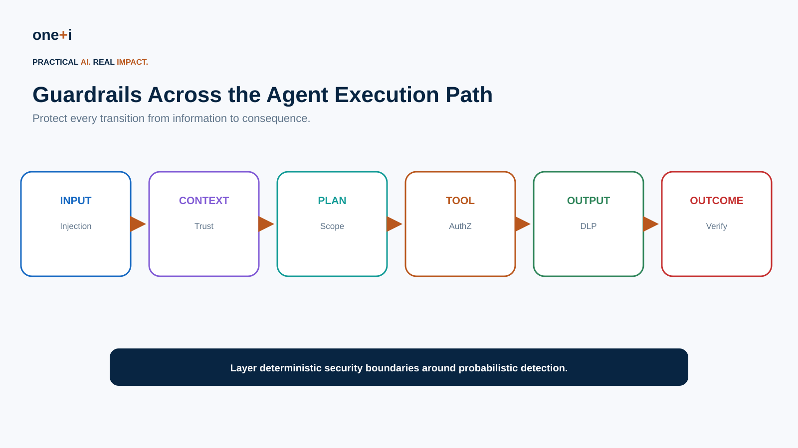
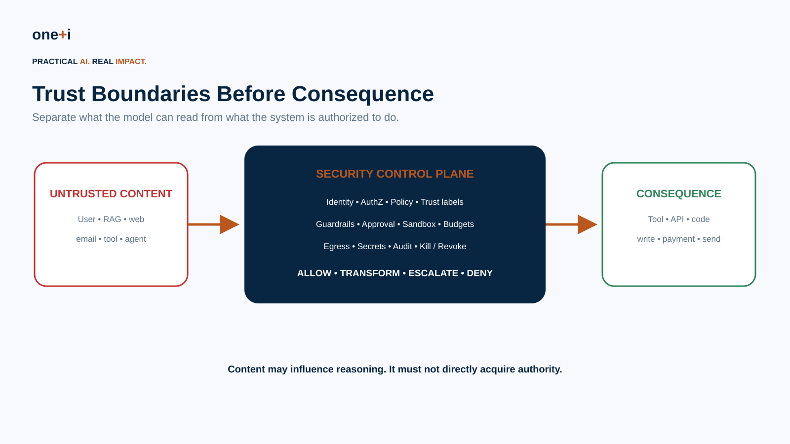
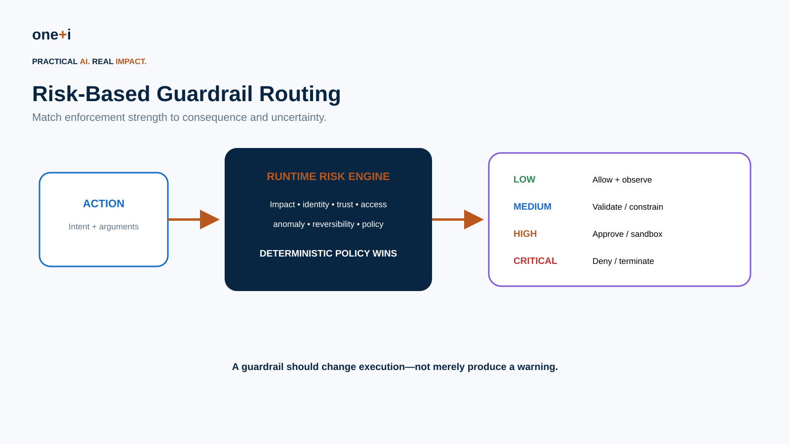
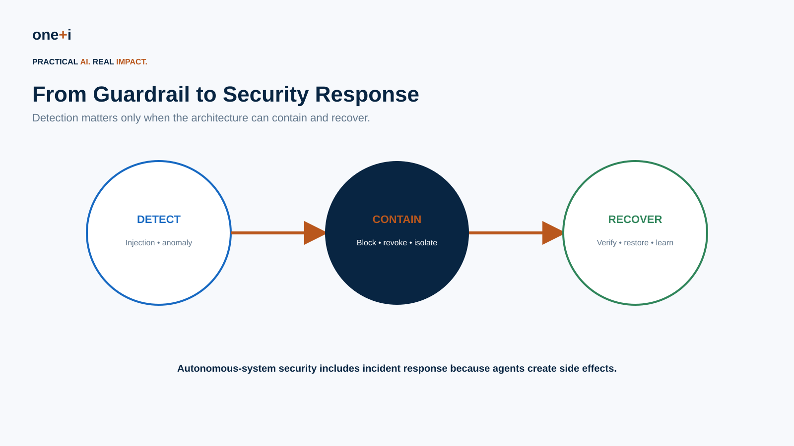

# Module 11 — Guardrails & Agent Security

> **Course:** Enterprise AI Agent Governance: From Principles to Runtime Control  
> **Audience:** AI/ML engineers, agent architects, security/platform teams, governance teams and red teams  
> **Recommended duration:** 10 hours theory + 7 hours practical lab  
> **Scenario:** Enterprise Procurement Agent exposed to users, RAG, tools, MCP-style integrations and delegated agents

## Learning objectives

Design defense-in-depth agent security; threat-model agentic systems; implement deterministic and probabilistic guardrails; defend injection, tool misuse, exfiltration, privilege abuse and code execution; apply information-flow controls; evaluate and red-team full trajectories; and build containment/recovery into production architecture.

> **Core principle:** A guardrail can detect risk. A security boundary must constrain consequence.

## 1. Why guardrails are not enough

Agents ingest untrusted content from users, RAG, web pages, email, tool results, memory and other agents, then create consequences through APIs, data writes, messages, code and financial actions. Security must therefore surround the complete trajectory, not only the prompt.

## 2. Threat modeling autonomous agents

Map principals, agent runtime, RAG, memory, tools/MCP, delegated agents, credentials and external systems. Identify assets, trust boundaries, privileged actions, irreversible effects and control points. Use OWASP's 2026 Agentic Top 10 as a threat catalog, then map risks to your architecture.

## 3. OWASP Agentic Top 10

Cover goal hijacking, tool misuse, identity/privilege abuse, agentic supply-chain compromise, unexpected code execution, context/memory poisoning, insecure inter-agent interaction, cascading failures, human-agent trust exploitation and rogue/misaligned behavior. Convert each relevant threat into controls and adversarial tests.

## 4. Trust and information-flow boundaries

Content is not authority. A retrieved document, email, tool output or agent message can provide evidence but cannot grant permission. Track integrity/confidentiality where practical and prevent low-integrity information from directly driving high-integrity consequences.

## 5. Guardrail taxonomy

Design input, context/RAG, plan, tool-input, tool-output, output, memory and outcome guardrails. Input/output checks alone miss the most important agentic boundary: the point immediately before a consequential tool executes.

## 6. Probabilistic vs deterministic controls

Use classifiers/LLMs for nuanced signals such as injection, semantic intent drift and anomalies. Use deterministic controls for hard boundaries: IAM, RBAC/ABAC, schemas, tenant isolation, amount limits, tool/domain allowlists, TTLs, budgets, sandboxes and network policy.

## 7. OpenAI Agents SDK guardrails

Current Agents SDK provides input/output guardrails, custom function-tool input/output guardrails and tripwires. Input guardrails protect the first agent and output guardrails the final agent; tool guardrails wrap custom function-tool calls. Blocking input guardrails should be preferred when unsafe side effects must not begin before validation finishes.

## 8. OpenAI Guardrails

Review the separate OpenAI Guardrails pipeline and GuardrailAgent integration. Use it for detection/validation such as injection and sensitive-data checks while keeping authorization, policy, sandboxing and infrastructure enforcement outside the model.

## 9. Microsoft Agent Framework and FIDES

Review middleware-based safety controls and experimental FIDES information-flow control. FIDES labels integrity/confidentiality and enforces policy before sensitive tools run—a useful state-of-the-art direction beyond heuristic injection detection.

## 10. Prompt injection and goal hijacking

Test direct and indirect injection, including malicious text hidden in RAG, email, web, tool output and inter-agent messages. Preserve the authorized task objective and require policy/approval for material scope changes.

## 11. Tool and identity security

Use least privilege, workload identities, scoped/short-lived credentials, strict schemas, server-side validation, conditional tool exposure, authorization and approval. Secrets should be injected by trusted runtime components directly into tool execution rather than exposed to model context.

## 12. Data exfiltration and network security

Control egress through domain/network policy, outbound proxies, DLP and classification. Defend against SSRF to localhost, metadata endpoints and internal services. Prompt instructions are not a network security control.

## 13. Code execution and sandboxing

Agents with shell, Python, file editing, browser automation or CI/CD access require isolated execution: constrained filesystem, network, process privileges, resource quotas, ephemeral credentials, timeouts and approval for sensitive operations.

## 14. MCP and supply-chain security

Inventory and authenticate servers, constrain scopes, review tool definitions, pin/version where possible, monitor schema/tool changes, detect tool-name collisions and apply the Tool & MCP Governance controls from the earlier module.

## 15. Memory and multi-agent security

Memory must not become IAM, policy or approval. Agent-to-agent messages are inputs, not authorization. Verify sender, delegation, task, purpose, scope and schema; downstream privileged agents independently authorize actions to prevent confused-deputy attacks.

## 16. Runtime controls and anomaly detection

Limit tool calls, tokens, spend, messages, records changed, runtime, delegation depth and parallel workers. Feed signals such as unusual destinations, repeated denials, large reads, novel tool sequences and rapid memory writes into runtime policy.

## 17. Security observability and incident response

Capture goal, identity, trust labels, evidence, plan, tool arguments, authorization, guardrail decisions, approvals, results and outcomes while minimizing secrets. Support detect → block → revoke → isolate → preserve evidence → verify side effects → recover → add regression test.

## 18. Evaluation and red teaming

Measure detector precision/recall, false positives/negatives, latency and cost, plus dangerous actions allowed, legitimate tasks blocked, containment time and fail-open events. Red-team complete trajectories and attack chains rather than prompt-response pairs.

## Practical architecture checklist

- Threat-model the whole system, not only the model.
- Treat user/RAG/web/tool/agent content as explicit trust domains.
- Keep hard boundaries deterministic.
- Put authorization immediately before consequential actions.
- Know exactly which framework paths each guardrail wraps.
- Use blocking checks where side effects cannot safely start early.
- Keep secrets out of model context.
- Restrict network egress and sandbox code execution.
- Apply least privilege to agent, tool, MCP, database and cloud identities.
- Make memory incapable of granting authority.
- Authenticate and scope agent-to-agent delegation.
- Enforce global autonomy/rate/spend budgets.
- Design fail-open/fail-secure behavior intentionally.
- Provide kill/revoke/isolation controls outside agent control.
- Continuously evaluate guardrail quality.
- Convert incidents and red-team findings into regression tests.

## Practical notebook

`11_guardrails_and_agent_security.ipynb`

The lab covers threat modeling, trust labels, injection signals, task-intent binding, strict tool schemas, tool allowlists, runtime risk routing, DLP signals, egress and SSRF controls, command policy, memory security, information-flow enforcement, autonomy budgets, anomaly signals, kill switch, audit evidence, detector evaluation, adversarial regression tests, and implementation patterns for OpenAI Agents SDK, OpenAI Guardrails and Microsoft Agent Framework/FIDES.

## Primary references

1. OWASP — Top 10 for Agentic Applications 2026  
   https://genai.owasp.org/resource/owasp-top-10-for-agentic-applications-for-2026/
2. OWASP — State of Agentic AI Security & Governance 2.01  
   https://genai.owasp.org/resource/state-of-agentic-ai-security-and-governance/
3. OWASP — Agentic Security Initiative  
   https://genai.owasp.org/initiatives/agentic-security-initiative/
4. OpenAI Agents SDK — Guardrails  
   https://openai.github.io/openai-agents-python/guardrails/
5. OpenAI Agents SDK — Tool Guardrails  
   https://openai.github.io/openai-agents-python/ref/tool_guardrails/
6. OpenAI Guardrails — Python  
   https://openai.github.io/openai-guardrails-python/
7. Microsoft Agent Framework — Agent Safety  
   https://learn.microsoft.com/en-us/agent-framework/agents/safety
8. Microsoft Agent Framework — Agent Security with FIDES  
   https://learn.microsoft.com/en-us/agent-framework/agents/security
9. Microsoft Agent Framework — Termination & Guardrails  
   https://learn.microsoft.com/en-us/agent-framework/agents/middleware/termination
10. NIST — AI Agent Standards Initiative  
    https://www.nist.gov/artificial-intelligence/ai-agent-standards-initiative

## Next module

**Module 12 — Agent Security Evaluation, Red Teaming & Incident Response**: attack libraries, automated adversarial evaluation, trajectory red teaming, CI/CD security gates, production detection, containment, forensics and recovery.
