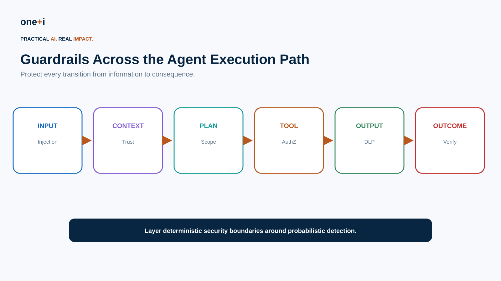
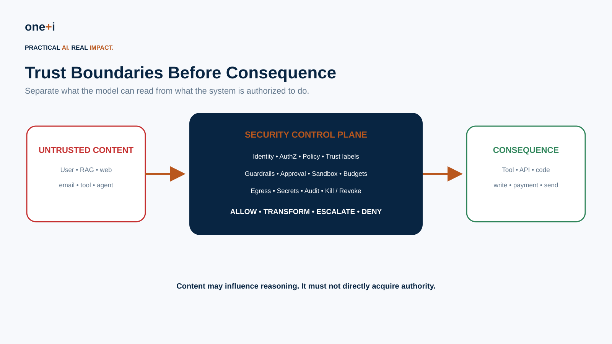
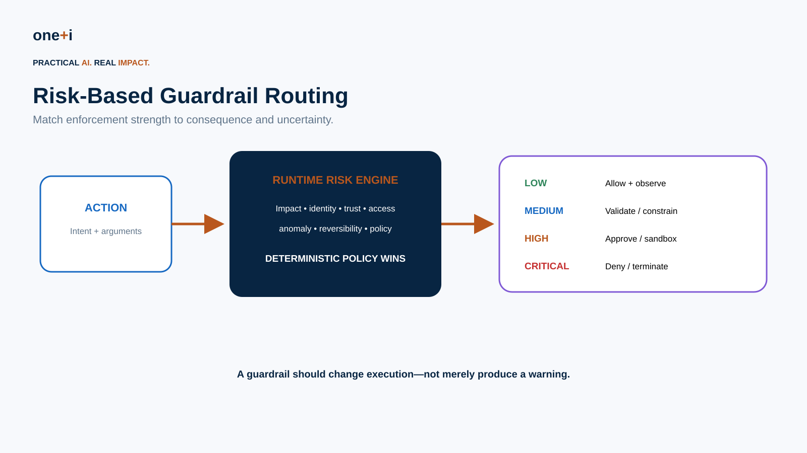
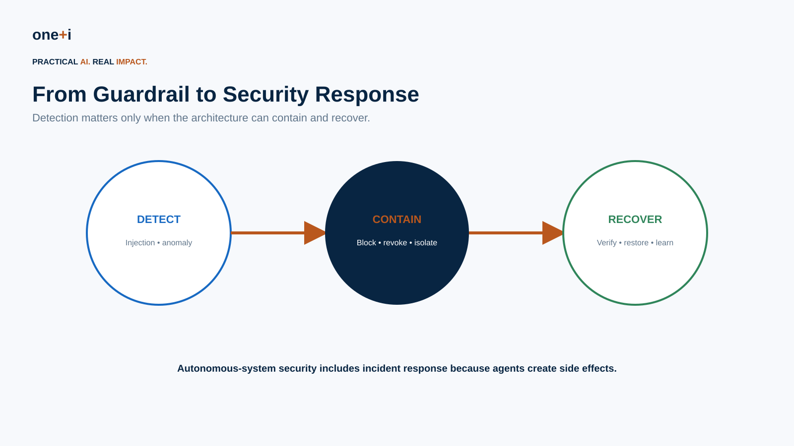

# Module 11 — Guardrails & Agent Security

> **Course:** Enterprise AI Agent Governance: From Principles to Runtime Control
> **Audience:** AI/ML engineers, agent architects, application-security and platform teams, governance teams, and red teams
> **Duration:** 8 hours guided study plus a 6-hour practical lab
> **Scenario:** An enterprise procurement agent reads vendor data, drafts purchase orders, calls an approved vendor API, and can run validation jobs in an isolated workspace

## Course thesis

A detector may estimate that content or behavior is risky; only trusted application and infrastructure controls can constrain the consequence. A secure agent therefore needs defense in depth across identity, context, tool calls, information flow, egress, execution isolation, budgets, observability, and containment—not a single “safe” prompt or classifier.



## Prerequisites

You should be comfortable with Python, Pydantic, tool-calling agents, and basic web security. This module builds on [fine-grained authorization](../../beginner/05-fine-grained-authorization-for-agents/README.md), [Tool & MCP Governance](../07-tool-and-mcp-governance/README.md), [Human Oversight](../08-human-oversight-and-bounded-autonomy/README.md), [Data, RAG & Memory Governance](../09-data-rag-and-memory-governance/README.md), and [Multi-Agent Governance](../10-multi-agent-governance-and-delegation/README.md).

The lab runs without credentials and performs no network, shell, model, or external-service call. All effects carry `status="simulated"`.

## Learning objectives

By the end of the course, you can:

1. threat-model an agent trajectory across users, RAG, memory, tools, MCP, delegated agents, credentials, and effects;
2. distinguish a detector, guardrail hook, policy-enforcement point, sandbox, and infrastructure boundary;
3. map OWASP agentic risks to preventive, detective, and recovery controls;
4. authenticate the caller and authorize the exact tool-resource pair before treating model output as a proposal;
5. label integrity and confidentiality, then stop incompatible data-to-sink flows;
6. combine schemas with identity, business rules, approval, budgets, and lifecycle state;
7. block exfiltration and SSRF with domain, scheme, port, DNS, resolved-IP, redirect, and connection checks;
8. define real code-execution isolation across process, filesystem, network, identity, credentials, and resources;
9. treat memory, tool output, and inter-agent messages as untrusted data rather than policy;
10. construct real OpenAI Agents SDK, OpenAI Guardrails, and Microsoft FIDES artifacts without confusing framework hooks with business authorization;
11. evaluate detector quality and end-to-end security outcomes using explicit populations; and
12. contain an incident with pause, revoke, terminate, evidence preservation, impact verification, and regression tests.

## Success criteria

You have completed the course when you can demonstrate that:

- three legitimate fixture cases remain allowed while nine dangerous cases are blocked;
- direct and indirect injection signals are visible, but detector output never grants authority;
- wrong tenant, agent, tool, resource, tool-resource pair, vendor, amount, or expired authority fails closed;
- low-integrity content cannot drive `po.create`, and confidential context cannot flow to a public vendor endpoint;
- localhost, link-local metadata, integer/hex IP literals, private DNS resolutions, and connection-time address changes are blocked;
- shell composition and path escape are rejected before a simulated sandbox action;
- secrets and restricted outputs do not leave through a lower-classification sink;
- an exact high-value proposal needs an expiring, single-use approval;
- concurrent requests cannot exceed the shared task budget;
- pause and termination stop the next effect; and
- framework examples construct real installed-library objects offline.

## Non-goals

This course does not claim that regexes or a classifier solve injection; that a schema, tripwire, or “trusted” label grants authority; that a hostname allowlist alone prevents SSRF; that a command allowlist is an OS sandbox; or that output filtering repairs an unauthorized read or effect. Its eight-case detector fixture is not a production benchmark, and its twelve-case architecture fixture is not a model-security benchmark. A local lock, static resolver, and in-memory ledger are teaching mechanisms, not multi-replica production controls.

## Claim-to-proof map

| Claim | Executable proof | Negative/evaluation proof |
|---|---|---|
| Content cannot manufacture authority | authenticated context plus application-issued `TaskGrant` | spoofed actor, tenant, tool/resource/pair, and vendor tests |
| Guardrails surround consequences | `SecurityControlPlane.evaluate` immediately precedes simulated execution | injection, flow, DLP, egress, command, approval, and budget failures |
| SSRF defense binds DNS to connection | resolution-bound `EgressTicket` | IP literal, private resolution, bad port, userinfo, and changed-IP tests |
| Memory is not IAM | typed memory-candidate gate | authority, credential, secret, and poisoning candidates denied |
| Approval binds the exact action | proposal digest, scope, policy, expiry, and atomic consumption | mutation, expiry, replay, and idempotent retry tests |
| Shared risk needs shared controls | locked call/spend ledger | six concurrent orders cannot exceed CAD 5,000 |
| Detector metrics differ from outcomes | eight labelled detector cases | one documented false negative and exact denominators |
| Architecture outcomes name a population | twelve labelled trajectories | baseline allows 8/9 dangerous cases; governed path allows 0/9 |
| SDK objects are integration surfaces | real tool guardrail/approval, Guardrails check, and FIDES config | tests inspect objects while effects stay in the control plane |

---

## 1. Why agent security is a system problem

A chat model returns text. An agent may also retrieve documents, call APIs, write records, execute code, contact people, spend money, and delegate work. Its context mixes developer instructions with attacker-controlled data from users, websites, documents, tools, memory, and other agents.

NIST describes agent hijacking as an indirect-injection problem caused by missing separation between trusted instructions and untrusted external data. NIST recommends adaptive evaluation and task-specific attack analysis rather than one aggregate score ([NIST CAISI, 2025](https://www.nist.gov/news-events/news/2025/01/technical-blog-strengthening-ai-agent-hijacking-evaluations)).

```text
model or detector      → proposes, classifies, extracts, flags
trusted application   → authenticates, validates, authorizes, approves,
                         reserves, executes, verifies, records
infrastructure         → isolates identity, network, filesystem, process,
                         secrets, resources, and blast radius
```

Security must still hold when a detector misses an attack. The goal is not “recognize every malicious sentence”; it is “prevent untrusted data from causing an unauthorized consequence.”

## 2. Signal, decision, enforcement, effect

Keep four layers distinct:

1. **Signal:** a regex, classifier, model, anomaly rule, or reputation service reports risk evidence.
2. **Decision:** policy combines trusted identity, authority, labels, arguments, system state, and signals into allow, deny, or review.
3. **Enforcement:** a tool wrapper, gateway, network proxy, sandbox, database, or IAM boundary makes the decision unavoidable.
4. **Effect:** the external system reports what happened; the application verifies and records it.

A framework guardrail only covers the paths it wraps. Hosted tools, handoffs, direct SDK calls, background workers, and services holding their own credentials may follow different paths. Inventory every path to an effect.

## 3. Threat-model the trajectory

```text
principal → application → model → retrieve/tool → observe → replan
          → delegate/memory → approve → execute → verify → respond
```

For every transition, record authenticated principal/workload, tenant/task/purpose, provenance, integrity, confidentiality, credentials, permissions, schemas, budgets, retries, idempotency, network/process boundaries, and the owner of detection and recovery.



The lab protects vendor records, purchasing authority, credentials, financial data, the outbound vendor endpoint, the validation workspace, audit evidence, and the kill switch. Attackers try to redirect calls, create unauthorized orders, exfiltrate a token, poison memory, escape a workspace, or induce a confused deputy.

## 4. OWASP agentic risks as hypotheses

The OWASP Top 10 for Agentic Applications 2026 is a threat catalogue, not a ready-made control set ([OWASP, 2026](https://genai.owasp.org/resource/owasp-top-10-for-agentic-applications-for-2026/)). Convert each applicable risk into an asset, attack path, control owner, negative test, telemetry event, and recovery playbook.

| Risk | Procurement hypothesis | Minimum control family |
|---|---|---|
| Goal hijacking | vendor page redirects the task | integrity labels, quarantine, detector signal, action policy |
| Tool misuse | valid tool receives harmful arguments | narrow tool, schema, business validation, authorization |
| Identity/privilege abuse | prompt claims another tenant or role | authenticated context, workload identity, least privilege |
| Supply-chain compromise | MCP schema or package changes | inventory, pinning, attestation, review, runtime restriction |
| Unexpected code execution | generated command composes shell operations | disposable sandbox, no ambient credentials, network deny, quotas |
| Memory poisoning | attacker persists authority or instructions | candidate/write separation, provenance, lifecycle, category deny |
| Insecure inter-agent interaction | research agent coerces procurement | authenticated sender, attenuated grant, independent authorization |
| Cascading failures | retries/workers multiply effects | shared budgets, idempotency, backpressure, kill switch |
| Human-agent trust exploitation | reviewer sees an ambiguous summary | exact proposal, authoritative context, expiry, separation of duties |
| Rogue/misaligned behavior | behavior drifts while syntax stays valid | outcome constraints, anomalies, evaluation, containment |

OWASP’s Agent Control Standard proposes portable runtime middleware hooks. It is an emerging interoperability direction, not proof that an implementation enforces local policy ([OWASP ACS, 2026](https://genai.owasp.org/resource/agent-control-standard-acs/)).

## 5. Guardrail taxonomy and placement

| Placement | Good for | Cannot establish alone |
|---|---|---|
| preflight/input | size, moderation, initial scope, obvious injection | safety of later retrieved/tool content |
| retrieval/context | provenance, tenant filter, quarantine, labels | authority to act on data |
| planner/trajectory | intent drift, unusual sequences, loops | deterministic denial of an effect |
| tool input | schema, rules, authorization, approval, egress | correctness of tool output or outcome |
| tool output | schema, DLP, provenance, result taint | prevention of an effect already performed |
| final output | secret/PII release and response policy | repair of prior unauthorized access/action |
| memory | provenance, scope, retention, poisoning | IAM, policy, or approval |
| outcome | reconciliation, rollback trigger | pre-effect prevention |

Put the strongest check immediately before the consequence. Repeat it after asynchronous approval, queues, retries, or handoffs create time-of-check/time-of-use gaps.

## 6. Deterministic and probabilistic controls

Use probabilistic components for injection/intent/anomaly signals and semantic moderation. Use deterministic code for identity, tenant/task scope, tool-resource pairs, object ownership, schemas, amount/call/time budgets, approval state, network policy, process isolation, state transitions, idempotency, and trusted information-flow labels.

The lab’s transparent detector intentionally misses one obfuscated attack. Better recall helps, but authorization and consequence controls remain necessary.



## 7. Identity and schema boundaries

The model may supply proposed arguments. It cannot supply its own identity or permission. The lab binds proposals to server-side `AuthenticatedContext` and `TaskGrant`, checking principal, workload, tenant, task, time, tool, resource, tool-resource pair, vendor, amount, policy, run state, budget, and approval.

Pydantic proves a purchase order looks like a purchase order. It does not prove the caller may create it, the vendor belongs to the tenant, the amount fits the task, the context is trustworthy, or approval covers this exact proposal. Schema validation lives inside the same path as those controls.

## 8. Injection and goal hijacking

Direct injection arrives from the user. Indirect injection arrives through documents, web pages, email, tool results, memory, or agents. Useful mitigations are to preserve trust domains and provenance; keep untrusted bytes out of privileged control context; use detectors as measured signals; bind task authority outside language; minimize capabilities/context; and authorize every consequence.

AgentDojo separates utility from attack success in realistic tool environments; NIST used it in its agent-hijacking work ([AgentDojo, NeurIPS 2024](https://proceedings.nips.cc/paper_files/paper/2024/hash/97091a5177d8dc64b1da8bf3e1f6fb54-Abstract-Datasets_and_Benchmarks_Track.html)). Course 12 develops attack campaigns; this course focuses on defensive architecture.

## 9. Information-flow control

Attach labels to values:

- **integrity:** how much authority the source has to influence a sensitive decision;
- **confidentiality:** which sinks may receive the value; and
- **provenance:** which trusted component assigned the label under which policy.

```text
low-integrity source          -/-> high-integrity consequence
high-confidentiality source   -/-> lower-confidentiality sink
```

The lab blocks a low-integrity vendor page from driving `po.create` and confidential context from reaching a public vendor endpoint. Conservative propagation can taint a whole session; labels can be wrong; declassification is dangerous; and side channels remain. FIDES studies deterministic label propagation and selective hiding, while CaMeL separates trusted control flow from untrusted data using capabilities ([FIDES paper](https://arxiv.org/abs/2505.23643), [CaMeL paper](https://arxiv.org/abs/2503.18813)).

## 10. Egress, exfiltration, and SSRF

A production outbound request should parse through one URL implementation; require approved scheme/port; reject URL credentials; normalize IDNs; match exact destinations; reject alternate IP literals; resolve through controlled DNS; reject non-public addresses; bind resolution to connection; revalidate redirects/retries; enforce the rule at an outbound proxy; and apply DLP/classification before sending bytes.

The lab’s `EgressTicket` demonstrates resolution-to-connection binding with a deterministic resolver. Production also needs TLS validation, redirect handling, proxy enforcement, destination ownership review, and protection against compromised allowlisted services.

## 11. Code execution and sandboxing

The lab validates a tiny command manifest but never executes it. A regex/allowlist is not a sandbox. Production needs an ephemeral non-privileged identity, no host socket or metadata access, a minimal read-only base, scoped workspace, default-deny network, CPU/memory/process/disk/time quotas, syscall/capability restrictions, pinned dependencies, controlled mounts, termination, cleanup, and evidence retention outside agent control.

If escape would expose a valuable host, the isolation is not strong enough.

## 12. Memory, RAG, MCP, and agents

Retrieved text, tool descriptions, MCP metadata, memory, and agent messages cannot grant a role, approve a purchase, change tenant/task scope, upgrade their own integrity, declare a remote server trusted, or widen delegated authority.

Memory requires candidate/write separation, subject scope, lifecycle, and system-of-record precedence. MCP requires server identity, schema-change controls, narrow scopes, and result validation. Multi-agent work requires authenticated sender/recipient, attenuated delegation, minimal context, shared budgets, and independent authorization at each privileged tool.

## 13. Budgets, anomalies, and failure behavior

Bound calls, spend, time, tokens, records, output size, retries, parallelism, and delegation depth. Aggregate limits require a transactional shared ledger. Use anomalies to route ambiguity; never let a low anomaly score override hard denial.

| Dependency failure | Read-only low-impact path | Sensitive/irreversible path |
|---|---|---|
| detector unavailable | allow only if independent controls contain impact | fail secure to review/deny |
| policy unavailable | possibly current signed deny-default cache | deny; never ask the model |
| approval timeout | no approval | stay paused/deny |
| unknown effect | reconcile by operation ID | never blind-retry |

## 14. Approval, idempotency, and containment

Approval binds principal, tenant, task, proposal digest, policy version, approver, issuance, expiry, and state. Consume it atomically with effect reservation. Stable operation IDs allow exact retries and reject mutated retries.

Containment controls must sit outside the agent:

```text
detect → block next effect → pause/terminate → revoke credentials/grants
→ isolate workers → preserve evidence → reconcile outcomes
→ remove poisoned state → restore → add regression test
```



## 15. Security observability

Capture request/task/run/agent/operation IDs; authenticated actor; proposed tool and argument digest; destination; source IDs and labels; detector version/result; decision/reason/policy; approval state; budget/retry/idempotency state; verified outcome; and containment events. Do not log credentials, unnecessary sensitive content, or private reasoning. A trace does not prove authorization or success.

## 16. Common libraries and control surfaces

No framework covers the whole architecture.

| Option | Useful surface | Strength | Boundary |
|---|---|---|---|
| OpenAI Agents SDK | input/output, function-tool guardrails, approval interruptions | close to SDK workflow and tools | agent guardrails do not wrap every chain point; other tool types differ |
| OpenAI Guardrails Python | configurable preflight/input/output and agentic checks | reusable validation catalogue and evals | detection does not replace authorization, IAM, egress, or sandboxing |
| Microsoft Agent Framework + FIDES | middleware, approval, labels, selective hiding | experimental deterministic information flow | Python-only/experimental; label authority is critical |
| LangChain/LangGraph | before/after agent/model and wrapped tools, HITL | flexible custom durable graphs | only paths using the hooks are covered |
| NVIDIA NeMo Guardrails | input/output/dialog/retrieval rails and evals | broad programmable orchestration | guardrail layer, not infrastructure isolation |
| Meta LlamaFirewall | PromptGuard, alignment checks, CodeShield | agent-focused detection/code scanning | probabilistic/experimental components are not authorization |
| OPA/Cedar/OpenFGA/gateways | deterministic action/resource policy | independent application PEP/PDP | trusted attributes and complete placement required |
| sandbox + egress proxy | process/network blast-radius enforcement | infrastructure boundary | secure configuration, identity, cleanup, telemetry required |

Official OpenAI documentation distinguishes blocking/parallel input checks, final output checks, tool guardrails, and approvals, and recommends placing validation beside side effects ([OpenAI](https://developers.openai.com/api/docs/guides/agents/guardrails-approvals)). Microsoft labels FIDES experimental and documents its propagation and MCP-label limits ([Microsoft](https://learn.microsoft.com/en-us/agent-framework/agents/security)). See also [NVIDIA NeMo Guardrails](https://docs.nvidia.com/nemo-guardrails/index.html), [LangChain middleware](https://docs.langchain.com/oss/python/langchain/guardrails), and [Meta LlamaFirewall](https://ai.meta.com/research/publications/llamafirewall-an-open-source-guardrail-system-for-building-secure-ai-agents/).

For a new OpenAI agent application, the current platform guidance starts with the hosted Agents API; the Python Agents SDK remains useful for code-first orchestration and for understanding where SDK hooks execute. Architecture review must cover hosted tools and any effect path that does not pass through a local SDK hook ([OpenAI Agents guide](https://developers.openai.com/api/docs/guides/agents)).

## 17. Framework artifacts in the lab

The current OpenAI Agents SDK supports blocking input guardrails, final output guardrails, function-tool input/output guardrails, and approval interruptions. Input checks cover the first agent, output checks the final agent, and tool checks the function tools to which they are attached. The lab constructs a real `Agent` with a blocking input guardrail, output DLP guardrail, and `FunctionTool` carrying both a tool-input guardrail and `needs_approval=True`. This proves compatibility, not policy correctness.

The lab uses the installed OpenAI Guardrails registry to instantiate and execute a credential-free deterministic `Keyword Filter`; live model/API checks require credentials and separate evaluation. It also constructs real Microsoft `SecureAgentConfig` and `ContentLabel` objects with untrusted-by-default tool output, automatic hiding, and block-on-violation. FIDES remains clearly labelled experimental.

## 18. State of the art: September 2026

**Established practice:** least privilege; authenticated workload identity; server-side validation and authorization; action-bound approval; sandbox/egress isolation; DLP; budgets; idempotency; kill controls; trajectory testing.

**Emerging practice:** portable runtime middleware such as OWASP ACS; tool-level checks around effects; labels propagated through agent state; selective disclosure of untrusted bytes; portable trajectory evidence; adaptive incident-derived attacks.

**Research frontier:** FIDES studies information-flow guarantees and utility; CaMeL extracts control/data flows and uses capabilities; LlamaFirewall combines prompt, alignment, and code scanners; AgentDojo measures utility and security across tool environments.

**Open problems:** useful action on untrusted data; composable labels across vendors/MCP/memory; safe declassification; complete interception across hosted tools and workers; calibrated multimodal detection; safe measurement of real outcomes; and portable proof that enforcement occurred.

## 19. Evaluation with honest denominators

The detector fixture has five injections and three benign texts. It produces `TP=4`, `FP=0`, `TN=3`, `FN=1`, precision `4/(4+0)=1.00`, and recall `4/(4+1)=0.80`. It is a transparent teaching fixture, not an external benchmark.

The trajectory fixture has three legitimate and nine dangerous cases. A deliberately weak schema-plus-direct-user-regex baseline allows all three legitimate cases and eight of nine dangerous cases. The governed path allows all three legitimate cases and zero dangerous cases.

Measure legitimate work blocked, dangerous attempts blocked, actual forbidden outcomes, review burden, detector errors, containment time, stale-worker activity, control unavailability, and cost/latency per successful compliant task. Do not call a blocked attempt an actual violation or detector accuracy “agent security.”

## 20. Practical lab

The notebook imports [lab.py](lab.py) and walks through threat model, weak baseline, authenticated authority, labels, injection/DLP signals, tool policy, egress tickets, command manifest, memory gate, proposal-bound approval, concurrent budgets, containment, exact evaluation, and real framework artifacts.

```bash
make course-11
```

## 21. Failure modes and production upgrades

| Anti-pattern | Failure | Correction |
|---|---|---|
| defensive prompt only | attacker adapts | quarantine/label data and authorize each effect |
| one input classifier | later context bypasses it | guard every trust transition and tool |
| output filter only | read/effect already happened | authorize before access/effect; filter additionally |
| role in prompt | model manufactures authority | authenticated server context |
| schema equals safety | valid harmful action passes | identity, business, flow, approval, budget policy |
| hostname allowlist | DNS/redirect bypass | resolve, classify, pin, revalidate, proxy-enforce |
| command regex called sandbox | runtime escape | isolate process/network/filesystem/identity/resources |
| anomaly score overrides policy | forbidden work can pass | hard-denial precedence |
| retry unknown effect | duplicate consequence | stable operation ID and reconciliation |

| Teaching mechanism | Production replacement |
|---|---|
| in-memory grant | workload identity + durable authorization + short-lived capability |
| process lock | transactional/linearizable shared reservation store |
| static resolver | controlled DNS + outbound proxy + connection enforcement |
| command manifest | disposable microVM/container with default-deny network |
| regex detector | versioned evaluated detector ensemble with drift monitoring |
| local approval | durable workflow, separation of duties, expiry, concurrency |
| simulated receipt | idempotent adapter, reconciliation, effect verification |
| local audit list | access-controlled integrity-protected telemetry |
| local kill state | revocation propagated to workers, queues, credentials, approvals |

## 22. Exercises and review

1. Add an `employee.notify` tool and prove cross-subject notification is denied.
2. Add redirect-chain validation and issue a fresh ticket for every hop.
3. Add IPv4-mapped IPv6 and IDN cases.
4. Add a secret-reference type so the model never receives secret bytes.
5. Replace the regex with a frozen classifier fixture and report slices, threshold, confusion matrix, and latency.
6. Create an attack that passes every detector but proposes a forbidden action; identify the stopping control.
7. Simulate policy/audit/approval outages and justify fail behavior by consequence.
8. Implement unknown-outcome reconciliation before retry.
9. Compare an application egress library, proxy, service mesh, and cloud firewall.
10. Identify the trusted label authority and rules for downgrade, endorsement, and declassification.
11. Map each OWASP risk to owner, control, evidence, and recovery.
12. Explain why output DLP cannot repair an unauthorized read.

## References

1. [OWASP — Top 10 for Agentic Applications 2026](https://genai.owasp.org/resource/owasp-top-10-for-agentic-applications-for-2026/)
2. [OWASP — Agent Control Standard](https://genai.owasp.org/resource/agent-control-standard-acs/)
3. [OWASP — Artificial Intelligence Security Verification Standard](https://owasp.github.io/www-project-artificial-intelligence-security-verification-standard-aisvs-docs/)
4. [NIST — Strengthening AI Agent Hijacking Evaluations](https://www.nist.gov/news-events/news/2025/01/technical-blog-strengthening-ai-agent-hijacking-evaluations)
5. [NIST AI 100-2e2025 — Adversarial ML Taxonomy](https://www.nist.gov/publications/adversarial-machine-learning-taxonomy-and-terminology-attacks-and-mitigations-0)
6. [OpenAI — Guardrails and Human Review](https://developers.openai.com/api/docs/guides/agents/guardrails-approvals)
7. [OpenAI — Agents SDK](https://developers.openai.com/api/docs/guides/agents/sdk)
8. [OpenAI — Guardrails Python](https://github.com/openai/openai-guardrails-python)
9. [Microsoft — Agent Safety](https://learn.microsoft.com/en-us/agent-framework/agents/safety)
10. [Microsoft — Agent Security with FIDES](https://learn.microsoft.com/en-us/agent-framework/agents/security)
11. [Costa et al. — Securing AI Agents with Information-Flow Control](https://arxiv.org/abs/2505.23643)
12. [Debenedetti et al. — Defeating Prompt Injections by Design](https://arxiv.org/abs/2503.18813)
13. [Debenedetti et al. — AgentDojo](https://proceedings.nips.cc/paper_files/paper/2024/hash/97091a5177d8dc64b1da8bf3e1f6fb54-Abstract-Datasets_and_Benchmarks_Track.html)
14. [NVIDIA — NeMo Guardrails](https://docs.nvidia.com/nemo-guardrails/index.html)
15. [Meta — LlamaFirewall](https://ai.meta.com/research/publications/llamafirewall-an-open-source-guardrail-system-for-building-secure-ai-agents/)
16. [LangChain — Guardrails and Middleware](https://docs.langchain.com/oss/python/langchain/guardrails)

## Next module

[Module 12 — Agent Red Teaming & Adversarial Testing](../12-agent-red-teaming-and-adversarial-testing/README.md) turns the threat model into rules of engagement, adaptive campaigns, trajectory evidence, severity, remediation, and continuous regression gates. Course 11 builds the defenses; Course 12 tries to break them safely and systematically.
